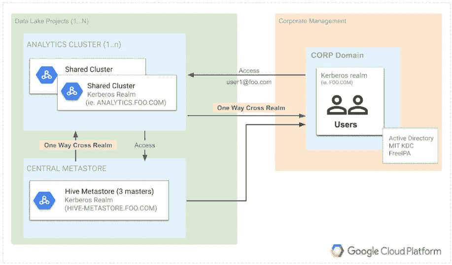

# 跨领域信任的 Kerberized 化 Dataproc 集群入门

> 原文：<https://medium.com/google-cloud/getting-started-with-kerberized-dataproc-clusters-with-cross-realm-trust-222d991660dd?source=collection_archive---------0----------------------->

在本文中，我们将介绍使用 Kerberos 建立多个 Dataproc 集群的架构和部署，这些集群使用跨领域信任进行互操作。本文中部署的 terraform 模块和脚本在 github repo[*Kerberos 化 _data_lake*](https://github.com/GoogleCloudPlatform/professional-services/tree/main/examples/kerberized_data_lake) 中提供。

# 概观

下面的架构是用 Kerberos 部署 Dataproc 的几种方法之一。在这个架构中，我们利用 [Dataproc 的安全配置](https://cloud.google.com/dataproc/docs/concepts/configuring-clusters/security#kerberos-config)来创建集群上的 KDC，并管理集群的服务主体和 keytabs，这是对 Hadoop 集群进行 Kerberos 化所需要的。



使用这种架构，Dataproc 集群必须建立信任，以确保经过身份验证的用户可以在分析集群上运行作业，并访问中央配置单元 metastore。跨 Kerberos 领域配置的单向信任允许经过身份验证的用户无缝访问所需的 Hadoop 服务。跨领域信任的三个关键组件包括:

## 企业目录服务(Active Directory、麻省理工学院 KDC 分校、FreeIPA)

*   带有 KDC 的单一主 Dataproc 集群，用于管理用户和团队的账户

## 分析 Dataproc 集群

*   供用户执行 Spark、MapReduce、Hive/Beeline、Presto 等的集群。
*   与公司域的单向信任以验证最终用户

## 配置单元 Metastore Dataproc 群集

*   数据库和表的中央 metastore
*   与公司域的单向信任，以验证最终用户对 metastore 的访问
*   与 analytics clusters 域的单向信任，以验证用于 [HiveServer2 模拟](https://cwiki.apache.org/confluence/display/Hive/Setting+Up+HiveServer2#SettingUpHiveServer2-Impersonation)的 HiveServer2 服务主体

# **部署**

[**Kerberos 化 _data_lake** git 仓库](https://github.com/GoogleCloudPlatform/professional-services/tree/main/examples/kerberized_data_lake)使用 terragrunt/terraform 为上述 Kerberos 架构提供部署。该部署需要多个 GCP 产品，包括 Dataproc、云 KMS、云存储、VPC，并且可以部署在沙盒环境中，以审查所使用的所有组件和服务。

作为先决条件，Dataproc 集群配置有**无外部 IP *s*** ，并要求子网启用[私有 Google 访问](https://cloud.google.com/dataproc/docs/concepts/configuring-clusters/network#create_a_cloud_dataproc_cluster_with_internal_ip_address_only)。

1.  **设置环境变量(根据需要修改)**:

```
export PROJECT=$(gcloud info --format='value(config.project)')
export ZONE=$(gcloud info --format='value(config.properties.compute.zone)')
export REGION=${ZONE%-*}
export DATALAKE_ADMIN=$(gcloud config list --format='value(core.account)')
export DATAPROC_SUBNET=default
```

**2。创建地形变量文件:**

```
cat > kerb_datalake.tfvars << EOL
project="${PROJECT}"
region="${REGION}"
zone="${ZONE}"
data_lake_super_admin="${DATALAKE_ADMIN}"
dataproc_subnet="${DATAPROC_SUBNET}"
users=["bob", "alice"]
tenants=["core-data"]
EOL
```

**配置注释**:

*   `project`、`region`、`zone`——指部署的项目、地区、地带
*   `data_lake_super_admin` -正在部署的资源(KMS 密钥、GCS 存储桶等)的 IAM 管理员。)
*   `datataproc_subnet`-data proc 集群的子网

**3。查看 kerb_data_lake.tfvars 并*运行部署* :**

```
terraform workspace new ${PROJECT}
terraform init
terraform apply -var-file kerb_datalake.tfvars
```

# **设置详情**

在这个例子中，我们使用一个麻省理工学院的 KDC 来实现公司域，在这里我们在一个 KDC 中管理用户主体。为了验证部署，我们创建三个用户:*alice@FOO.COM*、*bob@FOO.COM*，以及一个不需要人工交互的应用服务帐户*core-data-svc@FOO.COM*(即密码提示)进行身份验证。

有三个集群拥有自己的 Kerberos 领域，因为每个集群都部署了自己的 KDC。FOO.COM 代表企业领域，而其他人则专门负责数据湖。值得注意的是，当我们为所有服务创建 Dataproc 集群时，例如独立的中央 KDC，我们只配置集群来支持特定的服务，而不是作为传统的数据处理集群。下面是对三个集群及其各自的 Kerberos 领域的描述:

```
**cluster :       kdc-cluster** 
realm   :       FOO.COM
desc    :       corporate directory service / domain controller where user/service accounts are created**cluster :       metastore-cluster**
realm   :       HIVE-METASTORE.FOO.COM
desc    :       master only nodes that host the hive metastore catalog and provided default hive connection for all analytics clusters**cluster :       analytics-cluster**
realm   :       ANALYTICS.FOO.COM
desc    :       multi-tenant cluster(s) for data processing, users kinit alice@FOO.COM and are authenticated to access resources and execute jobs
```

## **KDCs 的秘密**

Dataproc Kerberos 部署需要集群上 KDC 的秘密和信任的额外秘密:

**1)**KDC 根主体的加密秘密
**2)** 用于建立对远程 KDC 的信任的加密秘密

Terraform 在本地生成并加密随机生成的秘密，并将它们推送到集群可访问的特定 GCS 秘密桶。创建集群时，设置将使用加密密钥的 GCS URI，流入内容，使用 KMS 密钥解密，并设置必要的配置，而不在集群上存储密钥。

## **Kerberos 主体的秘密**

除了设置集群上 KDC 的秘密之外，我们还为*alice@FOO.COM*、*bob@FOO.COM*创建用户主体，为应用服务帐户*core-data-svc@FOO.COM*创建服务主体。这些是在 kdc 集群中创建的，用户的*不安全的*密码只是用户名的前 4 个可能的字符，后跟 123(即。爱丽丝/alic123)。

由于*core-data-svc@FOO.COM*主体是一个应用程序服务，我们为这个帐户生成一个 keytab，并使其在 analytics-cluster 的主节点上可用。该凭证保存在/etc/security/keytab/core-data-SVC . keytab 中，拥有**core-data-SVC:core-data-SVC**和**权限 400** 。有了这个 keytab，应用程序服务就可以使用 keytab 进行身份验证来执行作业。

因为这只是为了演示，所以为了简单起见，我们不使用边缘节点，而是使用主节点来启动作业。

## **麻省理工学院 FOO.COM KDC 校区**

部署的第一个集群是麻省理工学院 KDC。它不需要建立到其他集群的信任，但是当其他集群被创建时，它们将与它建立信任。与该 KDC 建立信任将允许其他集群信任请求访问数据处理集群上的 Hadoop 的用户主体。GCS 中存储的要创建的该集群的依赖项有:

```
gs://{var.project}-**dataproc-secrets**/
  kdc-cluster_principal.encrypted      (*kdc secret*)gs://{var.project}-**dataproc-scripts**/init-actions/
  create-users.sh                     (*setup test users*)
```

## **Metastore 集群—HIVE-METASTORE.FOO.COM 领域**

此群集部署了一个集中式配置单元 Metastore，用于管理多个群集之间的共享元数据。它需要与*FOO.COM*的单向信任，以允许经过身份验证的用户访问 metastore 资源(即 Spark SQL 作业在分析集群查询表上作为*alice@FOO.COM*运行，分两步设置:

**1)** 在本地元存储集群上添加信任(自动执行)
**2)** 在远程 kdc 集群上添加信任(初始化设置-kerberos-trust.sh)

以下是 metastore 集群的依赖关系:

```
gs://{var.project}-**dataproc-secrets**/
  metastore-cluster_principal.encrypted  (*kdc secret*)
  trust_metastore-cluster_kdc-cluster_principal.encrypted  (trust w/ foo secret)gs://{var.project}-**dataproc-scripts**/init-actions/
  setup-kerberos-config.sh               (*updates krb5.conf*)
  setup-kerberos-trust.sh                (*setup trust on remote kdc*)
  setup-users-config.sh                  (*setup test users*)
  disable-history-server.sh              (*disable unneeded services*)gs://{var.project}-**dataproc-scripts**/shutdown-scripts/
  shutdown-cleanup-trust.sh              (*remove remote trust*)
```

## **分析集群—ANALYTICS.FOO.COM 领域**

最后一个集群是终端用户集群，用于多个租户的数据处理。此群集需要与*FOO.COM*建立信任，以及与 metastore(metastore trusts analytics)建立反向信任，以允许 HiveServer2 主体访问 metastore。设置步骤如下:

**1)** 在本地 analytics-cluster 上添加信任(自动执行)
**2)** 在远程 kdc-cluster 上添加信任(初始化设置-kerberos-trust.sh)
**3)**在本地 analytics-cluster 上添加反向信任(初始化设置-Kerberos-trust . sh)
**4)**在远程 metastore-cluster 上添加反向信任(初始化设置-Kerberos-trust . sh)

以下是分析集群的依赖关系:

```
gs://{var.project}-**dataproc-secrets**/
  analytics-cluster_principal.encrypted      (*kdc secret*)
  trust_analytics-cluster_kdc-cluster_principal.encrypted           (trust w/ foo secret)
  trust_metastore-cluster_analytics-cluster_principal.encrypted  (metastore trusts analytics secret)gs://{var.project}-**dataproc-scripts**/init-actions/
  setup-kerberos-config.sh               (*updates krb5.conf*)
  setup-kerberos-trust.sh                (*setup trust on remote kdc*)
  setup-users-config.sh                  (*setup test users*)
  disable-history-server.sh              (*disable unneeded services*)gs://{var.project}-**dataproc-scripts**/shutdown-scripts/
  shutdown-cleanup-trust.sh              (*remove remote trust*)
```

# **验证 Kerberos 部署**

## 宋承宪和 Kinit

登录，以 alice 身份验证，并在 analytics-cluster 上运行 Hadoop 命令。

```
*$ gcloud compute ssh alice@analytics-cluster-m --tunnel-through-iap
$ kinit alice@FOO.COM                # remember insecure pwd alic123
Password for* [*alice@FOO.COM*](mailto:alice@ACME.COM)*:
$ klist 
$ hadoop fs -ls /user/*
```

## MapReduce 测试

在 kerberized 化的集群上执行一个作业，并将输出保存到数据湖桶中。

```
$ hadoop jar /usr/lib/hadoop-mapreduce/hadoop-mapreduce-examples.jar teragen -Dmapreduce.job.maps=4 10000000 gs://jh-data-sandbox-us-data-lake/test.db/test
```

## 直线测试

测试 alice 对 HiveServer2 的身份验证以及 HiveServer2 对 Hive Metastore 的请求。

```
$ beeline -u "jdbc:hive2://localhost:10000/default;principal=hive/analytics-cluster-m@ANALYTICS.FOO.COM"
jdbc:hive2://localhost:10000/default> create database test_db location ‘gs://jh-data-sandbox-us-data-lake/test.db’;
jdbc:hive2://localhost:10000/default> show databases;
jdbc:hive2://localhost:10000/default> use test_db;
jdbc:hive2://localhost:10000/default> create external table test (one string) location 'gs://jh-data-sandbox-us-data-lake/test.db/test/';
jdbc:hive2://localhost:10000/default> describe formatted test;
jdbc:hive2://localhost:10000/default> select count(1) from test;
jdbc:hive2://localhost:10000/default> set hive.metastore.uris;
jdbc:hive2://localhost:10000/default> !q
```

## 火花和 Metastore 测试

```
$ spark-shell 
scala> spark.sql("select count(1) from test_db.test").show(false)
scala> spark.catalog.listDatabases.show(false)
scala> spark.sql("use test_db")
scala> spark.sql("describe formatted test").show(false)
scala> println(spark.sparkContext.hadoopConfiguration.get("hive.metastore.uris"))
scala> :q
```

## 应用服务帐户测试核心-数据-svc@FOO。计算机输出缩微胶片

Kinit 使用 keytab，在访问 metastore 的分析集群上运行 spark 作业。

```
$ gcloud compute ssh core-data-svc@analytics-cluster-m --tunnel-through-iap
 $ kinit -kt /etc/security/keytab/core-data-svc.keytab [core-data-svc@FOO.COM](mailto:core-data-svc@ACME.COM) $ spark-shell <<< 'spark.sql("select count(1) from test_db.test").show(false)'
```

# **总结**

在这篇博客中，我们学习了使用 kerberos 部署 dataproc 集群以及在 KDC 之间建立单向信任以实现互操作性的步骤。我们通过运行作业进一步验证了部署，这些作业不仅在本地 Dataproc kerberized 化的集群上执行，而且针对远程 Hive Metastore 验证了经过身份验证的测试用户。最后，我们通过使用 keytab 提供身份验证，完成了对自动化作业的验证。这些步骤有望为理解 Dataproc 上的 Kerberos 以及如何为您的数据湖配置多个集群提供一个良好的前提。

由梅丽莎·阿维拉 & [乔丹·汉伯顿](/@jordan.hambleton)