# 在 GCP 上开始使用 SQL Server

> 原文：<https://medium.com/google-cloud/getting-started-with-sql-server-on-gcp-692e4ac44cad?source=collection_archive---------0----------------------->

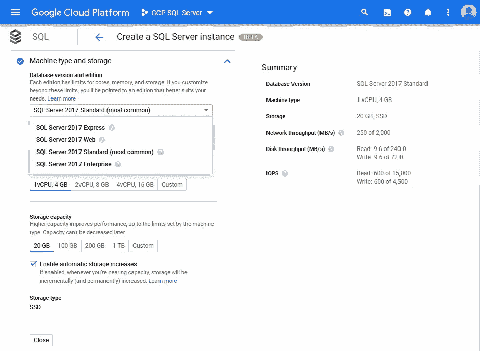

很少的设置，你就有了运行在谷歌云平台上的 SQL Server

当谈到 Google 云平台上的云 SQL 实例时，它通常与灵活方便的 MySQL 处理相关。最终，可能不太常见的是，有人可能会谈到 PostgreSQL。然而，最近谷歌为云 SQL 服务增加了第三个选项:微软 SQL Server。

[Cloud SQL](https://cloud.google.com/sql/) 是一个完全托管的关系数据库服务，适用于谷歌云平台(GCP)上的 MySQL、PostgreSQL 和 SQL Server。

> *云 SQL 与使用 MySQL、PostgreSQL 和 SQL Server 的应用程序完全兼容。您可以连接世界上任何地方的几乎任何应用程序。云 SQL 自动执行备份、复制和故障转移，以确保您的数据库可靠、高度可用，并灵活满足您的性能需求。*

所描述的 SQL Server on GCP 的特性集列出了安全、高可用性、高性能和可伸缩解决方案所需的一切。可以从其他 GCP 服务轻松访问云 SQL 实例，包括 App Engine、Compute Engine、Kubernetes Engine 以及您的工作站。BigQuery 能够直接查询现有的云 SQL 数据库。

Google Cloud 博客上有一篇有趣的文章:[SQL Server 的 Cloud SQL 不让任何数据库掉队](https://cloud.google.com/blog/products/databases/leave-no-database-behind-with-cloud-sql-for-sql-server)提供了关于新服务和即将推出的功能的更多信息。

# 创建 SQL Server 的云 SQL 实例

登录云控制台，选择侧面导航栏中的菜单项`SQL`。如果您选择的项目没有任何实例，您可以点击`Create Instance`继续。

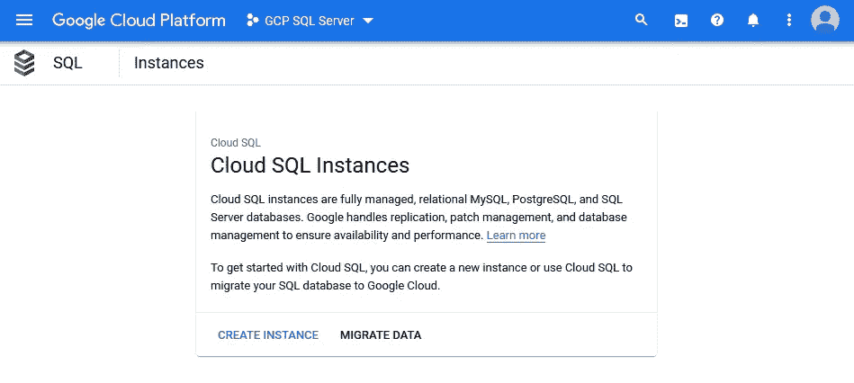

Microsoft SQL Server 作为云 SQL 实例提供

接下来，选择右侧的`SQL Server`选项，开始配置 SQL Server。

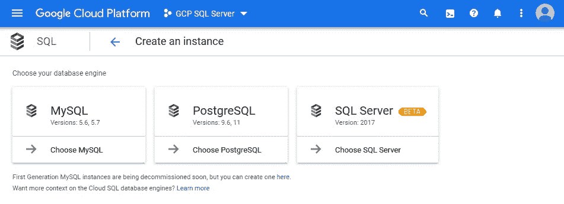

虽然标记为`beta`,但它已经可以使用了(在撰写本文时)

只需输入几个参数，你就可以开始了，阅读:点击页面底部的创建按钮。首先，回顾每一个配置设置，以便更熟悉云 SQL，这可能是很有趣的。

给实例一个唯一的标识符，为您的管理用户设置或生成一个密码。

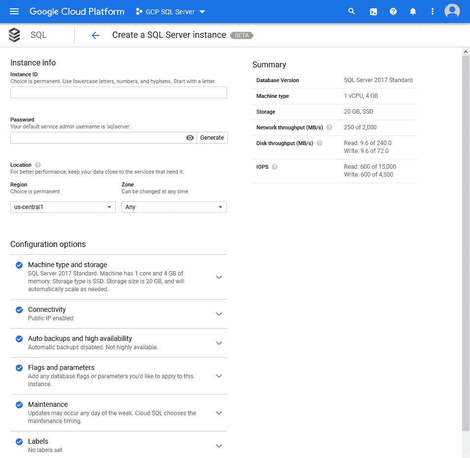

配置基于 SQL Server 的云 SQL 实例的广泛选项

**注意:**您的默认服务管理员用户名是`sqlserver`。而不是常见的`sa`用户名。生成的密码应该是这样的:`d3Ptgz30EAiygtMn`

然后从 SQL Server 2017 的可用版本中进行选择。如果您熟悉 SQL Server 及其许可，您会知道各种版本有不同的功能、限制和成本因素。SQL Server 的成本计算在这里描述得很简洁:[云 SQL 定价](https://cloud.google.com/sql/pricing#sql-server)。

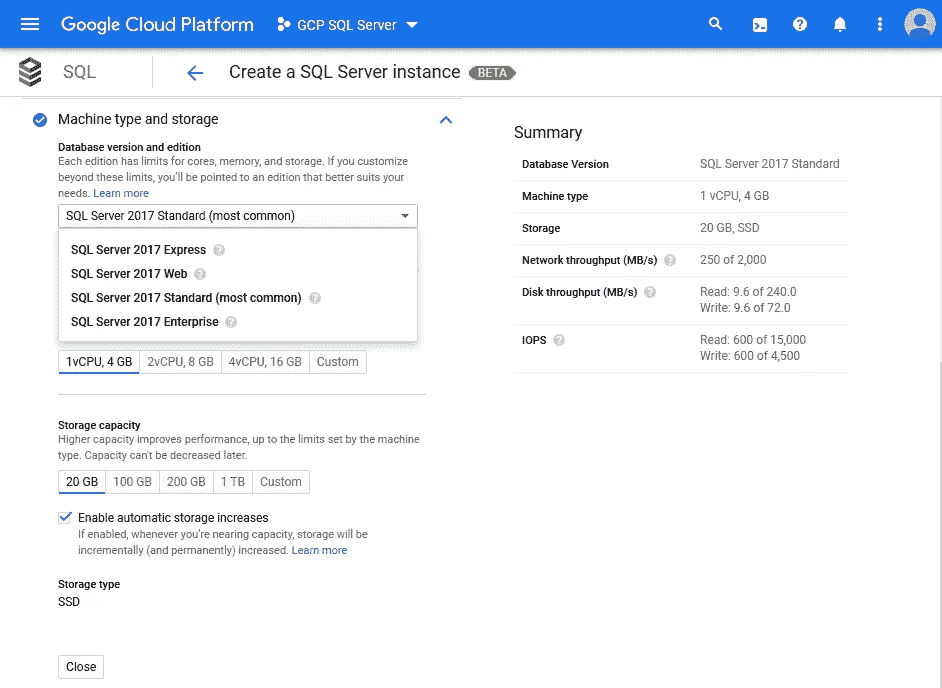

SQL Server 2017 有多种版本可供选择。预计会有更多版本(很快)

如果需要，您可以激活云 SQL 实例的自动备份和高可用性。然而，这可能会产生额外的费用。

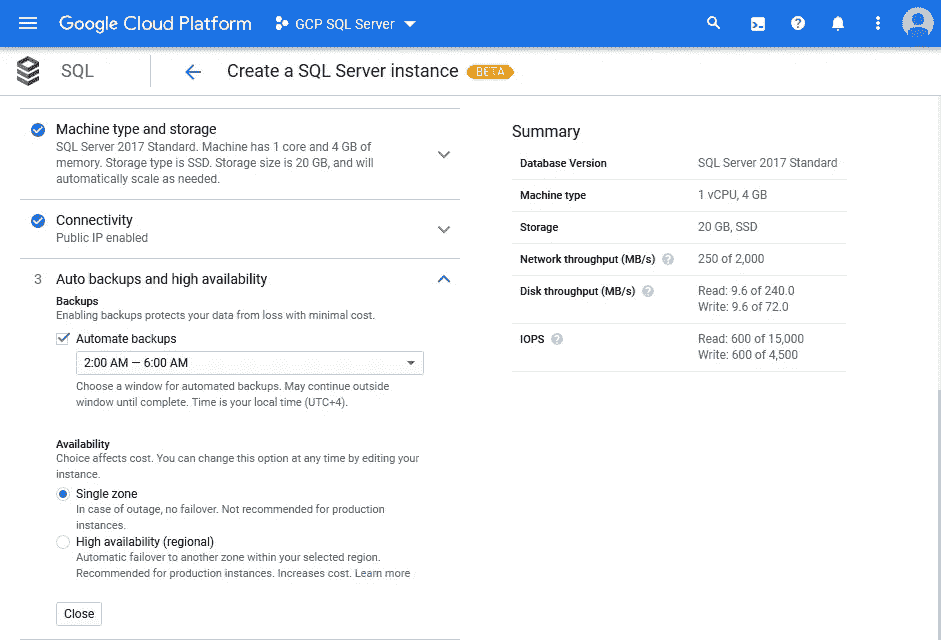

易于配置备份和高可用性

Cloud SQL for SQL Server 的配置提供了一个名为`Flags and parameters`的部分，允许您深入了解 SQL Server 配置的具体细节，因为生产系统可能需要它。

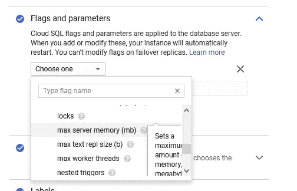

如果需要，可以用各种标志配置 SQL Server 实例

这个标志列表是详尽的，高级设置应该为有经验的数据库管理员所知。出于测试或开发目的，您可以跳过这一部分。

类似地，`Maintenance`上的部分允许您定义自己喜欢的停机时间窗口。

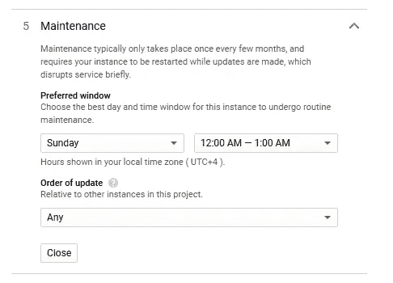

根据您的方便确定维护周期

最后，点击页面底部的`Create`按钮，为 SQL Server 创建一个云 SQL 实例。部署需要几分钟时间。也许是时候舒展一下筋骨，喝点饮料了。

完成后，您会在 Cloud SQL 的概览页面上看到该实例。

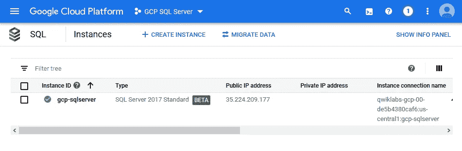

运行 SQL Server 的云 SQL 实例:准备就绪

实例连接信息是将客户端应用程序连接到实例所需的基本信息。单击实例标识符以访问 SQL Server 的概述和仪表板。

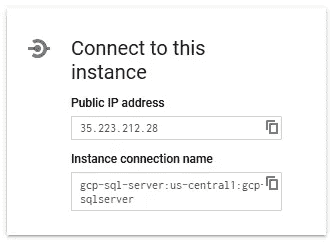

轻松连接到云 SQL 实例

复制信息并使用任何客户端应用程序连接到新创建的 SQL Server 实例。

**注意:**一个实例的标识符被阻塞一段时间。因此，删除云 SQL 实例后，您将无法立即使用相同的标识符。

# 使用 gcloud 创建实例

在尝试为 SQL Server 创建云 SQL 实例之前，确保您的`gcloud` SDK 环境已经安装了`beta`组件。您可以使用以下命令来验证这一点。

```
> gcloud components list 
```

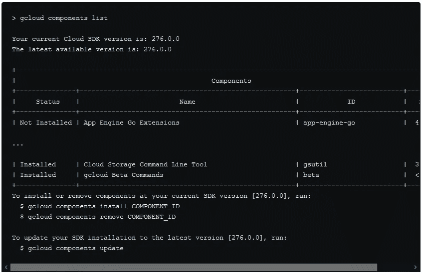

**注意:**必须使用`gcloud`版本 243.0.0 或更高版本。

安装了`beta`组件后，您可以运行这个命令为 SQL Server 创建一个新的云 SQL 实例。

```
> gcloud beta sql instances create gcp-sqlserver `
 --database-version=SQLSERVER_2017_STANDARD `
 --cpu=2 `
 --memory=7680MiB `
 --root-password=d3Ptgz30EAiygtMn
```

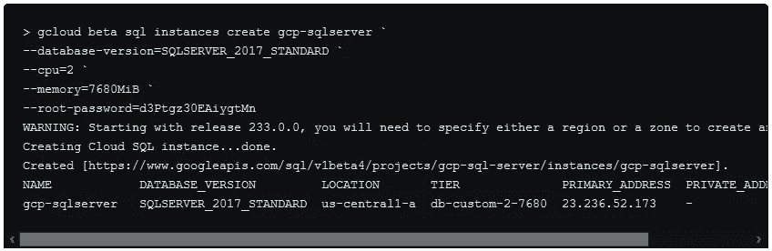

使用预先配置的区域和分区设置，在活动的 GCP 项目中创建新实例。如果需要，您还可以添加命令开关`--project`、`--region`和`--zone`来分配不同于默认值的值。

成功创建后，您必须为用户`sqlserver`设置密码。该密码应该不同于之前为创建云 SQL 实例本身而给出的 root 密码。

```
> gcloud beta sql users set-password sqlserver `
 --instance=gcp-sqlserver `
 --password=d3Ptgz30EAiygtMn
```

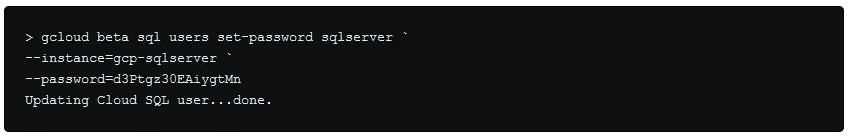

使用上面的命令，您还可以在以后重新设置用户的密码。比如，万一你忘了。

关于[创建实例](https://cloud.google.com/sql/docs/sqlserver/create-instance)的文档更加详细，并提供了关于所有命令开关的信息。它描述了一些关于底层机器类型配置的约束。

# 连接到云 SQL 实例

您将能够以熟悉的方式使用公共 IP 地址连接到新创建的 SQL Server 实例，就像连接到本地实例一样。只要你把你的 IP 地址列入白名单。

以下是各种客户端应用程序的一些截图，如 SQL Server Management Studio、Azure Data Studio 和 Visual Studio 2019。其他客户端应用程序应该可以正常工作。

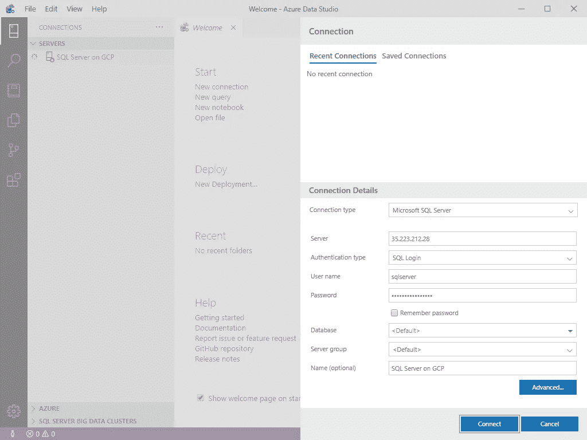

使用各种客户端应用程序连接到云 SQL 实例

使用 ODBC 驱动程序连接到云 SQL 实例也非常好。

# 公共访问云 SQL 的注意事项

在云 SQL 实例的创建步骤中，您可能已经看到了`Connectivity`一节。默认情况下，分配一个`Public IP`的选项被选中。

GCP 建议使用[云 SQL 代理](https://cloud.google.com/sql/docs/sqlserver/sql-proxy)而不是白名单 IP 地址范围，以使外部应用程序能够连接到实例。

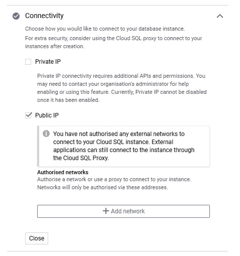

对云 SQL 的默认访问建议使用云 SQL 代理

**注意:**使用云 SQL 代理需要在您的 GCP 项目中启用[云 SQL 管理 API](https://console.cloud.google.com/flows/enableapi?apiid=sqladmin&redirect=https://console.cloud.google.com&_ga=2.205742355.-1649613044.1542902327)。

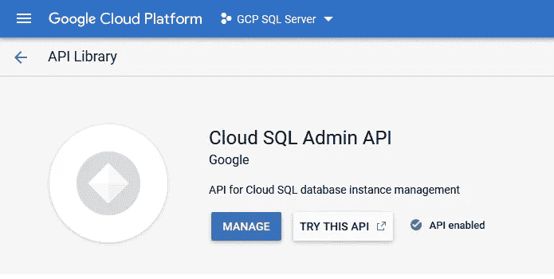

验证在您的 GCP 项目中启用了云 SQL 管理 API

下图显示了代理如何连接到云 SQL:

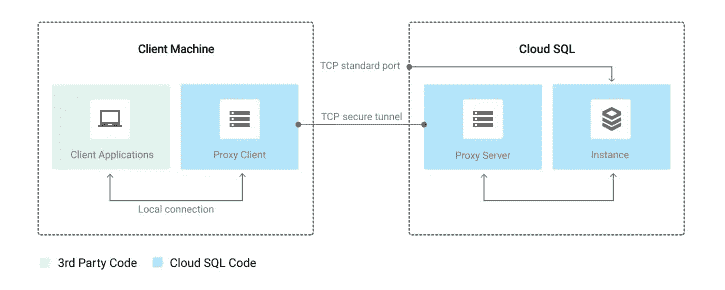

图片由谷歌云文档提供:[云 SQL 代理](https://cloud.google.com/sql/docs/sqlserver/sql-proxy)

将云 SQL 代理下载到您的机器上。打开控制台或终端窗口，导航到存储下载文件的文件夹。最终将二进制文件重命名为`cloud_sql_proxy`(取决于您的操作系统)。更多细节在[使用云 SQL 代理](https://cloud.google.com/sql/docs/sqlserver/connect-admin-proxy)连接客户端中描述。

以下命令建立远程连接并侦听本地主机上的传入连接。

```
> .\cloud_sql_proxy.exe -instances=gcp-sql-server:us-central1:gcp-sqlserver=tcp:1433
```

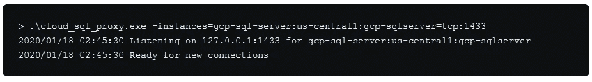

一旦云 SQL 代理为新连接做好准备，您就可以配置您的客户端应用程序使用 localhost 或简单的`.`来连接到您的实例。

按`Ctrl+C`停止执行云 SQL 代理并关闭与您的实例的连接。

您应该显式指定 TCP 端口来连接到您的云 SQL 实例。否则您可能会得到一个`unsupported network: unix`错误。

```
> .\cloud_sql_proxy.exe -instances=gcp-sql-server:us-central1:gcp-sqlserver
```


在运行 Hyper-V 的机器上，您可能会观察到另一个问题。

```
> .\cloud_sql_proxy.exe -instances=gcp-sql-server:us-central1:gcp-sqlserver2=tcp:1433
```

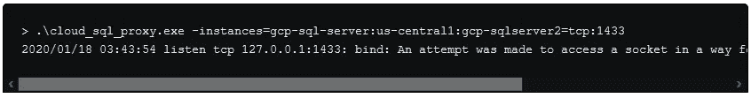

这是因为端口 1433 由 Hyper-V 管理，其他应用程序无法访问。您可以使用以下命令检查保留的 TCP 端口列表。

```
> netsh int ipv4 show excludedportrange protocol=tcp
```

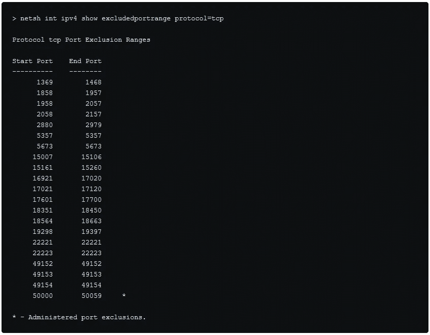

解决方案是在暂时禁用 Hyper-V 时保留 TCP 端口 1433。

```
> # Disable Hyper-V 
> dism.exe /Online /Disable-Feature:Microsoft-Hyper-V > # Reserve the port 1433 
> netsh int ipv4 add excludedportrange protocol=tcp startport=1433 numberofports=1 > # Re-enable Hyper-V 
> dism.exe /Online /Enable-Feature:Microsoft-Hyper-V /All
```

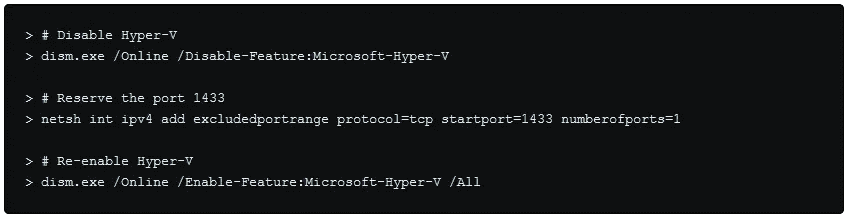

或者改为使用非保留的 TCP 端口。

```
> .\cloud_sql_proxy.exe -instances=gcp-sql-server:us-central1:gcp-sqlserver=tcp:1470
```

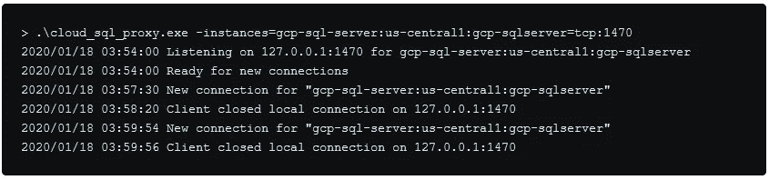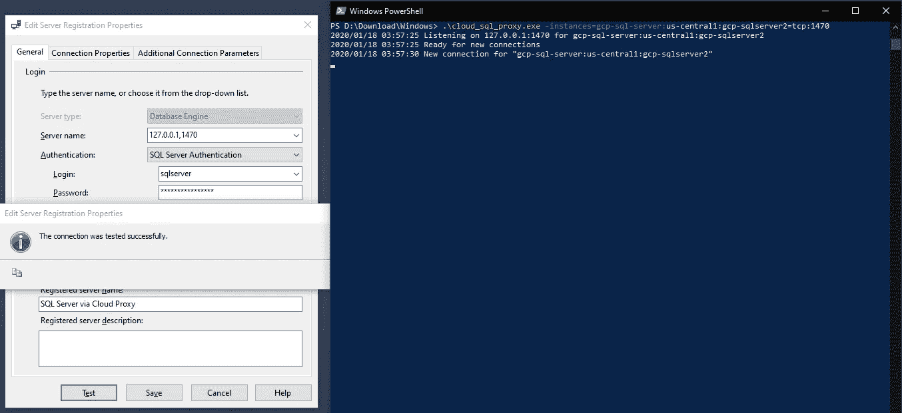

连接到本地云 SQL 代理和自定义 TCP 端口

后一种方法提供了更好的灵活性，而不会因为永久的改变而搞乱本地机器。几个星期后你可能不记得这个变化了。

但是，云 SQL 代理需要在连接到实例的每个客户端上安装一个代理。要在生产环境中正确调用云 SQL 代理，需要几个步骤。并且在某些情况下，由于各种原因，这也是不可能的。

有关云 SQL 代理选项和连接字符串的更多信息，请参见[云 SQL 代理 GitHub 页面](https://github.com/GoogleCloudPlatform/cloudsql-proxy)。

或者，对任何外部网络的授权都是可能的。您将在 [CIDR 符号](https://en.wikipedia.org/wiki/Classless_Inter-Domain_Routing#CIDR_notation)(无类域间路由)中指定至少一个网络，以允许访问您的实例。

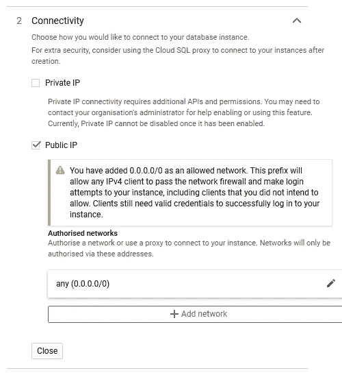

使用 CIDR 符号将您的主机或网络列入白名单

授权外部主机或网络是更简单的选择，也是我当前对用于开发或试运行环境的云 SQL 实例的选择。尽管如此，云 SQL 代理更安全，只要稍加练习，它应该是您连接到实例的首选方式。

您的里程可能会有所不同。也许你可以在下面的评论区给我你的理由。

# 关于云 SQL for SQL Server 的思考

使用云 SQL 实例的 SQL Server 选项不会带来太大的意外，您应该在最短的时间内启动并运行。

GCP 的托管关系数据库服务提供了 SQL Server 的全部功能。通过选择 SQL Server 的版本，您可以完全控制功能和定价。

与微软的 Azure SQL 数据库相比，应该注意的是，GCP 上的 SQL Server 目前作为虚拟机运行，阅读:使用预定义的计算引擎映像，在引擎盖下。

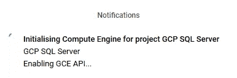

SQL Server 的云 SQL 似乎作为虚拟机运行

但是，您的云 SQL 实例在您的计算引擎区域的虚拟机实例下是不可见的。

不出所料，您的 Cloud SQL for SQL Server 实例运行在 Linux VM 上，准确地说是运行在 Ubuntu 16.04 LTS (64 位；在写的时候)。您可以在任何 SQL 客户端应用程序中检查执行以下查询的环境。

```
Select @@version;
```

文本响应应该如下所示。

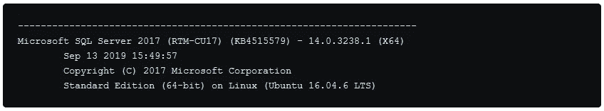

考虑到底层的 Linux 操作系统，还有许多 [SQL Server 特性对于云 SQL](https://cloud.google.com/sql/docs/sqlserver/features#sqlserver-unavailable) 是不可用的。在将本地数据库迁移到 GCP 之前，请务必查阅官方文档，这是评估和评价阶段的一部分。

尽管云 SQL for SQL Server 实例[配置有现成的自定义 TLS 证书](https://cloud.google.com/sql/docs/sqlserver/configure-ssl-instance#server-certs)，但它需要[在客户端](https://cloud.google.com/sql/docs/sqlserver/connect-admin-ip#connect-ssl)上注册证书颁发机构(CA)来启用加密连接。如果您在客户端上设置了`Encrypt=yes` ODBC 连接字符串值，将不会建立连接，并会显示一条错误消息退出。

相反，根据文档，Cloud SQL for SQL Server 可以使用[云 SQL 代理](https://cloud.google.com/sql/docs/sqlserver/connect-admin-proxy)进行连接，该代理将使用自动轮换的临时 TLS 证书建立安全连接。

研究这两个选项如何工作超出了本文的范围。也许我将来会研究这个问题。

为 SQL Server 创建新的 Cloud SQL 实例、恢复现有数据库备份(上面没有记录)以及将任何客户端应用程序连接到 Cloud SQL 只需几个步骤，可能只需要几分钟。

我对 Cloud SQL for SQL Server 的印象还是比较正面的。我喜欢在 GCP 上运行 SQL Server 数据库以及其他服务的想法，如计算引擎、应用引擎、Kubernetes 引擎，甚至是 BigQuery 来分析数据。

让我们看看这项托管服务何时正式发布。SQL Server 2019 应该是当前 SQL Server 2017 之外的额外选择。以及 [Google Data Studio](https://datastudio.google.com/) 中是否会有云 SQL for SQL Server 的连接器。

*原载于 2020 年 1 月 18 日*[*https://jochen . kirstaetter . name*](https://jochen.kirstaetter.name/sql-server-on-gcp/)*。*