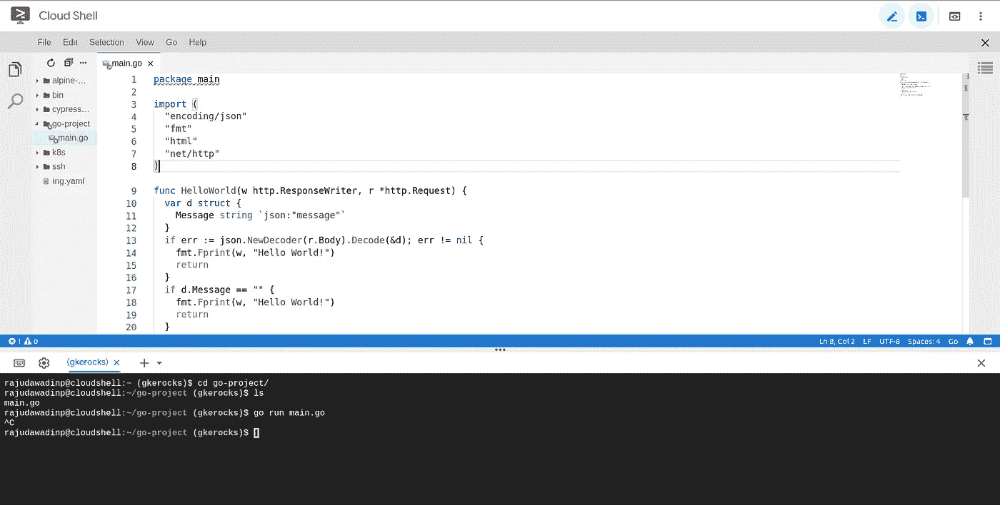

# 充分利用 Google Cloud Shell

> 原文：<https://medium.com/google-cloud/getting-the-best-out-of-google-cloud-shell-3d6ca64bc741?source=collection_archive---------0----------------------->

当涉及到访问 google 云资源或给予 ssh 访问权限或在云上执行一些操作时，我们会想到创建一个独立的 VM(又名跳转服务器)。也可以选择运行专用实例或获得对本地系统的完全访问权限。当我们需要快速访问时，移动设备怎么办？所有这些障碍都可以通过一个解决方案来避免: [Google Cloud Shell](https://cloud.google.com/shell/) 。


Google Cloud Shell 是一个命令行机器，可供每个 Google Cloud 帐户用户免费使用，并提供从浏览器进行 Shell 访问，我们可以从浏览器访问和管理云资源和项目。这个安全的外壳有 5GB 的存储空间，预装了最喜欢的工具，如:MySql 客户端、Kubernetes 和 Docker。外壳是帐户范围的，因此通过保持在同一个外壳上，我们可以连接到多个项目的云资源。

让我们来看看如何充分利用 Google Cloud Shell，让生活变得更加轻松。

## 1.只需点击一下，几秒钟就能启动外壳

预装 debian 的机器只需点击谷歌云控制台右上角的“激活云壳”图标，几秒钟就能在同一个浏览器中启动。如果你很久没有使用 shell 或者第一次试用，可能需要半分钟左右。shell 内置了对 gcloud 凭证的授权，因此您可以访问任何项目中您拥有 IAM 访问权限的任何云资源。


正在启动 google 云外壳

## 2.从本地连接到云外壳

Google Cloud Shell 并不局限于浏览器访问，而是可以从任何安装了 gcloud sdk 和帐户激活的终端访问。使用 gcloud IAM 验证您的本地系统，并访问 google cloud shell:

```
$ gcloud auth login$ gcloud alpha cloud-shell ssh
```

## 3.轻松通过 SSH 访问计算引擎实例

从云 Shell 中，使用 [SSH 访问](https://cloud.google.com/compute/docs/access/#granting_users_ssh_access_to_vm_instances)的用户可以使用 gcloud 命令轻松连接到计算引擎实例。

```
gcloud compute ssh [instance-name] --project [project-name] --zone [zone]
```

即使计算实例没有分配公共 ip，也可以通过云外壳访问该实例。

## 4.正在运行的服务的 Web 预览

它不仅是外壳，而且是一个真正的调试工具。我们可以启动任何服务或运行 docker，并使用“Web Preview”在 nice URL 上预览输出。


云壳 web 预览

通过在后台或外壳的不同标签上运行多个服务，我们可以在不同的端口上预览它们。

## 5.增强云外壳的能力以获得更高的性能

默认情况下，云壳在 *g1-small* 机器类型上运行，该机器类型提供 1 个 vCPU 短期突发和 1.70 GB 内存。有时，如果您必须使用多个选项卡并运行很少的服务，这是不够的。

cloud shell 新推出的功率提升功能允许对 shell *n1-standard-1* VM 实例进行升级，该实例提供 1 个 vCPU 和 3.75GB 内存，可运行 24 小时。

要激活增强模式，请单击云外壳“更多”菜单下的“启用增强模式”选项。

## 6.它不仅仅是 shell——代码编辑器和运行 VS 代码

Google Cloud Shell 基于[忒伊亚 IDE](https://theia-ide.org/) 的集成代码编辑器使得从浏览器编辑 Shell 中的文件和文件夹变得很容易。



云壳集成代码编辑器

点击云外壳顶部的*启动编辑器*(编辑图标)在浏览器上打开一个新标签，可以访问外壳根目录下的所有文件和文件夹。

还有，我们可以用云壳运行 VS 代码。通过 docker 或者云壳内部的 [shell](/google-cloud/how-to-run-visual-studio-code-in-google-cloud-shell-354d125d5748) 简单运行 [cdr/code-server](https://github.com/cdr/code-server/) ，我们就可以在 http 端口预览 nice VS code UI。

## 7.轻松连接到云 SQL

无论是创建 mysql 用户、数据库还是在云 sql 实例上的任何操作，使用云 Shell 都变得更加简单。

```
$ gcloud sql connect myinstance --user=root
```

## 8.使用高级键从移动应用程序访问外壳

云壳访问不仅限于 web 浏览器和计算机，还包括移动设备。除了获取警报通知、管理 GCP 资源和访问计算引擎实例之外，我们还可以从[云控制台移动应用](https://cloud.google.com/console-app/)连接到 shell。


从移动设备访问云外壳

## 9.单击即可部署到云运行

使用 cloud shell 可以将容器化的无服务器应用程序部署到 Google Cloud Run 按钮。新推出的“在 Google Cloud 上运行”按钮使得将新图像部署到 cloud run 服务变得非常简单。


从[Google cloud platform/cloud-run-button](https://github.com/GoogleCloudPlatform/cloud-run-button)repo 中了解更多关于设置的应用程序结构。

除了上述使用云壳，我们可以使用它部署到云功能，GKE 集群，应用引擎和其他服务。Google Cloud Shell 文档[可能会让你感兴趣去探索更多。](https://cloud.google.com/shell/docs/?hl=sk)

快乐的云壳！！

在 T [witter](https://twitter.com/dwdRAJU) 和 L[ink in](https://www.linkedin.com/in/dwdraju/)上与我保持联系，在那里我不断分享有趣的事情。