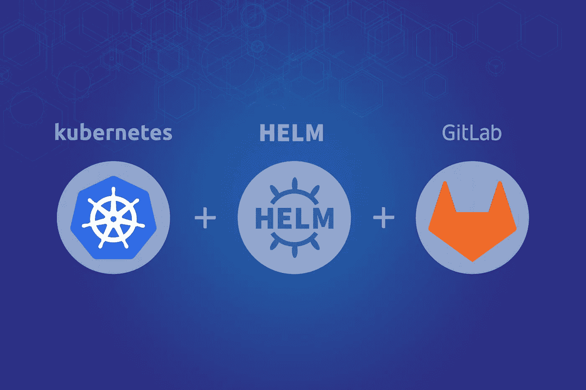
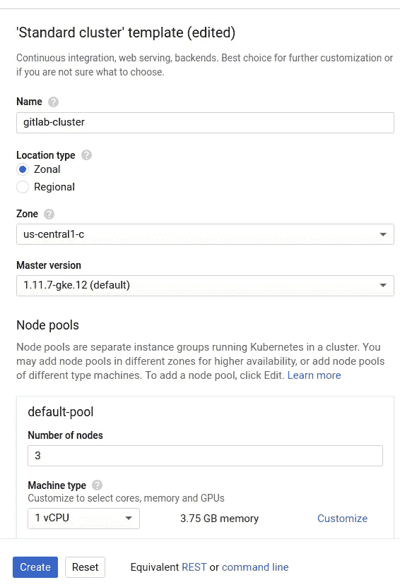
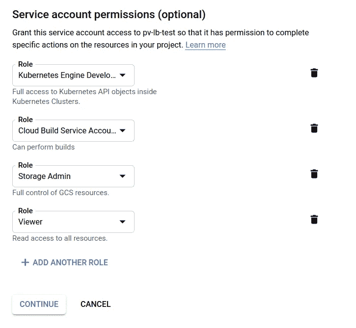
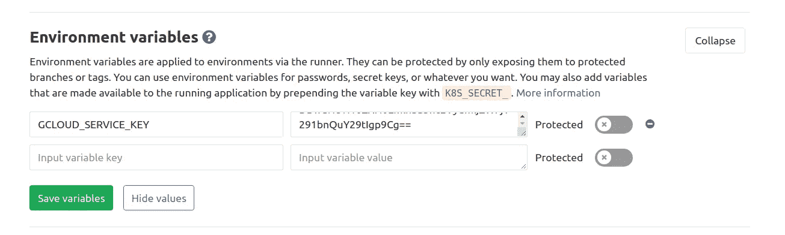
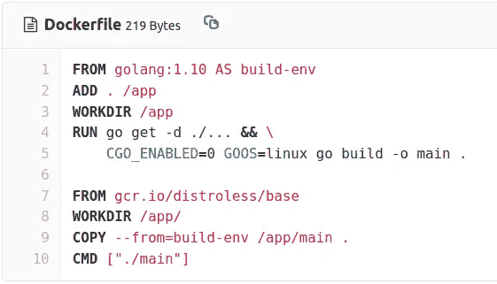
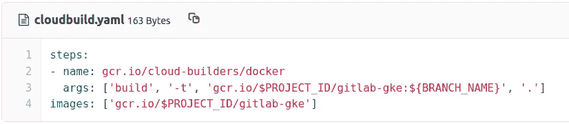
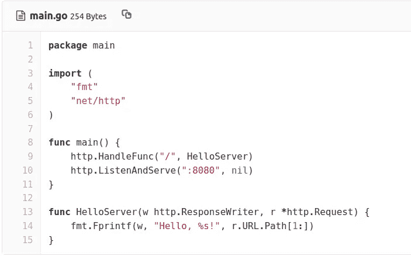
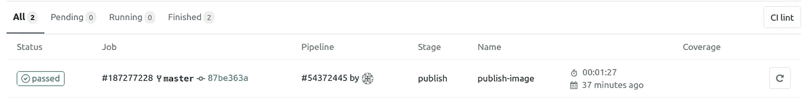
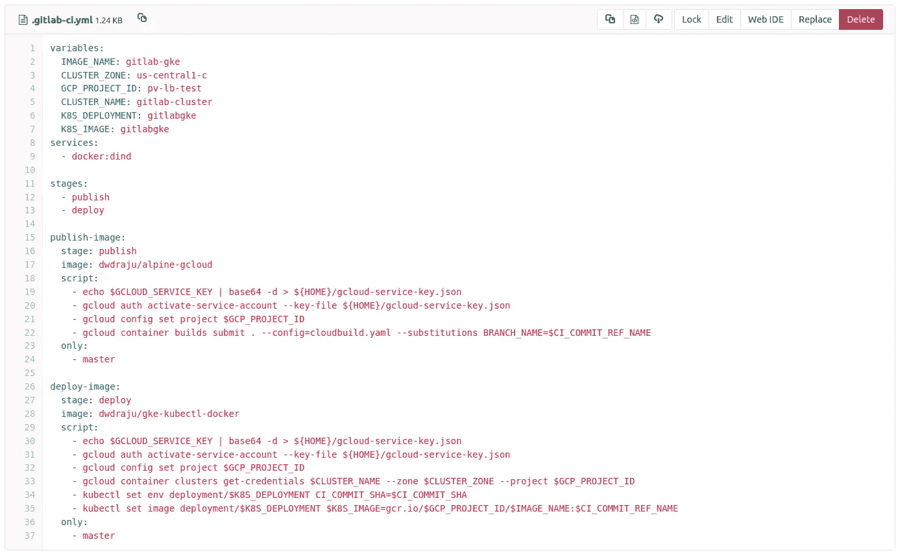
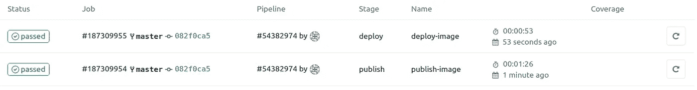

# Gitlab 通过 Helm 持续部署到 GKE

> 原文：<https://medium.com/google-cloud/gitlab-continuous-deployment-pipeline-to-gke-with-helm-69d8a15ed910?source=collection_archive---------0----------------------->

我分享了关于使用 shell runner 使用 Gitlab Community Edition(CE)的 Google Cloud Build 服务。你可以从[这篇文章](/google-cloud/using-google-container-builder-service-from-gitlab-ce-93d96dea06bb)中获得关于构建 docker 图像并将其存储在谷歌容器注册中心(GCR)的想法。

在这篇文章中，我们的目标是熟悉从 docker 构建到部署到 GKE(Google Kubernetes 引擎)的管道，这适用于 Gitlab 的 CE 和 EE(企业版)。



图片来源:blog.pactosystems.com

因此，流程应该是:

1.  在 GKE 创建一个 Kubernetes 集群
2.  配置用于访问群集和使用云构建服务的服务帐户凭据
3.  创建 gitlab 项目，添加 gitlab-ci pipline 以及 cloudbuild & dockerfile
4.  安装舵图以方便部署
5.  启动并运行持续部署
6.  保护 GKE 集群

让我们从**创建 GKE 集群**开始。前往 [Google Cloud Project](https://console.cloud.google.com/kubernetes/add) 上的集群创建页面，选择 favorite zone，添加节点(如果用于测试，您可能更喜欢自动扩展和可抢占的节点)，更好地启用 VPC 本地集群，根据需要调整其余设置，然后点击 create。



创建 GKE 集群

几分钟后，集群将准备就绪。

现在，是时候**创建一个服务帐户来从 Gitlab 访问 GKE 资源**并触发代码构建了。转到 IAM (身份和访问管理)的[服务帐户添加页面，添加新的服务帐户。给它起一个合适的名字，附加权限，创建一个 json 密钥，然后点击 done。](https://console.cloud.google.com/iam-admin/serviceaccounts/create)



***更新:***

我们可以创建一个单独的 GCS 存储桶来存储云构建日志，并通过以下步骤向服务帐户授予`objectCreator`权限，而不是授予存储管理员和项目查看者权限:

```
gsutil mb gs://[BUCKET-NAME]/gsutil iam ch serviceAccount:[SERVICE-ACCOUNT-ID]:objectCreator gs://[BUCKET-NAME]eg.
gsutil mb gs://gitlab-gke-cloudbuild-logs/gsutil iam ch serviceAccount:gitlab-gke@pv-lb-test.iam.gserviceaccount.com:objectCreator gs://gitlab-gke-cloudbuild-logs
```

我们可以利用[云外壳](https://cloud.google.com/shell/)来执行上述命令，或者通过控制台添加权限。

**是时候去 Gitlab 了！！**

让我们在[gitlab.com](https://gitlab.com)上创建一个新项目，并在上面添加几个文件:Dockerfile，cloudbuild.yaml，。gitlab-ci.yml 和项目资源文件。此外，我们将把服务帐户凭证文件保存为 Gitlab 环境变量。由于不支持多行，我们对文件进行 base64 加密，并在环境变量上使用编码值，我们将在触发 Gcloud 资源时解码该值。对文件进行编码:

```
base64 /path/to/credential.json | tr -d \\n
```

添加变量



下面是我们简单的 docker 文件:



我使用多阶段构建，工件在[发行版](https://github.com/GoogleContainerTools/distroless)基础映像上运行，它是轻量级的，只包含应用程序和运行时依赖。

> 专注于语言的 docker 图像，不包括操作系统

云构建构建配置文件，包含触发 Google 云构建服务的任务。我们正在推动 docker 图像到谷歌容器注册(GCR)。



和一个简单的 go http 服务器 main.go:



我们可以从本地通过构建和运行对 docker 文件进行测试:

```
$ docker build -t gitlab-gke .
$ docker run -d -p 8080:8080 --name gitlab-gke gitlab-gke
```

从浏览器向服务器发送几个请求:[http://localhost:8080/raju](http://localhost:8080/raju)

```
Response: Hello, raju!
```

**配置 Gitlab CI**

我们需要对 gitlab-ci.yml 执行两个主要步骤，这是使用 gitlab 管道服务的实际文件:

1.  发布:这一步使用 cloudbuild spec 文件在云构建环境上执行构建，云构建环境使用 Dockerfile 构建映像，然后推送到 gcr。
2.  部署:为了将新构建的映像部署到 GKE 集群，我们将其配置为在主分支上有新的提交时运行。你可以根据你的需要创建一个触发器，比如创建标签后，手动触发等。

以下阶段发布图像:

```
publish-image:
  stage: publish
  image: dwdraju/alpine-gcloud
  script:
    - echo $GCLOUD_SERVICE_KEY | base64 -d > ${HOME}/gcloud-service-key.json
    - gcloud auth activate-service-account --key-file ${HOME}/gcloud-service-key.json
    - gcloud config set project $GCP_PROJECT_ID
    - gcloud builds submit . --config=cloudbuild.yaml --substitutions BRANCH_NAME=$CI_COMMIT_REF_NAME
  only:
    - master
```

这里，我们使用一个简单的基于 alpine linux 的[*dwdraju/alpine-gcloud*](https://github.com/dwdraju/alpine-gcloud)，它拥有 Google cloud sdk，可以通过添加凭证文件来访问 g cloud 资源。


如果一切都很好，合并了主分支上的所有代码，它应该会触发一个新的工作，并在谷歌容器注册表上发布新的图像。



## **创建舵图**

Helm 是 Kubernetes 的一个包管理器，它简化了 k8s 资源的创建、版本控制和管理。从几个月前开始，它就属于 CNCF 了。

然后，为我们的应用程序创建一个新图表。我们正在使用最新的 Helm 版本 3，它更像是不需要舵柄代理的二进制文件。

```
$ helm create gitlabgke
```

它添加了一些 Kubernetes [清单文件](https://gitlab.com/dwdraju/gitlab-gke/commit/5df168fba930996d28c29fc4bf841ec3c2540ef9)。

## 获取 Kubernetes 集群凭据以访问 GKE 和安装舵图

```
$ gcloud container clusters get-credentials [cluster-name] --zone [cluster-zone] --project [project-name]
```

回应:

```
Fetching cluster endpoint and auth data.
kubeconfig entry generated for gitlab-cluster.
```

现在，我们需要调整默认舵图上的一些配置:

1.  服务类型:节点端口
2.  InternalPort: 8080(或根据您的应用程序端口)
3.  如果您没有域名，并且必须使用全局负载平衡器的 IP 地址访问服务，请添加默认路由
4.  图像存储库和标签(我们现在使用 gcr . io/[project-name]/git lab-gke:master)

下面是修改的提交:[https://git lab . com/dwdraju/git lab-gke/commit/9 f 02 cf 83 f 39 be 71 b 62 A8 ed 07589 bfc 538 BC 43349](https://gitlab.com/dwdraju/gitlab-gke/commit/9f02cf83f39be71b62a8ed07589bfc538bc43349)

## 安装舵图的时间到了

```
helm install gitlabgke .
```

在几分钟内，它将使 pod 运行，健康检查通过，新的入口 ip 可由`kubectl get ing`获得。您现在可以访问 ip 来获得 hello:)

[http://[ingress-IP]/my name](http://[ingress-ip]/myname)

## 返回 Gitlab CI 进行持续部署

我们需要添加一个新的阶段 **deploy** ，因为我们已经有了 **publish** 阶段，它会将新的图像发送到容器注册表。

```
deploy-image:
  stage: deploy
  image: dwdraju/gke-kubectl-docker
  script:
    - echo $GCLOUD_SERVICE_KEY | base64 -d > ${HOME}/gcloud-service-key.json
    - gcloud auth activate-service-account --key-file ${HOME}/gcloud-service-key.json
    - gcloud config set project $GCP_PROJECT_ID
    - gcloud container clusters get-credentials $CLUSTER_NAME --zone $CLUSTER_ZONE --project $GCP_PROJECT_ID
    - kubectl set env deployment/$K8S_DEPLOYMENT CI_COMMIT_SHA=$CI_COMMIT_SHA
    - kubectl set image deployment/$K8S_DEPLOYMENT $K8S_IMAGE=gcr.io/$GCP_PROJECT_ID/$IMAGE_NAME:$CI_COMMIT_REF_NAME
  only:
    - master
```

因此，我们最终的 gitlab-ci.yml 文件如下所示:



如果一切都设置正确，我们将获得 gitlab 工作的成功。



在设置环境变量 **CI_COMMIT_SHA** 之后，我们简单地更改了这里的图像，但是我们可以使用 helm 通过更改图表的 values.yml 文件上的标记值来升级版本。

```
$ helm upgrade gitlabgke .
```

你可以尝试升级头盔。为此，您可以使用我的 helm-docker 图像，该图像可通过此 [github repo](https://github.com/dwdraju/helm-docker) 获取使用示例。

## 保护集群

*   如果您使用自托管 CE gitlab，请在 GKE 集群上启用**主授权网络**，并将 Gitlab ip 地址列入白名单。
*   要访问 pod，最好创建一个特定的服务帐户。这是用于配置的[提交](https://gitlab.com/dwdraju/gitlab-gke/commit/295d367c3180328639820ca66fe225f6bcc0e2da)。
*   我们在这个例子中使用 distroless 基本映像，这可能不适合所有情况，但最好使用最小的 docker 映像，如 alpine，以减少攻击的机会并最小化 docker 映像大小。
*   GKE 已经开始提供支持 istio 的集群，该集群提供具有强身份、强大策略、透明 TLS 加密以及认证、授权和审计(AAA)的安全特性。试试看，你会爱上 istio 的。

目前就这些，如果你有更好的方法来增强健壮性，请随意发表评论。你可以在 [linkedin](https://www.linkedin.com/in/dwdraju/) 和 [twitter](https://twitter.com/dwdRAJU) 上找到我。