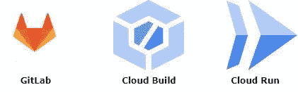
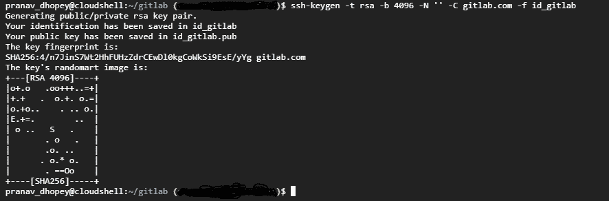
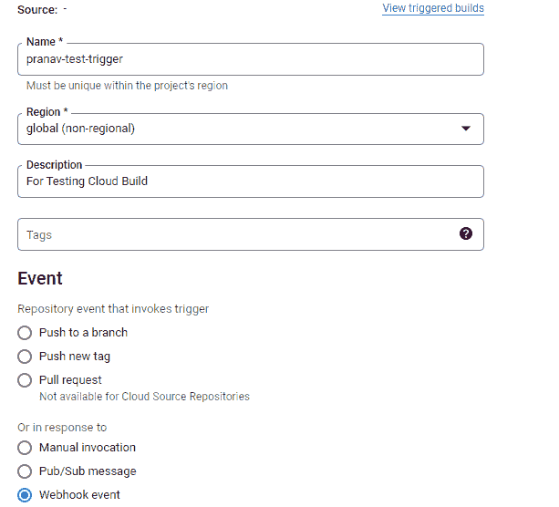
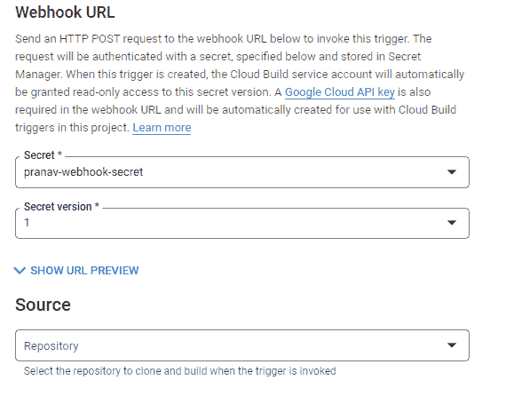
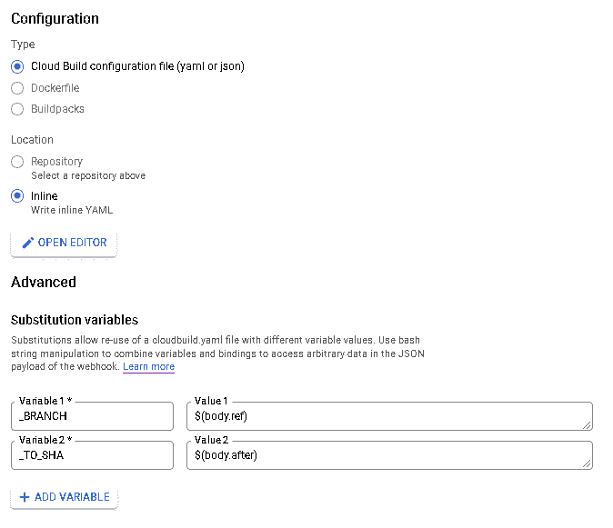
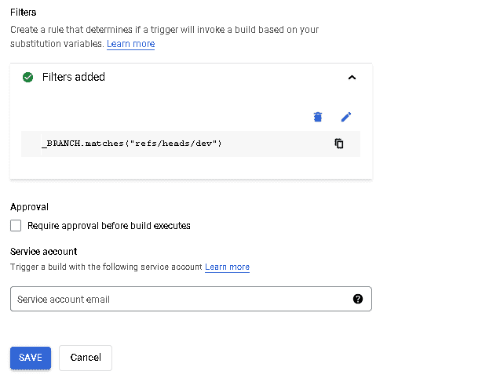
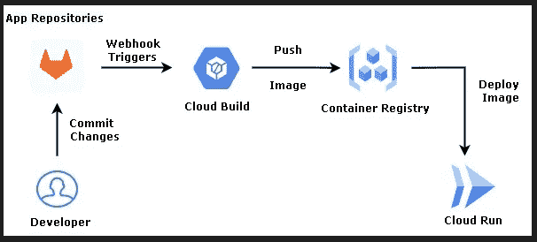
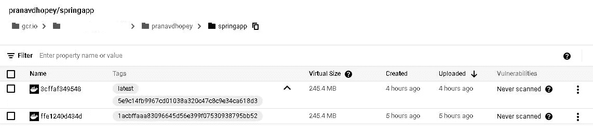
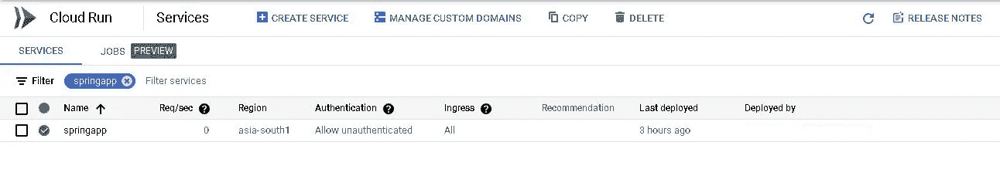
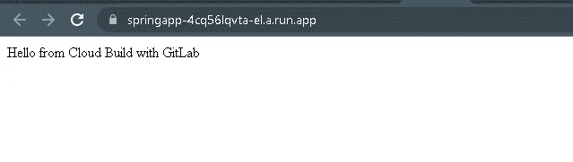

# GitLab 与 GCP CI/CD 云构建的集成

> 原文：<https://medium.com/google-cloud/gitlab-integration-with-gcp-cloud-build-for-ci-cd-9a3915bc1f92?source=collection_archive---------3----------------------->



在这篇博客中，我们将讨论如何使用 webhook 触发器将云构建与 GitLab 集成，构建 Docker 映像，并将其部署到云运行中。

## 问题陈述:

我们的一个客户希望使用云构建实现 CI/CD 管道，以便在云运行上部署 Docker 映像。他们将应用程序代码托管在 GitLab 上。Cloud build 提供了与 Cloud Source Repository、GitHub 和 BitBucket 的直接集成，但是没有与 GitLab 的直接集成。

## **整合:**

要在 GitLab 上创建一个 webhook 触发器，我们需要创建一个 SSH 密钥来验证您到 GitLab 的连接。您需要在内联构建配置中检索 SSH 密钥来访问 GitLab 上的代码。

将云构建与 GitLab 集成的步骤如下:

1.  创建 SSH 密钥。
2.  在 GitLab 上添加您的公共 SSH 访问密钥。
3.  在 Secret Manager 中存储您的私有 SSH 密钥。
4.  正在创建 Webhook 触发器。
5.  在 GitLab 中创建 webhook。

## 实施:

**第一步:创建 SSH 密钥**

创建一个新的 GitLab SSH 密钥，其中“gitlab.com”是您的 GitLab 存储库的 URL。

```
ssh-keygen -t rsa -b 4096 -N ‘’ -C gitlab.com -f id_gitlab
```



这将生成两个密钥文件，一个是公共文件“id_gitlab.pub”，另一个是私有密钥文件“id_gitlab”。

**第二步:** **在 GitLab 上添加你的公共 SSH 访问密钥**

现在，我们需要添加一个公共 SSH 密钥(。pub ),它是在 GitLab 的第一步中生成的，用于安全操作。为此，请遵循以下步骤。

*   登录 GitLab。
*   选择顶部栏右上角的**首选项**。
*   选择左侧边栏上的 **SSH 键、**。
*   将您的公钥内容粘贴到**密钥**框中。如果您手动复制了密钥，请确保复制了整个密钥，以 *ssh-rsa、ssh-dss、ssh-ed25519、ecdsa-sha2-nistp256、ecdsa-sha2-nistp521、sk-ecdsa-sha2-nistp256@openssh.com、*或*sk-ssh-ed25519@openssh.com*、 *ecdsa-sha2-nistp384* 开始，并可能以注释结束。
*   在**标题**框中，键入描述，如云构建或云构建配置项。
*   在**到期日期**框中，选择一个到期日期(可选)。

**第三步:** S **在秘密管理器中存放你的私有 SSH 密钥**

现在我们需要在 GCP 的秘密管理器中存储在步骤 1 中生成的秘密 SSH 密钥。

*   转到云控制台中的秘密管理器页面
*   在“机密管理器”页面上，单击“创建机密”。
*   在 Create secret 页面的 Name 下，输入您的秘密的名称，比如 **gitlab-ssh-secret-key** 。
*   在“秘密值”字段中，粘贴您的私钥内容。
*   保持区域部分不变。
*   单击“创建密码”按钮创建您的密码。

**步骤 4:创建 webhook 触发器**

现在是时候创建一个从 GitLab 调用构建的 webhook 触发器了。

*   打开触发器页面。
*   单击创建触发器。
*   输入以下触发设置:

i) **名称:**您的触发器的名称。

ii) **地区**:默认设置为全球。保持原样。

iii) **描述**(可选):对你的触发器的描述。

iv) **事件**:选择 **Webhook** 事件来设置您的触发器，以启动构建来响应传入的 Webhook 事件。

v) **Webhook URL** :使用 Webhook URL 来认证传入的 Webhook 事件。

*   **秘密**:你需要一个秘密来认证进入的 webhook 事件。您可以创建新密码或使用现有密码。

要创建新的秘密:

a.选择**创建新的**。

b.点击**创建密码**。你会看到**创建一个 webhook 秘密**弹出框。

c.在**机密名称**字段中，输入您的机密名称，比如 **gitlab-webhook-secret** 。

d.点击**创建密码**保存您的密码，该密码将自动创建并保存在密码管理器中

要使用现有机密:

a.选择**使用现有的**。

b.在**机密**字段中，从下拉菜单中选择您想要使用的机密名称，或者按照说明通过资源 ID 添加机密。

c.在**机密版本**字段中，从下拉菜单中选择您的机密版本。

在您创建或选择了您的秘密后，您将会看到一个 **Webhook URL 预览**。您的 URL 将包含由云构建生成的 API 密钥和您的秘密。

*   **Source** (可选):webhook 触发器运行时要构建的存储库。将此字段留空。
*   **配置**:在 Google Cloud 控制台中创建一个内联构建配置。

在内联 YAML 文件中添加如下所示的三个步骤，内联构建配置中的前两个步骤首先使用您的 SSH 密钥验证您到 GitLab 的连接，并访问您指定的存储库。第三步检查调用该构建的特定提交。

```
steps:
# first, setup SSH:
# 1- save the SSH key from Secret Manager to a file
# 2- add the host key to the known_hosts file
- name: gcr.io/cloud-builders/git
  args:
  - ‘-c’
  - |
    echo “$$SSHKEY” > /root/.ssh/id_rsa
    chmod 400 /root/.ssh/id_rsa
    ssh-keyscan gitlab.com > /root/.ssh/known_hosts
  entrypoint: bash
  secretEnv:
  - SSHKEY
  volumes:
  - name: ssh
    path: /root/.ssh# second, clone the repository
- name: gcr.io/cloud-builders/git
  args:
  - clone
  - ‘-n’
  - ‘git@gitlab.com:pranavdhopey/springapp.git’
  - .
  volumes:
  - name: ssh
    path: /root/.ssh# third, checkout the specific commit that invoked this build
- name: gcr.io/cloud-builders/git
  args:
  - checkout
  - $_TO_SHAavailableSecrets:
  secretManager:
  - versionName: projects/<project_no>/secrets/<secret-name>/versions/latest
  env: SSHKEY
```

*   **替换**(可选):我们可以使用该字段定义特定于触发器的替换变量。

在我们的例子中，我们创建了两个替换变量' _BRANCH '和' _TO_SHA '。假设您想要观察与提交 ID 相关联的特定分支名称，然后在构建定义中切换到该分支名称。为了获得这些数据，您可以使用有效负载绑定来创建替代变量，以保存分支名称。

```
‘_BRANCH’: $(body.ref)
‘_TO_SHA’: $(body.after)
```

*   **Filters** (可选):您可以在一个触发器中创建一个规则，该规则决定您的触发器是否将基于您的替代变量执行构建。

因为我们希望触发器在分支名称与 dev 匹配时执行构建，所以我们使用了“==”操作符来检查精确匹配。

```
“_BRANCH == refs/heads/dev”
```

*   点击**创建**来创建你的构建触发器。



**第五步:在 GitLab 中创建一个 web hook**

在这一步中，我们将把上一步中生成的 Webhook URL 添加到 GitLab 项目中。

1.  在您的项目或组中，在左侧栏中，选择**设置> Webhooks** 。
2.  在 URL 中，输入 webhook 端点的 URL。如果 URL 包含一个或多个特殊字符，则必须使用百分比编码。
3.  在**触发**部分，选择触发 webhook 的事件。
4.  可选。清除**启用 SSL 验证**复选框以禁用 SSL 验证。
5.  选择**添加 webhook**

这就是我们如何将云构建与 GitLab 集成并建立 CI/CD 管道。



我们用一个例子来理解这个。我们在 GitLab 存储库中托管了一个 spring-boot 应用程序。您可以从我的 [GitHub](https://github.com/pranavdhopey/springapp.git) 库复制一个示例代码，并将其托管在您的 GitLab 中。

现在，按照上面的步骤将 GitLab 存储库与 Cloud Build 集成，并按照步骤中的说明配置触发器。

**工作流程:**

1.持续集成(CI 渠道):

*   开发人员对代码进行更改，修复错误，并将其推送到应用程序存储库。
*   然后，Cloud build 通过存储库上的 webhook 事件自动调用触发器。
*   一旦触发器被任何事件调用，cloud build 就会执行内嵌编辑器中编写的指令，例如从提供的 Dockerfile 构建 docker 映像，并将其推送到配置的容器注册表中。

2.持续部署(CD 管道)

*   一旦 Docker 映像被推送到容器注册中心，云构建将使用给定的配置将映像部署到云运行，最后，云运行将在无服务器平台上托管应用程序。

在云构建触发器的内联编辑器中复制以下代码。

第一步，内联构建配置使用您的 SSH 密钥验证您到 GitLab 的连接，并访问您指定的存储库。接下来，在第二步和第三步中，它会克隆存储库，并根据您在触发器上设置的过滤器检查调用 webhook 的提交。

上述内联构建配置文件的第四步将从代码中构建一个 docker 映像，该映像的标签为' **latest** ，提交 id 从替换变量` **_TO_SHA** '中提取，并将映像推送到容器注册表中。现在，在最后一步中，docker 映像将使用提供的配置部署到云运行，并创建一个云运行服务。

每当开发人员进行更改时，云构建触发器就会被 webhook 事件调用，并执行内联构建配置文件中的步骤，该文件将构建名为“springapp”的 docker 映像，并以“latest”和“commit id”作为标签，然后将其推送到 GCR。



在图像被推送后，它将被部署在一个云服务器上，并将获得一个触发 URL 来测试它。



下面是云运行触发器 URL 的截图。



## **结论:**

我们已经看到了 Docker Image 在云上的端到端部署，使用 Cloud Build 作为 CI/CD 工具，与外部源代码管理系统 GitLab 集成，并托管了一个示例 spring boot 应用程序。