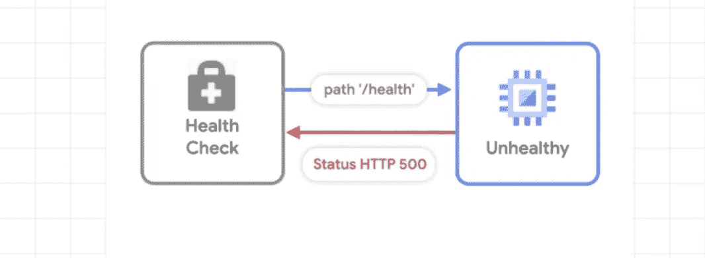
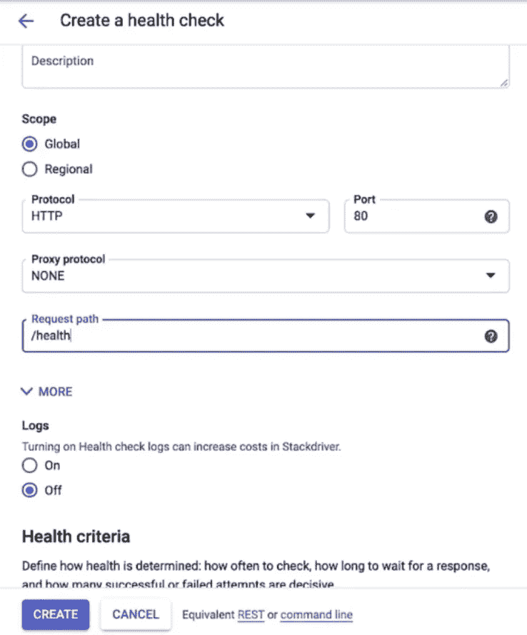
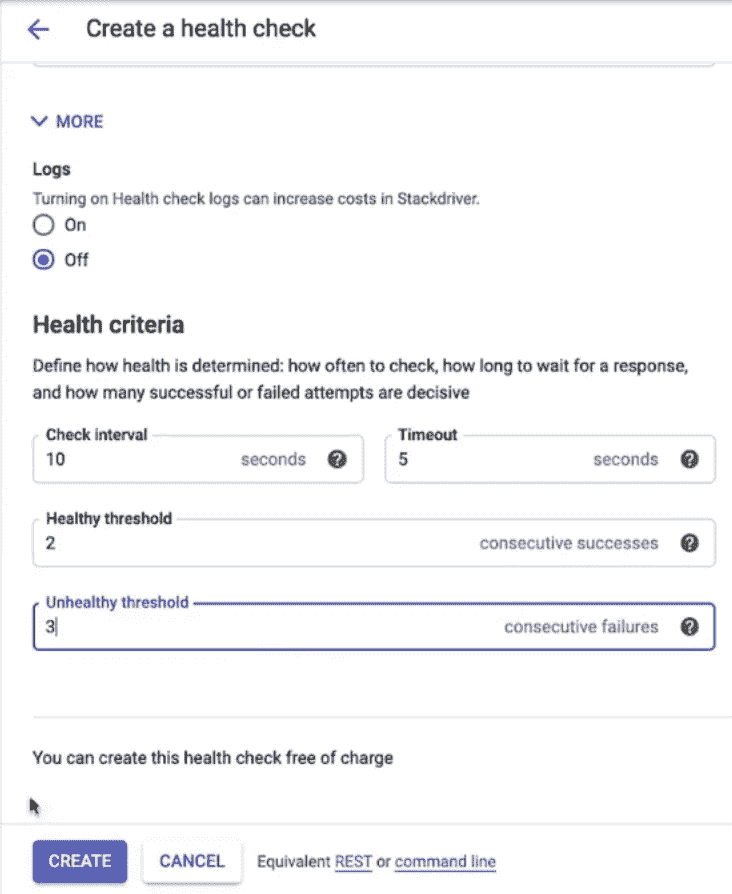
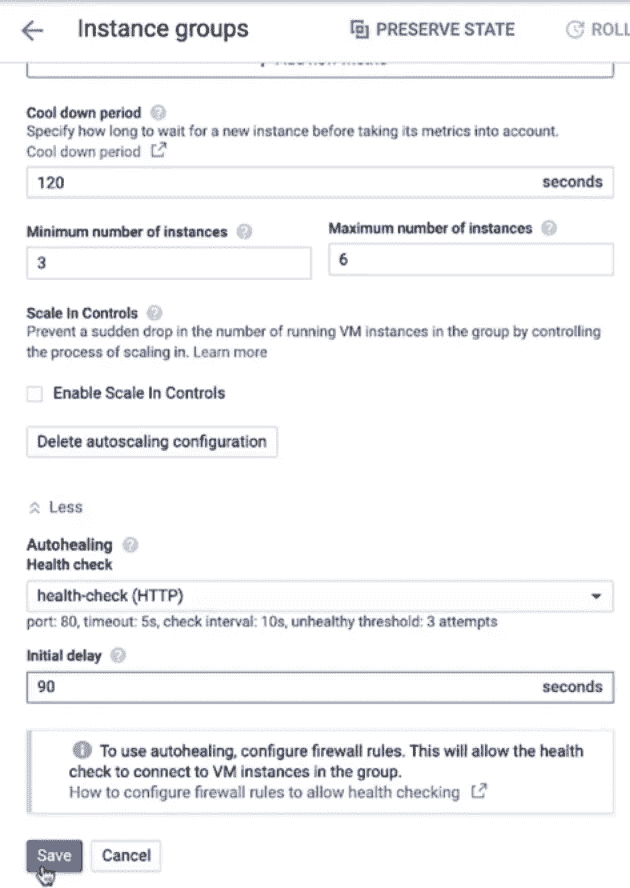
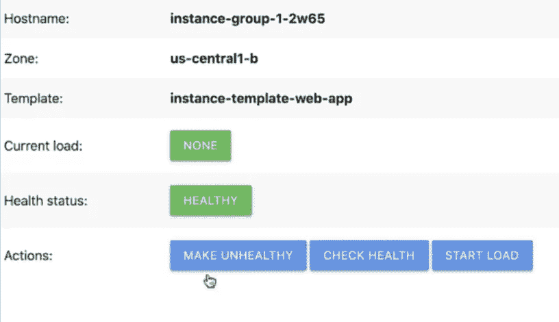
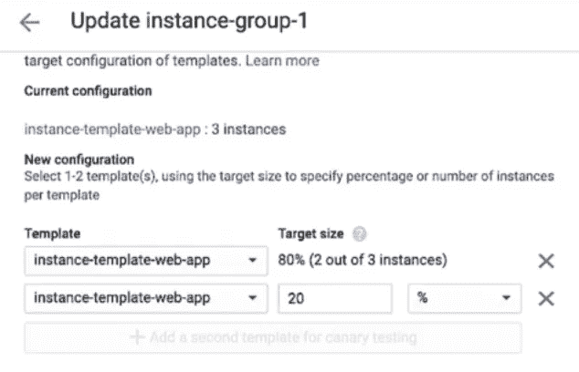
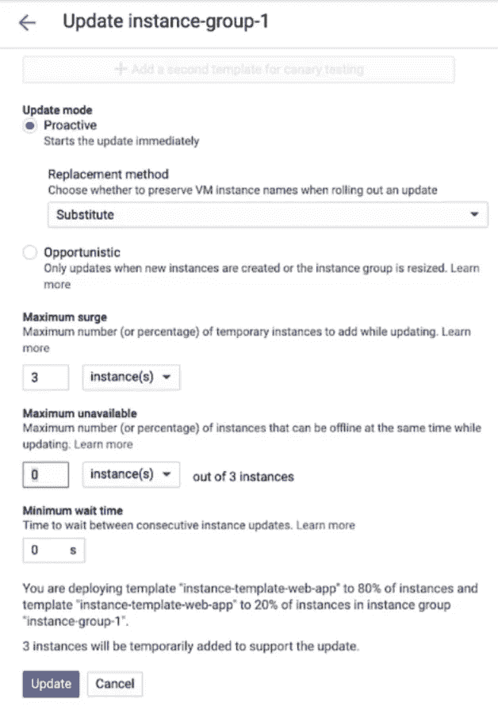

# 像具有自动修复和自动更新功能的 RPG 一样重生虚拟机

> 原文：<https://medium.com/google-cloud/give-your-vms-a-steady-pulse-with-autohealing-and-autoupdates-ae2c0828ecc9?source=collection_archive---------1----------------------->

## 规模季节

# 规模季节

“规模季节”是一个博客和视频系列，旨在帮助企业和开发人员在设计模式中构建规模和弹性。在这一系列文章中，我们计划向您介绍一些创建具有弹性和可伸缩性的应用程序的模式和实践，这是许多现代架构实践的两个基本目标。

在第 1 季中，我们将介绍基础架构自动化和高可用性:

1.  [可扩展和弹性应用的模式](/google-cloud/scale-and-resilience-arent-just-buzzwords-ce748360e80)
2.  [基础设施为代码](/google-cloud/why-should-you-treat-infrastructure-like-software-3865ed0e4b03)
3.  [不变的基础设施](/google-cloud/sometimes-change-is-bad-immutable-infrastructure-624a8e3482d6)
4.  [在哪里扩展您的工作负载](/@swongful/where-to-scale-your-workloads-6420150bf825)
5.  [全球自动扩展 web 服务](/google-cloud/globally-autoscaling-web-services-4b650cc6fc49)
6.  [高可用性(自动修复&自动更新)](/@swongful/give-your-vms-a-steady-pulse-with-autohealing-and-autoupdates-ae2c0828ecc9)(本文)

在本文中，我将带您了解如何使用自动修复和自动更新来为 GCP 计算引擎实例创建健康检查和维护 HA。

# 看看这个视频

# 回顾

到目前为止，我们已经了解了 Critter Junction 如何在 Compute Engine 上推出游戏应用并在全球推广。随着他们的日活跃用户不断增加，我们帮助他们设置了自动扩展和全局负载平衡，以处理全球分布和不断增长的流量。今天，让我们了解他们如何通过优雅地替换失败的实例来使这个社交动物应用程序更具可扩展性。

## 游戏噩梦

为了让他们的用户免于冒着日常游戏的风险，Critter Junction 需要确保他们的应用程序始终可用，没有中断。

一种方法是在堆栈的所有层设置高可用性或 HA。虽然这可能意味着分布式数据库、网络和应用服务器，但我们关注的是运行在计算引擎上的游戏服务器。

我们知道托管实例组提供了诸如[自动扩展](https://cloud.google.com/compute/docs/load-balancing-and-autoscaling#:~:text=Compute%20Engine%20offers%20autoscaling%20to,need%20for%20resources%20is%20lower.)、区域性(多区域)部署、自动修复和自动更新等功能。可以添加到计算引擎配置中的两个功能是自动修复和自动更新。

> 自动修复有助于主动识别不健康的实例(没有响应)并用健康的实例替换它们。
> 
> 自动更新有助于在不中断服务的情况下更新实例

# 自动愈合

让我们稍微关注一下自动修复。

第一步是创建一个健康检查，它不仅检测机器是否正在运行，还检测特定于应用程序的问题，如冻结、崩溃或过载。如果某个实例被认为不正常，则托管实例组会创建新的实例。

我们正在构建在[上一篇文章](/google-cloud/globally-autoscaling-web-services-4b650cc6fc49)中创建的实例配置。

1.  首先，在计算引擎中创建一个健康检查，并为其命名。
2.  将协议设置为 **HTTP** 。
3.  您可以在任何路径上设置健康检查，但是假设路径是/health。

在我们的演示应用程序中，我们添加了代码来确保/health 在正常运行时返回 200 OK 响应，在不正常运行时返回 HTTP 500 内部服务器错误。

## 建立健康标准

1.  将检查间隔设置为 **10** ，这意味着每隔 10 秒将探测服务的健康状况。
2.  将超时设置为 **5** 。也就是说，我们最多等待 5 秒钟来响应探测。
3.  将健康阈值设置为 **2** ，它定义了连续探测的数量，该数量必须成功，实例才能被视为健康。
4.  最后，将不健康阈值设置为 **3** ，它定义了实例被认为不健康时必须失败的顺序探测的数量。
5.  然后创造。

> 作为最佳实践，您希望运行状况检查是保守的，这样您就不会先发制人地删除和重新创建实例。

## 向现有实例添加运行状况检查

现在，让我们转到上一集创建的实例组，并向它添加一个健康检查。

1.  选择初始延迟为 90 秒的健康检查。

> 理想情况下，这个初始延迟应该足够长，以便实例完全运行并准备好健康地响应。

## 模拟故障

现在让我们玩玩这个，模拟失败。

1.  为此，我们转到虚拟机实例，单击外部 IP 并使其不健康。
2.  等待自动修复程序采取行动，您将看到实例旁边的绿色复选标记变成一个微调器，表明自动修复程序已经开始重新启动该实例。

# 当你更新一个实例的时候呢？

HA 的另一个关注点是在不影响服务的情况下对实例应用更新。托管实例组允许您控制更新部署的速度和范围，以最大限度地减少对应用程序的中断。您还可以执行部分部署，这允许金丝雀测试。

现在让我们来看看实际情况吧！

1.  在我们的实例组中，单击滚动更新按钮。滚动意味着它用于逐步更新。
2.  为 canary 测试添加第二个模板，并选择目标大小为 20%。

> 这意味着我们希望将 20%的流量发送到新实例进行金丝雀测试

3.现在，默认情况下，更新模式是主动的，这意味着计算引擎会主动计划操作，以便在必要时将请求的更新应用到实例。在许多情况下，这通常意味着主动删除和重新创建实例。

*   如果主动更新可能太具破坏性，您可以选择执行**机会性**更新。只有当您在选定实例上手动启动更新时，或者当托管实例组创建新实例时，才会应用机会更新。
*   **Max surge** 表示作为此次更新的一部分，你愿意增加多少实例。此处的值越高，更新速度越快，但新实例的成本也越高。所以你面临着成本和速度的权衡。
*   **最大不可用时间和最小等待时间**:将它们保持为零，但这些参数用于控制更新对您的服务的破坏程度，并控制更新部署的速度。

# 就是这样！

通过我们帮助在托管实例组中设置两个高可用性特性，Critter Junction 拥有了一个更具弹性的架构。自动修复主动识别不健康的实例并修复它们，而自动更新在不中断服务的情况下更新实例。请继续关注，以了解更多的生物连接商店。

记住，永远要做架构设计。

# 后续步骤和参考:

*   在[谷歌云平台媒体](https://medium.com/google-cloud)上关注这个博客系列。
*   参考:[设置健康检查和自动修复](https://goo.gle/3amFGm4)。
*   关注[季 Scale 视频系列](http://bit.ly/seasonofscale)，订阅谷歌云平台 YouTube 频道。
*   想要更多的故事？在[媒体](/@swongful)和[推特](http://twitter.com/swongful)上给我喊话。
*   与我们一起享受这个迷你系列的旅程，并了解更多关于谷歌云解决方案的信息！