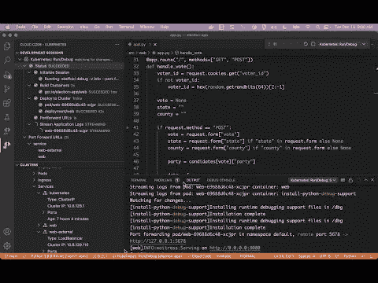

# GKE 自动驾驶仪和云代码

> 原文：<https://medium.com/google-cloud/gke-autopilot-and-cloud-code-1da63bedd18e?source=collection_archive---------0----------------------->

[**Autopilot**](https://cloud.google.com/kubernetes-engine/docs/concepts/autopilot-overview) **为开发人员提供了一个强大的进入** [**Google Kubernetes 引擎**](https://cloud.google.com/kubernetes-engine) **的入口，因为他们采用了**[**Kubernetes**](https://kubernetes.io/)**来为云**实现企业应用的现代化。

使用 Autopilot，您可以将[云原生](https://www.cncf.io/about/who-we-are/#:%7E:text=Cloud%20native%20definition)实践用于包含无状态和有状态服务的任务关键型应用程序，而不会受到基础架构管理的拖累。有了 Autopilot，谷歌就是你的 [SRE](https://sre.google/) 不仅为你管理 Kubernetes 控制平面，还创建和管理你的工人节点，这样你就可以专注于编写代码。

[**云代码**](https://cloud.google.com/code) **是 Google** 的一个开发者生产力扩展，它插入了两个主要的集成开发环境家族( [Visual Studio 代码](https://code.visualstudio.com/)和[JetBrains ide](https://www.jetbrains.com/)，如 [IntelliJ](https://www.jetbrains.com/idea/) 以及[云外壳编辑器](https://cloud.google.com/blog/products/application-development/introducing-cloud-shell-editor)，你可以用浏览器访问。

使用云代码，您可以创建 Kubernetes 集群，部署您的应用程序，监控流日志，甚至使用编辑器点击断点，并单步调试运行在本地甚至远程 GKE 集群中的代码。

> 我制作了一个简短的(8 分 44 秒)视频，展示了同时使用 GKE 自动驾驶模式和云代码的体验。你可以在 YouTube 上观看[，在 GitHub](https://www.youtube.com/watch?v=XAkGju1h_Ac) 上观看[。](https://github.com/subfuzion/election-app)

我个人喜欢这种体验的一点是，您可以快速启动并运行一些东西。让它更加引人注目的不仅是需要多么少的努力，而且在[创建一个谷歌项目](https://cloud.google.com/resource-manager/docs/creating-managing-projects#console)、**之后，你所有的活动都围绕着你的代码所在的 IDE**。

让这种体验更加强大的是，云代码还会从您配置的所有表单设置中为您生成一个 [skaffold](https://skaffold.dev/) 配置，您的团队可以使用它在生产环境中进行自动化的可重复构建。

您将获得快速启动和运行的好处，但不会随着需求的发展和应用程序变得越来越复杂而受到限制。

**自动驾驶集群是真正的 GKE 集群，完全能够大规模运行您的有状态任务关键型应用程序**，而无需大量致力于管理基础设施，许多开发人员会发现**云代码作为一个切入点是非常宝贵的，它降低了在其上启动和运行应用程序的门槛**。

有没有你希望得到支持的特定用例？有什么特定类型的演示吗？让我知道！

**资源** [https://www.youtube.com/watch?v=XAkGju1h_Ac](https://www.youtube.com/watch?v=XAkGju1h_Ac)
[https://github.com/subfuzion/election-app](https://github.com/subfuzion/election-app)