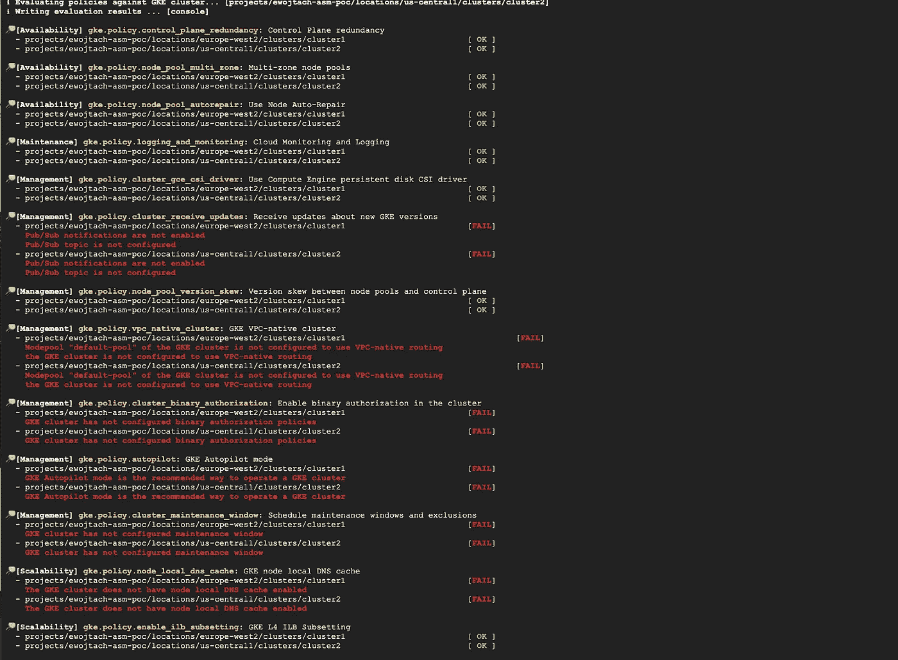

# GKE 集群配置参数—如何管理它们？

> 原文：<https://medium.com/google-cloud/gke-cluster-config-params-how-to-rule-them-all-240c0b10cdf2?source=collection_archive---------7----------------------->

创建 GKE 集群似乎是一件容易的事情。只需在 UI 控制台或一个 terraform-或 gcloud-命令中点击几下，就可以创建一个集群。

然而，深入下去，你会发现很多详细的设置和参数，事情开始变得有点复杂。如何找出合适的配置？默认值总是最好的选择吗？如何确保您的集群安全可靠、可扩展并满足高可用性要求？

您可以浏览 Google 提供的一些文档和最佳实践。这是知识的伟大源泉。然而，将这些知识付诸实践，这意味着在您的所有集群上手动检查所有这些知识…这并不令人兴奋，这很无聊，这是一件苦差事！

好消息是，您不必手动执行此操作。您可以使用 [GKE 策略自动化](https://github.com/google/gke-policy-automation)——自动化、免费使用的[开源工具](https://github.com/google/gke-policy-automation/)来发现并对照最佳实践集检查您的 GKE 集群。

## 让我们从这里开始，检查简单集群

我们需要在集群项目上使用 roles/container . cluster viewer IAM 角色登录到云 shell。让我们来看看:

```
gcloud auth application-default login
```

获取应用程序默认凭据的命令。

下一步是创建配置文件，其中包含我们想要检查的集群的详细信息。然后，让我们创建专用目录，(例如 gpa-config/)并将文件 config.yaml 放在那里。最简单的配置可能是:

```
clusters:
  - name: cluster1
    project: project-1
    location: europe-west3
  - name: cluster2
    project: project-1
    location: us-central1
  - name: cluster3
    project: project-2
    location: europe-central1
```

或者，通过多一个 IAM 角色(roles/cloudasset.viewer ),我们可以进一步简化配置，并在组织、文件夹或项目级别运行具有自动集群发现功能的工具。在这种情况下，我们的配置文件如下所示:

```
clusterDiscovery:
  enabled: true
  organization: "123456789012"
```

我们需要执行的最后一件事是运行工具。为此，我们可以使用 docker 容器:

```
docker run --rm -v ~/gpa-config/config.yaml:/temp/config.yaml \
    ghcr.io/google/gke-policy-automation check --config /temp/config.yaml
```

还有 tadaaam…



GKE 策略自动化输出示例

在控制台输出中，可以看到针对一组最佳实践策略的集群验证结果。

## 检查了什么？

在 GKE 策略自动化项目中维护了最初的三十多个策略集。嵌入策略中的规则来自 GKE 产品的官方文档，以及谷歌专业服务团队的经验。它们分为几类:

*   安全性
*   维护
*   管理
*   有效性
*   可量测性

仅举几个我们刚刚检查过的例子:

*   为了安全起见，除了别的以外，还检查集群控制平面暴露、如何授权对控制平面的访问、如何管理秘密以及是否有适当的服务范围账户许可。
*   通过使用区域控制平面和区域节点池、节点自动修复配置来检查可用性。
*   集群管理和维护类别包括检查网络配置、版本和更新设置。
*   可扩展性策略检查自动扩展选项、节点自动配置的正确使用以及本地 DNS 缓存的使用。

您还可以指定您自己组织的最佳实践，并将其附加到 GKE 策略自动化工具。

## 太好了，但是结果如何呢？

到目前为止，一切顺利！我们现在知道要修复什么了！现在难道不是卷起袖子开始修复集群配置的大好时机吗？没那么快…我们还可以用这个工具做一件事，以确保我们的集群配置不会再次漂移。

上面，我只描述了最简单的用例以及运行该工具的最简单的配置。但是，想象一下，您可以让该工具在后台运行，并每天/每周检查您的所有集群配置。并在安全指挥中心控制台向您显示结果。其实…已经有了！有更详细的[博文](https://cloud.google.com/blog/topics/developers-practitioners/auditing-gke-clusters-across-entire-organization)描述了这个用例:)

快乐阅读，配置和修复！

*本文仅代表作者个人观点，不代表谷歌* **的观点。**