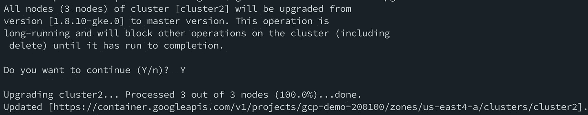
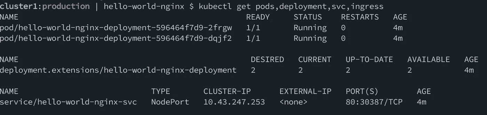

# GKE 使 Kubernetes 升级(极其)容易

> 原文：<https://medium.com/google-cloud/gke-making-kubernetes-upgrades-extremely-easy-9f7387a4bb57?source=collection_archive---------0----------------------->


有没有觉得您的 IT 运营速度超出了电影的速度？

在某个点，你必须升级。不变的是，升级是冒险的。以至于整个组织宁愿继续运行旧的(而且相当脆弱或不受支持的)软件，也不愿升级到给定软件平台的最新(也是最安全的)稳定版本。而这还只是传统软件。

Kubernetes(还)不是传统软件，它包括许多移动部件和零件，这些部件和零件共同提供了我们在技术历史上见过的最引人注目的操作部署平台之一。这种内在的复杂性有两方面的含义:

1.  由于管理 Kubernetes 发行版的困难，多租户几乎是被迫的决定。如今的运营团队根本无法支持 Kubernetes 集群的任意配置。这正是 GKE 存在的原因，它让组织继承了像谷歌一样运行和随意供应的能力。
2.  升级 Kubernetes 发行版在操作上容易出错。工件被遗留，配置过时，组件丢失，**部署中断**等等。

一旦你进入多租户环境，升级最好的情况是由委员会决定，最坏的情况是根本不可能。但这不是对多租户的讨论(那是另一篇文章)。这更多的是因为升级通常是一件痛苦的事情。其实也不一定。谷歌的 Kubernetes 引擎(GKE)提供了一种有效使用和操作 Kubernetes 的方法。

在我看来，有两种主要方法可以安全可靠地执行集群升级，而不会让您的工作负载面临风险:

1.  您可以在目标 Kubernetes 版本上以编程方式在 GKE 按需提供一个新集群，并在以蓝/绿格式设置旧集群之前部署/测试您的工作负载。
2.  GKE 为您提供了一种独特的方法，可以将节点池定义为现有集群的一部分，其中的特定节点是在目标 Kubernetes 版本上提供的。这允许您在单个集群中执行蓝/绿部署环境。一旦满意，您可以升级您的原始节点。

在 GKE 执行就地升级还有第三种选择，这种选择可以而且将适用于大多数使用情形，几乎不会造成中断:

`gcloud container clusters upgrade cluster1 --cluster-version=latest --master`

`gcloud container clusters upgrade cluster1 --zone=us-east4-a`

在短短的 5 分钟后，结果是:



这容易得令人不安。

在就地升级方面，core OS structural 也在其 K8s 发行版中提供了类似的按钮功能(这是通过部署与正常情况略有不同的控制平面组件来实现的)。然而，对于那些想要更多的分离和保证的人来说，我们将把重点放在 GKE 提供的上述两个选项上。

L 让我们看看第一个选项，我们在 cluster1 中部署了 Kubernetes 版本 1.9.6 的应用程序，我们希望安全可靠地升级到版本 1.10:



这是我们部署的内容。没什么刺激的。

```
$ gcloud container clusters list
NAME LOCATION MASTER_VERSION MACHINE_TYPE NODE_VERSION STATUS
cluster1 us-central1 1.9.6-gke.1 n1-highmem-2 1.9.6-gke.1 RUNNING
```

为了执行升级，让我们配置新的集群。以下命令将以最新的可用 Kubernetes 版本(n)配置集群，但是您也可以选择 n-1 或 n-2:

`gcloud container clusters create cluster2 --zone=us-east4-a --cluster-version=latest`

几分钟后，我们的新生产集群就准备好了，我们的 kubeconfig 已经针对它进行了上下文化:


列出我们的集群:

`gcloud container clusters list`

我们发现两者都有:

```
NAME LOCATION MASTER_VERSION MACHINE_TYPE NODE_VERSION STATUS
cluster1 us-central1 **1.9.6-gke.1** n1-highmem-2 1.9.6-gke.1 RUNNING
cluster2 us-east4-a **1.10.4-gke.0** n1-standard-1 1.10.4-gke.0 RUNNING
```

现在我们可以使用 Skaffold 部署我们的应用程序:

`skaffold run`

这将利用我们当前的 Kubernetes 上下文来构建、标记、推送和部署我们的代码到新的集群。


如果你愿意，[这里有一个 5 分钟的 Skaffold](/google-cloud/skaffold-and-kaniko-bringing-kubernetes-to-developers-a43914777af9) 入门视频。

查看我们在集群 2 中的部署:


现在，我们已经准备好测试我们的应用程序，无论这对您意味着什么。这一部分可能会花一些时间，也可能不会，这取决于你的测试和 QA 过程有多好。一旦您将服务和请求流量转移到目标集群上的应用程序(不在本文讨论范围内，因为这需要应用程序级别的东西，如会话管理、多集群进入等)，您就可以在确认不再使用或不再需要集群 1 后将其停用，具体取决于您的保留策略:

`gcloud container clusters delete cluster1 --zone=us-east4-a`

我知道仅仅删除整个集群看起来有点不协调，但这里要认识到的关键点是，使用 GKE，只需几个命令，您就可以完全升级您的部署环境，并相应地部署您的应用/工作负载，为流量提供服务，而不必担心实际的升级过程。您的资源调配命令肯定会更加复杂，利用您在 GKE 可以使用的大量配置选项，根据您的需求让您的群集做好生产准备。

> 在许多情况下，企业 Kubernetes 集群可以而且应该被视为牛，而不是宠物。

将我们的集群视为多租户不可移动的整体结构会导致我们的组织陷入与其他技术采用失误相同的运营陷阱，在这种情况下，我们获得了一些能力，但在如何管理我们所采用的技术方面仍然受到限制。

这篇文章中没有什么是复杂的，这并不奇怪。这很简单，任何规模的企业 Kubernetes 都应该如此。

> 注意:我已经跳过了节点池升级方法，因为 Sandeep Dinesh 在 Google Cloud 官方博客上的这篇高度相关的文章中对此做了很好的介绍:[https://Cloud platform . Google Blog . com/2018/06/Kubernetes-best-practices-upgrading-your-clusters-with-zero-down time . html](https://cloudplatform.googleblog.com/2018/06/Kubernetes-best-practices-upgrading-your-clusters-with-zero-downtime.html)