# 监控 GKE 上的 Kubernetes 集群(谷歌容器引擎)

> 原文：<https://medium.com/google-cloud/gke-monitoring-84170ea44833?source=collection_archive---------0----------------------->

> Ctrl+Alt+Monitor:)

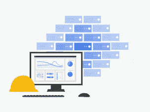

# 关于本指南

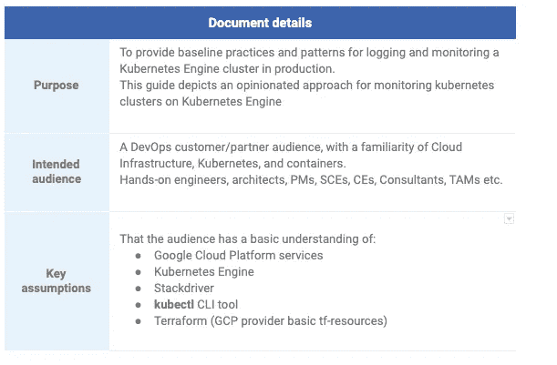

# 1.介绍

Kubernetes 生态系统包含许多日志记录和监控解决方案。这些工具解决了 Kubernetes 引擎堆栈中不同层的监控和日志记录问题。

*   GCP 组件(计算)
*   Kubernetes 对象(集群节点)
*   容器化应用程序(pod)
*   特定于应用程序的指标(在端口 8081 上运行 Apache http 服务器的 pod)

本文档描述了其中的一些工具、它们所针对的堆栈层，以及实施的最佳实践，包括现场示例、快速入门和演示项目。

# 2.要做的任务

为了在用于 Kubernetes 引擎的 Stackdriver 中实现日志记录和监控，我们建议执行以下任务:

# 2.1 监视器

确定什么是重要的(指标、资源等。)并决定监视什么:

*   没有被测量的，就不能被监控。收集尽可能多的合理信息(尽可能多的指标)非常重要。
*   确定服务水平指标和目标(SLIs 和 SLOs)有助于在系统可靠性的背景下构建监控讨论；系统用户关心的是什么。
*   避免监控一切的诱惑。监控过多和监控过少一样危险。
*   监控刚刚好。不存在的信息无法做出好的决策。做出“数据驱动的决策”。

# 2.2 日志

规划一个与部署架构和组织职责相匹配的日志架构

*   将所有 Kubernetes 引擎集群指标聚合到一个 Stackdriver 项目中？
*   需要监控哪些额外的指标？主要关注点是什么？

# 2.3 审查

*   审查 GCP 计划和现有的 Kubernetes 发动机集群；
*   确保为每个集群启用日志记录和监控

# 2.4 实施

*   实施监控

# 3.什么？又是怎么做到的？

要扩展应用程序并提供可靠的服务，您需要了解应用程序在部署时的行为。您可以通过检查容器、pod、服务和整个集群的特征来检查 Kubernetes 集群中的应用程序性能。Kubernetes 提供了每个级别的应用程序资源使用的详细信息。这些信息允许您评估应用程序的性能，以及可以消除哪些瓶颈以提高整体性能。

# 3.1 监控什么

这可能是规划云工作负载运营中最困难的问题，更不用说 Kubernetes 引擎了。也就是说，确定监控什么对于 Kubernetes 引擎工作负载在云中的成功至关重要。下表对要监控的最少一组重要属性提出了一些建议。虽然组织的结构各不相同，但该表将问题简化为两个方面:应用程序开发人员/操作员和 Kubernetes 引擎集群管理员。本文的其余部分将集中在这两个方面。

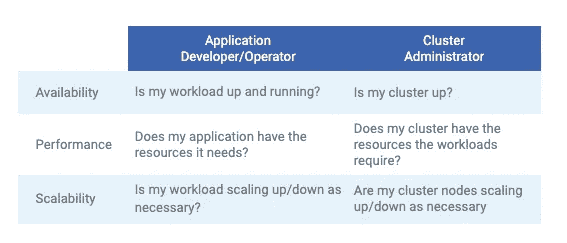

前景

# 3.2 如何监控？

理想情况下，正在收集的指标和正在显示的信息是以方便和简洁的方式完成的。Stackdriver 提供了 Kubernetes 引擎集群和工作负载的度量、日志和跟踪的单一控制台视图。

下图从较高的层面说明了 Kubernetes 引擎和 Stackdriver 之间的关系。日志、指标和其他有用的信息从 Kubernetes 引擎集群发送到 Stackdriver。

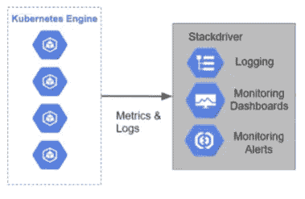

# 3.3 监控工具

本文档中讨论的工具可以在下表中找到，该表突出显示了该工具的范围。每个工具的详细描述如下。

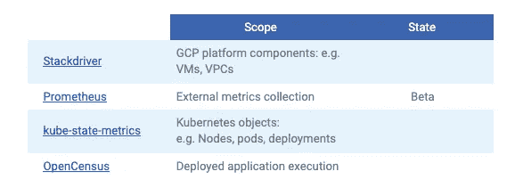

# 堆栈驱动程序

[Stackdriver](https://cloud.google.com/monitoring/kubernetes-engine/) 汇总来自基础设施的指标、日志和事件，为开发人员和运营商提供一组丰富的可观察信号，以加快根本原因分析并缩短解决问题的平均时间(MTTR)。Stackdriver 不需要广泛的集成或多个“窗格”，也不会将开发人员局限于使用特定的云提供商。

# 普罗米修斯

[云原生计算基金会项目 Prometheus](https://cloud.google.com/monitoring/kubernetes-engine/prometheus) ，是一个系统和服务监控系统。它以给定的时间间隔从配置的目标收集度量，评估规则表达式，显示结果，并在观察到某个条件为真时触发预警。

# 3 . 3 . 3 Kube-状态-度量

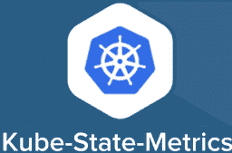

kube-state-metrics 是一个简单的服务，它监听 Kubernetes API 服务器并生成关于对象状态的度量。

# 公开普查

OpenCensus 是从应用程序服务中收集指标和分布式跟踪的单一分布库。OpenCensus 通过跟踪请求在服务中的传播来提供可观察性，并捕获关键的时间序列指标。指标可以导出到许多后端，包括 Stackdriver。

# 3.4 选择正确的工具

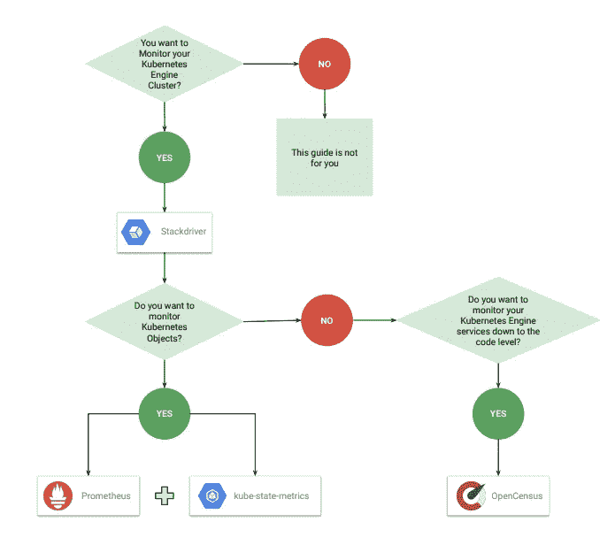

# 3.5 幕后(指标和聚合组件)

Kubernetes 引擎集群中的每个[节点](https://www.cloudconnect.goog/external-link.jspa?url=https%3A%2F%2Fcloud.google.com%2Fkubernetes-engine%2Fdocs%2Fconcepts%2Fcluster-architecture%23nodes)运行一个名为 [Kubelet](https://www.cloudconnect.goog/external-link.jspa?url=https%3A%2F%2Fkubernetes.io%2Fdocs%2Freference%2Fcommand-line-tools-reference%2Fkubelet%2F) 的进程，这是该节点上容器编排的主要进程。Kubelet 流程中嵌入了一个名为 cAdvisor 的机制。通过 cAdvisor，每个 Kubelet 向集群中的外部消费者提供一个信息汇总。

主要消费者是 Heapster，它自动部署在每个 Kubernetes 引擎集群的可用节点上的容器中。Heapster 查询集群主服务器以识别集群的所有节点，然后定期轮询每个节点的 Kubelet 以从摘要 API 收集摘要信息。

当 prometheus 安装在 Kubernetes 引擎群集中时，prometheus-to-sd-exporter 组件会以 Prometheus 格式抓取任何端点的内容，并将其转发给 Stackdriver。这个容器与 FluentD 和 Event Exporter pods 位于同一位置，因为正是这个组件负责将位实际移动到 Stackdriver。

这些资源由 metrics-server 组件收集。度量-服务器公开主度量 API。discovery summarizer 使主指标 API 对外部客户端可用。Heapster 成为该信息的集群级存储库。集群中的其他服务可以查询 Heapster，而不必单独轮询每个集群节点的 Kubelet。比如说。Stackdrover 向 Heapster 查询实时性能指标。水平窗格自动缩放器还查询 Heapster 以确定何时缩放窗格。

* ***从 Kubernetes 1.8 开始，在 Kubernetes 中可以通过 Metrics API 获得资源使用度量，比如容器 CPU 和内存使用。***

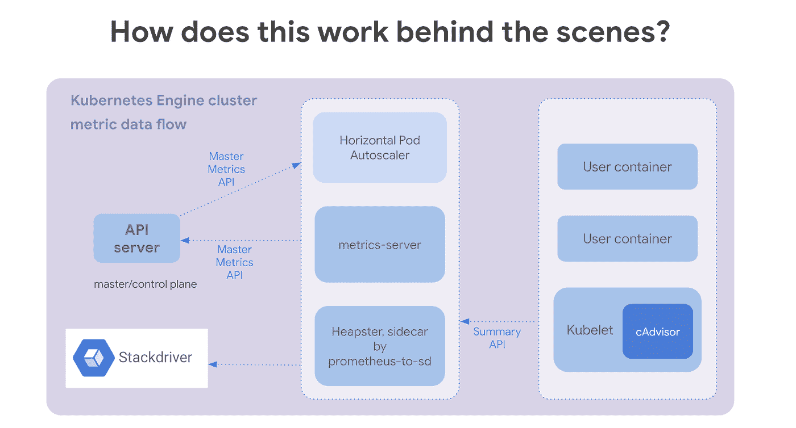

# 4.日志记录和监控的分步指南

在部署新的 Kubernetes 引擎集群时，默认情况下启用 Stackdriver 日志记录和监控。应该使用 Stackdriver 仪表板来可视化在一个或多个 Kubernetes 引擎集群中生成的指标。

# 4.1 先决条件

用户必须是包含 Kubernetes 引擎集群的项目的**所有者**(出于 IAM/资源管理原因)。

必须启用以下 API:

*   堆栈驱动程序日志 API
*   计算引擎 API
*   堆栈驱动程序监控 API
*   Kubernetes 引擎 API
*   堆栈驱动程序跟踪 API
*   发布订阅 API

必须在部署主机上安装以下命令行工具(可以使用云 shell 和/或任何其他主机)

*   gcloud
*   饭桶
*   库贝特尔
*   地形> = 0.11.7

# 4.2 预期结果

下表总结了执行后续部分中的步骤的结果。

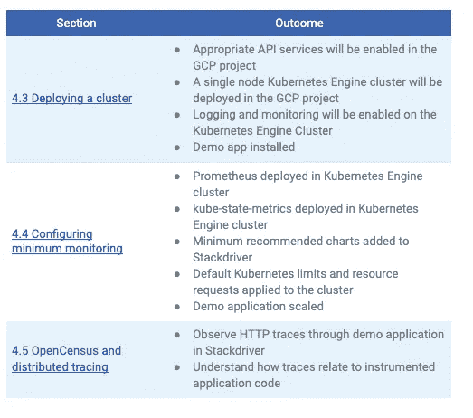

[4.3 部署集群](https://docs.google.com/document/d/1LwjNQ7EYVhryi-DcuMcpvMPvfXxW5qgARbXgOuuo1ow/edit#heading=h.uzb86fews50j)
[4.4 配置最小监控](https://www.cloudconnect.goog/external-link.jspa?url=https%3A%2F%2Fdocs.google.com%2Fdocument%2Fd%2F1Ew_vwvo_Jc1jrWFBaRphhZ4ad4VSlXMXWaQ3O33utzg%2Fedit%23heading%3Dh.8sv5qcuv7kmg)
[4.5 开放普查和分布式跟踪](https://docs.google.com/document/d/1LwjNQ7EYVhryi-DcuMcpvMPvfXxW5qgARbXgOuuo1ow/edit#heading=h.vqxsh8ojhvi2)

# 4.3 部署集群

**注意:**强烈建议在 Google Cloud 控制台中执行以下操作。
**注意:**对于这个演示，您可以使用一个现有的 Kubernetes 引擎集群。然而，通过实例化一个新的 Kubernetes 引擎集群，根据 [gke-tracing-demo](https://www.cloudconnect.goog/external-link.jspa?url=https%3A%2F%2Fgithub.com%2FGoogleCloudPlatform%2Fgke-tracing-demo) 示例，您将能够观察到更有趣的行为。

1.  部署 Kubernetes 引擎集群时，默认情况下启用日志记录和监控。但是，如果 Kubernetes 引擎集群没有部署日志记录和监视功能，则可以在事后使用以下命令启用这两种功能:

> $gcloud beta container clusters 更新[CLUSTER _ NAME]\-监控-服务 monitoring.googleapis.com \-记录-服务 logging.googleapis.com

2.验证日志记录和监视是否已启用:
*可以通过访问集群的集群详细信息页面来验证集群日志记录和监视，该页面应类似于以下内容:

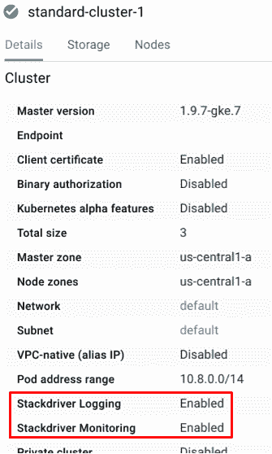

*或者，可以使用 gcloud 命令来验证日志记录和监控:

> $ g cloud container clusters describe-ZONE[ZONE][CLUSTER]| grep " monitoring service \ | logging service "

输出如下:

> logging service:logging . Google APIs . commonitoringservice:monitoring.googleapis.com

# 4.4 配置最低监控

无论是按照第 [4.3 节](https://www.cloudconnect.goog/external-link.jspa?url=https%3A%2F%2Fdocs.google.com%2Fdocument%2Fd%2F1Ew_vwvo_Jc1jrWFBaRphhZ4ad4VSlXMXWaQ3O33utzg%2Fedit%23heading%3Dh.uzb86fews50j)部署新集群还是使用现有的 Kubernetes 引擎集群，都需要安装以下指标组件。

# 安装监控组件

以下步骤将把 Prometheus 服务器、Prometheus Stackdriver sidecar 和 kube-state-metrics 部署到 Kubernetes 引擎集群中。
**注意:**这个部署将只与遗留 Stackdriver 监控一起工作。在 stack driver Kubernetes Monitoring 的测试版中，它不会像预期的那样运行。
**注意:**这些步骤不包含在任何 SLA 或弃用策略中。

*连接到 Kubernetes 引擎集群。

*确保您的用户拥有部署 Prometheus 的适当权限。

> $ ku bectl create clusterrolebinding cluster-admin-binding—cluster role = cluster-admin—user = $(g cloud info | grep Account | cut-d '['-F2 | cut-d ']'-f1)

*克隆 stack-driver-Prometheus-sidecar 项目。

> $ git clone[https://github . com/stack driver/stack driver-Prometheus-sidecar . git](https://www.cloudconnect.goog/external-link.jspa?url=https%3A%2F%2Fgithub.com%2FStackdriver%2Fstackdriver-prometheus-sidecar.git)

*导出以下变量。

> $export GCP 项目=…export GCP 地区=…export KUBE 集群=…

*部署普罗米修斯服务器和 kube-state-metrics。

> $ bash stack driver-Prometheus-sidecar/kube/full/deploy . sh

# 4.4.2 观察堆栈驱动仪表板

1.  创建一个以应用为中心的控制面板，并添加第 5.1 节中定义的图表。
2.  创建一个以 Kubernetes 引擎集群为中心的仪表板，并添加第 5.2 节中定义的图表。
3.  如果遵循了 4.3 节中的步骤，那么 trace-demo 应用程序就已经部署好了。如果 trace-demo 应用程序要在现有集群上运行，可以使用以下命令:

> $ ku bectl apply-f[https://raw . githubusercontent . com/Google cloud platform/gke-tracing-demo/master/terraform/tracing-demo-deployment . YAML](https://www.cloudconnect.goog/external-link.jspa?url=https%3A%2F%2Fraw.githubusercontent.com%2FGoogleCloudPlatform%2Fgke-tracing-demo%2Fmaster%2Fterraform%2Ftracing-demo-deployment.yaml)

4.需要注意两点:

1.  只有在为容器配置了 CPU 资源限制的情况下，水平窗格自动缩放才会起作用。
2.  如果定义了 CPU 资源请求，kube-state-metrics 将收集 pod CPU 利用率指标。

如果未定义默认 CPU 资源请求和限制默认值，以下命令将为当前命名空间设置它们:

> $ echo " API version:v1
> kind:limit range
> metadata:
> name:limits
> spec:
> limits:
> -default:
> CPU:100m
> default request:
> CPU:100m
> type:Container " | kubectl apply-f-

5.删除现有的跟踪演示窗格，以应用新的默认 CPU 限制。

> $ ku bectl delete pods-l app = tracing-demo

6.将 trace-demo 应用程序配置为自动缩放。

> $kubectl 自动缩放部署跟踪-演示\ — cpu 百分比=50 \ —最小值=1 \ —最大值=10

7.测试负载并监控应用程序:
*通过运行一个带有循环的容器来测试应用程序的负载，该循环将对 webapp 进行 HTTP 调用。

> $ ku bectl run-I—tty load-generator—image = busybox/bin/sh—requests CPU = 50m*在命令提示符下按 enter 键*/# while true；do wget-q-O-[http://tracing-demo . default . SVC . cluster . local；](https://www.cloudconnect.goog/external-link.jspa?url=http%3A%2F%2Ftracing-demo.default.svc.cluster.local%3B)完成>/开发/空

几分钟后，一些有趣的数据出现在下面的图表中:

*   Pod 运行总数

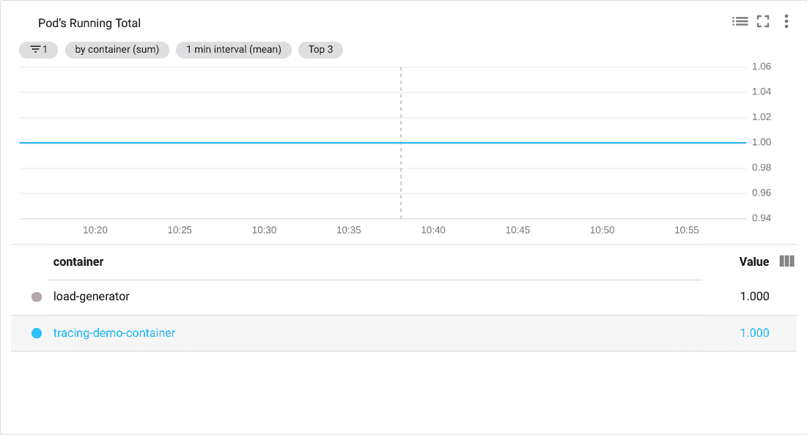

*   Pod 的待定合计

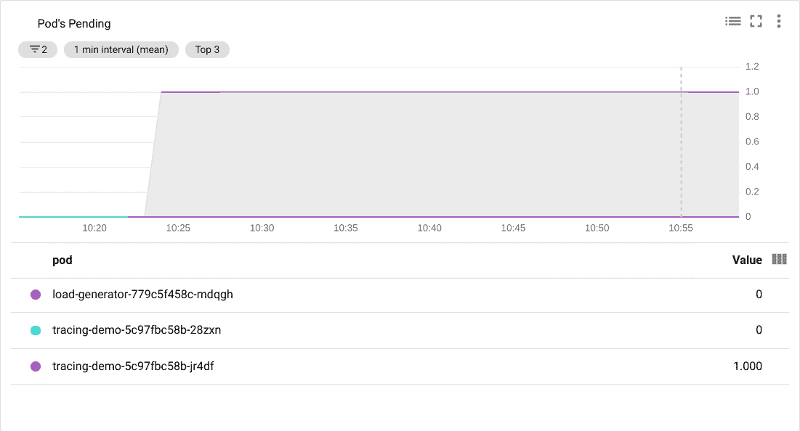

*   容器 CPU 利用率

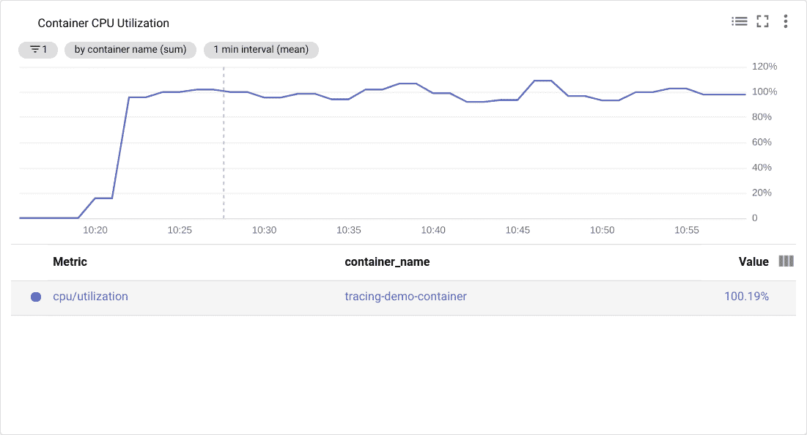

*   Pod 自动缩放当前与所需副本

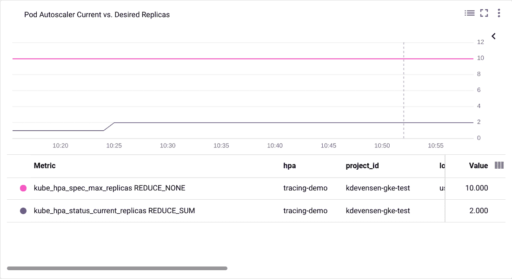

**注:**如果遵循了第 4.3 节中的步骤，显然存在问题。每个容器的 CPU 利用率徘徊在 100%左右，尽管已经指定了 50%的目标。autoscaler 似乎正在尝试扩展，但下一个复制的 pod 停留在挂起状态。

当仅成功部署一个副本时，Pod 自动缩放当前与所需副本图表显示两个活动副本，这可能会令人困惑。此图反映了自动缩放器的当前状态，其中有一个成功的复制副本和一个挂起的复制副本。

8.在步骤 5.2.4 中创建的基于日志的指标会生成一个图表，说明由于默认命名空间中的 CPU 资源不足，平均有一个 pod 调度失败。

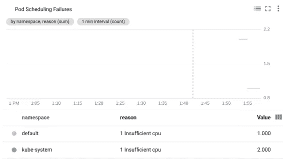

9.这是从集群的 stack driver“Kubernetes Engine Cluster Operations”日志中派生出来的，应该至少有一个类似于以下内容的条目:

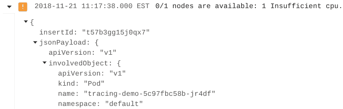

这表明挂起的 pod(注意与上图相比的 pod 名称)由于 CPU 不足而停滞。原因是 4.3 节中的步骤部署了具有单个节点且没有节点自动伸缩的集群。

10.创建一个额外的节点池，以允许 trace-demo pod 进行扩展并减轻负载。

> $ g cloud container node-pools create scaling-pool \-cluster tracing-demo-space \-scopes = default \-enable-auto scaling \-max-nodes = 6 \-min-nodes = 1 \-machine-type = n1-standard-2 \-ZONE = ZONE

# 4.5 开放式普查和分布式追踪

要通过应用程序观察跟踪，必须对应用程序进行适当的检测。有许多针对主要编程语言的 SDK 来支持这种能力。本节重点介绍用于 Python 的 OpenCensus SDK。gke-tracing-demo 应用程序是用 [Flask](https://census-instrumentation.github.io/opencensus-python/trace/usage.html?highlight=flask) 框架编写的。OpenCensus 提供了与 [Flask](https://www.cloudconnect.goog/external-link.jspa?url=https%3A%2F%2Fcensus-instrumentation.github.io%2Fopencensus-python%2Ftrace%2Fusage.html%3Fhighlight%3Dflask) 的集成，提供了一种简单的方法来测量应用程序中的延迟。

gke-tracing-demo 应用程序已经按照第 4.4.2 节中的步骤进行了部署。简单的 HTTP GET 请求是针对应用程序的端点发出的，生成一个轻 CPU 负载和一个响应。该应用程序有更多的功能值得探索。

下图说明了应用程序的体系结构。值得注意的是，除了返回 HTTP 响应之外，消息还被放在第三个服务(Cloud pub/sub) Google Cloud PubSub 中。

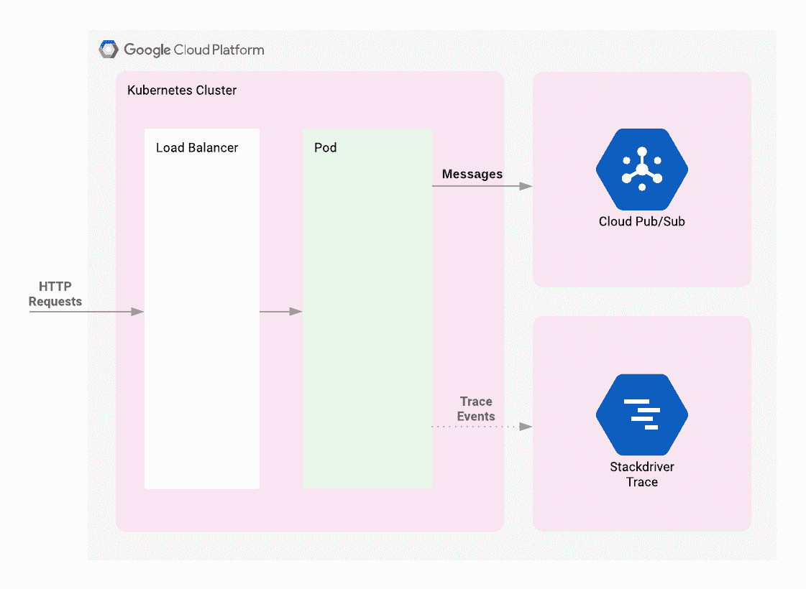

**注意:** [Istio](https://www.cloudconnect.goog/external-link.jspa?url=https%3A%2F%2Fistio.io%2F) 是 Kubernetes 引擎的一个强大的附加组件，提供类似的跟踪分析功能，包括[图形](https://www.cloudconnect.goog/external-link.jspa?url=https%3A%2F%2Fistio.io%2F)。Istio 提供的功能超出了本文档的范围。根据所需的特性，Istio 值得进一步研究。

# 调查痕迹

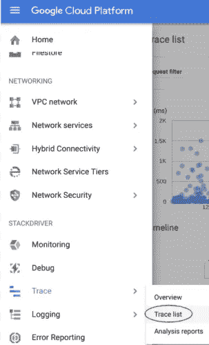

安慰

*在 Google Cloud 控制台中，导航到 Stackdriver Tracing 中的“跟踪列表”。

*调查该图，很明显该应用程序已经收到了相当大的流量(来自第 [5.3.2](https://www.cloudconnect.goog/external-link.jspa?url=https%3A%2F%2Fdocs.google.com%2Fdocument%2Fd%2F1Ew_vwvo_Jc1jrWFBaRphhZ4ad4VSlXMXWaQ3O33utzg%2Fedit%23heading%3Dh.dzimaei9ox8d) 节中执行的负载测试)。

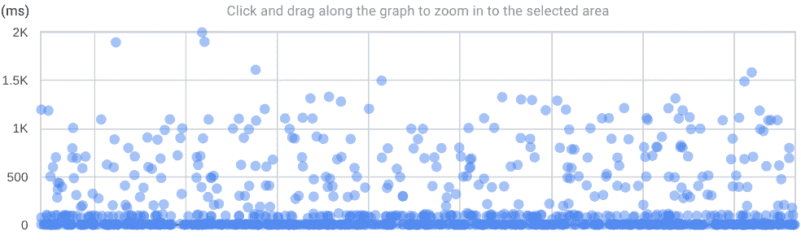

*选择任何一个绘图点将显示详细的轨迹时间线。

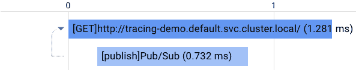

顶部时间轴表示根跨度；针对 Kubernetes 服务的 URL 的 HTTP GET 请求。底部时间轴显示子跨度；将消息发布到发布订阅主题所花费的时间。该信息由以下代码生成:

> @ app . route('/')def template _ test():[…]
> tracer = execution _ Context . get _ open census _ tracer()
> # Trace Pub/Sub 调用使用上下文管理器**with tracer . start _ span()as Pub Sub _ span:Pub Sub _ span . name = '[{ }]{ } '。格式('发布'，'发布/订阅')** […] […][…]

除了正在定义的子跨度的名称之外，OpenCensus 上下文管理器还负责测量执行时间并向 Stackdriver 报告。

# 5.堆栈驱动程序监控图表

*遥测数据以图形/图表等形式显示在 SD 仪表板的 SD 中..

# 5.1 以工作负载为中心的控制面板

鉴于可能会绘制大量数据，建议将图表设置为[“异常值”模式](https://www.cloudconnect.goog/external-link.jspa?url=https%3A%2F%2Fcloud.google.com%2Fmonitoring%2Fcharts%2Fchart-view-options%23using-outlier-mode)。

# 5.1.1 容器的 CPU 利用率

> **资源类型:** Kubernetes 引擎容器
> 
> **指标:** CPU 利用率
> 
> **过滤:**用户元数据标签(如 app)
> 
> **校准器:**表示
> 
> **减速器:**的意思

# 5 . 1 . 2 pod 的内存使用情况

> **资源类型:** Kubernetes 引擎容器
> 
> **度量:**内存使用情况
> 
> **过滤器:**用户元数据标签(如 app)
> 
> **校准器:**表示
> 
> **减速器:**总和

# 容器重启总数

> **资源类型:** Kubernetes 容器
> 
> **指标:**kube _ pod _ container _ status _ restarts _ total
> 
> **分组依据:**容器
> 
> **过滤器:**名称空间(如默认)
> 
> **对准器:**速率
> 
> **还原剂:**总和

# 5.1.4 Kubernetes pod 故障

> **资源类型:** Kubernetes 容器
> 
> **指标:** kube_pod_status_phase
> 
> 过滤器:阶段=失败，命名空间(例如，默认)
> 
> **校准器:**的意思是
> 
> **减速器:**总和

# 5.1.5 Kubernetes 吊舱运行

> **资源类型:** Kubernetes 容器
> 
> **指标:**kube _ pod _ container _ status _ running
> 
> 过滤器:名称空间(例如，默认)
> 
> **校准器:**表示
> 
> **减速器:**总和

# 5.1.6 Kubernetes 豆荚待定

> **资源类型:** Kubernetes 容器
> 
> 指标: kube_pod_status_phase
> 
> 过滤器:阶段=待定，名称空间(例如，默认)
> 
> **校准器:**的意思是
> 
> **减速器:**总和

# 5.1.7 Pod 自动缩放电流与所需副本

指标 1

> **资源类型:** Kubernetes 容器
> 
> **指标:**kube _ HPA _ status _ current _ replicas
> 
> 过滤器:名称空间(例如，默认)
> 
> **分组依据:** hpa
> 
> **校准器:**的意思是
> 
> **减速器:**总和

指标 2

> **资源类型:** Kubernetes 容器
> 
> **指标:**kube _ HPA _ status _ desired _ replicas
> 
> **过滤器:**命名空间(如默认)
> 
> **分组依据:** hpa
> 
> **校准器:**表示
> 
> **减速器:**总和

# 5.2 Kubernetes 引擎集群中心仪表板

仪表板提供集群中 Kubernetes 资源的状态信息以及可能发生的任何错误的信息。

# 5.2.1 按节点划分的 CPU 利用率

> **资源类型:** GCE 虚拟机实例
> 
> **度量:** CPU 利用率
> 
> **分组依据:**实例名称
> 
> **校准器:**表示
> 
> **减速器:**总和

# 5.2.2 按节点划分的内存利用率

> **资源类型:** Kubernetes 引擎容器
> 
> **度量:**内存利用率
> 
> **分组依据:**实例标识
> 
> **校准器:**的意思是
> 
> **减速器:**总和

# 5 . 2 . 3 Kubernetes pod 运行与集群容量

指标 1

> **资源类型:** Kubernetes 容器
> 
> **指标:** kube_pod_status_phase
> 
> 过滤器:阶段=运行
> 
> **分组依据:**集群名称
> 
> **校准器:**的意思是
> 
> **减速器:**总和

指标 2

> **资源类型:** Kubernetes 容器
> 
> **指标:**kube _ node _ status _ capacity _ pods
> 
> **分组依据:**聚类名称
> 
> **校准器:**表示
> 
> **减速器:**总和

# 5.2.4 基于日志的指标示例—失败的 Pod 调度

## *创建基于日志的指标* Stackdriver 提供了一种基于生成的日志条目数量来定义指标的机制。

以下示例定义了一个指标，该指标将显示日志条目的计数，这些日志条目表明一个 pod 由于资源不足而无法安排。

1.  在 Google Cloud 控制台中，导航至“基于日志的指标”

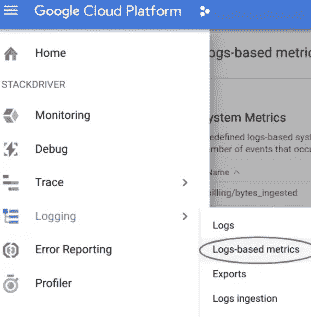

2.单击“创建指标”。

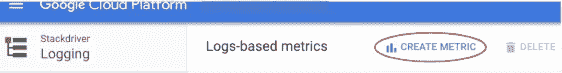

3.在“按标签或文本搜索筛选”字段的右侧，单击下拉箭头并选择“转换为高级筛选”。

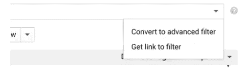

将以下标签过滤器粘贴到高级过滤器文本区域。

> resource.type="gke_cluster "
> 
> jsonpayload . reason = " failed scheduling "
> 
> jsonpayload . involvedobject . kind = " Pod "
> 
> jsonPayload.message:(“不足”或“不可用”)

过滤区域应如下所示:

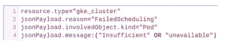

1.  在度量编辑器中，按如下方式配置度量:

> 名称:pod _ 失败 _ 计划

标签 1

> 名称:项目标识
> 
> **标签类型:**字符串
> 
> 字段名称:resource.labels.project_id

标签 2

> 名称:命名空间
> 
> **标签类型:**字符串
> 
> 字段名:jsonpayload . involvedobject . namespace

标签 3

> 名称:pod_name
> 
> **标签类型:**字符串
> 
> 字段名:jsonpayload . involvedobject . name

标签 4

> 名称:原因
> 
> **标签类型:**字符串
> 
> 字段名:jsonPayload.message
> 
> 提取正则表达式::\W(。*)\.
> 
> <leave empty="">单位:
> 类型:计数器</leave>

## *Pod 调度失败(图表)* 添加一个具有以下属性的图表:

> **资源类型:** <留空>
> 
> **度量:**日志记录/用户/pod_failed_schedule
> 
> **分组依据**
> 
> 命名空间
> 
> 理由
> 
> **对准器:**计数
> 
> **减速器:**总和

—

作者:[阿里尔·佩雷茨](https://www.linkedin.com/in/arielpe/)，[肯·埃文森](https://www.linkedin.com/in/kenneth-evensen-k6n/)