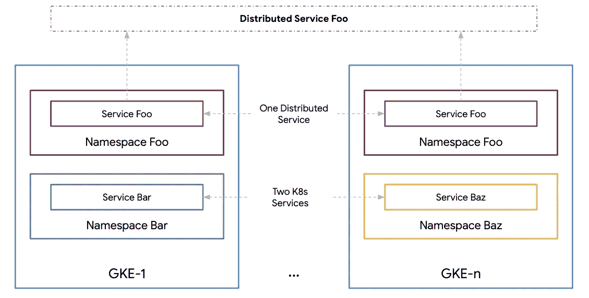

# Kubernetes 发动机(GKE)多集群生命周期管理系列

> 原文：<https://medium.com/google-cloud/gke-multi-cluster-life-cycle-management-series-a73185392345?source=collection_archive---------4----------------------->

## 第三部分:GKE 集群生命周期管理

GKE 分布式服务 Foo

在前两部分([第一部分](/@ameericus/kubernetes-engine-gke-multi-cluster-life-cycle-management-series-17ff892b85c8)和[第二部分](/@ameericus/gke-multi-cluster-life-cycle-management-series-b0d39080ac6b))中，我讨论了对多集群架构的需求，并定义了分布式服务的概念，它是运行在多个集群上的 Kubernetes 服务。在这一部分，让我们深入了解 GKE 集群生命周期管理的含义。集群生命周期管理可以定义为维护健康和更新的 Kubernetes 集群所需的策略和规划。具体来说，这是指在不违反服务 SLO 的情况下保持整个 Kubernetes 集群的更新。有了适当的策略和规划，集群生命周期管理应该是常规的、预期的和“平静的”。

尽管这个博客系列特别关注于 [Kubernetes 引擎](https://cloud.google.com/kubernetes-engine) (GKE)生命周期管理，但是所涵盖的概念可能适用于 Kubernetes 的其他发行版。

# GKE 版本和升级

在讨论集群生命周期管理的策略和规划之前，了解集群升级的组成部分非常重要。

一个集群由两部分组成:主节点和节点。Kubernetes 集群升级需要将所有节点和主节点升级到所需的版本。Kubernetes 遵循一个[语义版本](https://semver.org/)模式。Kubernetes 版本表示为 **X.Y.Z** 。其中 **X** 是主版本， **Y** 是次版本， **Z** 是补丁版本。次要版本大约每三个月(每季度)发布一次，Kubernetes 项目为最近的三个次要版本维护发布分支。这意味着九个月前的 Kubernetes minor 版本不再被维护。除了无法维护之外，远远落后于 Kubernetes 版本还可能导致 API 在最终升级到最新版本时发生变化。这可能会比更新 Kubernetes 版本更具挑战性和风险。不用说，Kubernetes 的升级必须定期进行。我们建议每季度或每两个季度进行一次 GKE 升级。

GKE 集群支持运行任何受支持的次要版本的 Kubernetes 版本。在任何给定时间，至少有两个(如果不是三个)次要版本可用。

GKE 提供了三种类型的集群。

1.  单区域群集—单个区域中的单个主节点和单个区域中的所有节点池
2.  多区域群集—一个区域中有一个主节点，一个区域中有多个区域中的节点池
3.  区域群集—单个区域中多个分区中的多个主节点和节点池

GKE 是一项托管服务，提供主节点和节点的自动升级。

# GKE 自动升级

GKE 自动升级是一种流行且常用的集群生命周期策略。GKE 自动升级提供了一种无操作的方式来保持您的 GKE 集群更新到支持的版本。GKE 自动升级分别升级主节点和节点。

**主机自动升级** —默认情况下，GKE 主机会自动升级。单区域和多区域集群有一个控制平面(主)。在主升级期间，工作负载会继续运行，但是在升级完成之前，您不能部署新的工作负载、修改现有工作负载或对集群的配置进行其他更改。

区域群集有多个控制平面副本，一次只能升级一个副本。在升级期间，群集保持高度可用，并且每个控制平面副本仅在升级时不可用。

**节点升级** —一次升级一个节点池。在节点池中，节点以不确定的顺序一次升级一个。您可以更改一次升级的节点的[数量。此过程可能需要几个小时，具体取决于节点数量及其工作负载配置。](https://cloud.google.com/kubernetes-engine/docs/concepts/cluster-upgrades#surge)

# GKE 汽车升级生命周期战略

我们建议尽可能使用 GKE 汽车升级。GKE 汽车升级优先考虑方便而不是控制。尽管如此，GKE 自动升级提供了多种方法来影响您的集群在特定参数范围内升级的时间和方式。您可以影响[维护窗口和排除项目](https://cloud.google.com/kubernetes-engine/docs/concepts/maintenance-windows-and-exclusions)。[发布渠道](https://cloud.google.com/kubernetes-engine/docs/concepts/release-channels)影响版本选择[激增升级](https://cloud.google.com/kubernetes-engine/docs/concepts/cluster-upgrades#surge)影响一次升级多少节点。尽管有这些控制，甚至对于区域集群(具有多个 Kubernetes 控制平面)，GKE 自动升级并不保证服务的正常运行时间。

如果您需要以下一项或多项功能，您可以选择不使用 GKE 自动升级功能:

1.  控制 GKE 群集的确切版本
2.  控制 GKE 升级的准确时间
3.  控制 GKE 车队的升级策略(在下一篇博客中讨论)。例如，使用多集群作为集群生命周期管理的一部分。

如果上述任何原因存在，你不能使用 GKE 自动升级策略。在下一部分中，我将深入探讨几个多集群升级策略以及与每个策略相关的规划。

> 接下来… [第四部分:GKE 多集群生命周期管理](/@ameericus/kubernetes-engine-gke-multi-cluster-life-cycle-management-series-43ed97142c47)