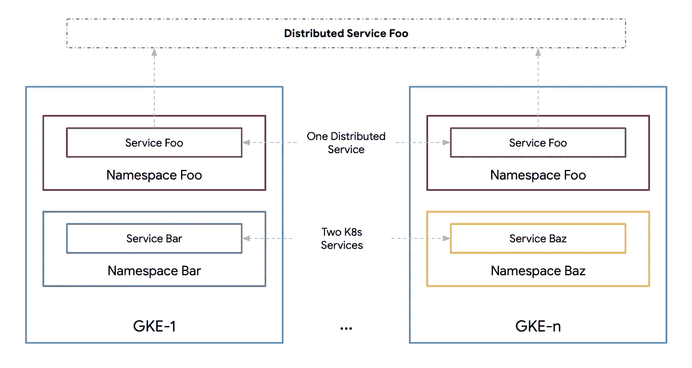
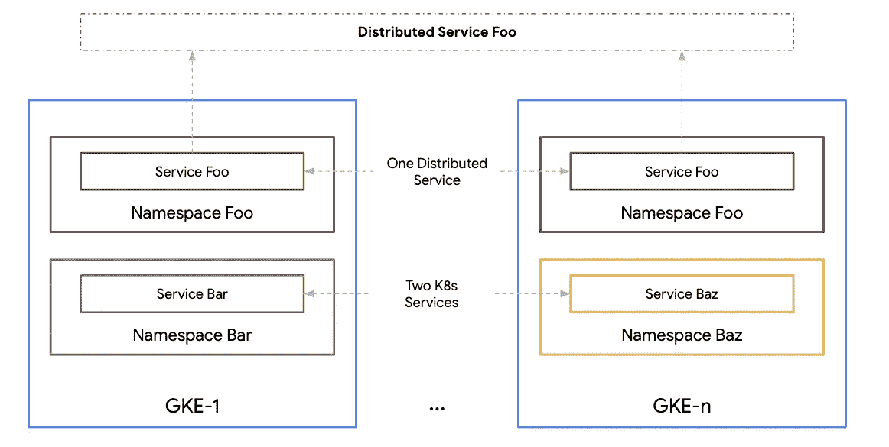
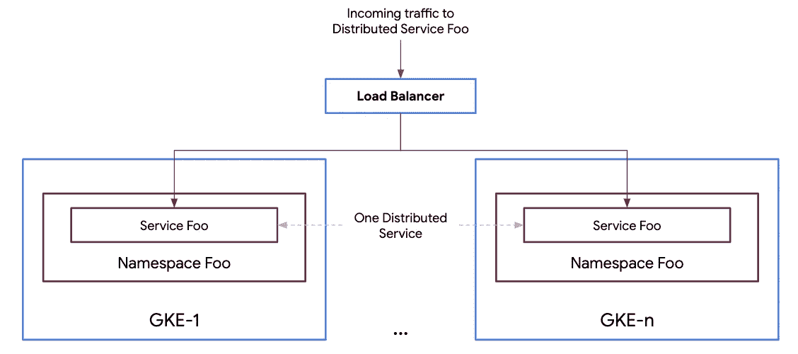

# Kubernetes 发动机(GKE)多集群生命周期管理系列

> 原文：<https://medium.com/google-cloud/gke-multi-cluster-life-cycle-management-series-b0d39080ac6b?source=collection_archive---------3----------------------->

## 第二部分:多集群和分布式服务

GKE 上的分布式服务

在[第一部分](/@ameericus/kubernetes-engine-gke-multi-cluster-life-cycle-management-series-17ff892b85c8)中，我谈到了多集群 Kubernetes 架构的各种原因。在这一部分，我将介绍分布式服务的概念。分布式服务是部署到多个 Kubernetes 集群的 Kubernetes 服务。分布式服务是无状态服务，在多个集群中的行为相同。这意味着分布式服务具有相同的 Kubernetes 服务名，并在多个集群中的相同名称空间中实现。Kubernetes 服务与其运行的 Kubernetes 集群的命运息息相关。如果一个 Kubernetes 集群离线，那么 Kubernetes 服务也会离线。分布式服务是从单个 Kubernetes 集群中抽象出来的。如果一个(或多个)Kubernetes 集群出现故障，分布式服务很可能会在线，并在期望的 [SLO](https://en.wikipedia.org/wiki/Service-level_objective) (服务级别目标)内。

在下图中，Foo 是一个运行在多个集群上的分布式服务(具有相同的服务名和名称空间)。因此，它不依赖于单个集群，因此在概念上表现为 Kubernetes 集群基础设施层之上的一层。如果任何一个集群(运行服务 Foo)关闭，分布式服务 Foo 仍然保持在线。同时，服务栏和 Baz 是运行在单个集群上的 Kubernetes 服务。它们的正常运行时间(和可用性)取决于它们所在的特定 Kubernetes 集群的正常运行时间。

GKE 的分布式服务 Foo 和 Kubernetes 服务 Bar 和 Baz

弹性是多集群部署的原因之一。分布式服务在多集群架构上创建弹性服务。无状态服务是多集群环境中分布式服务的主要候选对象。使用分布式服务时，有一些要求和注意事项。

**多集群网络** —去往分布式服务的流量可以被发送到运行该服务的集群。这是通过多集群入口技术实现的，如 Anthos 的[入口或推出您自己的外部负载平衡器/代理解决方案。尽管如此，网络解决方案必须让运营商控制何时、何地(即哪个集群)以及有多少流量被路由到分布式服务的特定实例。](https://cloud.google.com/kubernetes-engine/docs/concepts/ingress-for-anthos)

分布式服务 Foo 的多集群入口

**可观察性** —工具必须就位，以便在分布式服务层进行观察。应该对分布式服务的 SLO(通常是可用性和延迟)进行综合测量。这提供了每个服务在多个集群中如何执行的全局视图。虽然在大多数可观察性解决方案中，分布式服务并不是一个定义良好的资源，但是通过收集和组合各个 Kubernetes 服务指标，可以实现预期的结果。像[云监控](https://cloud.google.com/monitoring)这样的解决方案，或者像 [Grafana](http://grafana.com) 这样的开源工具，以及其他许多提供 Kubernetes 服务指标的解决方案。像 [Istio](http://istio.io) 和 [ASM](https://cloud.google.com/anthos/service-mesh) 这样的服务网格解决方案也提供现成的服务指标，不需要任何工具。

**服务放置** — Kubernetes 服务在单个 Kubernetes 集群内提供节点级容错。这意味着 Kubernetes 服务可以承受节点中断。在节点停机期间，Kubernetes 主节点会自动将 pod 重新安排到健康节点。分布式服务提供集群级容错。这意味着分布式服务可以承受集群中断。当对分布式服务进行容量规划时，必须考虑到这一点。分布式服务不需要在每个可用的集群上运行。分布式服务在哪些集群上运行可能取决于以下要求:

1.  在哪里，或者在哪些地区，需要这种服务？
2.  分布式服务所需的 SLO 是多少？
3.  分布式服务需要什么类型的容错？集群、地带或区域。例如，单个区域中的多个集群，或者单个区域或多个区域中跨区域的多个集群。
4.  在最坏的情况下，分布式服务应该承受什么级别的中断？在群集层
5.  N+1，意味着分布式服务可以承受单个集群故障
6.  N+2，意味着两个并发故障。例如，两个集群中的 Kubernetes 服务同时发生计划内和计划外停机。

分布式服务的放置取决于上述要求。

**推出/回滚** —分布式服务，如 Kubernetes 服务，允许逐步推出和回滚。与 Kubernetes 服务不同，分布式服务将集群作为一个额外的部署单元，作为一种渐进变革的手段。推出和回滚也取决于服务要求。在某些情况下，可能需要同时升级所有集群上的服务(例如错误修复)。在其他情况下，可能需要一次一个集群地缓慢推出(或错开)变更。这通过逐渐引入对服务的更改来降低分布式服务的风险。但是，这可能需要更长时间，具体取决于集群的数量。通常情况下，没有放之四海而皆准的解决方案。通常，根据分布式服务需求，会使用多种部署/回滚策略。这里重要的一点是，分布式服务必须允许环境中渐进的和受控的变化。

**业务连续性/灾难恢复(BCDR)** —这些术语经常一起使用。业务连续性是指在发生重大(计划内或计划外)事件时继续提供(关键)服务，而灾难恢复是指在发生此类事件后为使业务运营恢复到正常状态而采取或需要采取的步骤。有许多针对 BCDR 的策略超出了本指南的范围。简单地说，BCDR 要求系统和服务有一定程度的冗余。分布式服务的关键前提是它们运行在多个位置(集群、区域、地域)。BCDR 策略通常依赖于前面讨论的推出/回滚策略。例如，如果以交错/受控的方式执行部署，可以在不影响大量用户的情况下及早发现 bug 或不良配置推送的影响。在大规模和快速变化的情况下(例如，在现代 CI/CD 实践中)，通常不是所有用户都被提供相同版本的分布式服务。分布式系统和服务中的 BCDR 规划和策略不同于传统的整体架构。在传统系统中，所做的更改会影响大量甚至可能是每个用户，因此必须有一个冗余/备份系统，以防首次展示的不良影响。在分布式系统/服务中，几乎所有的变化都是以渐进的方式完成的，影响到少数用户。

**集群生命周期管理** —与受控的推出/回滚一样，分布式服务支持受控的集群生命周期管理。如前所述，分布式服务提供集群级别的弹性。这意味着群集可以“不轮换”进行维护。这可以通过多种方式实现。本指南稍后将介绍其中的一些策略。这里可以说，集群生命周期管理是分布式服务的一个原则，不适用于 Kubernetes 服务。

本系列的其余部分重点关注分布式服务的集群生命周期方面。

> 接下来… [第三部分:GKE 集群生命周期管理](/@ameericus/gke-multi-cluster-life-cycle-management-series-a73185392345)