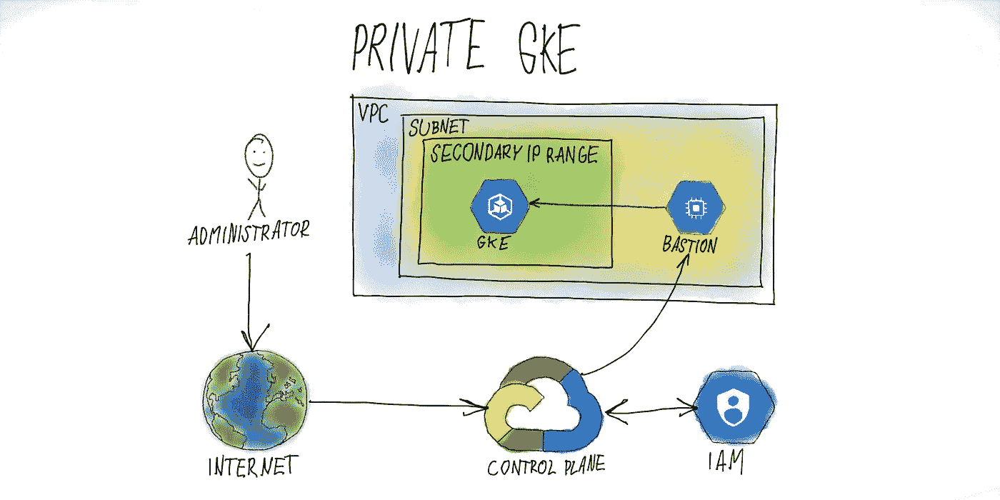
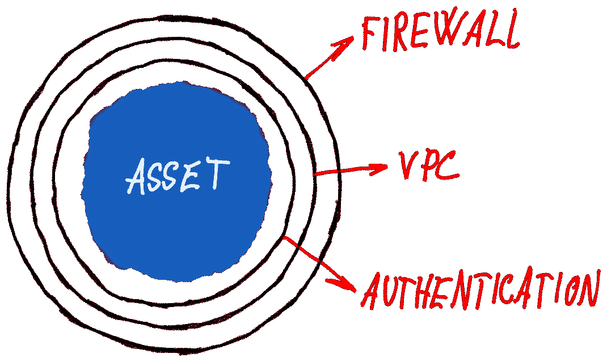
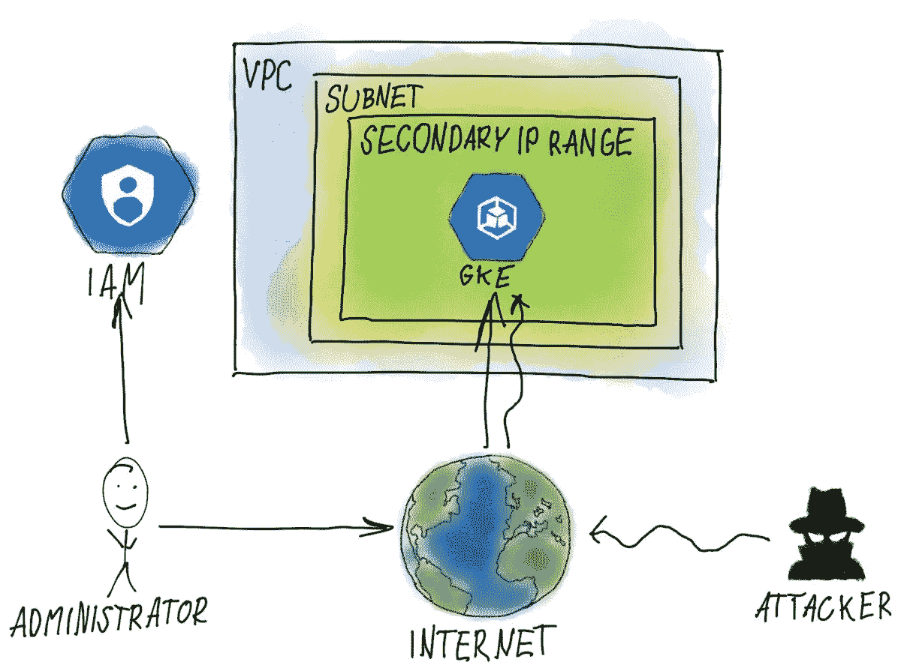
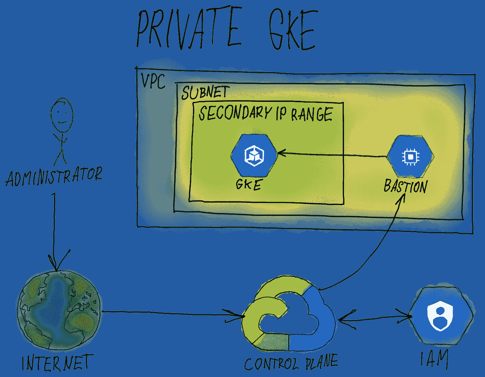
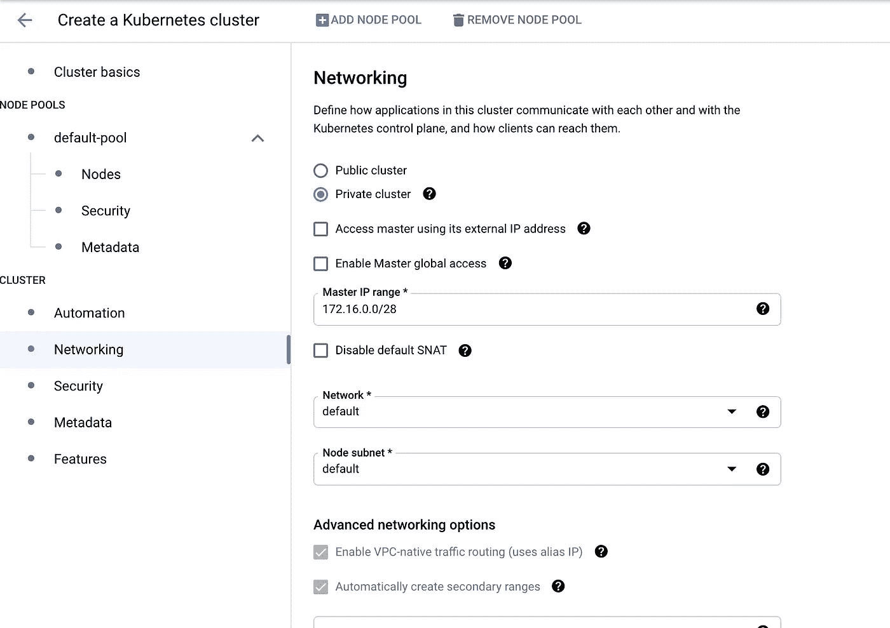

# 带有堡垒主机的 GKE 专用集群

> 原文：<https://medium.com/google-cloud/gke-private-cluster-with-a-bastion-host-5480b44793a7?source=collection_archive---------0----------------------->

许多 GKE 集群暴露在互联网的管理访问之下。对控制平面的公共访问使集群暴露于各种潜在的攻击和零日漏洞。依靠分层安全性是行业最佳实践，攻击者在获得访问权限之前必须绕过多个级别的控制。

在本文中，您将了解到:

*   公共集群如何暴露给攻击者
*   设置带有附加访问控制的专用集群
*   为安全访问创建一个带有身份识别代理(IAP)的堡垒主机

谷歌 Kubernetes 引擎(GKE)在设置期间提供三种操作模式供选择:

*   禁用公共端点访问-不能通过互联网直接访问 GKE 管理 API
*   通过授权网络启用公共端点访问—可通过互联网访问管理 API，但要求请求来自一组特定的 IP 地址
*   启用公共端点访问—这是最不安全的选项，允许直接访问仅依赖 Kubernetes 身份验证功能的管理 API

像洋葱模型一样围绕资产构建安全性允许在多个级别上实施安全性规则。从物理访问，通过网络，一直到应用程序级别的身份验证。在堆栈的多个级别上建立控制可以显著降低攻击者发现漏洞从而暴露核心资产的风险。

洋葱安全模型

将 GKE 集群设为私有会为您的工作负载增加一层安全性，攻击者必须在 Kubernetes 身份验证的基础上额外绕过网络安全规则。

## Kubernetes \w 公共端点访问已启用

启用公共端点访问的 Kubernetes 集群管理

Kubernetes 集群具有对管理 API 的公共访问权限，通常由管理员直接从互联网访问，在互联网上，Kubernetes 的内置身份验证用于验证管理员的身份及其访问权限。

Kubernetes 身份验证是针对攻击者的唯一保护级别。这使得群集容易受到零日攻击，新发现的漏洞可以被利用，而没有可用的修补程序。添加多层安全要求攻击者在获得对核心资产的访问权之前找到多个零日/未打补丁的漏洞。

# 正在设置专用 GKE 集群

禁用公共端点访问的 Kubernetes 集群管理

首先，我们将创建一个不允许公共访问的新 GKE 集群。一旦集群启动并运行，我们将需要一种访问它的方法，因为公共访问不再是一个选项，我们将在 Kubernetes 管理 API 之间建立一个堡垒主机，并允许访问来管理集群。我们将使用 GCP IAM 作为身份识别代理来建立到堡垒主机的安全连接。

为私人 GKE 设置网络

让我们从在控制台中创建一个私有集群开始。在网络设置中，我们选择一个专用集群。禁用使用外部 IP 的访问，我们必须指定主 IP 范围，该范围将用于为 Kubernetes 主节点分配 IP 地址。该范围不得与 VPC 中的任何其他 IP 地址重叠，并且必须具有/28 的 CIDR 大小。在这种情况下，我们将使用 CIDR 172.16.0.0/28。

一旦 GKE 集群启动并运行，我们将需要一种管理集群的方法。为此，我们在授权访问管理 API 的集群内部网络上部署堡垒主机。

我们将从创建一个小型计算引擎实例开始，例如“e2-micro”就足够了。该实例必须运行在与上一步中创建的 Kubernetes 集群相同的网络上。在这种情况下，它是默认网络和默认子网。实例运行后，让我们通过 ssh 进入实例(我们可以使用 GCP 控制台)并通过运行“sudo apt-get install tinyproxy”安装 Tinyproxy。完成后，我们在/etc/tinyproxy/tinyproxy.conf 中更改 tinyproxy 的配置，并将“Allow localhost”附加到文件末尾并保存文件。文件保存后，我们将通过执行“sudo service tinyproxy restart”来重新加载 Tinyproxy

在计算引擎上安装微型代理

最后一步是使用 kubectl 等常用工具从您的计算机连接到您的 Kubernetes 集群。此步骤在您的计算机上完成，我们首先使用以下命令下载 GKE 集群的凭据:

设置 Kubernetes 身份验证配置

这将设置本地 Kubernetes 配置，包括可由 kubectl 和类似工具用来访问集群的集群凭证。最后，我们使用以下代码创建一个堡垒的身份感知代理:

创建堡垒实例的 HTTPS 代理

这为我们之前创建的堡垒创建了一个代理。堡垒的作用是将发送给它的请求转发到请求目的地，在我们的例子中是 Kubernetes 管理 API。该命令将代理作为后台进程运行，当我们希望与群集通信时，它必须运行。

最后一步是使用 kubectl 的 HTTPS 代理环境变量来指定代理。这个变量可以用于代理对集群的请求，也可以使用其他工具，如 Jenkins X 的 jx-cli 或 Octant。但是它的支持取决于应用程序。

现在，我们有了一个具有分层安全性的群集，该群集完全运行，并有一种访问它的方法。此外，我们不应该忘记补丁管理，集群和堡垒设置应该自动化，并使用 Terraform 等工具定期更新。

敬请关注改进集群的帖子！