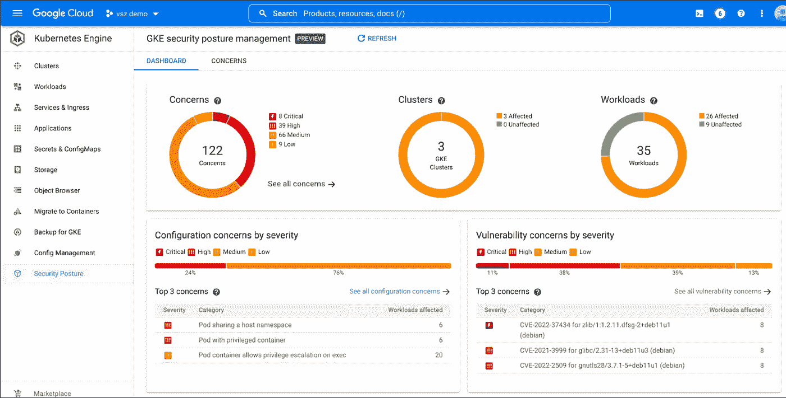
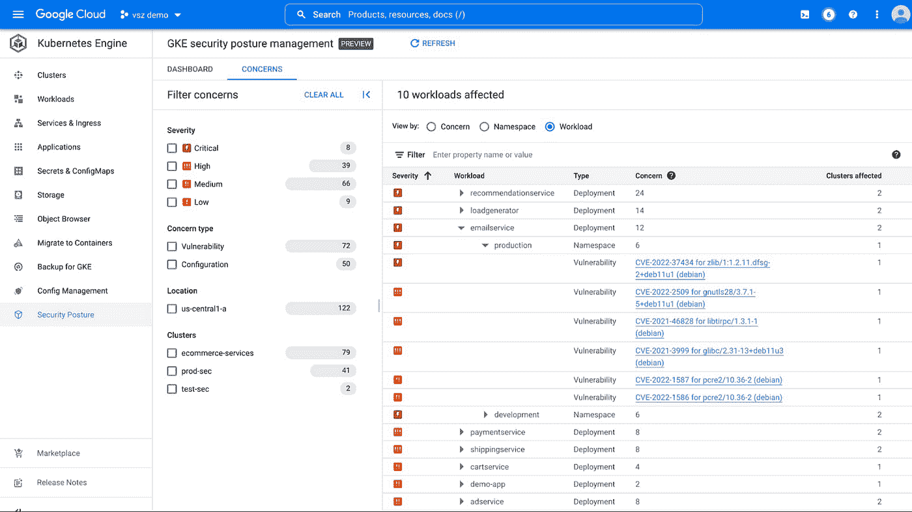
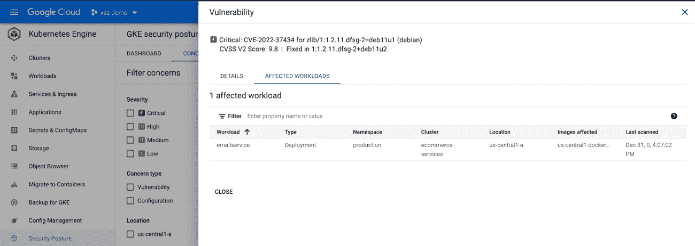
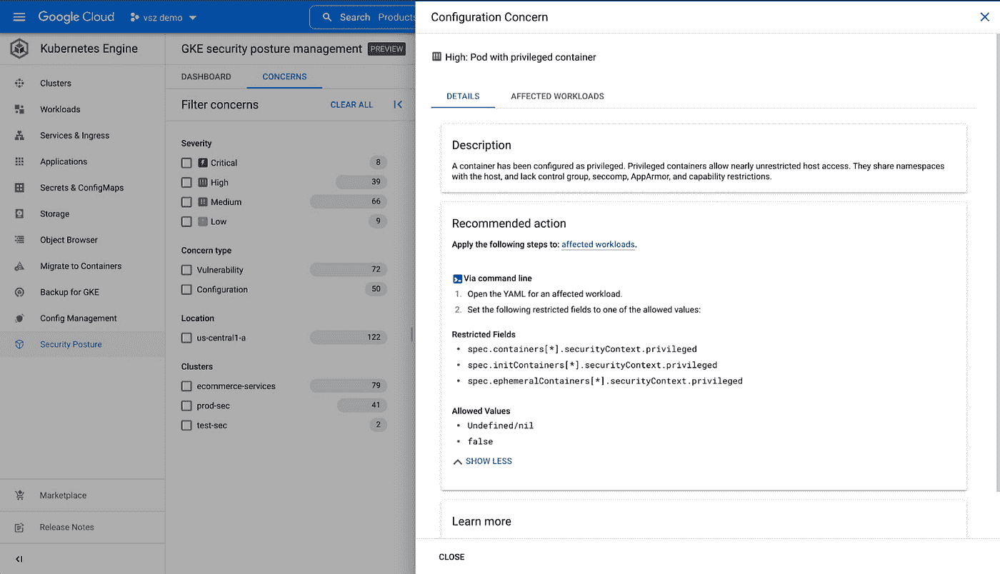

# GKE 安全态势管理:自动检测 GKE 安全问题

> 原文：<https://medium.com/google-cloud/gke-security-posture-management-automatic-detection-of-gke-security-concerns-fa5d888c1312?source=collection_archive---------3----------------------->

除了使用 GKE 管理大规模应用程序，每个人最关心的问题是安全性。本博客将向您介绍 GKE 的集成安全扫描工具和仪表板，它们有助于自动检测安全问题。这些特性是现成可用的，可以让您了解整个集群和工作负载的安全状态和问题。

借助 [GKE 安全态势管理](https://cloud.google.com/kubernetes-engine/docs/concepts/about-security-posture-dashboard)，您可以主动监控集群的安全状况。该控制面板读取围绕 GKE 构建的多种监控、分析和扫描技术的结果，为您提供安全的综合视图。

仪表板由两种类型的扫描生成-

**工作负载配置扫描**

理想情况下，GKE 工作负载应该具有强化的配置，但是很难手动扫描所有配置文件。工作负载扫描根据 [pod 安全标准](https://kubernetes.io/docs/concepts/security/pod-security-standards/)中提到的策略检查每个 Pod。

C **容器扫描已知漏洞**

GKE 扫描 pod 上运行的容器图像，寻找来自 CVE 公共数据库 [NIST](https://nvd.nist.gov/vuln/search) 的已知漏洞。

## 扫描完成后,“安全状态仪表板”中会显示以下视图



安全态势—主控制面板

## “仪表板”选项卡具有以下视图

*   为您提供跨集群的安全问题严重性的图表。
*   配置类型关注严重性和可操作的指导。
*   安全部门关注的漏洞类型以及可操作的指导。
*   受影响的工作量比例。



安全态势—关注仪表板

您可以转到“关注点”选项卡，双击关注点，获得有见解且可行的指导。



*漏洞扫描结果*



*配置问题和建议措施*

# 如何在集群上启用工作负载扫描？

**使用 CLI 运行以下命令**

```
gcloud beta container clusters update CLUSTER_NAME \
    --region=COMPUTE_REGION \
    --enable-workload-config-audit
```

*集群名称=您的集群的名称*

*COMPUTE_REGION =您的集群的区域或用于分区集群–- zone。*

您还可以通过转到日志浏览器并运行以下查询来查看已发现问题的日志记录:

```
resource.type="k8s_cluster"
jsonPayload.@type="type.googleapis.com/cloud.kubernetes.security.containersecurity_logging.Finding"
jsonPayload.type="FINDING_TYPE_MISCONFIG"
```

# 如何启用集装箱扫描？

## 使用 CLI 运行以下命令

```
gcloud beta container clusters update CLUSTER_NAME \
  --region=COMPUTE_REGION \
  --enable-workload-vulnerability-scanning
```

*集群名称=您集群的名称*

*COMPUTE_REGION =您的集群的区域或用于分区集群的区域——zone*

您还可以通过转到日志浏览器并运行以下查询来查看已发现的容器漏洞的日志记录:

```
resource.type="k8s_cluster"
jsonPayload.@type="type.googleapis.com/cloud.kubernetes.security.containersecurity_logging.Finding"
jsonPayload.type="FINDING_TYPE_VULNERABILITY"
```

## 其他资源和建议

你可以在官方文档中读到更多相关信息-

[](https://cloud.google.com/kubernetes-engine/docs/concepts/about-security-posture-dashboard) [## 关于安全态势仪表板|谷歌 Kubernetes 引擎(GKE) |谷歌云

### 无论您的企业正处于数字化转型的早期阶段，谷歌云都可以帮助您解决…

cloud.google.com](https://cloud.google.com/kubernetes-engine/docs/concepts/about-security-posture-dashboard) 

对于预防性和前瞻性安全措施，您可以使用以下服务来保护您的构建和集成管道:

*   **容器漏洞评估—**[https://cloud . Google . com/Container-analysis/docs/automated-scanning-how to](https://cloud.google.com/container-analysis/docs/automated-scanning-howto)
*   **二进制授权—**[https://cloud . Google . com/Binary-Authorization/docs # training-and-tutorials](https://cloud.google.com/binary-authorization/docs#training-and-tutorials)