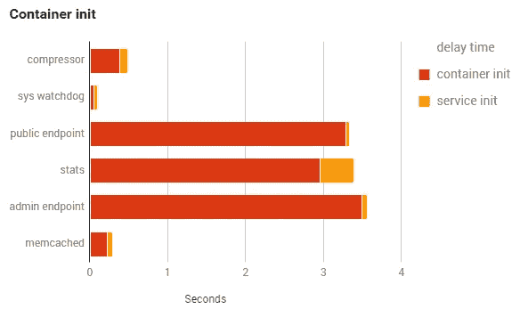
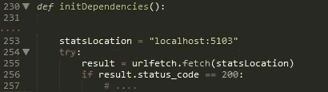
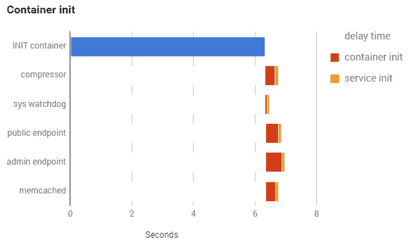
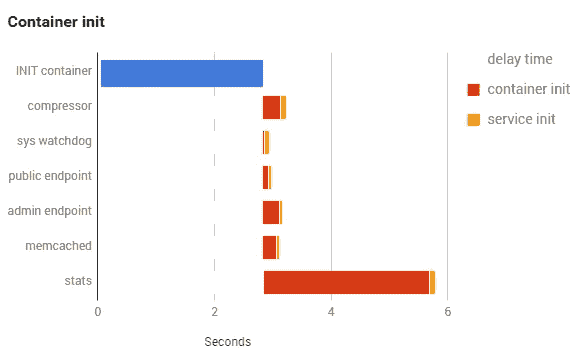

# GKE 启动时间&集装箱问题

> 原文：<https://medium.com/google-cloud/gke-startup-time-the-container-problem-d9166b03c3c0?source=collection_archive---------0----------------------->

上一次，[我介绍了剖析&获得可见性](/@duhroach/profiling-gke-startup-time-9052d81e0052)的各种方法，以了解给定 pod 的 Google 容器引擎(GKE)启动时间。考虑到 Kubernetes 在启动阶段的复杂性，这是非常有用的，它有时会在奇怪的地方隐藏性能问题。

不经意间，这就是*培根住的地方！*遇到了一个问题:即使有了 kubernetes 的强大功能，它们的容器仍然需要下载一些数据，结果是它们的初始化舞蹈导致了胃灼热。(懂了吗？因为这是一个食品应用？…)

# 取决于容器

培根，活下去！我已经将他们的代码从 GCE 移植到 GKE，因此，他们所有的容器都在 pod 启动过程的并行阶段初始化(FWIW:他们*确实有一个单独的 init 容器，它正在做一些"*对不起，我不能告诉你那个*工作，大约需要 2-3 秒，但是我马上就要谈到它..) .应用上一篇文章中的分析过程，我们最终获得了容器的如下计时:*

其中三个容器花费了大量的时间来启动，最重要的是公共/管理端点，它们在健康检查阶段直接使用。

在查看公共端点时，我看到了看起来是罪魁祸首的东西:

公共端点的初始化代码快速调用 Stats 容器，以确保它在继续之前启动并运行。啊，现在我们看到问题了。

那个 urlfetch 命令是一个**阻塞**调用。因为并行容器是随机初始化的，所以端点首先被初始化，但是由于它们对 stats 容器的依赖而被阻塞。显然不理想..

# 让我们使用初始化容器！

因为看起来我们依赖于 stats 容器，所以将该容器移动到 *init* 阶段是有意义的，这样并行容器就不必陷入这种奇怪的竞争状态，并且可以正确执行。我们可以看到系统是如何反应的；基本上，init 阶段现在延长了 2-4 秒，这导致整个系统启动总体上变得更糟:

(记住，他们现有的“*不能告诉你关于那个*”init 容器已经做了大约 2-2.5 秒的工作，所以我们看到这个过程加倍了)

# 别管初始化容器了！

这明显是*方向错了*；这使得整个冷启动时间变慢。

至此，*培根，活了！*决定返回，对他们的代码做一些小的修改:stats 模块在那里帮助执行启动相关任务的计时，但是由于他们现在可以看到代码之外的那些东西*(感谢我们设置的剖析工具)，他们很乐意消除对端点的依赖。*

结果是，我们最终在地面上丢弃了一些信号，但是对于我的新启动测试代码来说，保留这些信息并不重要。一旦进行了这一更改，stats 容器就可以在并行阶段移回，从而提高整个系统的性能:

# 发现和收获

我从这里学到了一些东西:

**在容器中计时启动时间有点复杂*，*** 但是很重要。

为了真正以一种合理的方式获得这些信息，你需要以非常特殊的方式修改每个单独的容器，这需要了解它所运行的容器。我确信这是一件好事，这是有开发和运营方面的原因的，但是我还没有看到这一点。

**初始化容器是关键路径。**由于容器以线性顺序初始化，执行一个容器所花费的时间会延迟其他容器的启动时间。单个不良因素会给启动时间带来巨大负担。因此，您应该考虑在容器的初始化阶段和之后的并行阶段执行多少工作。(注意，如果你感兴趣的话，凯尔西·海托华[有一篇关于驾驭这种复杂性的文章](/@kelseyhightower/12-fractured-apps-1080c73d481c#.rp57cshi7)

**避免并行初始化依赖。**这些容器是随机创建的。避免它们之间的线性依赖。让容器 A 需要容器 B 可能会出现问题，如果 A 在 B 之前初始化，那么 A 会等待一段随机的时间。如果可能的话，考虑将这些依赖项转移到 init 阶段，或者完全移除这些依赖项。