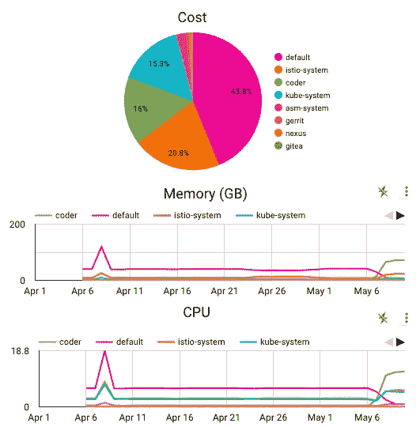

# GKE 使用计量

> 原文：<https://medium.com/google-cloud/gke-usage-metering-507a0edb5e8e?source=collection_archive---------0----------------------->

# 介绍

[GKE 使用计量](https://cloud.google.com/kubernetes-engine/docs/how-to/cluster-usage-metering)是一个很棒的特性，它支持 GKE 分析，捕捉 CPU、内存、存储和网络出口的使用和成本([可选](https://cloud.google.com/kubernetes-engine/docs/how-to/cluster-usage-metering#enable-network-egress-metering))。提供了示例查询和 Data Studio 仪表板。

这篇博文的目的是向您展示一个*替代方案*逐小时分析，以及对所用查询的详细解释。

## 限制

有许多记录在案的[限制](https://cloud.google.com/kubernetes-engine/docs/how-to/cluster-usage-metering#limitations)，但也有其他应该考虑的限制:

*   有限的对象级指标。有在对象级别报告的指标，但没有对象名称或种类，只有标签。 ***变通方法:*** *如果有有意义的标签，可以用那些。*
*   使用计量数据集与群集是同一个项目，无法将多个项目合并成一个项目。 ***解决方法:*** *创建一个视图，将多个项目中的所有 GKE 使用情况计量结合在一起。*
*   使用计量不会捕获所有系统和空闲 CPU 和内存。 ***解决方法:*** *加入计费数据，将指标按比例调整到整个集群。*
*   计费数据不包括集群名称。这意味着来自计费的调整不能连接到同一个集群。 ***解决方法:*** *标注集群或根据项目中的所有集群进行调整。*

# 标准化 GKE 使用计量

GKE 使用计量数据具有代表大约一个小时的指标，通常接近一个小时的开始— *但不完全是*！这使得不可能加入计费数据。

此外，GKE 计量数据有多种来源:

*   可能有一个或多个项目包含数据。
*   有资源使用和资源消耗指标。前者代表实际使用的资源，而后者 GKE 请求(保留的)CPU 和内存。

## 询问

以下查询执行以下操作:

*   在单一视图中显示底层数据。按字段 record_date、project_id、type 过滤将导致扫描的表和分区减少。
*   将窗口规范化为与计费使用的窗口相同(精确到小时)。

```
CREATE OR REPLACE VIEW **`gke_usage.gke_resource_normalised`** AS-- SourceData is a UNION of all source tables, including the
-- different types and projects.
--
-- Any queries against this view that specifies the project_id,
-- type, or record_date (partition for the source data) will be
-- more efficient as it will scan fewer tables and partitions.
--
WITH SourceData AS (
  SELECT
    _PARTITIONTIME AS record_date,
    '<project-id>' AS project_id,
    'consumed' AS type,
    * EXCEPT (project)
  FROM
    **`gke_usage.gke_cluster_resource_usage`**
  UNION ALL
  SELECT
    _PARTITIONTIME AS record_date,
    '<project-id>' AS project_id,
    'request' AS type,
    * EXCEPT (project)
  FROM
    **`gke_usage.gke_cluster_resource_consumption`**
)-- Pull out all of the fields we need from the GKE Usage Metering
--
-- The CROSS JOIN with 'win' is the set of precise time windows
-- (on the hour for an hour) that overlap with the metrics. This
-- allows joining with billing later.
--
-- Additionally, you can use the GKE labels at this stage and
-- normalise for analytics.
SELECT
  record_date,
  win AS start_time,
  sku_id,
  project_id,
  resource_name,
  cluster_location,
  cluster_name,
  namespace,
  type,
  usage.unit AS unit,
  -- This formula calculates the size of the new window
  -- against the original window for the new usage amount
  usage.amount *
    IF(
      end_time = start_time,
      1.0,
      TIMESTAMP_DIFF(
        LEAST(TIMESTAMP_ADD(win, INTERVAL 1 HOUR), end_time),
        GREATEST(win, start_time), MICROSECOND) /
      TIMESTAMP_DIFF(end_time, start_time, MICROSECOND)
    ) AS usage
FROM
  SourceData
  -- Array of overlapping periods
  CROSS JOIN UNNEST(GENERATE_TIMESTAMP_ARRAY(
    TIMESTAMP_TRUNC(start_time, hour),
    TIMESTAMP_TRUNC(end_time, hour),
    INTERVAL 1 HOUR)) AS win
WHERE
  usage.amount > 0 AND
  -- Bug -- sometimes start_time is at the epoch
  TIMESTAMP_DIFF(end_time, start_time, DAY) < 1
GROUP BY
  1, 2, 3, 4, 5, 6, 7, 9, 8, 9, 10, 11
```

现在，我们有了一个跨 GKE 使用计量表的有用视图。

# GKE 和计费汇总

将 GKE 使用数据与计费汇总是下一个关键步骤，因为它们的时间窗口是一致的。

*下一个挑战:*GKE 的使用数据不包括 GKE GCE 节点的所有使用情况。我们需要上调使用量。但是只针对 GCE 节点，不针对其他任何节点。

## 计费查询

我们将从账单中提取使用量和费率。这将用作更大查询的一部分。

对于计费，我们只需要常规的成本，其中有一个明确的项目，并积极使用。

我们将这个表称为 **BillingData** 。

```
SELECT
  -- Same dimensions as GKE Usage Metering
  usage_start_time AS start_time,
  project.id AS project_id,
  sku.id AS sku_id,
  usage.unit AS unit, -- If this billing entry is for a GCE GKE Node (it has
  -- the label), then we count this as gke_usage and otherwise
  -- it is zero.
  SUM(IF(
    EXISTS (SELECT * FROM x.labels WHERE key='goog-gke-node'),
    usage.amount,
    0.0)) AS gke_usage, -- The rate is based on total cost / total usage regardless
  -- of GKE or not. All GCE instances for the same sku_id have
  -- the same rate.
  SUM(cost)/SUM(usage.amount) AS rate
FROM
  **`gke_usage.gcp_billing_export_v1_<billingID>`** x
WHERE
  cost_type='regular' AND
  usage.amount > 0.0 AND
  project IS NOT NULL
GROUP BY
  1, 2, 3, 4
HAVING
  -- Aggregations must have a rate (positive cost)
  -- otherwise we can ignore it.
rate > 0.0 
```

## 计算调整

将计费数据与“gke _ usage . gke _ resource _ normalized”结合将为我们提供提升指标的调整。

我们将这个表称为**调整数据**。

```
SELECT
  n.*, -- If there is a GKE usage to adjust, then safely
  -- divide it over the SUM of GKE Usage over the same
  -- keys as the billing. This is the proportion that this
  -- specific usage needs to be adjusted so that the total
  -- will match the actual billed usage (gke_usage).
  IF(b.gke_usage > 0.0,
    COALESCE(SAFE_DIVIDE(b.gke_usage, SUM(n.usage) OVER (
      PARTITION BY n.start_time, n.project_id,
                   n.sku_id, n.type, n.unit
      )),
      1.0),
    1.0
  ) AS adjustment, // Add the rate. This is used for finding out the cost.
  b.rateFROM
  **`gke_usage.gke_resource_normalised`** n
  JOIN **BillingData** b ON (
    b.start_time=n.start_time AND
    b.project_id=n.project_id AND
    b.sku_id=n.sku_id AND
    b.unit=n.unit
  )
WHERE
  -- Skip system-overhead. The adjusted values will be the
  -- recharged amounts, while the non-adjusted would allow
  -- optimising.
  namespace != 'kube:system-overhead'
```

## 在视图中应用调整

对于仪表板分析，数据仅对特定类型有效。该查询将使类型数量加倍，以包括调整后的指标和未调整的指标以及成本。

这将被构造成如下视图。

```
CREATE OR REPLACE VIEW `gke_usage.gke_usage_dashboard` AS
WITH
  BillingData AS (
    ***Billing Query Here* **  ),
  AdjustmentData AS (
 ***Adjustment Query Here***  ),-- The fields need to be ordered the same for UNION ALL,
-- so they also need to have the same EXCEPT() field list.
--
-- This union will allow the queries against the view to
-- 'see through' with the type field. It will only process one
-- side or the other of the UNION depending on the type.
SELECT
  c.* EXCEPT (usage, type, rate),
  type,
  usage,
  -- Add the cost
  usage * rate AS cost,
FROM
  **AdjustmentData** c
UNION ALL
SELECT
  c.* EXCEPT (usage, type, rate),
  -- Add adjusted type, usage, and cost.
  CONCAT(type, '_adj') AS type,
  adjustment * usage AS usage,
  adjustment * usage * rate AS cost,
FROM
  **AdjustmentData** c;
```

# 仪表板查询

这个查询是为 Data Studio 准备的。可以是直接连接，也可以是另一种视图。为 data studio 添加了 end_time。

## BigQuery 连接-查询

```
-- end_time is added to help with dashboards.
--
-- For calculating the average mem_gb, average cpu,
-- and average disk_gb you need to divide by
-- max(end_time) - min(start_time).
--
SELECT
  start_time,
  TIMESTAMP_ADD(start_time, INTERVAL 1 HOUR) AS end_time,
  sku_id,
  project_id,
  resource_name,
  cluster_location,
  cluster_name,
  namespace,
  type,
  -- Turn the metrics into something that can be directly used
  -- by a dashboard. Memory into GB, Egress into GB, disk into GB,
  -- and _secs where it is over time.
  SUM(IF(resource_name='cpu',usage,0.0)) AS cpu_secs,
  SUM(IF(resource_name='memory',usage/1e9,0.0)) AS mem_gb_secs,
  SUM(IF(resource_name='networkEgress',usage/1e9,0.0)) AS egress_gb,
  SUM(IF(resource_name='storage',usage/1e9,0.0)) AS disk_gb_secs,  
  SUM(IF(resource_name='cpu',cost,0.0)) AS cpu_cost,
  SUM(IF(resource_name='memory',cost,0.0)) AS mem_cost,
  SUM(IF(resource_name='networkEgress',cost,0.0)) AS egress_cost,
  SUM(IF(resource_name='storage',cost,0.0)) AS disk_cost,
  -- We need the total cost across all resource types
  SUM(cost) AS cost,
FROM
  `gke_usage.gke_usage_dashboard`
GROUP BY
  1, 2, 3, 4, 5, 6, 7, 8, 9;
```

## 公式字段

为了计算平均 CPU、平均磁盘 GB 和平均内存 GB，仪表板中需要计算字段。这是因为它可以在一段时间内聚集。

经过的时间是`DATE_DIFF(MAX(end_time), MIN(start_time))`。那么 avg_cpu 是`SUM(cpu_secs) / **<ElapsedTime>**`，avg_disk_gb 是`SUM(disk_gb_secs) / **<ElapsedTime>**`，avg_mem_gb 是`SUM(mem_gb_secs) / **<ElapsedTime>**`。

# 其他考虑

还有一些其他功能或方法可以采用。

*   处理计费数据和左加入 GKE 使用计量数据。这样做的好处是计费数据是主要的(应该等于计费数据*而没有*左边的连接),同时仍然在可能的情况下提供集群中的细分。如果获得 GKE 和其他地方的总成本是最重要的，这是最好的方法。
*   这允许实际使用和请求计量，但是对于成本分配，最大值(实际使用，请求)可能是最好的。这可以作为处理中的额外阶段添加。

# 结论

将 GKE 使用计量数据与 GCP 计费结合起来并不简单，但希望这篇博客文章提供了一个分步指南，说明如何在仪表板中展示这些数据并使其变得有用。

下面是使用 Data Studio 中的查询，按名称空间划分总成本，以及随时间变化的内存(GB)和 CPU。



一段时间内按命名空间、内存和 CPU 划分的总成本

任何问题或反馈请告诉我！