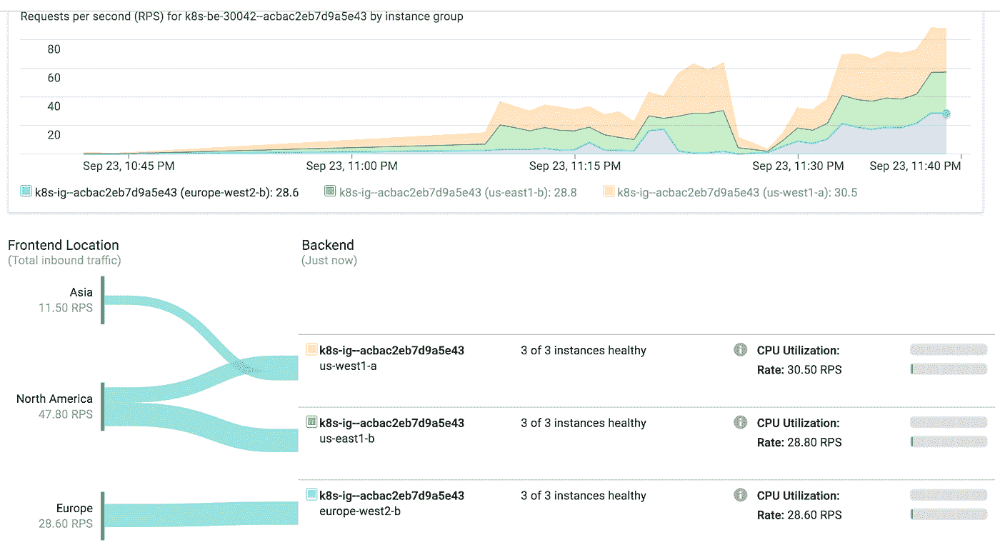
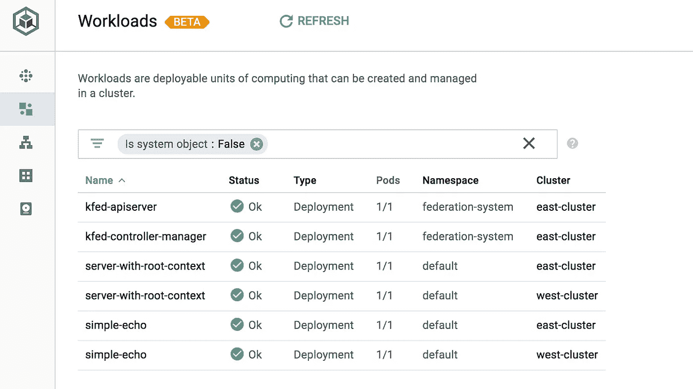
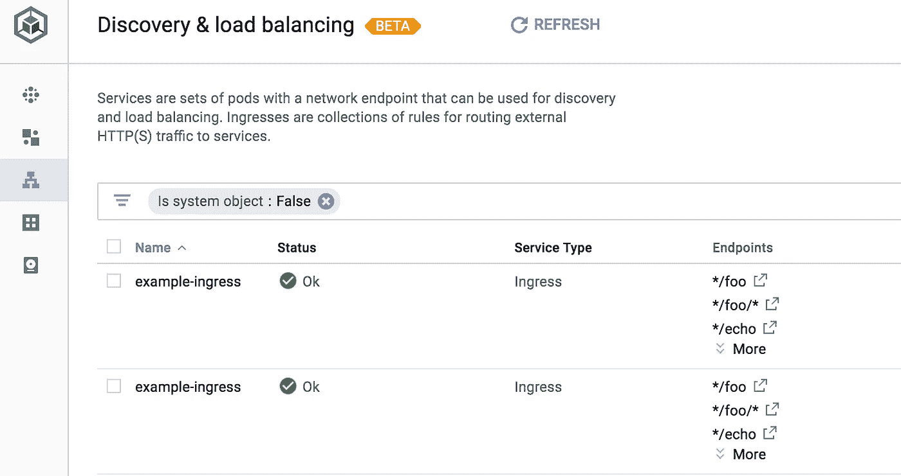
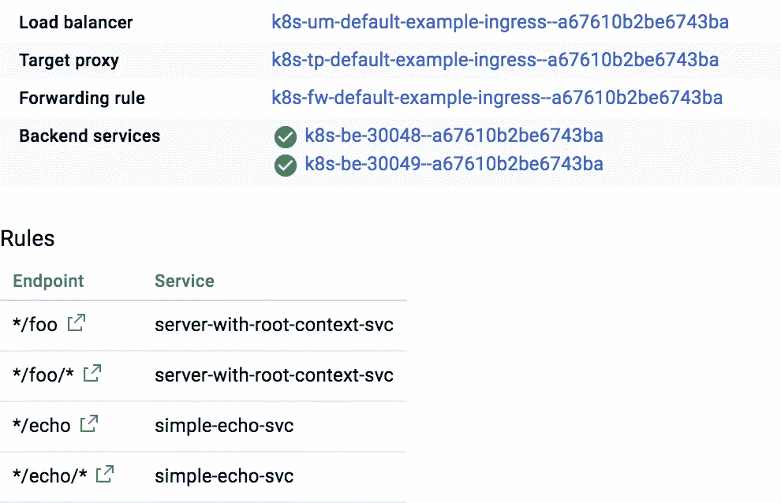
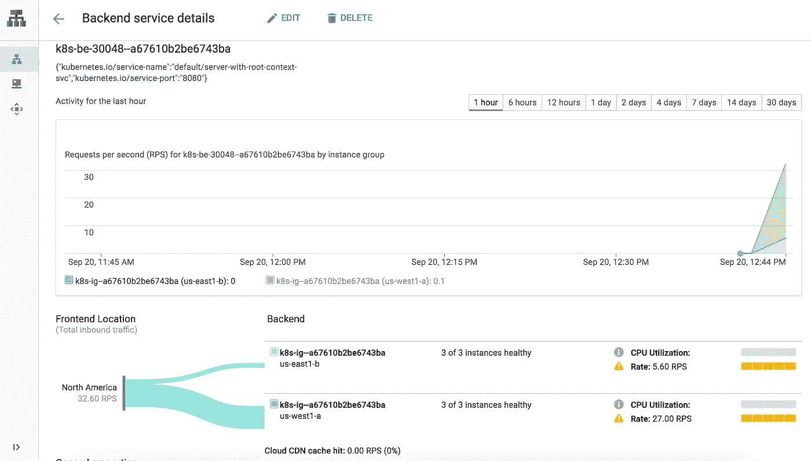

# Google 容器引擎的全球入口实践—第 2 部分:演示

> 原文：<https://medium.com/google-cloud/global-ingress-in-practice-on-google-container-engine-part-2-demo-cf587765702?source=collection_archive---------0----------------------->



本文是前几篇文章的后续，前几篇文章分别是:GCP 上的[全球 Kubernetes 三步曲，介绍了如何建立一个全球集群；以及](/google-cloud/global-kubernetes-in-3-steps-on-gcp-8a3585ec8547)[Google Container Engine 上的 Global ingress 实践——第一部分:讨论](/@cgrant/global-ingress-in-practice-on-google-container-engine-part-1-discussion-ccc1e5b27bd0),讨论了如何将一个全球集群与 Google LoadBalancer 一起用于 ingress。

**源代码**
本演练的源代码可以在 GitHub 的[这里找到](https://github.com/cgrant/global-k8s-ingress-with-gce-controller)

在这里，您会发现:
- /app —演示中使用的应用程序代码
- /cluster —一个配置联合集群的脚本
- /deploy —我们将在演示中使用的 k8s yaml 文件

# 设置集群

我在[Global Kubernetes in 3 Steps](/google-cloud/global-kubernetes-in-3-steps-on-gcp-8a3585ec8547)帖子中详细介绍了这一点，并在 [README](https://github.com/cgrant/global-k8s-ingress-with-gce-controller/blob/master/README.md) 中再次提供了这一点。这篇文章更多的是关于如何使用它，所以我不会在这里进入设置过程。

# 部署应用程序和入口

首先，获取回购并在本地克隆它

```
 git clone [https://github.com/cgrant/global-k8s-ingress-with-gce-controller](https://github.com/cgrant/global-k8s-ingress-with-gce-controller)
cd global-k8s-ingress-with-gce-controller 
```

对于这个例子，我在/apps 目录中提供了示例 python 应用程序。我已经预先构建了它们，并把它们发布到 docker hub 上。您应该能够自定义代码或交换您自己的图像。

**部署应用**

```
kubectl apply -f deploy/app-with-context.yaml
kubectl apply -f deploy/simple-echo.yaml
```

正如在第 1 部分中提到的，您需要在部署中显式设置 NodePort 值。我已经为你设置了 30048 和 30050

查看[谷歌云控制台](https://console.cloud.google.com/kubernetes/workload)中的工作负载页面



**创建一个全球 IP**
一旦部署了应用程序包，我们就可以考虑通过入口将它们连接在一起。

我们需要做的第一件事是为全局负载平衡器创建一个全局 IP。

> 这对于 ingress 在多个集群上工作至关重要。默认的临时 IP 只是区域性的，不允许适当的联合

创建一个名为`ingress-ip`的全球 ip

```
gcloud compute addresses create ingress-ip — global
```

**展开入口**

现在部署入口本身

```
kubectl apply -f deploy/ingress.yaml
```

这将需要一段时间，大约 5 分钟，以便在全球范围内创建负载平衡器并通过所有运行状况检查。

您可以在云控制台的[发现&负载平衡页面](https://console.cloud.google.com/kubernetes/discovery)上查看进度



负载平衡器启动后，您可以访问以下 URL:

/
/foo
/foo/bar
/echo
/echo/any string

从云控制台中的[发现&负载平衡页面](https://console.cloud.google.com/kubernetes/discovery)中，单击负载平衡器名称了解详细信息。然后向下滚动到后端。



在你的入口 yaml 中，每个服务都有一个后端。继续点击其中一个后端

随着流量流向您的新服务，您可以在此页面上看到位置和其他指标的细分。



就这样，你可以走了！

# 独立地

这是演示的简短和甜蜜。一定要研究代码以理解其中的机制。也可以自己尝试更新

继续部署您自己的服务，修改 ingress.yaml 并运行

```
kubectl apply -f deploy/ingress.yaml
```

负载平衡器上的新服务需要几分钟才能出现，但是对现有服务的更改非常快

尝试将应用程序部署中的映像更新为新的内容，例如，我可能会更新“simple-echo.yaml”

```
spec:
 containers:
 — name: simple-echo
 image: cgrant/simple-echo-server
```
```

到

```
spec:
 containers:
 — name: simple-echo
 image: cgrant/simple-echo-server:version1 
```

然后申请

```
kubectl apply -f deploy/simple-echo.yaml
```

容器会及时更新，您就万事俱备了！

我真的很喜欢使用 Kubernetes 的原生谷歌云产品的能力。它消除了基础架构的许多麻烦，同时为我的应用程序提供了强大的托管工具。

希望你喜欢。请留下任何意见或问题