# 具有健康检查的全局自动伸缩 Web 服务

> 原文：<https://medium.com/google-cloud/globally-autoscaling-web-services-4b650cc6fc49?source=collection_archive---------0----------------------->

## 规模季节


## 规模季节

“规模季节”是一个博客和视频系列，旨在帮助企业和开发人员在设计模式中构建规模和弹性。在这一系列文章中，我们计划向您介绍一些创建具有弹性和可伸缩性的应用程序的模式和实践，这是许多现代架构实践的两个基本目标。

在第 1 季中，我们将介绍基础架构自动化和高可用性:

1.  [可扩展和弹性应用的模式](/google-cloud/scale-and-resilience-arent-just-buzzwords-ce748360e80)
2.  [基础设施为代码](/google-cloud/why-should-you-treat-infrastructure-like-software-3865ed0e4b03)
3.  [不变的基础设施](/google-cloud/sometimes-change-is-bad-immutable-infrastructure-624a8e3482d6)
4.  [在哪里扩展您的工作负载](/@swongful/where-to-scale-your-workloads-6420150bf825)
5.  全球自动伸缩 web 服务(本文)
6.  [高可用性(自动修复&自动更新)](/@swongful/give-your-vms-a-steady-pulse-with-autohealing-and-autoupdates-ae2c0828ecc9)

在这篇文章中，我将带你了解如何在 Google Cloud 上扩展你的 web 服务。

# 看看这个视频

# 回顾

到目前为止，我们已经了解了 Critter Junction 是如何在 Google Cloud 上推出新应用的。我们讨论了谷歌云必须提供的各种[计算选项](/@swongful/where-to-scale-your-workloads-6420150bf825)——有些包括强大的自动扩展功能。这实际上取决于您的语言需求、控制级别、对操作系统的访问以及其他应用程序特征，如容器化。今天，让我们来看看他们如何让他们的应用程序优雅地处理流量峰值*和*下降。

# 准备就是一切

Critter Junction 正变得越来越受欢迎，用户比以往任何时候都多。这个游戏是关于每天玩，收集物品和家具来装饰你的房子，并与其他玩家互动。

正如我们在上一篇文章中看到的，他们选择在 Cloud Run 上运行他们的布局应用程序。但是，他们仍然选择将一些游戏服务器迁移到计算引擎。随着流量的增长，他们很难在一天中的任何给定时间提供额外的全局实例。这导致过度利用计算，并给他们的运营团队带来持续的压力。因此，现在他们正在寻找一种自动化的方法来处理不断增长的用户，并保持性能，以保持用户每天都回来。换句话说，他们如何设置自动缩放实例来检查不健康的实例并在需要时替换它们？

# 全局负载平衡器

答案是[谷歌云的全球负载均衡器](https://cloud.google.com/load-balancing/docs/https)和[托管实例组](https://cloud.google.com/compute/docs/instance-groups)自动扩展和分配流量。这让运营团队和用户对性能优势感到满意。

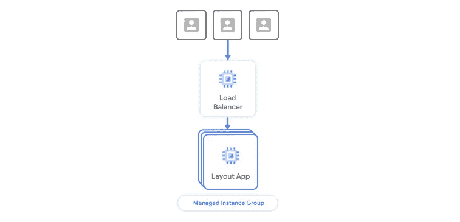

托管实例组提供自动扩展、自动修复、自动更新和区域(多区域)部署等功能。为了更好地理解这一点，让我们后退一步，理解计算引擎实例是如何创建的。

## 实例创建

您为您的应用程序创建一个自定义图像，然后使用它来创建一个实例。为了使其可重用，您创建了一个[实例模板](https://cloud.google.com/compute/docs/instance-templates)。使用实例模板，不仅可以设置 VM 的配置，还可以在机器启动时运行启动脚本来下载最新版本的代码。您还可以附加磁盘模板以及您的应用程序所需的所有软件依赖项，或者将它作为一个空壳，由 CI/CD 管道填充。然后，这些模板通过托管实例组自动创建大规模的计算引擎实例。

# MIG +运行状况检查演练

让我们通过一个简单的 web 应用程序示例来看看这是如何工作的！

## 创建防火墙规则

1.  在 Google Cloud 控制台中，使用以下属性在 VPC 网络下创建防火墙规则:

*   **允许 HTTP 流量**进入您即将部署的应用。
*   提供一个名称: **default-allow-http**
*   选择默认网络。
*   对于目标，选择指定的目标标记。
*   将目标标签设置为 **http-server** 。
*   将源过滤器设置为 IP 范围，并提供 **0.0.0.0/0** 以允许所有 IP 地址的访问。
*   对于端口和协议，选择 **TCP** 并输入 **80** 。
*   现在点击创建。

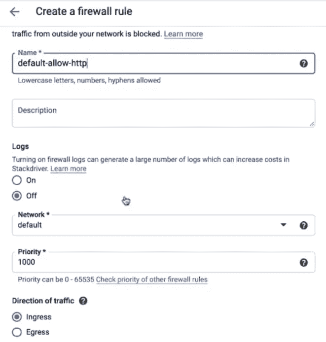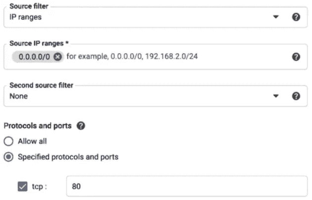

## 创建实例模板

1.  转到计算引擎，创建一个具有以下属性的实例模板:

*   给它起个名字:**实例模板。**
*   选择机器类型。
*   将启动盘镜像设置为 **Debian9。**
*   检查**允许 HTTP 流量。**
*   在“管理”选项卡下，找到“自动化”并添加启动脚本。

```
sudo apt update && sudo apt -y install git gunicorn3 python3-pip
git clone https://github.com/GoogleCloudPlatform/python-docs-samples.git
cd python-docs-samples/compute/managed-instances/demo
sudo pip3 install -r requirements.txt
sudo gunicorn3 --bind 0.0.0.0:80 app:app --daemon
```

> 这个脚本使每个实例在启动时运行一个简单的 web 应用程序。

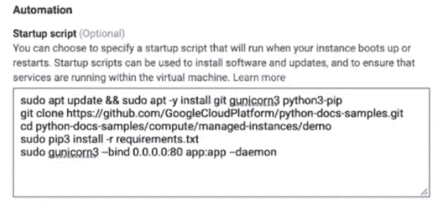

2.最后点击创建。

## 使用新模板创建实例

现在您已经有了一个实例模板，您可以使用这个模板创建一个实例组。

1.  在“计算引擎实例组”页面上创建具有以下属性的实例组:

*   给它起个名字。
*   在位置下，选择多个区域。这可以保护您免受区域故障的影响。
*   选择一个区域，然后在“实例模板”下选择您刚刚创建的模板。
*   现在将自动缩放模式设置为**自动缩放。**
*   将自动缩放策略设置为 **CPU 利用率**。您还可以将策略设置为 HTTP 负载平衡或监控指标。
*   将目标 CPU 使用率设置为 **60%。**
*   将最小实例数设置为 **3**

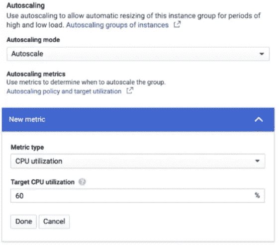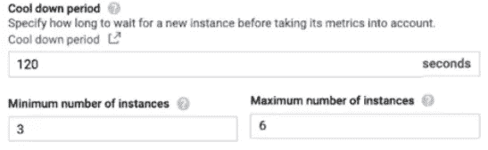

> 建议您提供足够的实例，以便在整个区域关闭时，剩余的实例仍能满足所需的最小数量。

*   将最大实例数设置为 **6** 以确保不会产生额外的成本。
*   我们将冷却时间设置为 **120 秒**。

> 确保该数字大于虚拟机的 CPU 利用率达到初始稳定所需的时间。

*   现在跳过设置健康检查，但是我们将在下一篇文章中讨论。

2.并单击 create，然后等待几分钟，直到所有实例都在运行

3.然后转到虚拟机实例，单击该实例的外部 IP 以查看演示 web 应用程序页面。

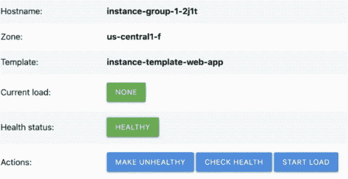

## 流量负载测试

现在我们已经设置好了，让我们生成流量，这样我们就可以看到自动缩放的效果。

1.  打开云壳。

2.使用 **export PROJECT_ID 命令**创建一个本地 bash 变量。

3.运行下面的 bash 脚本。

```
export MACHINES=$(gcloud --project=$PROJECT_ID compute instances list --format="csv(name,networkInterfaces[0].accessConfigs[0].natIP)" | grep "autoscaling-web-app-group")
for i in $MACHINES;
do
  NAME=$(echo "$i" | cut -f1 -d,)
  IP=$(echo "$i" | cut -f2 -d,)
  echo "Simulating high load for instance $NAME"
  curl -q -s "http://$IP/startLoad" >/dev/null --retry 2
done
```

> 这个脚本增加了负载，导致我们的演示应用程序的 CPU 利用率增加。当它达到 60%的目标值时，自动缩放开始增加实例组的大小。

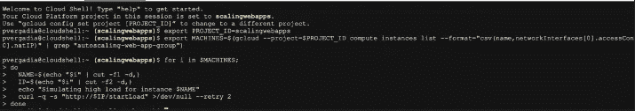

4.现在导航到我们的实例组中的 monitoring 选项卡，您可以看到随着 CPU 使用率的增加，实例的数量也在增加。

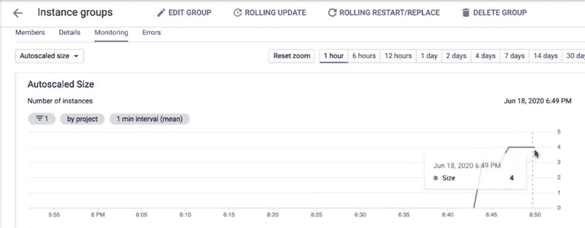

通过运行一个类似的 bash 脚本，您应该能够看到缩减的效果，该脚本减少了负载，从而降低了 CPU 利用率。经过几分钟的稳定期后，autoscaler 会提示减小实例组大小，这在 monitoring 选项卡中是可见的。

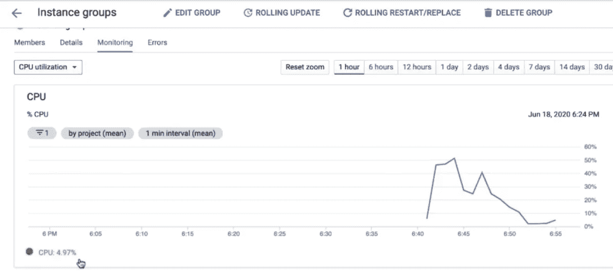

# 在每一层使用负载平衡器

Critter junction 拥有全球用户。他们希望新加坡的用户最终在东亚服务器上，而美国的用户最终在美国中部地区。

为此，他们将使用全局负载平衡，将流量路由到最近的 web 服务器实例。这有助于减少延迟并提高性能。从那里，内部负载平衡器分配流量，以管理和维护后端负载。

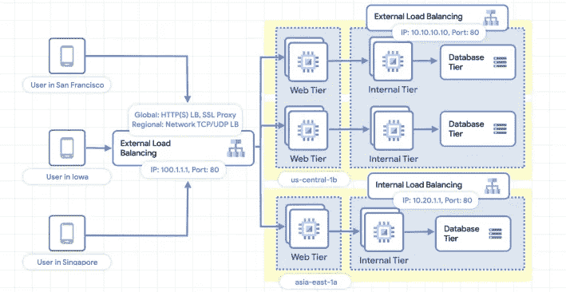

不同区域中的这些实例组使用 HTTP 负载平衡策略自动扩展，以便无缝扩展，而不管流量来自何处。

# 发布日成功

Critter Junction 不仅能够使用自动扩展和托管实例组自动扩展其计算实例，还能够通过使用全局负载平衡器为离用户最近的实例提供流量服务来提高性能。

但是扩展还有一步——识别不健康的实例，并自动替换它们！因此，请继续关注下一集，我们将介绍 Critter junction 如何设置自动修复并让他们的用户满意。

记住，永远要做架构设计。

# 后续步骤和参考:

*   在[谷歌云平台媒体](https://medium.com/google-cloud)上关注这个博客系列。
*   参考:[为高度可伸缩的应用使用自动伸缩](https://cloud.google.com/compute/docs/tutorials/high-scalability-autoscaling?utm_source=youtube&utm_medium=googlecloud&utm_campaign=seasonofscale&utm_content=005)。
*   跟随[一季的尺度视频系列](http://bit.ly/seasonofscale)，订阅谷歌云平台 YouTube 频道。
*   想要更多的故事？给我在[中](/@swongful)，和[推特](http://twitter.com/swongful)上喊一声。
*   与我们一起享受这个迷你系列的旅程，并了解更多关于谷歌云解决方案的信息！