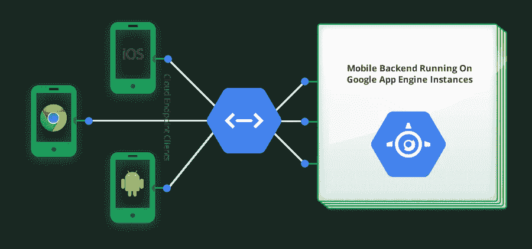

# Go、云端点和应用引擎

> 原文：<https://medium.com/google-cloud/go-cloud-endpoints-and-app-engine-19d290dafda3?source=collection_archive---------0----------------------->

## **第一部分**

**前言**:我听说了很多关于谷歌云端点、应用引擎和它们的界面。作为一个新手，我找不到任何关于这方面的入门教程。

这些学习笔记是我在探索和实验过程中写下的一个尝试，希望一个新的围棋开发者能够很快理解并掌握它。

我广泛引用了我在网上找到的文章。

感谢:

1.  罗明·伊拉尼(GDE:谷歌云平台)关于 Java 的谷歌云端点的优秀[教程系列。](http://rominirani.com/2014/01/10/google-cloud-endpoints-tutorial-part-1/)
2.  Google 对[云端点](https://cloud.google.com/appengine/docs/java/endpoints/)的概述。
3.  谷歌关于[谷歌应用引擎](https://cloud.google.com/appengine/docs/whatisgoogleappengine)的教程。

# 蜜蜂

[公共 API](http://www.programmableweb.com/apis/directory)现在被认为是集成两个应用程序最有效的机制。通常，API 托管在服务器端应用程序中，并向客户端公开以供使用。客户端可以是:

*   其他服务器端应用程序，
*   原生移动应用程序或
*   甚至浏览器应用程序(移动或桌面)。

当我们谈到一个公共 API 时，它们之间很少有共同点:

*   它们可以通过一个流行的、定义明确的协议获得，通常是 HTTP。
*   它使用 JSON 或 XML 作为数据格式。

以上并不是绝对绑定的，但是大多数公共 API 都有相同之处。

REST 协议以有效的方式利用各种 HTTP 动词来执行基本操作:

*   列出(或获取)所有记录
*   基于某些搜索标准或 ID 获取一个或多个记录
*   创造记录
*   更新记录
*   删除记录

关于 Web 服务的一个关键点是，就所使用的技术而言，它在客户机和服务器之间提供了一个很好的隔离层。客户端应用程序完全不知道您在服务器端使用的编程语言/环境。HTTP 是将两者绑定在一起的通用语言，因此，您可以在 Go 中编写服务器端 API 实现，但仍然能够通过 Go 客户端、iOS 客户端甚至 Web 客户端调用相同的 HTTP API。

# 谷歌云端点

[Google Cloud Endpoints](https://cloud.google.com/appengine/docs/java/endpoints/) 是 Google 的一个解决方案，由工具、库和功能组成，允许您从 Google App Engine 应用程序生成 API 和客户端库，称为 API 后端(即，它帮助您为您的 App Engine 应用程序创建公共 API)，以简化客户端对其他应用程序数据的访问。端点使得为 web 客户端和移动客户端(如 Android 或苹果的 iOS)创建 web 后端变得更加容易。

API 后端是一个 App Engine 应用程序，开发人员可以使用 App Engine 中可用的所有服务和功能，如数据存储、Google 云存储、邮件、Url 提取、任务队列等。最后，通过将 App Engine 用于后端，开发人员可以从系统管理工作、负载平衡、扩展和服务器维护中解放出来。

下图显示了云端点解决方案(摘自官方文档):

云端点

需要注意的一点是，你需要有一个 App Engine 应用。除此之外，如何存储或检索数据完全取决于你自己。您可以选择使用数据存储来满足您的 API 功能，或者简单地与外部服务对话来聚合和呈现响应。

# 谷歌应用引擎

[谷歌应用引擎](https://cloud.google.com/appengine/docs/whatisgoogleappengine)不同于大多数其他云系统，因为它既不是 IaaS(基础设施即服务，例如亚马逊 EC2)，也不是 SaaS(软件即服务，例如 Salesforce)。它介于两者之间，即平台即服务。

App Engine 不是固定的应用程序(SaaS)或原始硬件(IaaS)，而是为用户管理您的基础架构。此外，它提供了一个开发平台…用户可以创建应用程序，而不是使用云供应商提供的应用程序，并且它利用基础架构作为托管平台。

谷歌应用引擎让你在谷歌的基础设施上运行网络应用。使用 App Engine，不需要维护任何服务器:您只需上传您的应用程序，它就可以为您的用户提供服务。App Engine 无需任何成本即可开始使用。所有应用程序都可以使用高达 *1 GB 的存储*和足够的 CPU 和带宽来支持一个月服务约 500 万页面浏览量的高效应用程序，绝对*免费*。

创建 App Engine 应用程序很容易，只需几分钟。而且开始是免费的:上传你的应用并马上与用户分享，不需要任何费用和承诺。

## 沙箱

开发人员不会对让其他应用程序/用户访问他们的应用程序代码或数据感兴趣。为了确保这一点，所有 App Engine 应用程序都在一个称为沙箱的受限环境中运行。

> **警告**:由于沙箱的原因，应用程序无法执行某些动作。其中包括:打开一个本地文件进行写入，打开一个套接字连接，进行操作系统调用。

## 服务

App Engine 团队已经创建了一组高级 APIs 服务供开发人员使用。

*   希望你的应用发送和接收电子邮件或即时消息？这就是电子邮件和 XMPP APIs 的用途！
*   想接触其他 web 应用程序吗？使用 URLfetch 服务！
*   需要 Memcache？Google 有一个全局 Memcache API。
*   需要数据库？谷歌提供了其传统的 NoSQL 可扩展数据存储和对关系型 MySQL 兼容的谷歌云 SQL 服务的访问。

用户可用的所有服务列表*随着新 API 的创建而经常变化*。

## 管理控制台

Google App Engine 管理控制台让您可以完全访问应用程序的公共版本。通过在您的网络浏览器中访问[此链接](https://appengine.google.com/)来访问控制台。谷歌建议你使用[谷歌开发者控制台](https://developers.google.com/console/help/new/)。开发者控制台支持所有的云平台产品，包括 App Engine，以及其他 Google 开发者 API。

## 应用程序(网络和非网络)

虽然谷歌应用引擎上运行的许多应用程序都是基于网络的应用程序，但它们肯定不限于此。App Engine 也是一个流行的移动应用后端系统。在开发这样的应用程序时，以分布式方式存储数据要安全得多，而不是仅仅存储在可能会丢失、被盗或被破坏的设备上。将数据放在云中可以改善用户体验，因为恢复得到了简化，用户可以更多地访问他们的数据。

## 数据存储

App Engine [Datastore](https://cloud.google.com/appengine/docs/go/datastore/) 是一个无模式的对象数据存储，为您的 web 应用程序提供健壮的、可伸缩的存储。这意味着你不能在谷歌应用引擎(GAE)上运行 MongoDB。你需要使用谷歌数据库。然而，GAE 现在支持[谷歌云 SQL](https://developers.google.com/cloud-sql/) 一个托管在谷歌云平台上的完全托管的 MySQL 服务。

## Go 运行时环境

通过 Google App Engine for Go，您可以使用 Go 编程语言构建 web 应用程序。你的 Go 应用运行在 Google 的可扩展基础设施上，使用大规模持久存储和服务。

*   App Engine 使用安全的“沙盒”环境构建和执行 Go 应用程序代码。您的应用程序通过与该环境交互来接收 web 请求、执行工作和发送响应。
*   [Go 运行时环境](https://cloud.google.com/appengine/docs/go/)使用 Go 版本 1.4。SDK 包括 Go 编译器和标准库，所以它没有额外的依赖性。与其他运行时一样，并非所有标准库的功能在沙箱中都可用。例如，试图打开一个套接字或写入一个文件将返回一个' os。“ErrPermission”错误。
*   SDK 包括一个自动构建服务来编译你的应用，所以你永远不需要自己调用编译器。每当您更改源代码时，您的应用程序都会自动重建。
*   Go 应用程序在一个安全的“沙盒”环境中运行，库的数量减少了。例如，应用程序不能将数据写入本地文件系统或建立任意网络连接。相反，应用程序使用 App Engine 提供的可扩展服务来存储数据并通过互联网进行通信。

**备注**:我希望你能对这些学习笔记提出反馈意见。如果我能让它变得更好，我会喜欢它！

在 [**第二部分**](/@IndianGuru/go-cloud-endpoints-and-app-engine-e3413c01c484) 中，我们下载了 SDK 并构建了一个小应用程序。

在 [**第 3 部分**](/@IndianGuru/go-cloud-endpoints-and-app-engine-64d1c78bea82) 中，我们使用 Google 端点编写了一个程序。