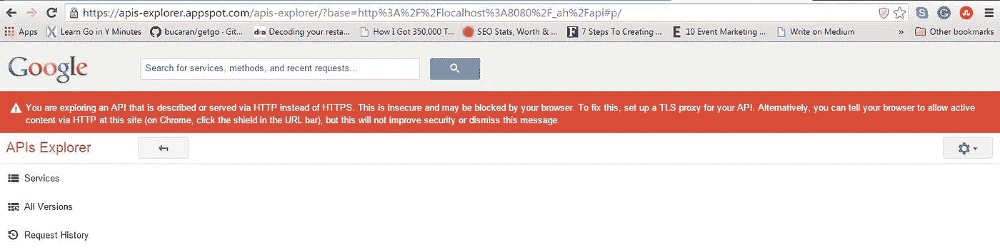
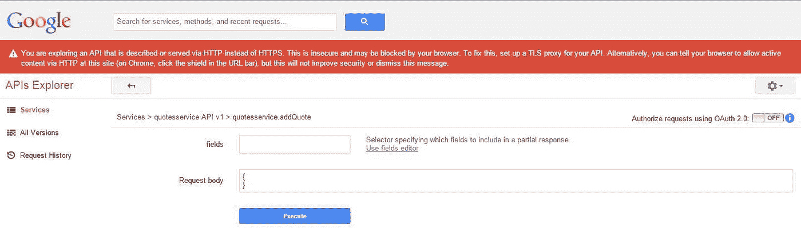
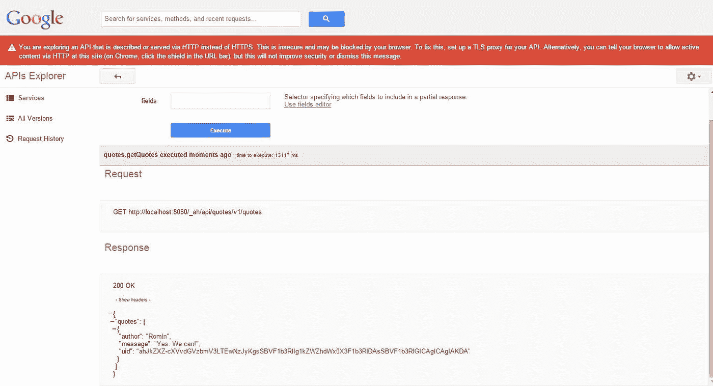

# Go、云端点和应用引擎

> 原文：<https://medium.com/google-cloud/go-cloud-endpoints-and-app-engine-64d1c78bea82?source=collection_archive---------2----------------------->

## 第三部分

*   在 [**第一部分**](/@IndianGuru/go-cloud-endpoints-and-app-engine-19d290dafda3) 中，我们谈到了 API、谷歌云端点和谷歌应用引擎。
*   在 [**第二部分**](/@IndianGuru/go-cloud-endpoints-and-app-engine-e3413c01c484) 中，我们下载了 SDK 并为 Google App Engine 构建了一个小应用程序。

在我们开始本教程的第 3 部分**之前，我们需要了解 Go 的模板、表单和 App Engine 的数据存储。**

**提示** *:如果您是新手，您需要先阅读并运行以下文章中的示例:*

*   [了解 Go 的模板包](/@IndianGuru/understanding-go-s-template-package-c5307758fab0)
*   [Go 的网络表单和 App Engine 的数据存储](/@IndianGuru/go-s-web-forms-and-app-engine-s-datastore-d7c9ad97decb)

我广泛引用了以下文章。

感谢:

*   [谷歌的围棋教程](https://cloud.google.com/appengine/docs/go/gettingstarted/introduction)为其应用引擎。
*   罗明·伊拉尼关于生成报价 API 的想法。我们的目标是编写一个公共 API，允许我们管理名人名言。引语是一个名人说的一句著名的或哲学的话。
*   [go-Endpoints](http://godoc.org/github.com/GoogleCloudPlatform/go-endpoints)—Package“Endpoints”将允许您在 Go 中编写云端点后端。
*   弗朗切斯克·坎波伊的聚合物地鼠。

我们在第 1 部分中提到 [Google Cloud Endpoints](https://github.com/GoogleCloudPlatform/go-endpoints) 是 Google 的一个解决方案，由工具、库和功能组成，允许您从 Google App Engine 应用程序生成 API 和客户端库，称为 API 后端(即*它帮助您为 App Engine 应用程序*创建公共 API)，以简化客户端对其他应用程序数据的访问。

此外，我们的目标是编写一个公共 API，允许我们管理名人名言。引用是一个名人说的著名的/哲学的话。

# 为 Go 安装云端点

请参考 Go 的[云端点的文档。这个包可以让你在 Go 中编写云端点后端。](https://github.com/GoogleCloudPlatform/go-endpoints)

使用 Go App Engine SDK 中的 [goapp 工具](http://blog.golang.org/appengine-dec2013)获取包:

```
c:\go_appengine>goapp get github.com/GoogleCloudPlatform/go-endpoints/endpoints
```

**提示**:如果你之前已经安装了端点，更新一下是有意义的。添加"-u "参数以获取更新版本，即

```
go get -u github.com/GoogleCloudPlatform/go-endpoints/endpoints
```

[文档](https://github.com/GoogleCloudPlatform/go-endpoints)说:

> 现在，您会看到一些错误，这没关系，不要担心！

**包端点用法**

```
import “github.com/GoogleCloudPlatform/go-endpoints/endpoints”
```

包“端点”将让您在 Go 中编写云端点后端。

# **声明描述数据的结构**

Go Endpoints 有自己的[字段标签](https://github.com/GoogleCloudPlatform/go-endpoints/wiki/Field-tags)“Endpoints ”,您可以使用它让您的客户端知道什么是服务方法数据约束(在输入上):

*   “请求”是指“必需的”。如果该值等于该类型的零值，验证将失败。
*   默认值“d”不能与“req”一起使用。

# **服务**

我们将有一个“quotesService ”,此时有两个方法，即“Add”和“List”。

**添加方法**

数据存储实体是存储单元，与一个键相关联。

我们在每个报价实体上设置相同的父关键字，以确保每个报价都在同一个实体组中。跨单个实体组的查询将是一致的。将实体放入新的不完整键下的数据存储中将导致为该实体生成唯一键。

**列表方法**

“List”返回所有现有报价的列表。

**向云端点注册 QuotesAPI】**

让我们将上述两个服务作为可发现的 API，并利用云端点擅长的所有有趣的东西。

在“init()”方法中，我们将向云端点注册“QuotesAPI ”,如下所示:

阅读[注册服务文档](http://godoc.org/github.com/GoogleCloudPlatform/go-endpoints/endpoints#Server.RegisterService)。

“RegisterService”向服务器添加新服务，其中名称为“quotesService”，版本为“v1”，描述为“Quotes API”，默认值为 true。

**登记列表并添加方法**

```
info := api.MethodByName(“List”).Info()
```

[MethodByName](http://godoc.org/github.com/GoogleCloudPlatform/go-endpoints/endpoints#RPCService.MethodByName) 返回注册服务的方法的 ServiceMethod 或 nil。 [RpcService](https://github.com/rwl/go-endpoints/blob/master/endpoints/service.go#L30) 表示向特定服务器注册的服务。[信息](http://godoc.org/github.com/GoogleCloudPlatform/go-endpoints/endpoints#RPCService.Info)返回一个[服务信息](http://godoc.org/github.com/GoogleCloudPlatform/go-endpoints/endpoints#ServiceInfo)，用于构造端点 API 配置。

**开始处理云端点请求**

```
endpoints.HandleHTTP()
```

这里是关于 [HandleHTTP](http://godoc.org/github.com/GoogleCloudPlatform/go-endpoints/endpoints#Server.HandleHTTP) 的文档。

**goendpoint.go —完整程序**

该文件存储在文件夹中:“$ GOPATH/src/github . com/satish talim/quotes new”

**app . YAML 文件**

该文件存储在文件夹中:“$ GOPATH/src/github . com/satish talim/quotes new”

现在是启动开发 web 服务器并使用 API Explorer 的时候了。

从“$ GOPATH/src/github . com/satish talim”目录运行以下命令，编译您的应用程序并启动开发 web 服务器:

```
goapp serve quotesnew/
```

web 服务器现在正在运行，监听端口 8080 上的请求。

在您的浏览器中使用 API 浏览器，网址为:

```
[http://localhost:8080/_ah/api/explorer](http://localhost:8080/_ah/api/explorer)
```

您应该会看到这样的屏幕:



浏览器屏幕

点击地址栏中的盾牌，点击“加载不安全脚本”。

一段时间后，您应该会在“服务”旁边看到“quotesservice API”。

点击“quotesservice API”，应该会看到“quotes.addQuote”和“quotes.getQuotes”。

接下来，点击“quotes.addQuote ”,弹出如下所示的屏幕:



报价. addQuote

点击“使用字段编辑器”，在弹出的屏幕上选择“作者”和“消息”，然后点击“关闭”。

接下来，点击“请求正文”字段，选择“添加一个属性”“作者”，输入你的作者的名字，说“Romin”。接下来，“添加一个属性”“消息”和输入报价说“是”。我们可以！”点击“执行”按钮两次。恭喜你。已创建报价。

最后，点击“quotesservice API”，选择“quotes.getQuotes”。点击“使用字段编辑器”,点击“全选/无”,点击“关闭”按钮。接下来点击“执行”按钮。您应该会看到您刚刚输入的报价，如下所示:



getQuote

你现在可以将应用程序部署到 appspot.com 的[、http://myapp.appspot.com 的](http://appspot.com)、T2 的。使用[浏览器](https://myapp.appspot.com/_ah/api/explorer)添加并列出报价。

**练习**:作为练习，实现该服务的“更新”和“删除”方法。参考官方 [Go 数据存储 API](https://cloud.google.com/appengine/docs/go/datastore/) 。

**额外**:你可以在这里引用[生成可以和你的 API 交互的客户端库](https://github.com/GoogleCloudPlatform/go-endpoints#generate-client-libs)。

对于 JavaScript API，推荐的方式是使用 [Google JS API](https://cloud.google.com/appengine/docs/python/endpoints/consume_js) 。Javascript 教程[解释了如何构建一个使用 API 的 web (JavaScript)客户端。](https://cloud.google.com/appengine/docs/java/endpoints/getstarted/clients/js/)

罗明·伊拉尼的笔记:

> 您将需要使用核心 JavaScript $。ajax 调用 GET、PUT、POST、DELETE 方法来访问端点，或者使用第三方 JavaScript 库(如 jQuery / REST 库)来处理我们已经公开的端点。如果您不想使用标准的 Google JS 客户端 API，您仍然可以自己访问端点。

如果有人没有使用 Google JS 客户端 API 编写简单的客户端，请告诉我。

注:我很希望你能对这些学习笔记提出反馈意见。如果我能让它变得更好，我会喜欢它！