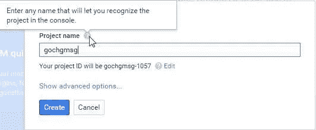

# Go、云端点和应用引擎

> 原文：<https://medium.com/google-cloud/go-cloud-endpoints-and-app-engine-e3413c01c484?source=collection_archive---------1----------------------->

## **第二部分**

在[第 1 部分](/@IndianGuru/go-cloud-endpoints-and-app-engine-19d290dafda3)中，我们讨论了 API、谷歌云端点和谷歌应用引擎。

**序言**:因为这篇文章是为新手开发者准备的，所以下面两篇文章会很有用:

*   [下载并安装 Go 及其工具](/@IndianGuru/downloading-and-installing-go-and-its-tools-b7431936d30b)
*   [Go 代码组织](/@IndianGuru/go-code-organization-8d185b115c20)

# 下载并安装 App Engine SDK for Go

要开始在 Go 中开发 Google App Engine 应用程序，您首先需要[下载](https://cloud.google.com/appengine/downloads)(针对您的操作系统)并设置 App Engine Go 软件开发工具包(SDK)。

接下来，按照下载页面上的说明在您的计算机上安装 Go App Engine SDK。我在我的 Windows 7 桌面上安装了 Go 应用引擎 SDK 到“C:\go_appengine”。

Go App Engine SDK 可以在任何运行 Python 2.7 的基于英特尔的 Mac OS X、Linux 或 Windows 电脑上运行。如有必要，从 [Python 网站](http://www.python.org/download/)下载并安装适用于您平台的 Python 2.7。大多数 Mac OS X 用户已经安装了 Python 2.7。如果您对 Python 工具有疑问，请确保您安装了 Python 2.7。

Go App Engine SDK 包括一个模拟 App Engine 环境的 web 服务器应用程序，包括本地版本的数据存储、Google Accounts，以及使用 App Engine APIs 直接从您的计算机获取 URL 和发送电子邮件的能力。

稍后，我们将使用 Go App Engine SDK 中的以下两个命令:

*   [goapp serve](https://cloud.google.com/appengine/docs/go/tools/devserver) —用于运行本地开发服务器
*   [goapp 部署](https://cloud.google.com/appengine/docs/go/tools/uploadinganapp) —用于将您的应用上传至应用引擎

您可以在“C:\go_appengine”目录中找到这些命令。为了简化开发和部署，考虑将这个目录添加到您的 **PATH** 环境变量中。

**提示**:设置**路径**时，确保“C:\go_appengine”在“C:\go\bin”之后，即应该类似于**PATH = C:\ go \ bin；c:\ go _ app engine；…** 这确保了我们使用原始 go 安装中的“go”命令，而不是 Go 应用程序引擎中的“Go”命令。

## 让我们在本地构建一个小应用程序(mytext.go)

本地开发环境允许您开发和测试完整的 Go App Engine 应用程序，然后再向外界展示。让我们写一些代码。

Go App Engine 应用程序通过与 Go 的 [http 包](http://golang.org/pkg/net/http/)兼容的 web 服务器与外界通信。这使得编写 Go App Engine 应用程序非常类似于编写独立的 Go web 应用程序。

让我们从实现一个向用户显示短消息的小应用程序开始。

## 编程 mytext.go

在文件夹“$ GOPATH/src/github . com/satish talim”中创建文件夹“mytext”。用您的 GitHub id 替换“SatishTalim”。

接下来，在“mytext”文件夹中，创建一个名为“mytext.go”的文件，并赋予它以下内容:

这个 Go 包通过发送包含消息“Hello。这是我们为谷歌应用引擎开发的第一款 Go web 应用！”

**注**:

*   当编写一个独立的围棋程序时，我们会将这段代码放在“main”包中。Go App Engine 运行时提供了一个特殊的“主”包，因此您应该将 HTTP 处理程序代码放在您选择的包中(在本例中为“mytext”)。
*   为了处理一些打印功能，我们导入了包 [fmt](http://golang.org/pkg/fmt/) 。
*   App Engine Go API 使用标准 http 包作为 Go 程序和 App Engine 服务器之间的接口。因此，对于 web 相关的 http 功能，我们导入包 [http](http://golang.org/pkg/net/http/) 。其中的任何函数都称为“http.function_name”。
*   在“init”函数中，我们将任何传入的请求重定向到处理函数。我们通过调用 [http 来实现。HandleFunc](http://golang.org/pkg/net/http/#HandleFunc) 并向其传递两个参数——第一个是传入 URL 的一部分，第二个是能够处理它的方法。
*   函数处理程序接受一个“http。ResponseWriter”和一个“http。请求”作为其论据。
*   当用户连接时，程序用一个发送回浏览器的文本来响应。“http。ResponseWriter”值组装 HTTP 服务器的响应；通过写入它，我们将数据发送到 HTTP 客户端。
*   一个“http。“请求”是表示客户端 HTTP 请求的数据结构。
*   请求的所有参数都可以通过参数“http。请求”。您可以获得 URL、输入值和其他详细信息。

## 创建配置文件

一个 App Engine 应用程序有一个名为“app.yaml”的配置文件。此外，这个文件告诉 App Engine 服务使用哪个运行时，以及哪些 URL 应该由我们的 Go 程序处理。

在“$ GOPATH/src/github . com/satish talim/my text”目录中，创建一个名为“app.yaml”的文件，其内容如下:

从上到下，该配置文件说明了该应用程序的以下内容:

*   应用程序标识符是“helloworld”。当您稍后向 App Engine 注册您的应用程序时，您将选择一个唯一的标识符，并更新该值(稍后我们将更新该值)。这个值可以是开发过程中的任何值。现在，让它设置为“helloworld”。
*   这是该应用程序代码的版本号 1–0。您的应用程序版本信息可以包含字母数字字符和连字符。如果您在上传应用程序软件的新版本之前对此进行了调整，App Engine 将保留以前的版本，并允许您使用管理控制台回滚到以前的版本。
*   这段代码运行在 go 运行时环境中，API 版本为“go1”。
*   对路径与正则表达式/匹配的 URL 的每个请求。*(所有 URL)应该由 Go 程序处理。“_go_app”值是开发 web 服务器识别的神奇字符串；生产应用程序引擎服务器会忽略它。

给定应用程序的所有 Go 包都构建在一个可执行文件中，请求调度由 Go 程序本身处理。这就是为什么我们称之为“http。HandleFunc”来将我们的处理程序与 web 根目录(“/”)关联起来。但是，您仍然可以使用“app.yaml”文件来配置服务于静态文件或需要特殊权限的路径。

有关配置选项的完整列表，请参见 [Go 应用配置页面](https://cloud.google.com/appengine/docs/go/config/appconfig)。

## 测试应用程序

现在，您可以使用 Go App Engine SDK 附带的 web 服务器来测试您的应用程序。应用程序的目录应该包含文件“mytext.go”和“app.yaml”。

从“$ GOPATH/src/github . com/satish talim”目录运行以下命令，以编译您的应用程序并启动开发 web 服务器:

```
goapp serve mytext/
```

web 服务器现在正在运行，监听端口 8080 上的请求。通过在 web 浏览器中访问以下 URL 来测试应用程序: [http://localhost:8080/](http://localhost:8080/) 。关于运行开发 web 服务器的更多信息，包括如何改变它使用的端口，参见[开发服务器参考](https://cloud.google.com/appengine/docs/go/tools/devserver)。

## 迭代开发

开发应用服务器知道如何观察文件中的变化。当你更新你的源代码时，它会重新编译它们并重新启动你的本地应用。不需要重启“goapp 发球”。

*立即尝试*:

*   让 web 服务器保持运行，然后编辑“mytext.go”以更改“Hello。这是我们为谷歌应用引擎开发的第一款 Go web 应用！”去做别的事情。重新加载 [http://localhost:8080/](http://localhost:8080/) 以查看更改。
*   让 web 服务器保持运行，然后编辑“mytext.go”以更改“fmt。Fprint”改为“Fprint”。观察控制台中的错误。现在把“Fprint”改回“fmt。Fprint”并观察控制台。

若要关闭 web 服务器，请确定“终端”窗口是活跃的，然后按下 Control-C 键(或适用于您的控制台的“break”键)。

您现在拥有了一个完整的 Go App Engine 应用程序！你现在就可以部署这个简单的程序，并与世界各地的用户分享。

# 将您的应用上传到 Google 的应用引擎

## 注册应用程序

你现在需要有一个谷歌账户。如果您没有谷歌帐户，您可以使用电子邮件地址和密码创建一个[谷歌帐户](https://www.google.com/accounts/)。

您可以从位于[URL](https://console.developers.google.com/?_ga=1.81727902.809453384.1440214181)的开发者控制台创建和管理 Go App Engine 应用程序。

要创建新的应用程序，请单击“创建项目”按钮。弹出如下图所示的屏幕:



创建项目

输入“gochgmsg”作为项目名称。它创建了一个惟一的项目 ID，在我们的例子中是“gochgmsg-1057”。

我们选择使用免费的“appspot.com”域名。这样，应用程序的完整 URL 将是 http://gochgmsg-1057.appspot.com/的。

编辑“app.yaml”文件，然后将 application: setting 的值从“helloworld”更改为“gochgmsg-1057”。

## 上传并访问应用程序

要上传您的应用程序，请从文件夹:" $ GOPATH/src/github . com/satish talim "中键入:

```
goapp deploy mytext/
```

如果看到编译错误，修复源代码并重新运行“go app deploy”；在编译成功之前，它不会启动(或更新)您的应用程序。

> **罗明·伊拉尼说**:用户在部署应用程序时可能会面临的一个问题是——如果你有多个谷歌账户，并且你当前登录的默认账户不是包含应用程序引擎项目的账户，那么“goapp 部署”将会失败，并显示错误“该应用程序不存在..< appid >等。不幸的是，唯一的办法是默认帐户是拥有 App Engine 应用程序的帐户，或者您必须使用“appcfg.py”命令来设置 no_cookies，等等。并再次进行部署。

## 访问您的应用

您现在可以看到您的应用程序在 App Engine 上运行。我们的[消息应用](http://gochgmsg-1057.appspot.com/)正在运行，您可以访问和查看。

*恭喜恭喜！您刚刚在 Google App Engine 上成功发布了您的第一个 Go web 应用程序，让全世界都可以看到！！*

**注释**:我希望您能对这些学习笔记提出反馈意见。如果我能让它变得更好，我会喜欢它！

在 [**第三部分**](/@IndianGuru/go-cloud-endpoints-and-app-engine-64d1c78bea82) 中，我们使用谷歌端点编写了一个程序。