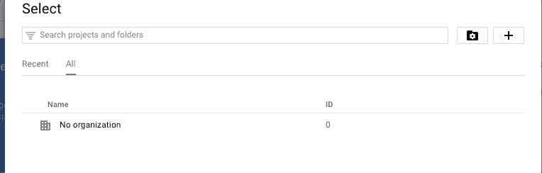
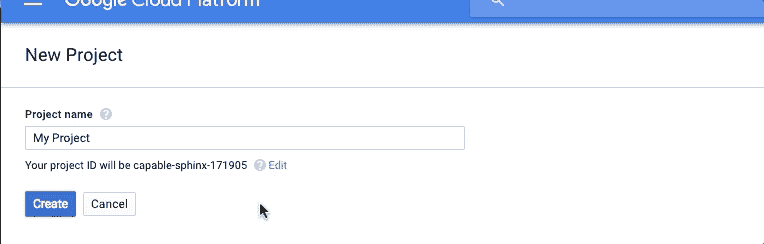
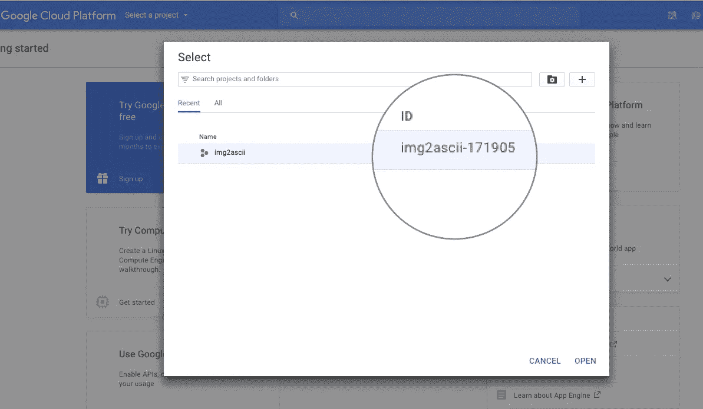
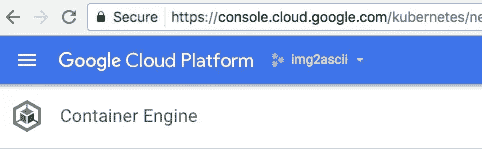
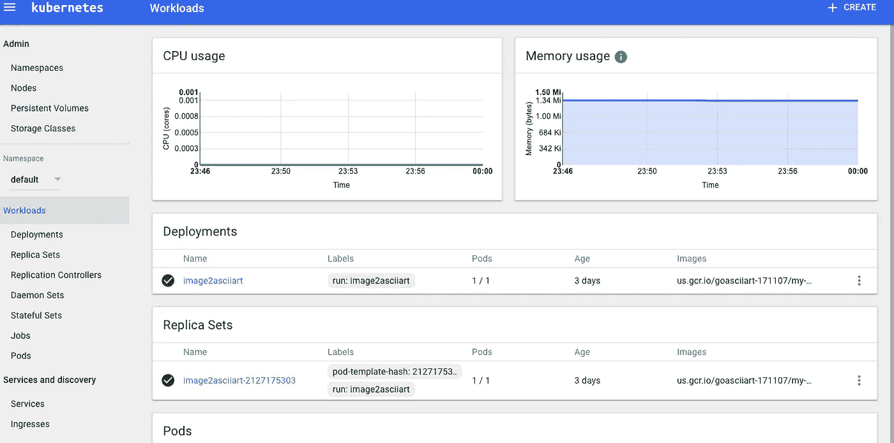

# Go，Docker，Google Cloud:微服务指南

> 原文：<https://medium.com/google-cloud/go-docker-google-cloud-a-microservice-howto-c4f3b50910f?source=collection_archive---------0----------------------->


说今天的软件工程师“一点点”喜欢微服务，就像说人们“一点点”喜欢巧克力培根一样。微服务对互联网系统的作用就像函数调用对汇编的作用一样:抽象而不丧失功能。

在过去的几年里，一系列幸运的技术出现了，使得 MS 成为可能，或者至少变得更加容易。Docker 是最大的一个。其他人可以发动圣战，所以我会保持中立。我写我知道的，好吗？

我们将使用一个简单的 MS 示例，该示例使用 Docker、Go 和 Google Cloud Platform 从上传的图像生成 ascii art。

去叉([https://github.com/rockviper/img2asciiart](https://github.com/rockviper/img2asciiart))，让我们开始吧！:D

# Go 专为微服务打造

在 UNIX 上写 C 是上帝的意图，但是使用 Docker 映像既有趣又不太正统，所以你只需要付出最少的代价。让我们去吧！

Go 是由 Google 编写的，它解决了很多像 Google 这样的公司会面临的问题:大量易于构建和部署的可扩展软件。构建围棋程序比用 C/C++更容易。没有复杂的链接。合作舞蹈是一个梦想。

这里是一个非常基础的，简单化的微服务。在端口 8080 上监听时，提供一条路径并输出结果。

```
**package** main

**import** (
       **"fmt"
       "net/http"
       "image"** _ **"image/jpeg"** _ **"image/gif"
       "image/color"
       "github.com/nfnt/resize"
       "bytes"
       "reflect"
       "log"
       "strconv"** )

**func** handler(w http.ResponseWriter, r *http.Request) {

       **if** r.Method == **"POST"** {
              dimension, err := strconv.Atoi(r.URL.Path[1:])
              **if** err != nil {
                     dimension = 80
              }
              **if** (dimension > 256) || (dimension < 0) {
                     dimension = 256
              }
              file, _, err := r.FormFile(**"uploadfile"**)
              **if** err != nil {
                     fmt.Println(err)
                     **return** }

              **defer** file.Close()
              img, _, err := image.Decode(file)
              **if** err != nil {
                     log.Print(err)
                     **return** }
              fmt.Fprintf(w, **"%s"**, 
                     Convert2Ascii(ScaleImage(img, dimension)))
       }
}

*// https://github.com/stdupp/goasciiart* **var** ASCIISTR = **"MND8OZ$7I?+=~:,.."** *// https://github.com/stdupp/goasciiart* **func** ScaleImage(img image.Image, w int) (image.Image, int, int) {
       sz := img.Bounds()
       h := (sz.Max.Y * w * 10) / (sz.Max.X * 16)
       img = resize.Resize(uint(w), uint(h), img, resize.***Lanczos3***)
       **return** img, w, h
}

*// https://github.com/stdupp/goasciiart* **func** Convert2Ascii(img image.Image, w, h int) []byte {
       table := []byte(ASCIISTR)
       buf := new(bytes.Buffer)

       **for** i := 0; i < h; i++ {
              **for** j := 0; j < w; j++ {
                     g := color.GrayModel.Convert(img.At(j, i))
                     y := reflect.ValueOf(g).FieldByName(**"Y"**).Uint()
                     pos := int(y * 16 / 255)
                     _ = buf.WriteByte(table[pos])
              }
              _ = buf.WriteByte(**'\n'**)
       }
       **return** buf.Bytes()
}

**func** main() {
       http.HandleFunc(**"/v1"**, handler)
       http.ListenAndServe(**":8080"**, nil)
}
```

# 建立码头工人形象

您应该注意到 github 存储库是这样安排的。

```
.
├── Dockerfile
├── README.md
└── image2asciiart.go
```

构建 docker 映像就像这样简单

```
docker build -t us.gcr.io/goasciiart-171107/my-golang-app .
```

通常，docker 构建的目录结构在其自己的目录中会有一个 docker 文件。这是由[设计的](https://docs.docker.com/engine/reference/builder/)

> `<src>`路径必须在构建的*上下文*内；您不能使用`ADD ../something /something`，因为`docker build`的第一步是将上下文目录(和子目录)发送到 docker 守护进程。

您可以使用`-f`选项指向另一个目录。

```
.
├── README.md
├── build
│   ├── Dockerfile
│   ├── asdf.exe
│   └── data/
├── node.py
└── tests
```

您可以在本地运行 docker 映像:

```
docker run -it -p 8080:8080 --rm --name my-running-app us.gcr.io/goasciiart-171107/my-golang-app
```

并进行测试，发出 curl 命令，如下所示:

```
$ curl -F "uploadfile=@wilder.jpg" localhost:8080/
I=77$I$7$Z$$ZZZI:.:=77$OZ8DNN8O88
$+7$$777$Z$$OOZ$?,,+7$ODNM88DOO88
OZOOOOZZ$ZOO8OZZ$$$7$O8D888D8OON8
OZZZ$$77$$$I???+++++??II77$$$$OND
++++++=IODNI+?+??IIIII77$$$ZZZO8D
I???????ZOOIII????III777777$$$Z$$
?++?+?++I8D8$?+=IOZ????III777$$$Z
IIIIIIII7OMMN$IZDNZI77IIII7$7$$77
II77III7I$$$7I$ZZOO7Z$?I7I7??I777
77I$I77777777$$ZOOZ77777$$77$ZZ$7
7$77777777777I777$7777777I777$$$$
$$77$77777777$$7777$77$777777$$$Z
77777$Z$$$$$$$777$$7$$7777$ZZ$ZZZ
$
```

注意，`-F`选项用于提交一个带有参数`uploadfile`的表单对象。

# 谷歌计算云

AWS 感觉像一个中国的地方，还卖朋友鸡和披萨。菜单到处都是；开始时很有趣，但五年后，它变得势不可挡。AWS 是你向除你自己之外的所有人推荐的地方。AWS:一个在被观察到之前在技术上不迟钝的平台。我看着谷歌计算云环境，我认为未来会很好。

# gcloud 命令行工具

首先:[安装`gcloud`实用程序](https://cloud.google.com/container-builder/docs/quickstarts/gcloud)。与我们已经习惯的其他 cli 工具相比，gcloud 更容易与 GCP 交互。

GCP 在“项目部”工作。这使得资源被分割。如果您将 docker 图像上传到错误的项目，其他项目不一定会看到它。



创建项目


最终你会得到一个项目。



记下这个数字

你看到突出显示的`img2ascii-171905`代码了吗？**记下它**。

我们还需要一些活动部件。

# Docker 计算机注册表

还记得我们构建 docker 映像的时候吗？我们需要用一种特殊的方式来标记它。GCP 希望这样。

```
docker build -t us.gcr.io/img2ascii-171905/my-golang-app .
```

我们现在需要将 docker 映像推送到 Google cloud

```
gcloud docker — push us.gcr.io/goasciiart-171107/my-golang-app
```

# 库伯内特斯

Kubernetes 是让 Docker 图像集群在云中运行的主要方式，不管是不是谷歌的云。谷歌的产品叫做*谷歌容器引擎*。



Kubernetes 的 Google talk

# 创建容器引擎集群

使用`gcloud`创建集群非常简单。

`gcloud config set compute/zone us-central1-b`

创建默认配置的容器集群将导致 3 个新的虚拟机实例运行。这些**会让你破费。**

`gcloud container clusters create img2ascii`

`gcloud auth application-default login`

`kubectl run img2ascii-node --image=gcr.io/google-samples/node-hello:1.0 --port=8080`

预先警告一下，负载均衡器**实际上会让你多花**钱****

`kubectl expose deployment img2ascii-node --type="LoadBalancer"`

`kubectl get service img2ascii-node`

您应该会看到在`EXTERNAL-IP after a few seconds.`下列出了一个外部 IP

# **临时演员**

问:我的 API 没有暴露在外部环境中。

答:如果您尝试重新运行 *curl* 命令，但没有得到输出或挂起响应，可能发生的情况是您告诉 kubernetes 运行它找不到的图像。

运行`glcoud projects list`查看是否创建了其他项目，然后使用`gcloud config set project img2ascii-171905`将您想要的项目设置为默认项目。您应该能够重新运行`kubectl run`命令。

**问:我怎样才能看到 Kubernetes 控制台？**

答:运行以下命令

`gcloud containers get-credentials img2ascii`

`kubectl proxy`

你应该能够浏览到`localhost:8001/ui`并看到仪表板



**问:安全性如何？**

答:这是一个演示。别被黑了，好吗？