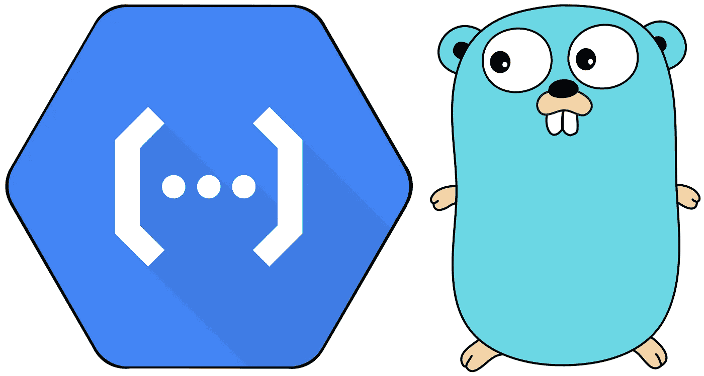

# Go 功能框架

> 原文：<https://medium.com/google-cloud/go-functions-framework-120ace237fe2?source=collection_archive---------0----------------------->



谷歌云功能+ Go(上田拓也的 Logo—[src](https://github.com/golang-samples/gopher-vector))

在本帖中，您将了解开源 Go Functions 框架，该框架使您能够在您的计算机上开发 Golang Google Cloud 函数，并将它们部署到云中。

那么，为什么 Go Functions 框架如此重要呢？嗯，它使…

*   💻**Go 中谷歌云功能的本地测试**
*   🔢**Google Cloud 上应用代码的透明版本管理**
*   🌐**一次编写，随处运行:**云功能，云运行，其他云

就我个人而言，我非常喜欢如何轻松地使用`localhost`来测试我的功能。

## 设置您的环境

在我们开始之前，让我们首先确保我们运行在相同的环境中。使用以下命令打印您的 go 版本:

```
go version
```

输出应该是 Go 1.11 或者更高。如果没有，通过卸载并重新安装 Go 来更新 Go:[https://golang.org/dl/](https://golang.org/dl/)

然后，让我们为名为`hello`的函数创建一个新目录:

```
mkdir -p hello/cmd
cd hello
```

创建 Go 模块:

```
go mod init example.com/hello
```

用以下内容创建一个`function.go`文件(任意包名):

一个简单的“你好”包裹。

为我们的`main`包创建一个包含文件`cmd/main.go`的文件夹`cmd`,内容如下:

我们的`main program that starts the Function Framework.`

这个文件使用 Go Functions 框架来启动我们的函数。

## 测试

使用以下命令在本地测试您的函数:

```
go run cmd/main.go
```

您的 Google Cloud 功能现已在本地运行。你可以卷曲你的函数来调用你的函数:

```
curl localhost:8080
```

您将看到输出:

```
Hello, Functions Framework!
```

厉害！

## 部署到 Google 云功能

要部署到 Google Cloud 功能，请运行以下命令:

```
gcloud functions deploy HelloWorld --runtime go111 --trigger-http
```

大约 2 分钟后，您将看到如下所示的 URL:

> https://us-central 1-my-project . cloud functions . net/hello world

您可以通过访问您的 URL 来调用该函数。

从命令行，这个脚本将获得 URL 和`curl`您的函数:

```
curl $(gcloud functions describe HelloWorld --format 'value(httpsTrigger.url)')
```

缺德！😄

您刚刚在计算机上测试了 Go 功能，然后部署到理论上可以扩展到每 100 秒 100，000，000 个请求的 Google Cloud 上([🔗](https://cloud.google.com/functions/quotas))。

如果你想跟踪更新，或者了解更多，请查看 GitHub repo:[https://GitHub . com/Google cloud platform/functions-framework-go](https://github.com/GoogleCloudPlatform/functions-framework-go)

## 感谢阅读

你可能也会对这篇博文和视频感兴趣:

*   [🖊️jbd 为 Go 介绍谷歌云功能](/google-cloud/google-cloud-functions-for-go-57e4af9b10da)
*   [📹Eno 和 Angela(+可爱的地鼠)介绍 Go 对函数的支持](https://www.youtube.com/watch?v=RbnyUpVRq_4)