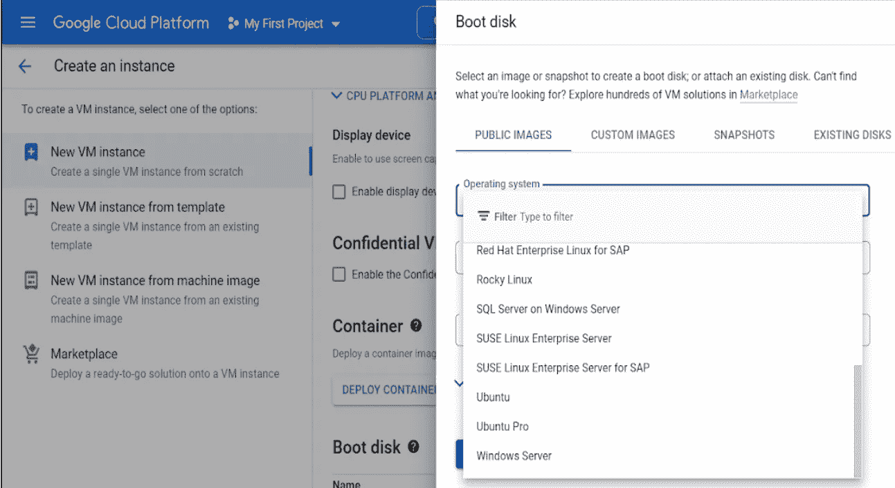
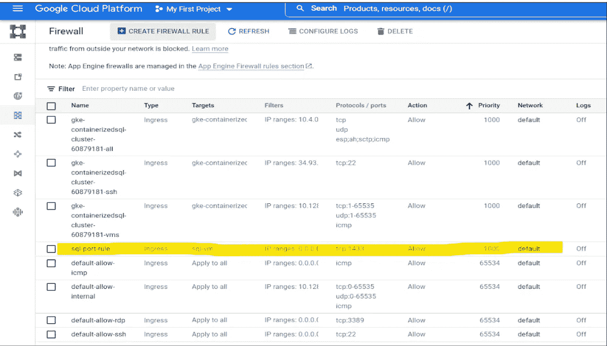
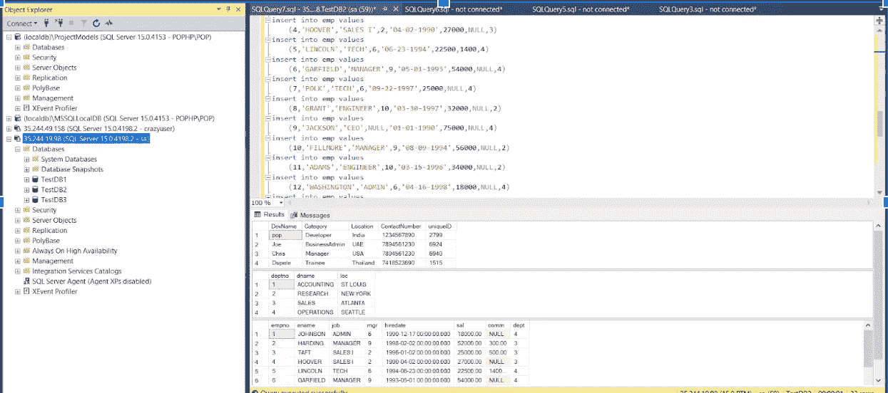
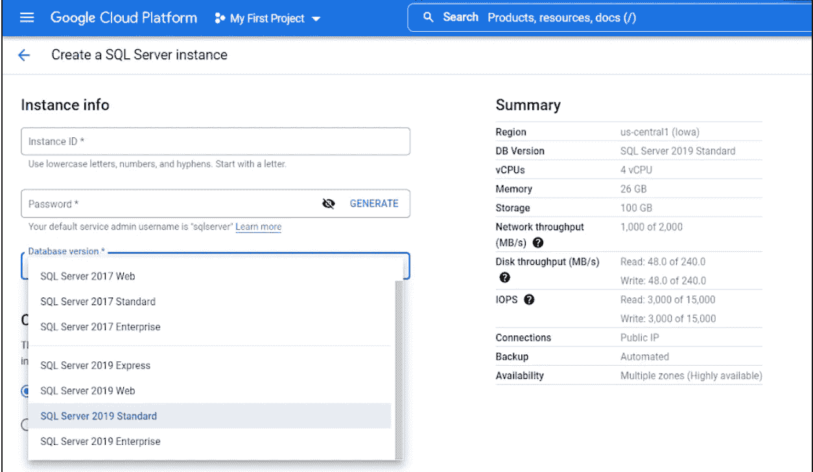
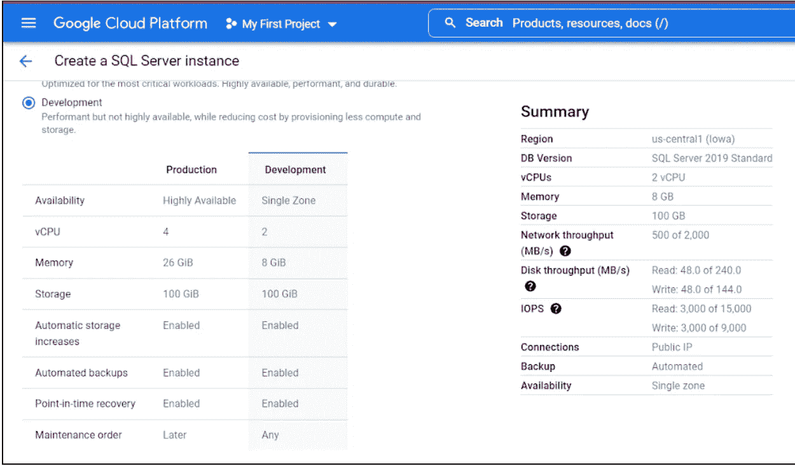
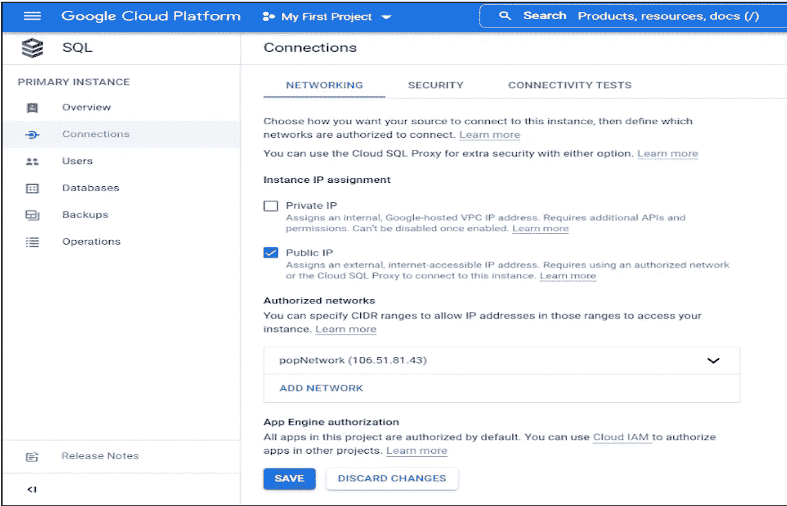
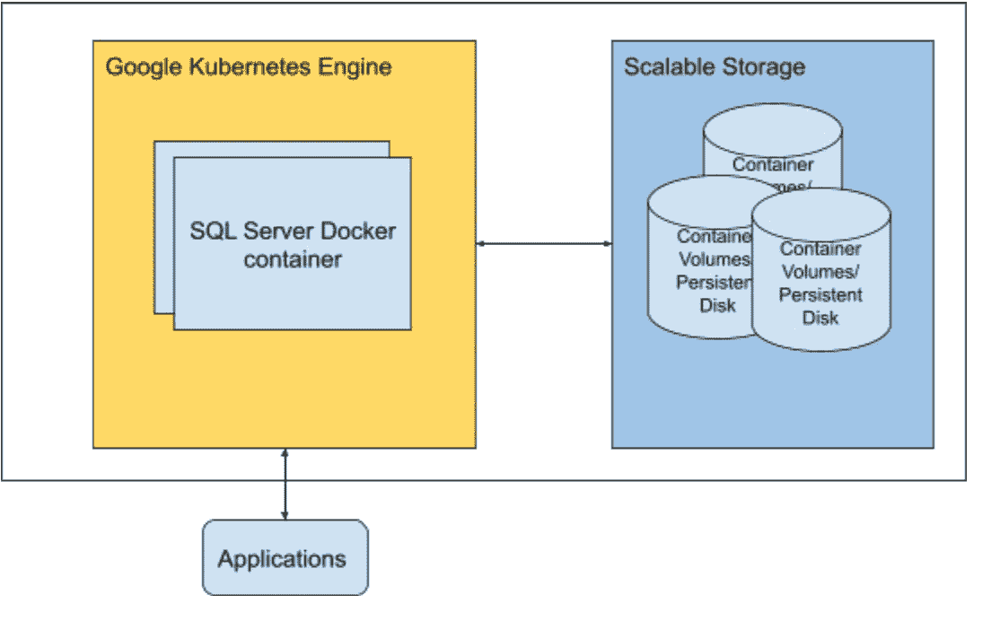
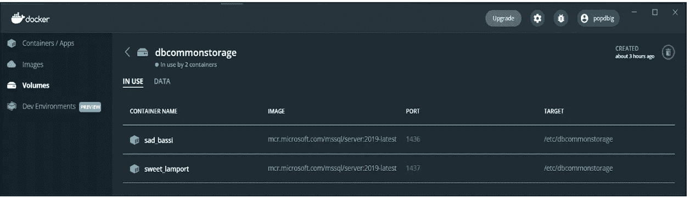

# 使用 SQL Server 实现云:Google 云选项

> 原文：<https://medium.com/google-cloud/going-cloud-with-sql-server-google-cloud-options-6cd44bb52bef?source=collection_archive---------0----------------------->

*本博客由* [***和***](/@pop.dbig)*【(pop.dbig@gmail.com】*共同撰写和发表

嗨伙计们！这一切都是关于使用 GCP 选项将 SQL Server 迁移到云，这是一个很长的争论:)请坚持到最后，以获得有趣的结论并参与后续步骤…

G 云计算、向云迁移、云上的数据和向云的集成、云的存在——这些是我们这些天听到的关于数据管理或处理应用的词汇。这仅仅意味着组织正在将其数字资产全部或部分转移到云中。这也可能意味着从一个云迁移到另一个云。“云计算”的诸多优势，仅举几例:

1.  消除运营开销
2.  卓越的灵活性和敏捷性(因为易于部署、无前期成本、无基础架构维护/成本、经济实惠)
3.  经济高效(只为您使用的东西付费)
4.  可量测性
5.  监控等

这个博客包含了在 GCP 上托管 SQL Server 的概念。以下解决方案的设计重点是可伸缩性、迁移工作和易维护性。

# 在云上托管 SQL Server 的方法

*   *计算引擎中的 SQL Server*
*   *针对 SQL Server 的云 SQL*
*   *使用 Docker 容器/持久存储*

# 1.计算引擎中的 SQL Server

*   部署和配置类似于传统的内部数据库基础架构
*   通过这种方式进行设计，可以利用垂直扩展、持久磁盘/预定义机器、负载平衡(如果我们要使用多实例数据库设计)

## 所需的虚拟机最低规格

内存:4GB
处理器:x64，2.0GHz
存储:最低 6GB

*   服务器故障可能是由以下原因造成的
*   计算 SLA 99.99%(多区域)正常运行时间和单实例 99.5%
*   设计不良的虚拟机(由个人选择的配置)可能会导致 SQL Server 性能不佳
*   预迁移成本和设计规划至关重要
*   计算引擎实例的价格因配置而异，如果我们在配置时不知道详细的设计，我们可能会付出更多
*   资源利用不足/过度利用也是可能的

**POC —计算引擎中的 SQL Server**

**步骤:**

*   ***GCP 控制台>导航菜单>计算引擎> VM 实例>创建实例***
*   我们可以选择基于 Linux 或 Windows 的启动映像，因为 SQL Server 可以在两种操作系统中运行
*   如果我们希望通过 GUI 工具 RDP 到虚拟机并维护 SQL Server，可以使用桌面友好的 windows 虚拟机
*   在启动菜单上，我们可以从各种操作系统中进行选择，包括(但不限于)，
    Ubuntu
    Windows Server(许可证需单独购买)
    Windows Server 上的 SQL Server(许可证需单独购买)

启动盘创建:选择操作系统

*   创建虚拟机(对于 POC，我们选择了基于 Linux 的 Ubuntu(18.04)，因为它是免费的)
*   一旦创建了一个虚拟机，SSH 进入虚拟机并更新包管理器，然后安装 SQL Server
*   要安装 SQL Server，必须在虚拟机上运行以下命令集:

https://packages.microsoft.com/keys/microsoft.asc|须藤 apt-key add -

sudo add-apt-repository " $(wget-qO-https://packages . Microsoft . com/config/Ubuntu/18.04/MSSQL-server-2019 . list)"

sudo apt-get 更新→更新软件包管理器

sudo apt-get Install-y MSSQL-Server→安装 SQL Server

sudo /opt/mssql/bin/mssql-conf 设置→配置 SQL Server

*   防火墙必须配置为允许虚拟机实例的 SQL Server 端口(默认端口-1433)上的传入连接

注意:我们可以通过使用网络标签将防火墙规则添加到特定的虚拟机

*   现在，我们可以在 SSMS 和其他工具中使用公共 IP 和 SQL 用户凭据连接到 SQL Server
*   数据库创建、DAC 文件部署、数据库备份都已经过测试，工作正常，没有任何问题

注意:DAC 文件是数据层应用程序，它是整个数据库模型的压缩文件，包括表、视图、实例对象、用户登录等对象。

使用 SSMS 通过客户端计算机连接 GCP 虚拟机实例上的 SQL Server

## 使用案例:

*   当数据库管理团队习惯于传统的数据库管理方式，而数据库管理员尚未采用云生态系统时，建议使用这种类型的 SQL Server 部署
*   这是我们获得基于 GUI 的服务器管理工具(windows VM)的最简单的方法

**最佳实践:**

1.  如果您只是为开发/测试环境创建一个临时服务器，那么不推荐使用这种方法。请注意，这个选项会带来相对较高的操作开销
2.  对于开发/测试环境，我们建议使用 Linux 操作系统、Docker 上的 SQL Express/SQL 容器映像。这样我们可以降低许可成本
3.  确保你有完整的设计，包括技术细节，如数量，时间表，交易等。在配置此选项之前已计划好

# **2。用于 SQL Server 的云 SQL**

Cloud SQL for SQL Server 是一项托管数据库服务，可帮助您在 Google Cloud 上设置、维护、管理和管理您的 SQL Server 数据库。

*   云 SQL 是来自 GCP 的完全托管的 SQL 服务器
*   此外，CloudSQL 是 Google 推荐的最佳实践，而不是在计算引擎中部署 SQL Server，因为它真正体现了迁移到云的好处，并减少了数据库的任何管理
*   不到 5 分钟，我们就可以创建云 SQL 并迁移现有数据库，还可以自动扩展
*   最多可添加 96 个处理器内核、超过 624 GB 的 RAM 和 64 TB 的存储空间

**步骤:**

*   **T3【GCP】控制台>导航菜单> SQL >创建实例 **
*   根据需要选择 SQL Server 版本和其他配置

*   可以从预定义的开发人员/生产实例配置中选择 SQL 实例

*   此外，SQL 实例计算大小和内存是可定制的

*   创建实例后，我们可以通过生成的公共 IP 连接到 SQL Server

**注:**

*   默认情况下，CloudSQL 会阻止来自外部 IP 的连接，因此我们必须将客户机或 web 应用程序 IP 添加到授权的网络中
*   请确保添加 ipv4 和公共 IP，私有 IPv4 将会出错
*   授权公共网络有一些例外情况，请参考本产品文档了解详情:[https://cloud . Google . com/SQL/docs/MySQL/authorize-networks #限制](https://cloud.google.com/sql/docs/mysql/authorize-networks#limitations)
*   我们可以通过使用内置的数据库认证来认证用户

*   一旦配置完成，我们就可以像连接本地 SQL 服务器一样连接到 CloudSQL Server
*   **连接**可由以下人员授权

面向 Java 和 Python 的云 SQL 身份验证代理和云 SQL 连接器库
自管理 SSL/TLS 证书
授权网络

*   **SQL 连接**可以使用 sqlcmd、SSMS、Azure data studio、OLEDB 等。
*   **访问控制**可以在两个级别限制对数据库的访问——实例级和数据库级

实例级是您连接到云 SQL
的任何客户端的访问授权。数据库级是使用服务器级角色访问您实例中的数据

*   **数据驻留**、本地化和隐私指的是关于数据的物理位置和当地法规对您的数据的要求。云 SQL 通过 3 种方式帮助您应对数据驻留的挑战:

存储数据:配置数据的存储位置(使用区域配置)
加密数据:控制加密密钥的存储位置(使用客户管理的加密密钥)
访问数据:控制对数据的访问(使用访问批准、透明和密钥访问调整方法)

*   **使用脚本、DAC 包和备份文件创建数据库**可以在云 SQL 实例中完成
*   一些基本的****SQL Server 功能**如数据库创建/删除、数据库备份、用户管理可以在 *GCP 控制台*本身完成，但不推荐，有许多 SQL Server 管理员工具可供选择**

## **最佳实践:**

*   **在配置和部署 SQL Server 之前，请确定数据负载的容量**
*   **尽可能使用较小的云实例，而不是大型的整体实例**
*   **观察数据库表的数量对实例响应时间的影响**
*   **使用连接池进行高效的资源管理**
*   **几笔小交易胜过一笔大交易**

# ****3。使用 Docker 容器****

*   **微软在 docker Hub 中提供了基于容器的 SQL Server for Linux 的官方 Docker 镜像**
*   **我们可以提取该映像并立即启动 SQL Server 实例**
*   **我们还可以备份现有的数据库，并用这些备份创建一个 docker 映像，这样创建的所有容器都将复制相同的数据，而无需任何额外的同步和迁移**
*   **容器存储不是持久的，所以我们必须为数据库使用容器卷/外部存储(持久磁盘),否则我们必须设计数据库的自动备份/恢复**

****

*   **对不同的 SQL Server 实例使用相同的外部存储在理论上也是可行的。这可以使 SQL Server 更加可靠，并且可以横向扩展，从而最大限度地减少云开支**
*   **我们还可以通过各种方法(SSMS、sqlcmd、VS 代码和其他数据分析工具)以最少的工作量连接到容器外部的 SQL Server**

## **需求(linux 容器)**

**内存:2 GB
文件系统:XFS 或 EXT4
磁盘空间:6 GB
处理器速度:2 GHz
处理器内核:2 核
处理器类型:仅兼容 x64**

*   **通过使用 GKE 和可伸缩的持久存储来编排容器，我们可以在 Google cloud 上设计一个抗故障的、高度可用的 SQL Server**

****

**上图显示了两个不同的 SQL 容器，它们使用相同的容器卷(持久存储)但端口不同(1436/1437)，因此我们也可以使用 GKE 对 SQL Server 进行负载平衡**

## **码头集装箱的缺点:**

1.  **理论上，我们可以在几分钟内在网络存储或本地存储中创建多个具有相同配置的 SQL Server，但 SQL 数据库文件和 SQL Server 实例是按 1:1 的比例映射的，因此在同一存储中跨多个实例不会横向扩展数据库**
2.  **我们可以在不同的机器上(甚至在 Google 云计算引擎中)轻松复制容器化的 SQL Server 实例(不是实时的，而是基于快照的)及其数据，我们必须为每台机器配置端口设置和防火墙规则，以便进行远程访问**
3.  **与 CloudSQL 相比，运营开销很高，运营成本不可预测**

# **判决**

**在本博客中提出的 3 个选项中，云 SQL 被证明是最简单、最省力、最快和可靠的方法，其 99.95%的正常运行时间百分比 SLO、灵活的组件式定价结构(1。CPU 和内存，2。存储和网络，3。许可)，它高度可扩展到高达 64 TB 的可用存储容量，并能够根据需要自动增加存储大小！！**

# **下一步是什么？**

**为什么不回到上面的选项，自己试试，如果有想法/建议，随时联系/评论？**

**作为跟进，给这些后续阅读更多的乐趣:**

1.  **云 SQL 库和示例:[https://cloud . Google . com/SQL/docs/SQL server/admin-API/Libraries](https://cloud.google.com/sql/docs/sqlserver/admin-api/libraries)**
2.  **使用谷歌云部署多区域灾难恢复[https://Cloud . Google . com/architecture/deploying-Microsoft-SQL-server-Multi-Regional-Disaster-Recovery](https://cloud.google.com/architecture/deploying-microsoft-sql-server-multi-regional-disaster-recovery)**
3.  **https://www.linkedin.com/in/abiramisukumaran
    [https://www.linkedin.com/in/kppnesh](https://www.linkedin.com/in/kppnesh)联系我们**