# Google Analytics 数据传输到 BigQuery

> 原文：<https://medium.com/google-cloud/google-analytics-data-transfer-to-bigquery-fad388ae646a?source=collection_archive---------4----------------------->

**简介**

**在 BigQuery 中获取网站访客信息。**

在本文中，我们将了解如何将实时数据从 google analytics 转移到 BigQuery。使用谷歌分析，我们可以跟踪访问我们网站的访问者的数据，访问者浏览器，访问者位置等。

**步骤 1** 创建样本网站。

1.  转到[https://sites.google.com](https://sites.google.com/new)

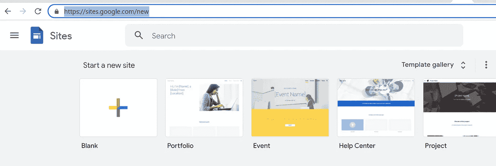

2.创建示例网站。

3.添加自定义域名到您的谷歌网站(可选)

设置>自定义域

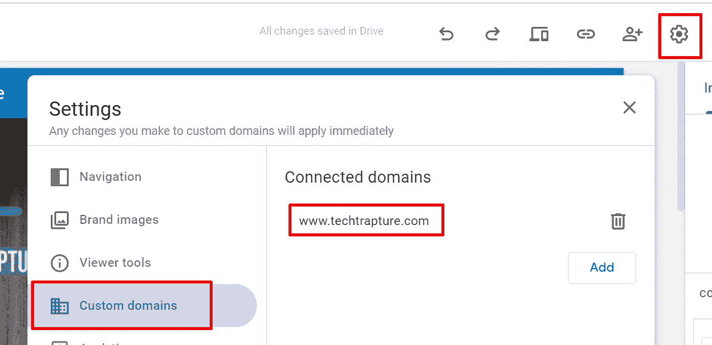

**步骤 2——创建谷歌分析账户**

**第 3 步——在谷歌网站中添加谷歌分析跟踪 ID，以跟踪我们网站的流量。**

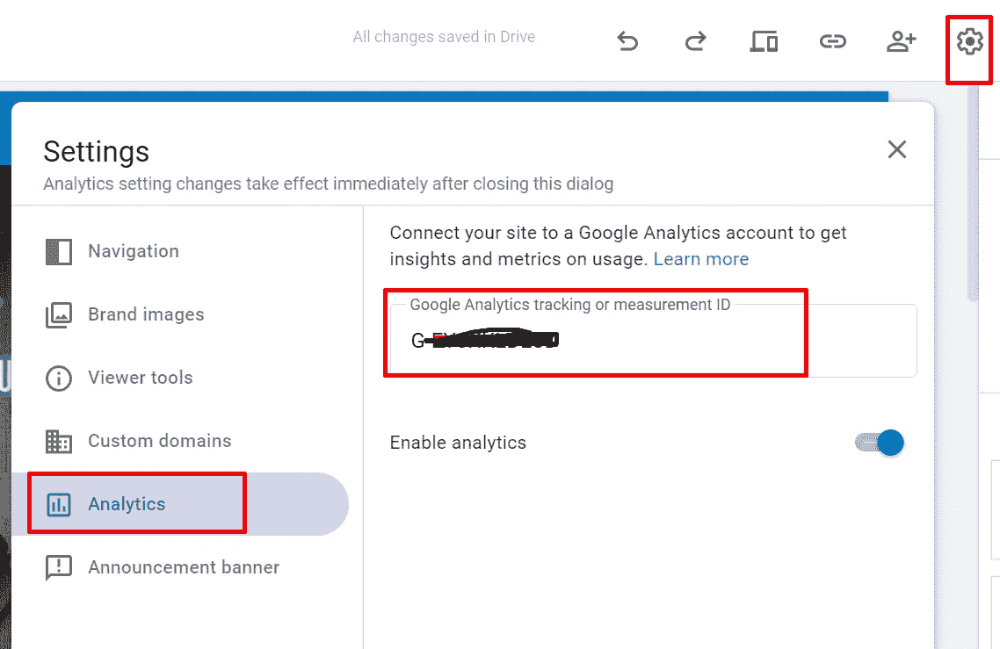

**步骤 4 验证显示数据的谷歌分析仪表盘**

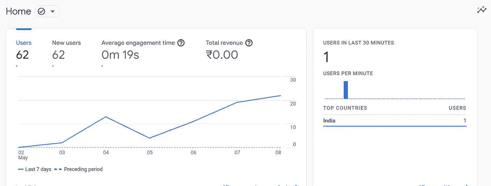

步骤 5 将数据传输到 Bigquery

1.  启用 **BigQuery 数据传输** API
2.  导航到谷歌分析的管理标签

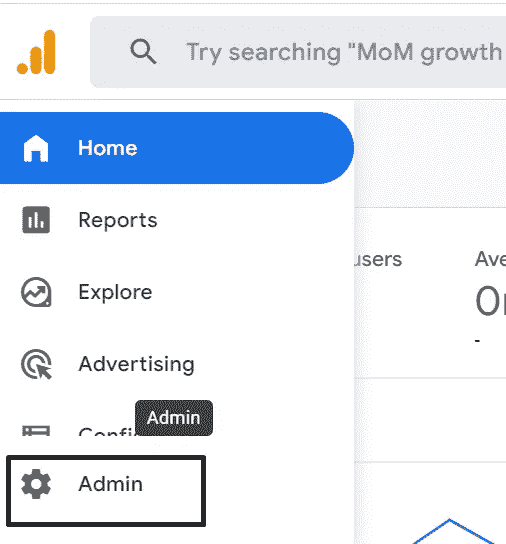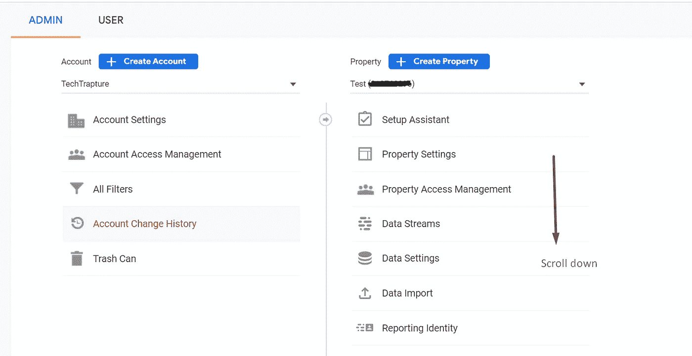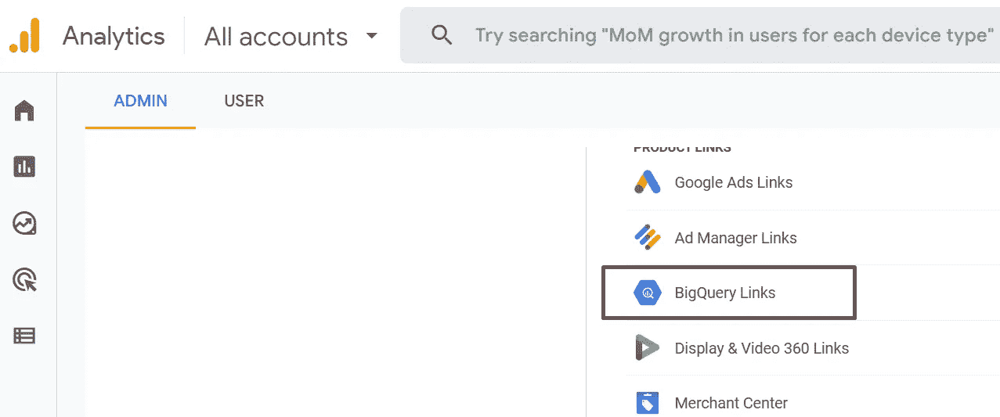

2.点击**大查询链接**

3.使用项目 Id 搜索并链接 Google Cloud Bigquery 项目。

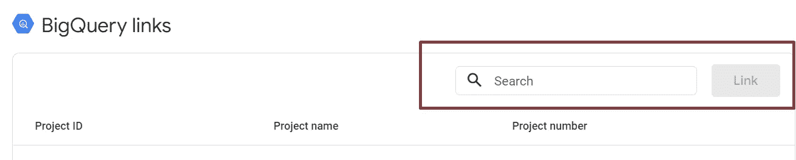

4.将频率配置为实时数据流。

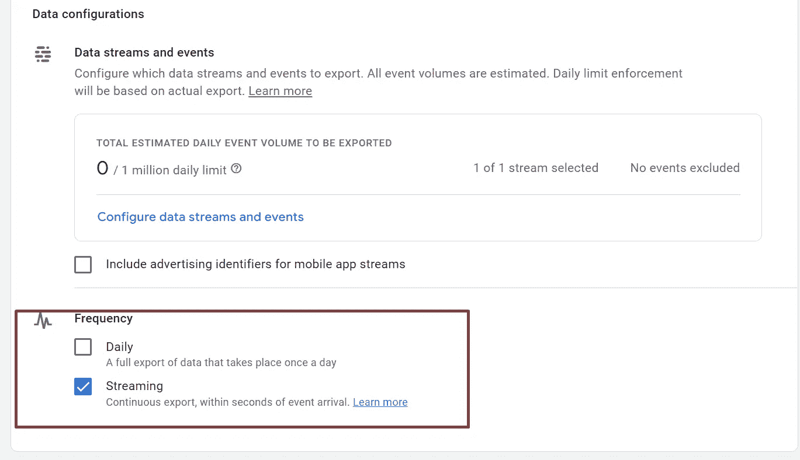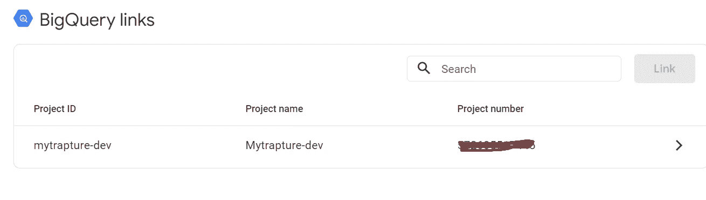

现在，所有与网站访问者和流量相关的数据都将开始加载到 BigQuery 中。

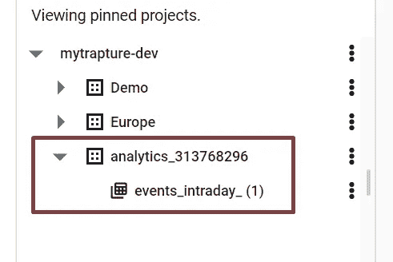

通过在 BigQuery 中运行查询来验证数据。

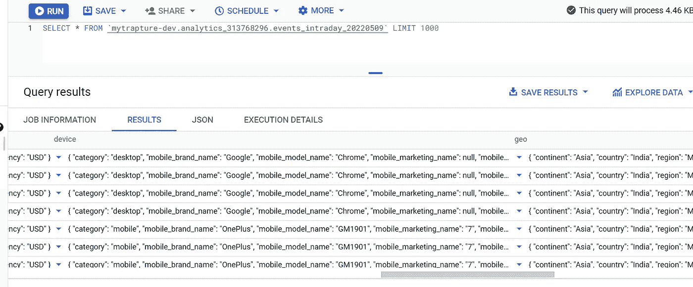