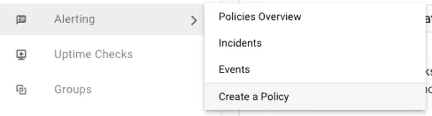
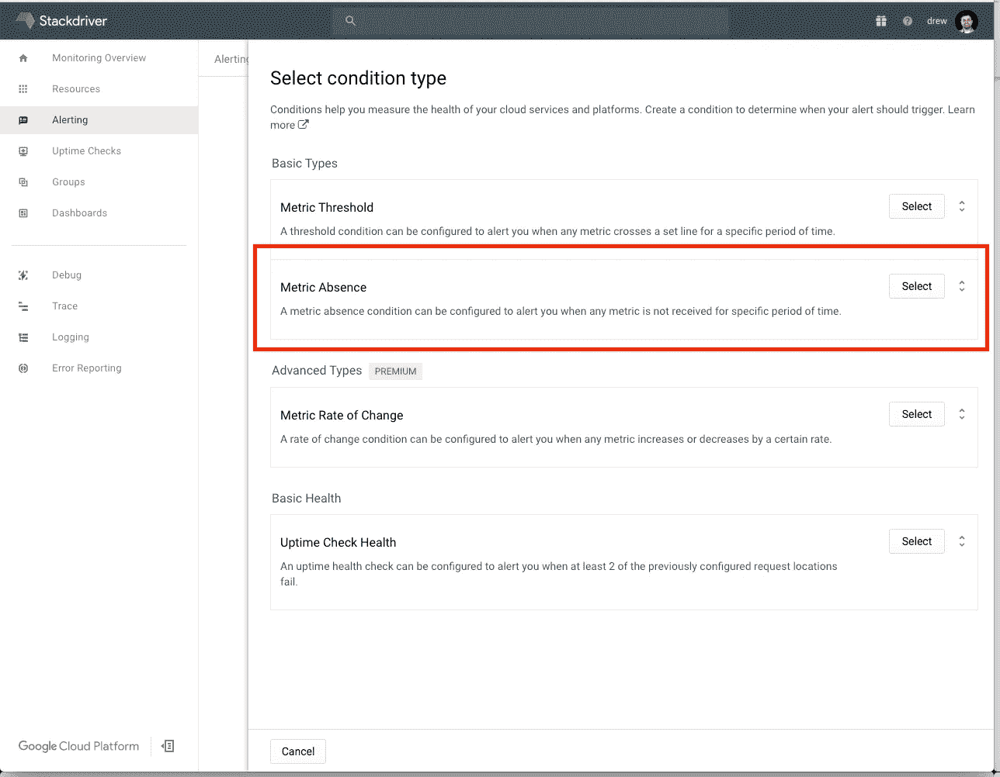
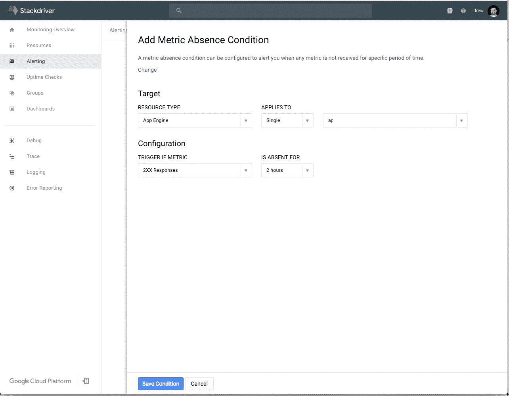
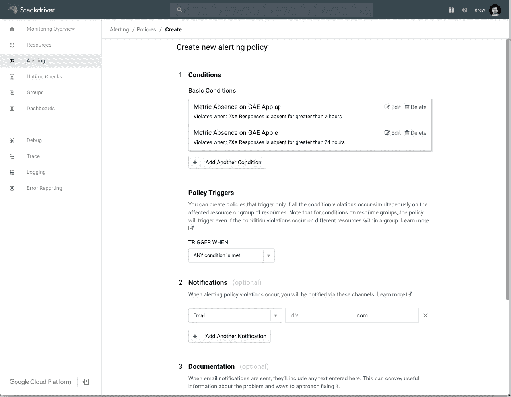
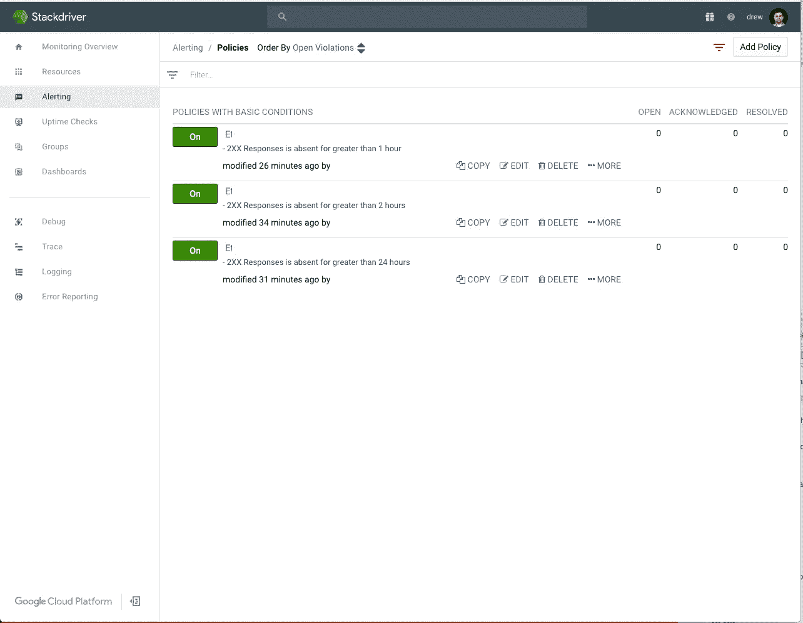

# 谷歌应用引擎 Cron 作业监控

> 原文：<https://medium.com/google-cloud/google-app-engine-cron-job-monitoring-bbf5c2ed6ca3?source=collection_archive---------0----------------------->

使用 Stackdriver 对 GAE Cron 作业进行简单监控

如果您在 GAE 编写 Cron 作业，您可能希望在作业本身之外添加对它们的监控。Stackdriver 提供各种监控功能，作为免费基础层的一部分，只需几秒钟即可完成设置。

这篇短文详细介绍了如何用免费的 Stackdriver 为 GAE 的 Cron 任务添加监控。

# 启用堆栈驱动程序

第一步是启用 Stackdriver，如果你还没有为你的谷歌计算平台(GCP)项目。前往 https://app.google.stackdriver.com/[的](https://app.google.stackdriver.com/)出发。该向导将引导您选择要启用的项目。

需要考虑两点:

1.  如果你有多个项目，我建议你创建一个**新的** GCP 项目，以一种合理的方式命名，以便能够在 Stackdriver 中对你的项目进行分组。Stackdriver 不允许任意的父命名，并重用您开始的项目([来吧 Stackdriver！](https://twitter.com/mediocrity/status/937727889646141440))。这有点烦人，但是只需点击几下或者一个 *gcloud* 命令就可以创建一个新的 GCP 项目。
2.  Stackdriver 会自动为您注册 30 天的高级层，30 天后会自动将您降级到基本层。你不必在这里做任何事情，这只是一个参考。我还没看到有什么办法可以禁用这种无用。

完成演练，跳过所有与 AWS、每日/每周报告等的连接。如果您愿意，可以在以后更改所有这些内容，这与添加监控无关。

# 创建警报策略

在左侧菜单中，选择**警报**选项卡和**创建策略**。

警报>创建策略

通过选择**添加条件**从顶部开始。对于我编写的 Cron 作业类型，最简单的方法是选择**度量缺失**。如果一切按预期进行，我通常编写的所有作业都将返回 HTTP **200** 响应，这似乎很常见。

度量缺勤>选择

在**目标>资源类型**下，选择**应用引擎**。您可以选择将此警报策略应用于该 Stackdriver 帐户中的单个项目或所有项目。就我个人而言，为了更精细的控制，我已经单独选择了每个项目。

度量缺勤配置

在我的情况下，没有 **2XX 响应**被认为是可报警的情况。还需要配置**缺席时间段**的选择。在我的例子中，对于这个特定的用例，作业每小时运行一次，在 2 小时时，我希望得到提醒(每小时+运行时间)。

> 多个 cron 任务:此时，您似乎无法区分在一个**项目下是否安排了多个 Cron 任务。也许来自 [Google Cloud](https://medium.com/u/4f3f4ee0f977?source=post_page-----bbf5c2ed6ca3--------------------------------) 的某个人会读到这篇文章并提交一个功能请求。非常感谢。:)**

如果通知相同，您可以将多个作业/项目的多个条件添加到单个策略中(以节省您的配置时间)。添加每个条件后，您需要选择一个**策略触发器**，设置一个**通知**方法(有很多选项！)，添加**文档**文本并**保存**策略。

警报策略配置

保存每个策略后，您将能够在“Alerting”>“Policies”页面上查看(和编辑)每个策略。

警报策略

# 鳍状物

就是这样！使用 Stackdriver 对 Google 计算平台上的 Google 应用引擎 Cron 作业进行快速、简单(且免费)的监控。说快 10 倍！