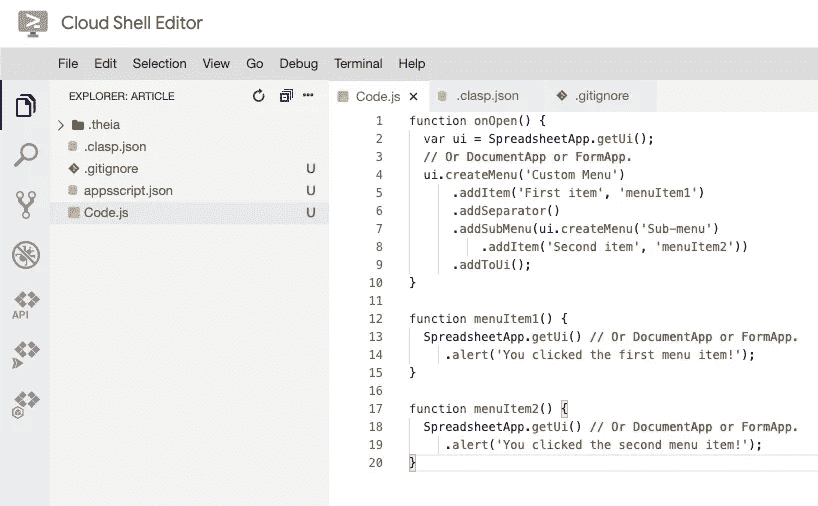
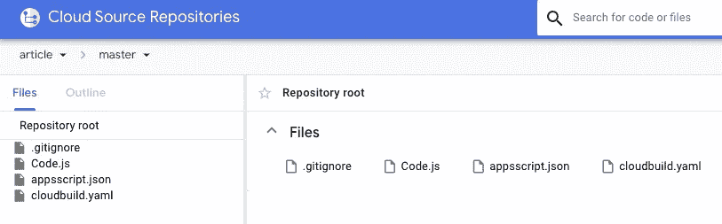
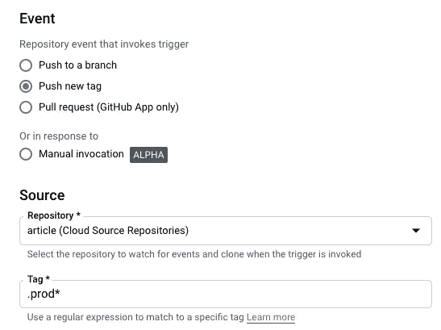
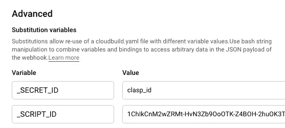
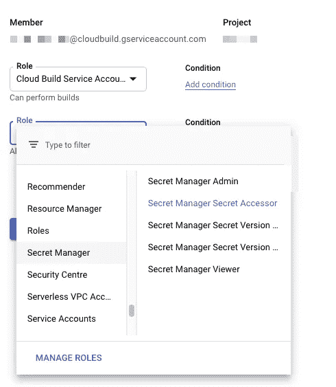
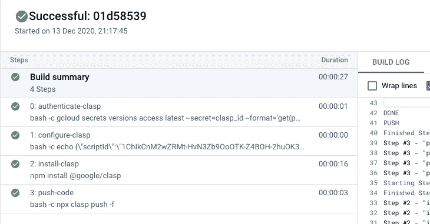

# 使用云构建的 Google Apps 脚本部署

> 原文：<https://medium.com/google-cloud/google-apps-script-deployment-with-cloud-build-d9d0abf7dcf8?source=collection_archive---------0----------------------->

Google Apps 脚本可以超越解决问题的简单脚本。在本文中，我将展示如何在企业环境中部署 Google Apps 脚本代码。我将分享实际的构建文件以及必要的步骤和工具来重现我的工作流。这种方法确实需要谷歌云平台知识和信用卡。这些说明是高层次的，本文不是代码实验室。如果你卡住了，留下评论，我会尽力协助和更新文章。


大卫·吉尔伯森在 [Unsplash](https://unsplash.com?utm_source=medium&utm_medium=referral) 上拍摄的照片

当我使用 Google Apps 脚本解决一个问题时，我会在三个工作流之间进行选择:

*   [最近更新了](https://workspaceupdates.googleblog.com/2020/12/google-apps-script-ide-better-code-editing.html)，Apps 脚本 IDE。
*   [Git](https://git-scm.com/) ，[扣子](https://github.com/google/clasp)和[云壳编辑器](https://shell.cloud.google.com/?show=ide&environment_deployment=ide)
*   [Git](https://git-scm.com/) ， [clasp](https://github.com/google/clasp) ，[云壳编辑器](https://shell.cloud.google.com/?show=ide&environment_deployment=ide)，[云源库](https://cloud.google.com/source-repositories)，以及[云构建](https://cloud.google.com/cloud-build)

新的应用程序脚本 IDE 非常棒。然而，它缺少企业环境所要求的一些特性，比如版本控制和持续部署(CD)。[云壳编辑器](https://cloud.google.com/blog/products/application-development/introducing-cloud-shell-editor)是一个巨大的进步。我强烈建议去 https://ide.cloud.google.com 试一试。Clasp 和 Git 已经安装在终端中。

但是我们谈论的是企业级，所以为什么要保持简单。事实上，使用 CD 有很多好处。当 CD 管道就位时，部署脚本、分离职责和支持代码的多个版本和实现就变得容易了。使用 Git 规定了版本控制，像[保存一个变更日志](https://keepachangelog.com/en/1.0.0/)和[制作一个自述文件](https://www.makeareadme.com/)这样的项目在这样的结构中是有意义的。

对我来说，使用 CD 最重要的好处是它能让我保持心态。它提供了一个环境，在这个环境中，我对在我的应用程序中创建小的增量更改感到自信和安全。播客:[The Pipeline:All things CD&CD Foundation](https://cd.foundation/podcast/)的 DevOps 播客很好地解释了这一点。

## 动手，我们如何设置它

我通常从资源库[https://source.cloud.google.com/](https://source.cloud.google.com/)开始。这将需要一个启用计费的 GCP 项目。一旦你创建了你的库，启动[https://ide.cloud.google.com](https://ide.cloud.google.com)。

打开终端并创建存储库的本地克隆。使用三个选项之一来克隆存储库。一旦存储库被克隆，您就可以将新目录作为工作区打开。


存储库屏幕

此时，您应该在工作区中打开一个空的存储库。下一步是获取 clasp 凭证。我们在云构建中需要这些凭证。在下面键入命令，并按照说明进行操作。使用您想要在云构建中使用的帐户进行授权。

```
clasp login --no-localhost
```

如果一切顺利，凭证保存在文件~/.clasprc.json 中，我们稍后会用到它。

## 谷歌表单

用 clasp 本身创建一个脚本是可能的，但是在这种情况下，我们将保持它的简单性并使用一个 Google Sheet。因此，在这一点上，创建一个谷歌表，并打开脚本编辑器。找到脚本 id，并在终端中键入以下命令:

```
clasp clone [script id]
```

创建。git 忽略文件并添加。theia 和. clasp.json .接下来将来自 Google Docs、Sheets、Slides 或 Forms 中的[自定义菜单的示例代码添加到 Code.js 文件中。](https://developers.google.com/apps-script/guides/menus#custom_menus_in_google_docs_sheets_slides_or_forms)



这是您应该在编辑器中看到的内容

现在我们需要创建 cloudbuild.yaml 文件:

所有代码现在都已就绪。在真实的实时部署中，一定要考虑[保留一个变更日志](https://keepachangelog.com/en/1.0.0/)和[制作一个自述文件](https://www.makeareadme.com/)。现在您可以提交代码了。Git 将要求您进行一些配置:

```
git config --global user.email "git@example.com"
git config --global user.name "Git Example"
```

推送代码并检查代码是否在存储库中



现在我们可以开始构建了。转到[云构建](https://cloud.google.com/cloud-build)并创建一个新的[触发器](https://console.cloud.google.com/cloud-build/triggers)。给触发器一个名称，并连接到正确的存储库。现在使用以下设置:



也添加替代变量，使用您自己的脚本 id。



在这一步中，我们将存储 clasp 的令牌。转到[秘密管理器](https://console.cloud.google.com/security/secret-manager)并创建一个新的秘密扣扣 id。秘密的值是. clasprc.json 文件的内容。

```
cat ~/.clasprc.json
```

云构建需要访问机密，找到服务帐户并在 [AIM](https://console.cloud.google.com/access/iam) 中分配角色 Secret Accessor:



## 深呼吸，快到了

这个装置中有许多活动部件。我们有一个谷歌表单、一个 Git 存储库、一个构建触发器和一个云秘密。当像 v1.0-prod 这样的标签被推送到 Git 存储库时，触发器将触发一个构建。构建将执行以下步骤:

*   通过将云秘密值推入. clasprc.json 文件来认证 clasp
*   用脚本 id 创建. clasp.json 文件
*   安装卡扣
*   将代码推送到脚本

因此，如果我们在终端中键入以下内容:

```
git tag v1.0-prod
git push origin v1.0-prod
```

如果一切顺利，你可以看到建设



## 包扎

仅仅是维护一些脚本，这看起来就有很多工作要做。如果这只是一个简单的脚本，请务必使用这个伟大的新编辑器。但是，如果不允许您访问该表呢？或者如果您想回滚更改？或者您是否希望同时部署 25 个工作表？

该解决方案适用于您需要一个流程来确保一致的部署流程的情况。如果需要的话，这也使得职责分离变得容易。假设您使用云存储库，那么只有存储库和构建触发器需要在同一个项目中。您可以通过在密码中存储多个 clasp 令牌来使用不同帐户的身份验证。

我希望这种方法能让你对 Google Apps 脚本和 GCP 的结合有所了解。如果您有任何问题，或者如果您在实现示例时遇到困难，请留下评论。