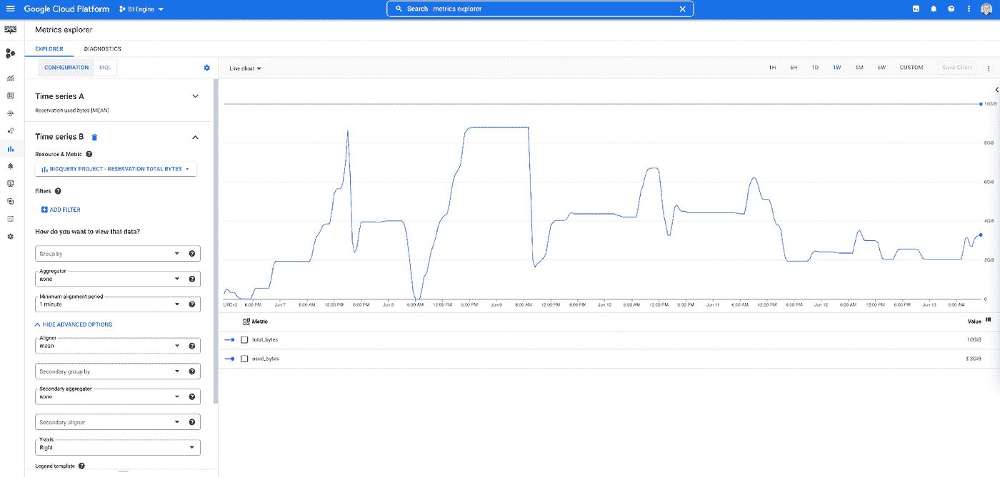
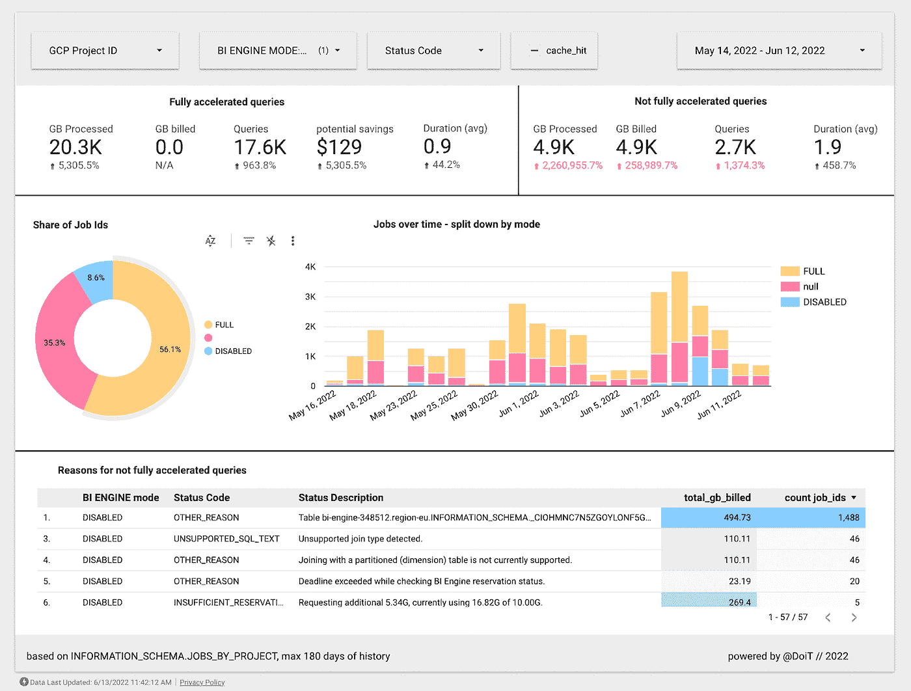
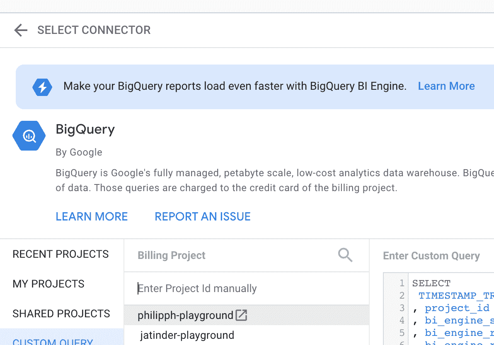

# Google BI 引擎统计仪表板

> 原文：<https://medium.com/google-cloud/google-bi-engine-statistics-dashboard-d210de6c5295?source=collection_archive---------0----------------------->

Google [BI Engine 现在已经普遍上市](https://cloud.google.com/blog/products/data-analytics/bigquery-bi-engine-generally-available)，并且已经被很多 DoiT 客户使用。客户在 Looker 上使用 BI 引擎，但也在 Tableau 等其他 BI 工具上使用。在 DoiT，我们使用商业智能引擎为[高级云成本分析](https://help.doit-intl.com/docs/cmp)平台向我们的客户提供亚秒查询。

然而，在监控 BI 引擎工作负载时，仍有一些工作要做。

在**云监控指标浏览器**中，您可以看到 BI 引擎预留的*利用率以及 BI 引擎预留*的总*大小。*

然而，这并不能说明有多少查询通过 BI Engine 得到了加速，更重要的是，为什么其他查询根本没有得到加速。BI 引擎或云控制台中也没有仪表盘来统计哪些进展顺利，哪些进展不顺利。

在撰写本文时，这些信息只能从大的查询信息模式中查询，具体来说就是从 [JOBS_BY_PROJECT 表](https://cloud.google.com/bigquery/docs/bi-engine-sql-interface-overview#acceleration_statistics_in_information_schema)或通过命令行(*bq show—format = pretty JSON-j job _ id*)。

然而，获得一些有价值的见解需要对数据以及 BI 引擎如何工作有更深入的理解。

因此，我们创建了一个易于使用的 [Data Studio 仪表盘来监控 BI 引擎工作负载。](https://datastudio.google.com/u/0/reporting/079ae1d2-0392-4c13-94a0-d05919dad3ac/page/gtyuC)

我们在这个仪表板中使用的查询可以在这里找到[。[3]](https://github.com/doitintl/bi-engine-statistics)

# 入门指南

# 先决条件

要创建仪表板并查询 INFORMATION_SCHEMA 表，用户必须能够访问以下 INFORMATION_SCHEMA 表:

信息 _ 模式。按项目列出的作业

# 数据源

1.1 复制该数据源
登录 Data Studio，创建以下数据源的副本。关于复制数据源的更多信息可在[这里](https://support.google.com/datastudio/answer/7421646?hl=en&ref_topic=6370331)找到。

1.2 设置正确的 GCP 计费项目
将此设置为您已经进行了 BI 引擎预订的项目

1.3 更改数据源:
在我们的示例中，我们使用了 region-eu，但是您可以将其更改为您选择的区域(BI 引擎容量保留的区域)。使用以下格式为 INFORMATION_SCHEMA 视图中的项目 id、区域和视图指定[区域性](https://cloud.google.com/bigquery/docs/information-schema-jobs#regionality):

` project _ id '` REGION-REGION _ name '. information _ SCHEMA。视角

# 仪表盘

2.1 复制仪表板
创建一个[公共仪表板](https://datastudio.google.com/u/0/reporting/079ae1d2-0392-4c13-94a0-d05919dad3ac/page/gtyuC)的副本。您将被要求选择一个新的数据源，您必须选择您在步骤 1 中复制的数据源。单击创建报告，并根据需要对其进行重命名。

2.2 更改仪表板
一旦复制了报告并且呈现了所有数据，更改报告页面中的任何日期选择器以使用您想要的时间段(例如:上周、过去 14 天、过去 28 天等)。