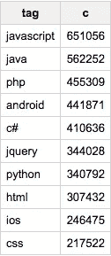

# Google BigQuery 公共数据集现在包括堆栈溢出问答

> 原文：<https://medium.com/google-cloud/google-bigquery-public-datasets-now-include-stack-overflow-q-a-5a8a7e371b52?source=collection_archive---------4----------------------->

2016 年 12 月 15 日星期四

*最初发表于*[*【cloud.google.com】*](https://cloud.google.com/blog/big-data/2016/12/google-bigquery-public-datasets-now-include-stack-overflow-q-a)*。*

**探索堆栈溢出数据中隐藏的趋势和关系是使用 BigQuery 进行 SQL 分析的一个很好的教训。**

好消息:我们刚刚将 Stack Overflow 的问答历史添加到 BigQuery 的公共数据集集合中。这意味着任何拥有谷歌云平台账户的人都可以使用 SQL 查询(或者其他一些[喜欢的工具](https://cloud.google.com/bigquery/partners/))来挖掘这个数据宝库。

您可以在[堆栈溢出数据文档页面](https://cloud.google.com/bigquery/public-data/stackoverflow)上找到一些示例查询，例如:

*   "这些年来有百分之多少的问题得到了回答？"
*   "栈溢出时不同任期的用户的声誉和徽章数是多少？"
*   " 10 个‘最容易’获得的金牌是什么？"
*   "一周中的哪一天一小时内回答的问题最多？"

以这些问题为起点，然后通过[reddit.com/r/bigquery](http://reddit.com/r/bigquery)与我们分享您的结果和疑问。如果您有任何问题，[请咨询堆栈溢出社区](http://stackoverflow.com/questions/tagged/google-bigquery)。

# 钻研数据

您可能想知道:用 BigQuery 查询堆栈溢出有什么特别之处？毕竟，Stack Overflow 已经向用户推荐了[Stack Exchange Data Explorer](https://data.stackexchange.com/stackoverflow/queries)(SEDE)，这是一个以数据为中心的网站，用户可以在这里分享和优先处理数千个问题——而且效果非常好。因此，让我们回顾一下在 BigQuery 中使用堆栈溢出数据的一些优点:

*   超过 50，000 行的限制。 [SEDE 最多只能输出 5 万行](http://varianceexplained.org/r/stack-lite/)。这对于 BigQuery 来说不是问题。
*   欢迎机器人。SEDE 保护自己免受滥用验证码，没有 API。使用 BigQuery 登录时不需要验证码，它的 REST API 允许各种工具利用它的强大功能。请随意将 Tableau、re:dash、Looker、R、pandas 和您最喜欢的工具连接到它。
*   加入一切。BigQuery 上有大量其他数据集共享，没有什么可以阻止你加载更多，无论是私人的还是公共的。想象一下你可以通过查询来回答这些问题？

我们来看一个加入的例子。我们在 BigQuery 上分享了[万亿字节的 GitHub 开源代码](/google-cloud/github-on-bigquery-analyze-all-the-code-b3576fd2b150#.jxn1zdfow)。让我们来看看 GitHub 代码中哪些是最常被引用的堆栈溢出问题——特别是 Javascript。

```
#standardSQL 
SELECT a.id, title, c files, answer_count answers, favorite_count favs, view_count views, score FROM `bigquery-public-data.stackoverflow.posts_questions` a JOIN ( SELECT CAST(REGEXP_EXTRACT(content, r'stackoverflow.com/questions/([0-9]+)/') AS INT64) id, COUNT(*) c, MIN(sample_path) sample_path FROM `fh-bigquery.github_extracts.contents_js` WHERE content LIKE '%stackoverflow.com/questions/%' GROUP BY 1 HAVING id>0 ORDER BY 2 DESC LIMIT 10 ) b ON a.id=b.id ORDER BY c DESC
```

以下是 GitHub 上 Javascript 代码中最常见的堆栈溢出问题:


或者，我们可以看看来自 GHTorrent(也在 BigQuery 上)的 GitHub 拉请求注释:

```
#standardSQL 
SELECT a.id, title, c files, answer_count answers, favorite_count favs, view_count views, score FROM `bigquery-public-data.stackoverflow.posts_questions` a JOIN ( SELECT CAST(REGEXP_EXTRACT(body, r'stackoverflow.com/questions/([0-9]*)/') AS INT64) id, COUNT(*) c FROM `ghtorrent-bq.ght.pull_request_comments` WHERE body LIKE '%stackoverflow.com/questions%' GROUP BY 1 ORDER BY 2 DESC LIMIT 10 ) b ON a.id=b.id ORDER BY c DESC
```

结果如下:


或者，我们来看看黑客新闻。自 2014 年以来，最受欢迎的问题标签是什么？

```
#standardSQL 
SELECT tag, SUM(c) c FROM ( SELECT CONCAT('stackoverflow.com/questions/', CAST(b.id AS STRING)), title, c, answer_count, favorite_count, view_count, score, SPLIT(tags, '|') tags FROM `bigquery-public-data.stackoverflow.posts_questions` a JOIN ( SELECT CAST(REGEXP_EXTRACT(text, r'stackoverflow.com/questions/([0-9]+)/') AS INT64) id, COUNT(*) c FROM `fh-bigquery.hackernews.comments` WHERE text LIKE '%stackoverflow.com/questions/%' AND EXTRACT(YEAR FROM time_ts)>=2014 GROUP BY 1 ORDER BY 2 DESC ) b ON a.id=b.id), UNNEST(tags) tag GROUP BY 1 ORDER BY 2 DESC LIMIT 10
```

以下是 2014 年以来链接自《黑客新闻》的堆栈溢出问题上最受欢迎的标签:


这与堆栈溢出的其余部分相比如何？

```
#standardSQL 
SELECTtag, COUNT(*) c FROM ( SELECT SPLIT(tags, '|') tags FROM `bigquery-public-data.stackoverflow.posts_questions` a WHERE EXTRACT(YEAR FROM creation_date)>=2014 ), UNNEST(tags) tag GROUP BY 1 ORDER BY 2 DESC LIMIT 10
```

黑客新闻社区似乎更关心 Haskell、C、C++和性能，而不是整体上的 Stack Overflow，Stack Overflow 在其最流行的标签中列出了 php、android、jquery 和 css:



# 后续步骤

如果你还没有尝试过 BigQuery，请跟随这个[初学者教程](https://www.reddit.com/r/bigquery/comments/3dg9le/analyzing_50_billion_wikipedia_pageviews_in_5/)，它展示了如何在 5 秒钟内分析 500 亿次页面浏览量。然后，您可以随意使用您喜欢的任何其他查询或数据集:例如，我们的官方[公共 BigQuery 数据集](https://cloud.google.com/bigquery/public-data/)，其他用户[共享的数据集](https://www.reddit.com/r/bigquery/wiki/datasets)，当然还有[您自己的](https://twitter.com/felipehoffa/status/761635507080081408)。

*原载于*[*cloud.google.com*](https://cloud.google.com/blog/big-data/2016/12/google-bigquery-public-datasets-now-include-stack-overflow-q-a)*。*