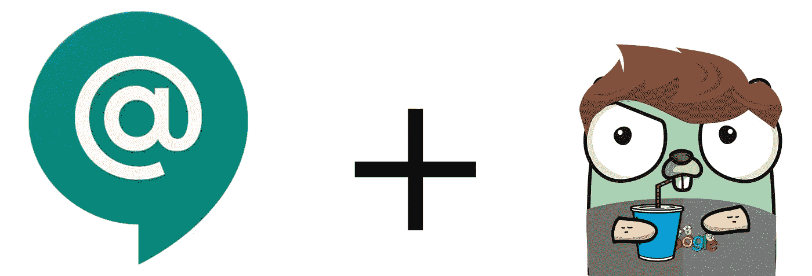

# 谷歌聊天机器人+ Go

> 原文：<https://medium.com/google-cloud/google-chat-bot-go-cc91c5311d7e?source=collection_archive---------0----------------------->



我喜欢即时通讯领域发生的变革。团队正在用电子邮件和会议来交换即时消息。我想我是在美国在线即时通讯软件(AOL instant messenger)或酷孩子们称之为 AIM 的环境中长大的。我发现在向同事提供答案和从同事那里获得答案方面，它的效率要高得多。我可以控制自己的干扰。当我发现自己在做需要高度集中注意力的工作时，这变得很重要。

你们中的一些人可能已经注意到我之前说了“革命”,然后立即开始谈论这是如何发生的……那么这里真正的新内容是什么？一句话:**机器人**。

## 聊天机器人

机器人很棒。它们改变了我们在 20 世纪 90 年代聊天室中的互动方式(同样，聊天室和即时消息并不新鲜)。机器人带来的功能和集成并不缺乏。你不必去寻找完美的 GIF 来扔给你的团队，你可以让一个机器人向你展示一些对应于一个短语的 GIF，然后……*嘣*！你是这个频道的热门人物！

当然，你也可以做一些对生产力没有那么大影响的事情。Github 问题、PRs、CI 管道破裂等等。机器人什么都能做！我认为一个健康的组织会发现他们越来越多地使用机器人来更好地交流和管理异步事件。让机器人帮助解决混乱。

## 定制机器人(即将推出)

很有可能你会找到你想让机器人做的对你或你的团队来说非常独特的事情。这是否意味着你运气不好？当然不是！

我开始创建一个与[谷歌聊天](https://chat.google.com)(G 套件[自带的聊天服务](https://gsuite.google.com/))整合的机器人。我选择了 [Go](https://golang.org/) ，因为那是我选择的语言。事实证明，用 Go 走这条路的开发人员很少，所以很快我就清楚我需要写一些关于我的经验和发现的帖子。

首先也是最重要的，如果我不把你引向[文档](https://developers.google.com/hangouts/chat/)、 [Go 库文档](https://godoc.org/google.golang.org/api/chat/v1)和一些[样本](https://github.com/gsuitedevs/hangouts-chat-samples)的话，我会对每个人造成伤害。这些会让你马上开始。

据我所知，当你考虑一个机器人时，你需要决定你想如何与它互动。

1.  同步—问答(*简单*)
2.  异步——机器人自己推送消息(*更难*)

## 同步机器人

这是一个机器人的正常流程。你说“嗨”，它回说“你好”。事实上，这是一个非常正常的流程，Google Chat 不会让机器人做任何特别的认证工作。这意味着您可以用几行代码制作一个响应 HTTP POST 请求的机器人。

```
// Copyright 2018 Google LLC
//
// Licensed under the Apache License, Version 2.0 (the "License");
// you may not use this file except in compliance with the License.
// You may obtain a copy of the License at
//
//      [http://www.apache.org/licenses/LICENSE-2.0](http://www.apache.org/licenses/LICENSE-2.0)
//
// Unless required by applicable law or agreed to in writing, 
// software
// distributed under the License is distributed on an "AS IS" BASIS,
// WITHOUT WARRANTIES OR CONDITIONS OF ANY KIND, either express or 
// implied.
// See the License for the specific language governing permissions 
// and limitations under the License.package mainimport (
 "encoding/json"
 "fmt"
 "log"
 "net/http" chat "google.golang.org/api/chat/v1"
)func main() {
  f := func(w http.ResponseWriter, r *http.Request) {
    if r.Method != http.MethodPost {
      w.WriteHeader(http.StatusMethodNotAllowed)
      return
    } var event chat.DeprecatedEvent
    if err := json.NewDecoder(r.Body).Decode(&event); err != nil {
      w.WriteHeader(http.StatusBadRequest)
      w.Write([]byte(err.Error()))
      return
    } switch event.Type {
    case "ADDED_TO_SPACE":
      if event.Space.Type != "ROOM" {
        break
      } fmt.Fprint(w, `{"text":"thanks for adding me."}`)
    case "MESSAGE":
      fmt.Fprintf(w, `{"text":"you said %s"}`, event.Message.Text)
    }
  } log.Fatal(http.ListenAndServe(":8080", http.HandlerFunc(f))
}
```

这很容易通过`app.yaml`部署到 app engine:

```
runtime: go111
service: basic-chat-bot
```

通过以下方式部署

```
gcloud app deploy
```

一旦你有了它，你可以用`curl`来玩它:

```
curl '[https://basic-chat-bot-dot-<PROJECT-ID>.appspot.com/](https://basic-chat-bot-dot-modern-cipher-138303.appspot.com/)['](http://localhost:8080') \
-H 'Content-Type: application/json' \
-d '{"type":"MESSAGE","message":{"text": "Hello!"}}'
```

你的机器人会这样回应:

```
{"text":"you said Hello!"}
```

注意:确保用你的 GCP 项目 ID 替换`<PROJECT-ID>`。你会发现:

```
gcloud projects list
```

够简单了吧？一旦你准备好发布你的机器人，检查[发布机器人](https://developers.google.com/hangouts/chat/how-tos/bots-publish)。

## 异步机器人

与某人的异步交互更加复杂。首先，你现在必须弄清楚[服务账户](https://developers.google.com/hangouts/chat/how-tos/service-accounts)。写这篇文章的时候，你还不能使用通过 app engine 提供的默认服务帐户(bummer…)。

```
// Copyright 2018 Google LLC
//
// Licensed under the Apache License, Version 2.0 (the "License");
// you may not use this file except in compliance with the License.
// You may obtain a copy of the License at
//
//      [http://www.apache.org/licenses/LICENSE-2.0](http://www.apache.org/licenses/LICENSE-2.0)
//
// Unless required by applicable law or agreed to in writing, 
// software
// distributed under the License is distributed on an "AS IS" BASIS,
// WITHOUT WARRANTIES OR CONDITIONS OF ANY KIND, either express or 
// implied.
// See the License for the specific language governing permissions 
// and limitations under the License.package mainimport (
 "context"
 "encoding/json"
 "fmt"
 "io/ioutil"
 "log"
 "net/http"
 "os"
 "time" "golang.org/x/oauth2"
 "golang.org/x/oauth2/google"
 chat "google.golang.org/api/chat/v1"
)func main() {
  // Setup client to write messages to chat.google.com
  client := getOauthClient(os.Getenv("SERVICE_ACCOUNT_PATH"))
  service, err := chat.New(client)
  if err != nil {
    log.Fatalf("failed to create chat service: %s", err)
  }
  msgService := chat.NewSpacesMessagesService(service) f := func(w   http.ResponseWriter, r *http.Request) {
    if r.Method != http.MethodPost {
      w.WriteHeader(http.StatusMethodNotAllowed)
      return
    } var event chat.DeprecatedEvent
    if err := json.NewDecoder(r.Body).Decode(&event); err != nil {
      w.WriteHeader(http.StatusBadRequest)
      w.Write([]byte(err.Error()))
      return
    } if event.Type != "MESSAGE" {
      return
    } d, err := time.ParseDuration(event.Message.Text)
    if err != nil {
      fmt.Fprintf(w, `{"text":"Not a time.Duration: %s"}`, err)
      return
    }
    fmt.Fprintf(w, `{"text":"I will message you in %v"}`, d) // Best effort. If the instance goes away, so be it.
    time.AfterFunc(d, func() {
      msg := &chat.Message{
        Text: fmt.Sprintf("message after %v", d),
      }
      _, err := msgService.Create(event.Space.Name, msg).Do()
      if err != nil {
        log.Printf("failed to create message: %s", err)
      }
    })
 } log.Fatal(http.ListenAndServe(":8080", http.HandlerFunc(f))
}func getOauthClient(serviceAccountKeyPath string) *http.Client {
  ctx := context.Background()
  data, err := ioutil.ReadFile(serviceAccountKeyPath)
  if err != nil {
   log.Fatal(err)
  }
  creds, err := google.CredentialsFromJSON(
    ctx, 
    data, 
    "[https://www.googleapis.com/auth/chat.bot](https://www.googleapis.com/auth/chat.bot)",
  )
  if err != nil {
    log.Fatal(err)
  } return oauth2.NewClient(ctx, creds.TokenSource)
}
```

这是用`app.yaml`部署到 app engine 的:

```
runtime: go111
service: basic-async-chat-bot
env_variables:
  SERVICE_ACCOUNT_PATH: account.json
```

**注意**:这里假设您下载了服务帐户密钥，并将其放在代码旁边。你应该确保你不会不小心检入它(例如，将它添加到`.gitignore`)。

## 测试异步机器人

显然这个机器人更复杂，包括如何测试它。同步机器人只是一个 RESTful 应用程序，你可以对它做出各种断言，而异步机器人实际上会伸出手去`chat.google.com`做一些事情。那么，你如何判断它做得是否正确呢？

我四处打听，得到了几个像样的答案。有些人比其他人更投入。

我喜欢的一个解决方案(但我不打算在这里详细讨论)是配置另一个 bot，它与异步 bot 在同一个房间中监听。当我们正在测试的机器人发送消息时，第二个机器人可以将结果记录在某个数据库中。然后我们可以读取数据库，确保一切顺利。

我认为这比我的平均用例需要的要复杂得多。相反，我发现 Go 库有一个[变量](https://godoc.org/google.golang.org/api/chat/v1#Service)，我可以在它发送消息的地方覆盖它。

```
Service.BasePath
```

因此，如果我们让这在我们的 bot 中是可配置的，那么我们可以用一个简单的`httptest.Server`覆盖它并断言离开！

```
if googleApiURL := os.Getenv("GOOGLE_API_URL"); googleApiURL != ""{
  service.BasePath = googleApiURL
}
```

## 更多即将推出…

在我创建机器人的时候，我会尝试开源它们。希望它们不仅是好的样本，而且足够有用，其他人会将它们部署到他们的 G Suite 项目中，并发现它们很有用。快乐机器人大厦！