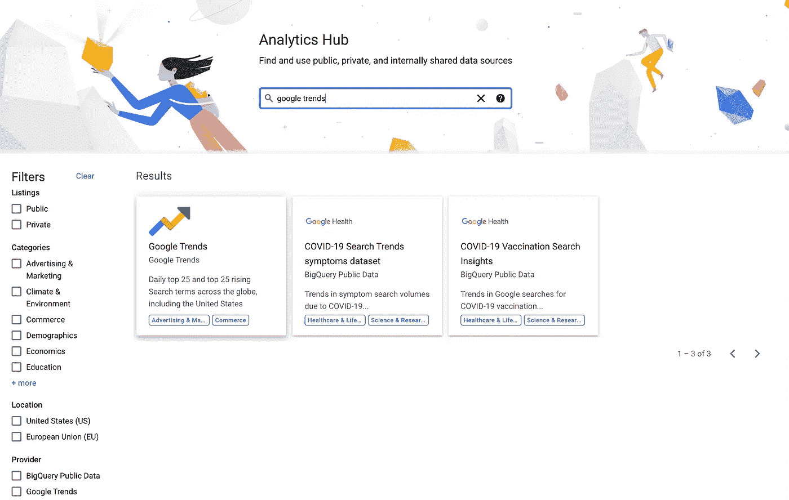

# 谷歌云——分析中心

> 原文：<https://medium.com/google-cloud/google-cloud-analytics-hub-f30fde439e4b?source=collection_archive---------0----------------------->

谷歌云分析中心(Google Cloud Analytics Hub)于 2022 年 4 月 6 日在谷歌云数据峰会上亮相，现已公开预览。把分析中心想象成一个数据市场。Analytics Hub 将数据的生产者和消费者聚集在一起，使发布和消费数据变得容易，并使跨组织边界的共享变得安全和高效。

该解决方案构建在 BigQuery 之上。BigQuery 中的共享自 2010 年就已经存在，并且有许多公共数据集可用，那么是什么让 Analytics Hub 与众不同呢？Analytics Hub 遵循发布者/订阅者模型，并添加了额外的功能来改善数据共享体验。三个新功能是:

1.  共享数据集
2.  数据交换
3.  使用指标

**共享数据集**。发布者在 BigQuery 中定义数据、表和视图的集合，作为共享数据集进行共享。订阅者获得一个称为链接数据集的版本，它看起来像任何其他 BigQuery 数据集，但它是只读的。由于链接数据集是对原始数据集的引用，因此数据集保持同步。此外，由于链接数据集是数据的引用而非副本，订阅者无需支付任何存储费用。发布者需要为数据集的存储和查询付费。订阅者只需为针对数据集的查询付费。

**数据交换。**像证券交易所一样，数据交易所将数据的买方(出版商/生产商)和卖方(订户/消费者)聚集在一起。交易的不是股票，而是数据。列表用来唯一地标识数据，而不是股票代码。清单包含对数据集的引用、描述和任何相关文档的链接。数据交换和列表是解决方案如何跨多个组织扩展并提供对数据集的自助式访问的方式。数据交换可以是公共的，也可以是私有的。Exchange 管理员控制数据访问。默认设置是专用交换机。

**使用指标。**追踪订户。确定哪些桌子受欢迎。查看查询了多少数据。使用度量显示您的数据是如何被使用的。

[](https://cloud.google.com/bigquery/docs/analytics-hub-introduction#subscriber_workflow)

分析中心架构:订户工作流

截至本文发布之日，Analytics Hub 已经公开发布。可以在谷歌云控制台的 BigQuery 部分找到。


BigQuery 中增加了分析中心特性

启用分析中心 API。


启用分析中心 API

启用后，您应该会在谷歌云控制台中看到分析中心。您还可以通过点击“搜索列表”来查看分析中心“市场”。


管理数据交换

分析中心“市场”。您可以通过使用过滤器或搜索列表来查找数据集。


分析中心

例如，您可以搜索“谷歌趋势”列表。这个免费数据集是谷歌搜索热门查询的可查询版本。



谷歌趋势数据集

通过选择“Google Trends”列表，可以选择将数据集添加到 Google Cloud 项目。


将 Google 趋势数据集添加到 Google 云项目

要创建链接数据集，请指定数据集所在的 Google Cloud 项目和数据集名称。提供了默认的数据集名称。


创建链接数据集

添加数据集时，它会出现在项目下，看起来像任何 BigQuery 数据集。由于这是一个链接数据集，因此该数据集是只读的，并且是对原始数据集的引用。


添加到 BigQuery 的链接数据集

## 进一步观察

## 进一步阅读

```
[Google Cloud Blog: Securely exchange data and analytics assets at scale with Analytics Hub, now available in Preview](https://cloud.google.com/blog/products/data-analytics/analytics-hub-data-exchange-now-in-public-preview)
[Google Cloud: Introduction to Analytics Hub](https://cloud.google.com/bigquery/docs/analytics-hub-introduction)
[Google Cloud: Analytics Hub](https://cloud.google.com/analytics-hub)
[MIT Sloan School: Why external data should be part of your data strategy](https://mitsloan.mit.edu/ideas-made-to-matter/why-external-data-should-be-part-your-data-strategy)
```