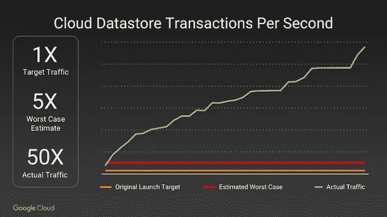

# 上周谷歌云公告的回顾

> 原文：<https://medium.com/google-cloud/google-cloud-announcements-september-2016-4f43ae53712b?source=collection_archive---------1----------------------->

上周四，在旧金山的 Google Horizon 活动上，我们发布了大量内容广泛的公告。公告来得太快了，很难跟上！现在尘埃落定，我整理了一份回顾，让你跟上时代。

## 介绍谷歌云

SVP 的黛安·格林在博客上介绍了谷歌云。新的谷歌云品牌横跨每一层业务，包括谷歌云平台、机器学习工具和 API、企业地图 API、访问云的 Android 和 Chrome 设备，以及新命名的 G Suite(原谷歌工作应用套件)。

## 新地区，Kubernetes 新功能，CRE

副总裁 Brian Stevens 在博客中写道[谷歌云平台为新视野](https://cloudplatform.googleblog.com/2016/09/Google-Cloud-Platform-sets-a-course-for-new-horizons.html)设定了路线——宣布了八个新的谷歌云区域:孟买、新加坡、悉尼、北弗吉尼亚、圣保罗、伦敦、芬兰和法兰克福(明年将宣布更多)。Brian 还介绍了 Kubernetes 的最新特性，集群联合支持跨多个集群和多个云的简单部署。他还提到，谷歌容器引擎的使用率每 90 天翻一番！最后但同样重要的是，Brian 宣布了一个新角色:客户可靠性工程(CRE ),它直接与我们的客户运营团队集成。

## BigQuery 企业数据仓库特性

产品管理总监 Fausto Ibarra 在博客上发表了 [BigQuery:引入强大的新企业数据仓库功能](https://cloud.google.com/blog/big-data/2016/09/bigquery-introducing-powerful-new-enterprise-data-warehousing-features)宣布了 Google BigQuery 中的一系列新企业功能，包括身份访问管理(IAM)、通过 Google Stackdriver 进行监控、统一定价、与生态系统数据工具的改进兼容性、新的 ODBC 驱动程序、对标准 SQL 的支持，以及在 BigQuery 数据集(DML)中更新、删除和插入行和列的能力。他还描述了可口可乐欧洲合作伙伴、纽约时报和 Viant 是如何依赖 BigQuery 的。

## 云机器学习公测版

产品经理利库·井上在博客上发布了[Google Cloud Machine Learning:now open to all with new professional services and education programs](https://cloud.google.com/blog/big-data/2016/09/google-cloud-machine-learning-now-open-to-all-with-new-professional-services-and-education-programs)，宣布 Google Cloud Machine Learning 现已公开测试版，包括一个名为 HyperTune 的新功能，可以自动提高预测准确性。帖子还讨论了空中客车防务和航天公司如何测试使用谷歌云机器学习来自动分析卫星图像，并解决了一个存在了几十年的问题。利库还宣布了我们专业服务团队内部新的专门的机器学习实践，以及新的计划和认证，以帮助企业学习如何使用机器学习来解决实际的业务问题。

## 口袋妖怪 Go +谷歌云

客户可靠性工程总监卢克·斯通(Luke Stone)在博客上写道[在谷歌云](https://cloudplatform.googleblog.com/2016/09/bringing-Pokemon-GO-to-life-on-Google-Cloud.html)上赋予口袋妖怪 GO 生命，提供了口袋妖怪 GO 发布的幕后花絮。这篇文章提供了一些关于 Pokemon GO 爆炸式增长的惊人细节，包括该应用如何增长到最初估计使用量的 50 倍，需要一些英雄措施，并成为有史以来 Kubernetes 在谷歌容器引擎上最大的部署。这个帖子就像是开发者的真人秀！

## 谷歌和埃森哲的合作关系

全球战略联盟负责人 Caliah Manson 在博客上发表了[谷歌和埃森哲:为企业而建](https://cloud.googleblog.com/2016/09/google-and-accenture-building-for-the-enterprise.html)，宣布谷歌和埃森哲建立新的联盟，为企业开发将云、移动性和协作结合在一起的解决方案，帮助客户接受技术可以实现的数字化转型。

## g 套件新功能

应用副总裁 Prabhakar Raghavan 在博客上发布了 [G Suite:为团队设计的智能工具](https://cloud.googleblog.com/2016/09/intelligent-tools-built-for-teams.html)，并宣布了 G Suite(以前的 Google Apps for Work)的几个新功能。这些新功能为日历、文档、电子表格和演示文稿带来了惊人的机器智能。还宣布了 Google Drive for Teams，它提供团队级别的内容所有权和共享，以及支持多达 50 名参与者的团队会议，并允许通过简单的链接加入会议。

势头令人振奋，更多的公告即将发布——我们正在全力以赴。

敬请期待！