# 谷歌云 Anthos 系列:Anthos 平台介绍

> 原文：<https://medium.com/google-cloud/google-cloud-anthos-series-23b9a35e9179?source=collection_archive---------0----------------------->

## 谷歌云 Anthos 系列:第 1 部分

欢迎来到“Google Cloud Anthos platform”的多部分系列。在这个博客系列中，我们将探索名为“Samajik”的虚拟组织如何使用 Google Cloud 的 Anthos 平台跨多个 Google Cloud 区域扩展其基于 Kubernetes 的应用程序。

我们将在这个博客系列中报道 Samajik 的 Anthos 收养之旅。

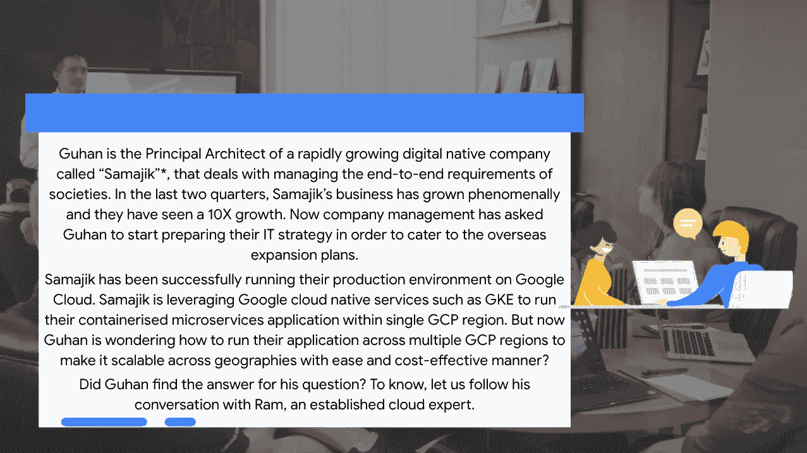

*故事情节中提到的公司名称和人物角色是虚构的

**Part-1** : Anthos 平台介绍(本博客)

**Part-2** : [Anthos 平台技术细节](/google-cloud/google-cloud-anthos-series-f12e91c8c928)

**第三部分:**[Anthos 平台入门](/google-cloud/google-cloud-anthos-series-part3-e8af35e47bc)

**第四部分** : [Anthos 服务网格](/google-cloud/google-cloud-anthos-series-part4-e23172b61ec9)

**Part-5** : [Anthos 配置管理](/google-cloud/google-cloud-anthos-series-part5-a17ce89ddc7a)

**第 6 部分** : [Anthos 多集群入口](/google-cloud/google-cloud-anthos-series-part6-bbb70e2f9979)

**第七部分** : [Anthos 市场应用](/google-cloud/google-cloud-anthos-series-part7-6b85c5f7016f)

**第八部** : [为安索斯和 GKE 而迁徙](/google-cloud/google-cloud-anthos-series-part8-2af3bdce0c9b)

**Part9** : [Anthos 多云&混合故事](/google-cloud/google-cloud-anthos-series-anthos-multi-cloud-hybrid-story-fc70ce352c40)

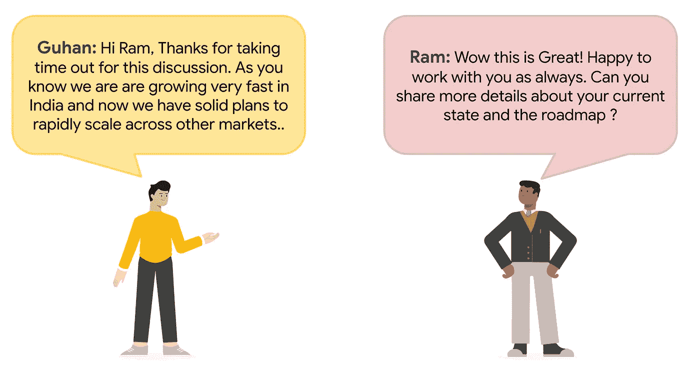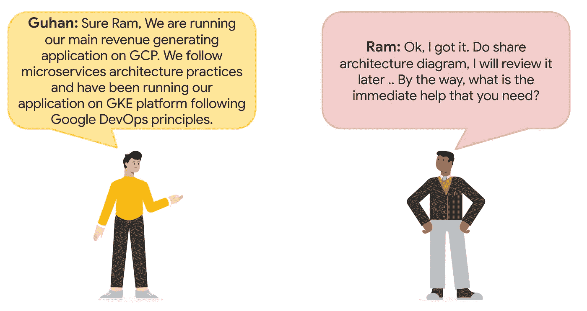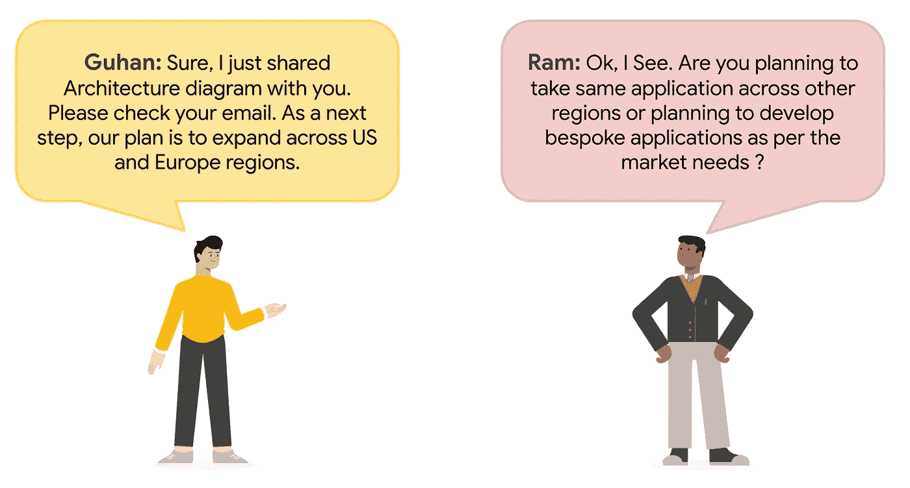

这是 Samajik 的应用架构图。在内部，该应用程序被称为“独角兽”，目前正在谷歌云的孟买地区运行。

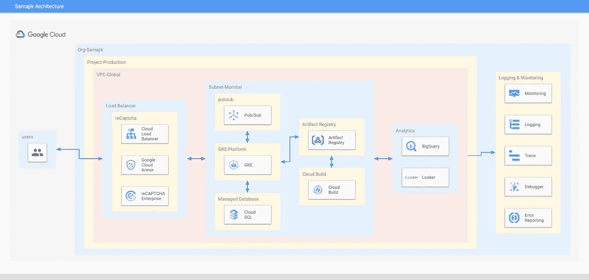

Samajik 在 Google Cloud 上的“独角兽”应用架构

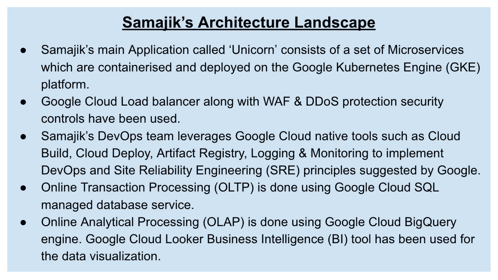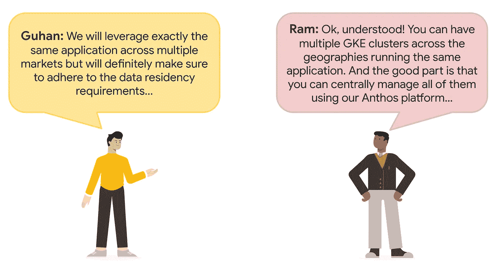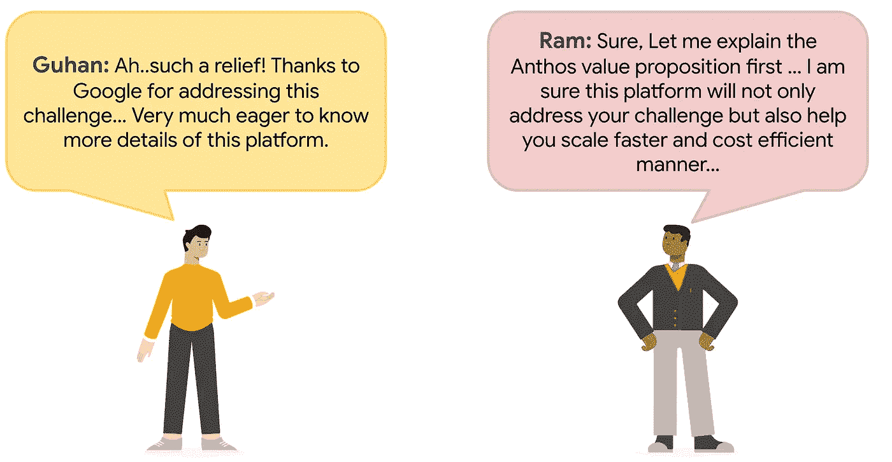

**介绍谷歌云的 Anthos 平台**

Anthos 是一个现代化的应用管理平台，为跨多个云(GCP、AWS、Azure)和私有内部数据中心的计算、网络甚至服务管理提供了一个统一的模型。该技术体系建立在基于开源技术的一组一致的 API 之上，为开发人员和运营商提供了一套工具。

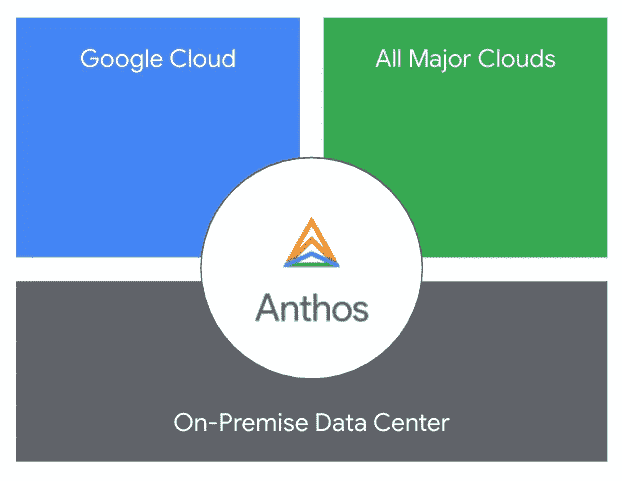

Anthos 是一个基于 Kubernetes 的平台，可以在任何地方运行，有一个云支持的控制平面用于集中管理。Anthos 提供

1.  应用管理
2.  基础设施自动化
3.  端到端可观测性
4.  合规与治理

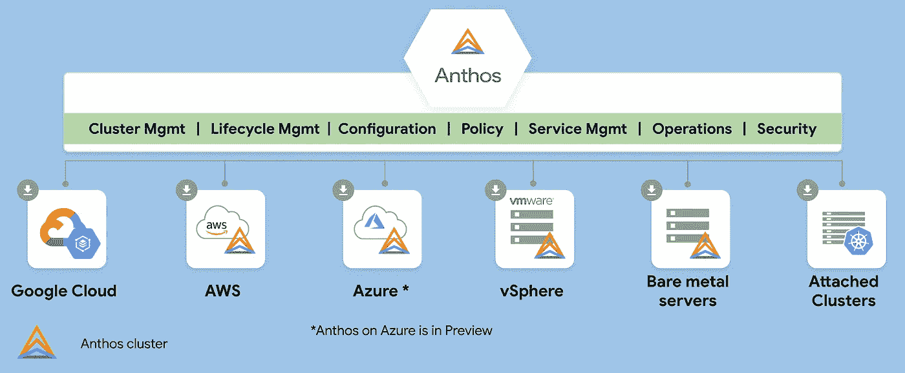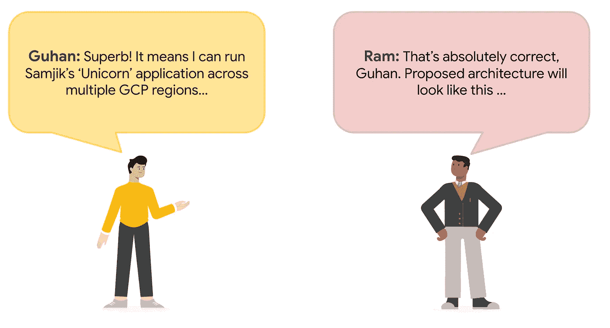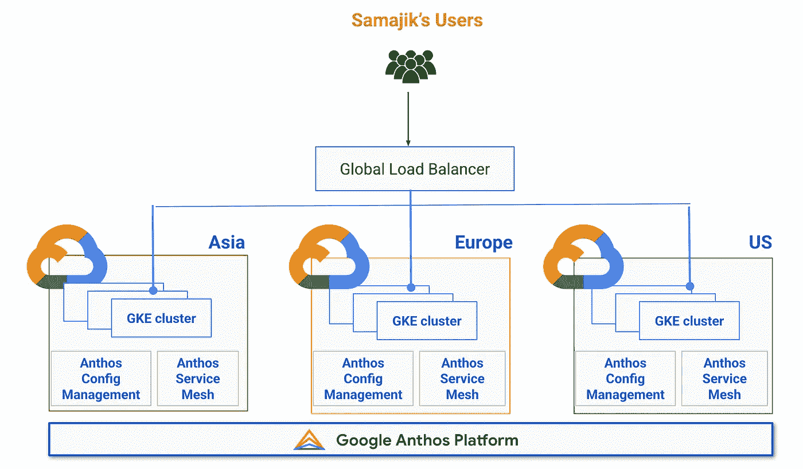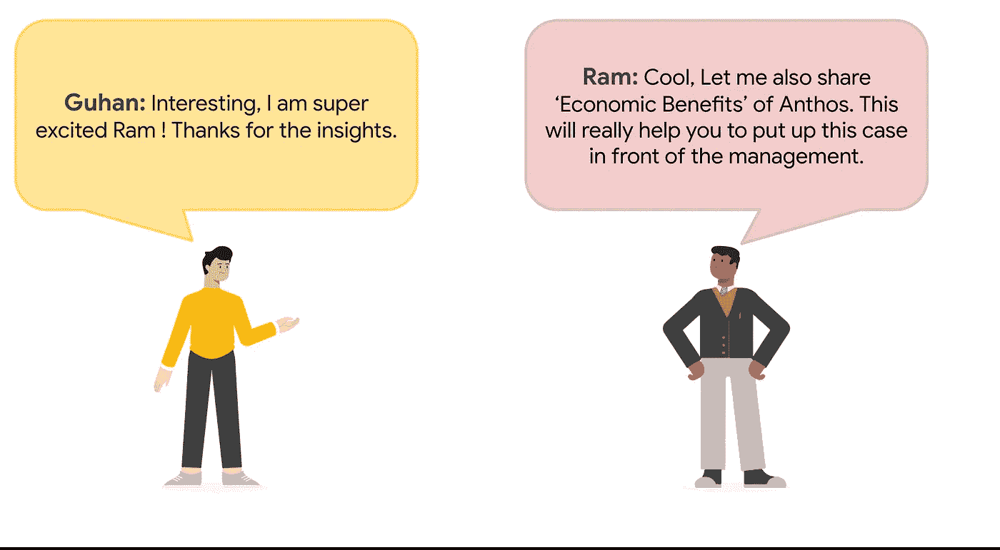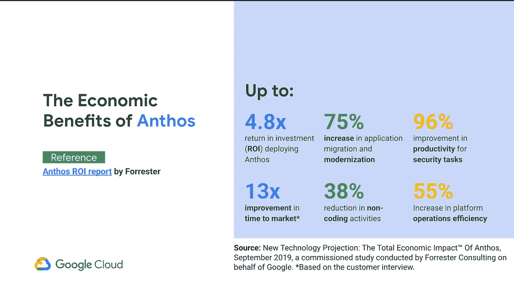

参考:[https://services . Google . com/FH/files/misc/the _ total _ economic _ impact _ of _ anthos . pdf](https://services.google.com/fh/files/misc/the_total_economic_impact_of_anthos.pdf)

**来了..**

在这篇博客中，我们讨论了安索斯的价值主张。在接下来的博客中，我们将继续 Samajik 收养 Anthos 的旅程。

**参考**

你可以参考 [Google Cloud DevOps 系列](/google-cloud/google-cloud-devops-part-1-introduction-to-google-native-devops-process-bfb55be9e3f3)来了解 Samajik 如何使用 Google Cloud 原生工具&原理改造他们的 DevOps 格局’。

供稿人:[施吉莫勒·阿克](https://medium.com/u/41b475b881ff?source=post_page-----23b9a35e9179--------------------------------)，[安其特·尼尚](https://medium.com/u/2d47f7f3f8e2?source=post_page-----23b9a35e9179--------------------------------)，[丹杜斯](https://medium.com/u/71d9487165c6?source=post_page-----23b9a35e9179--------------------------------)