# 谷歌云 Anthos 系列:Anthos 多云和混合故事

> 原文：<https://medium.com/google-cloud/google-cloud-anthos-series-anthos-multi-cloud-hybrid-story-fc70ce352c40?source=collection_archive---------0----------------------->

## Google Cloud Anthos 系列(在 AWS 上部署 Anthos):**第九部分**

W 欢迎来到“谷歌云 Anthos 系列”的第 9 部分。你可以在这里找到完整的系列。

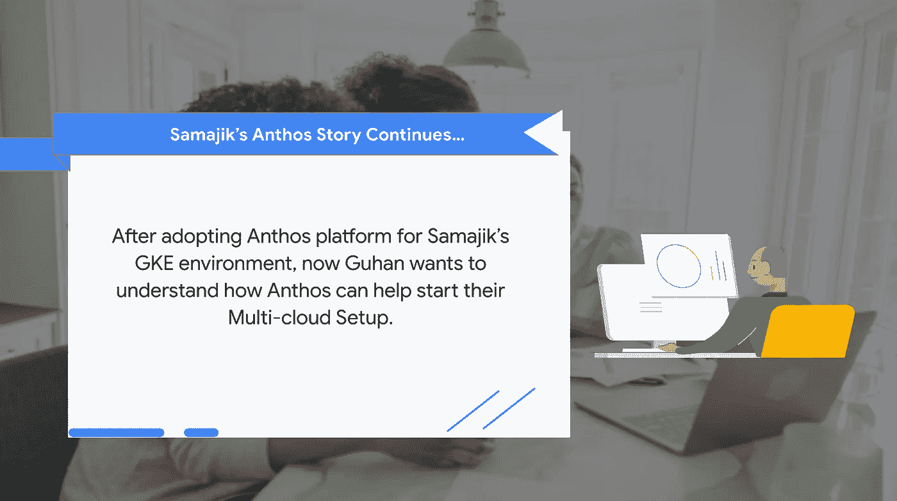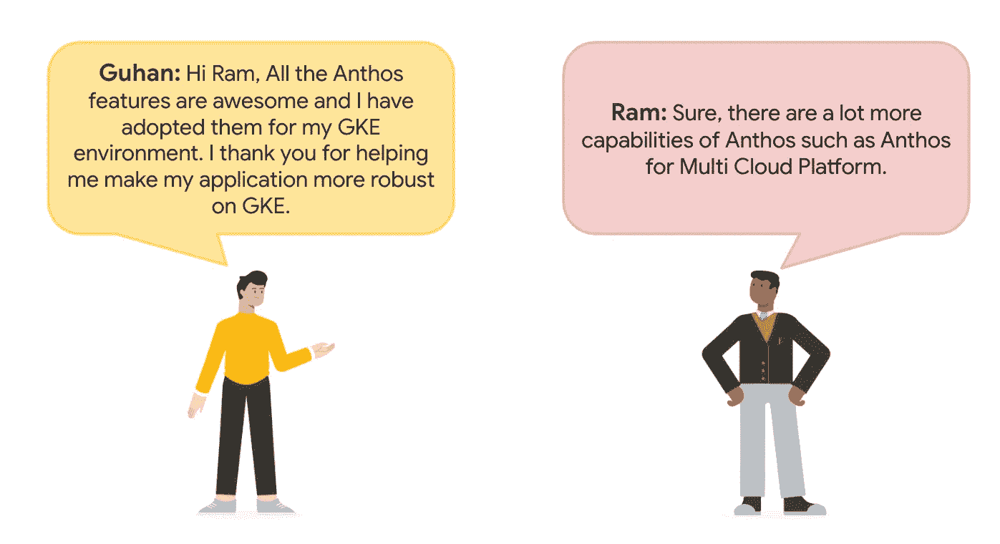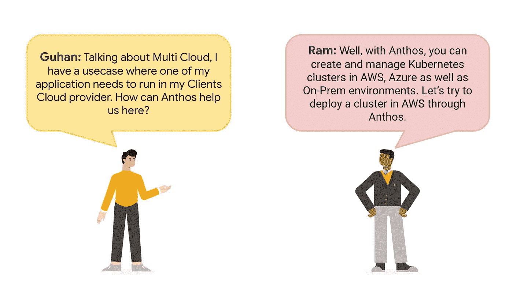

借助 Anthos 集群，您可以通过统一的管理、信号和配置控制平面将工作负载部署到多个云中。

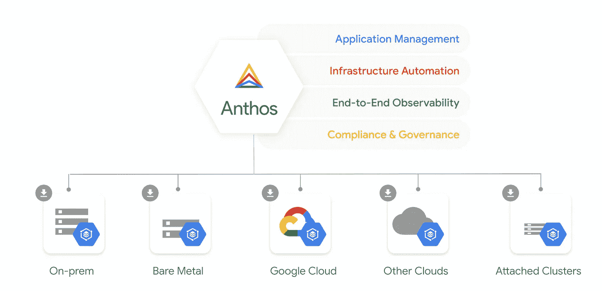

在这个例子中，我们将通过 Anthos 在 AWS 上部署一个 Kubernetes 集群。

作为先决条件，安装并配置以下组件:

> [AWS CLI](https://docs.aws.amazon.com/cli/latest/userguide/getting-started-install.html)
> [g cloud CLI](https://cloud.google.com/sdk/docs/install)
> [jq](https://stedolan.github.io/jq/download/)
> [ku bectl](https://kubernetes.io/docs/tasks/tools/)

这里我们将使用的 AWS 地区是 us-west-2
这里我们将使用的 GCP 地区是 us-west1

**设置一些环境变量**

```
PROJECT_ID="<your-gcp-project-id>"AWS_REGION="us-west-2"GCP_REGION="us-west1"gcloud components update
```

**启用以下 API**

```
gcloud services enable gkemulticloud.googleapis.com
gcloud services enable gkeconnect.googleapis.com
gcloud services enable connectgateway.googleapis.com
gcloud services enable cloudresourcemanager.googleapis.com
gcloud services enable anthos.googleapis.com
gcloud services enable logging.googleapis.com
gcloud services enable monitoring.googleapis.com
```

**让我们在 AWS 中创建一个 VPC，其公共和私有子网位于不同的 az 中。**

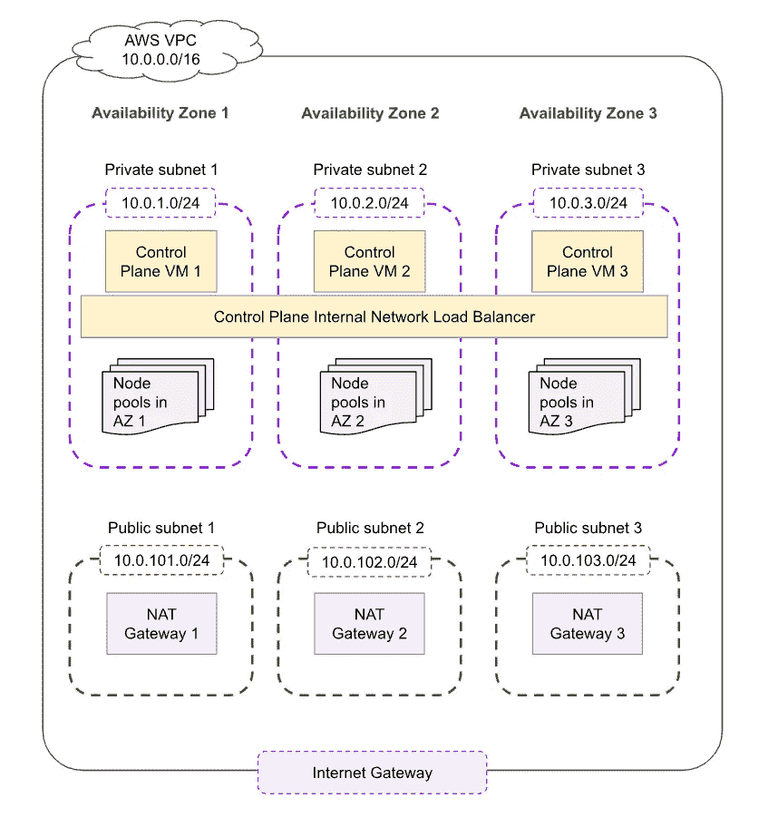

```
aws --region $AWS_REGION ec2 create-vpc \
    --cidr-block 10.0.0.0/16 \
    --tag-specifications 'ResourceType=vpc, Tags=[{Key=Name,Value=anthosAWSVPC}]'VPC_ID=$(aws ec2 describe-vpcs \
  --filters 'Name=tag:Name,Values=anthosAWSVPC' \
  --query "Vpcs[].VpcId" --output text)aws ec2 modify-vpc-attribute --enable-dns-hostnames --vpc-id $VPC_ID
aws ec2 modify-vpc-attribute --enable-dns-support --vpc-id $VPC_ID
```

**创建私有和公共子网**

```
aws ec2 create-subnet \
     --availability-zone us-west-2a \
     --vpc-id $VPC_ID \
     --cidr-block 10.0.1.0/24 \
     --tag-specifications 'ResourceType=subnet, Tags=[{Key=Name,Value=anthosAWSPrivateSubnet1}]'
   aws ec2 create-subnet \
     --availability-zone us-west-2b \
     --vpc-id $VPC_ID \
     --cidr-block 10.0.2.0/24 \
     --tag-specifications 'ResourceType=subnet, Tags=[{Key=Name,Value=anthosAWSPrivateSubnet2}]'
   aws ec2 create-subnet \
     --availability-zone us-west-2c \
     --vpc-id $VPC_ID \
     --cidr-block 10.0.3.0/24 \
     --tag-specifications 'ResourceType=subnet, Tags=[{Key=Name,Value=anthosAWSPrivateSubnet3}]'aws ec2 create-subnet \
  --availability-zone us-west-2a \
  --vpc-id $VPC_ID \
  --cidr-block 10.0.101.0/24 \
  --tag-specifications 'ResourceType=subnet, Tags=[{Key=Name,Value=anthosAWSPublicSubnet1}]'
aws ec2 create-subnet \
  --availability-zone us-west-2b \
  --vpc-id $VPC_ID \
  --cidr-block 10.0.102.0/24 \
  --tag-specifications 'ResourceType=subnet, Tags=[{Key=Name,Value=anthosAWSPublicSubnet2}]'
aws ec2 create-subnet \
  --availability-zone us-west-2c \
  --vpc-id $VPC_ID \
  --cidr-block 10.0.103.0/24 \
  --tag-specifications 'ResourceType=subnet, Tags=[{Key=Name,Value=anthosAWSPublicSubnet3}]'
```

**将子网标记为公共**

```
PUBLIC_SUBNET_ID_1=$(aws ec2 describe-subnets \
  --filters 'Name=tag:Name,Values=anthosAWSPublicSubnet1' \
  --query "Subnets[].SubnetId" --output text)
PUBLIC_SUBNET_ID_2=$(aws ec2 describe-subnets \
  --filters 'Name=tag:Name,Values=anthosAWSPublicSubnet2' \
  --query "Subnets[].SubnetId" --output text)
PUBLIC_SUBNET_ID_3=$(aws ec2 describe-subnets \
  --filters 'Name=tag:Name,Values=anthosAWSPublicSubnet3' \
  --query "Subnets[].SubnetId" --output text)
aws ec2 modify-subnet-attribute \
  --map-public-ip-on-launch \
  --subnet-id $PUBLIC_SUBNET_ID_1
aws ec2 modify-subnet-attribute \
  --map-public-ip-on-launch \
  --subnet-id $PUBLIC_SUBNET_ID_2
aws ec2 modify-subnet-attribute \
  --map-public-ip-on-launch \
  --subnet-id $PUBLIC_SUBNET_ID_3
```

**创建互联网网关**

```
aws --region $AWS_REGION  ec2 create-internet-gateway \
  --tag-specifications 'ResourceType=internet-gateway, Tags=[{Key=Name,Value=anthosAWSInternetGateway}]'INTERNET_GW_ID=$(aws ec2 describe-internet-gateways \
  --filters 'Name=tag:Name,Values=anthosAWSInternetGateway' \
  --query "InternetGateways[].InternetGatewayId" --output text)aws ec2 attach-internet-gateway \
  --internet-gateway-id $INTERNET_GW_ID \
  --vpc-id $VPC_ID
```

**为公共子网配置路由表**

```
aws ec2 create-route-table --vpc-id $VPC_ID \
  --tag-specifications 'ResourceType=route-table, Tags=[{Key=Name,Value=anthosAWSPublicRouteTbl1}]'
aws ec2 create-route-table --vpc-id $VPC_ID \
  --tag-specifications 'ResourceType=route-table, Tags=[{Key=Name,Value=anthosAWSPublicRouteTbl2}]'
aws ec2 create-route-table --vpc-id $VPC_ID \
  --tag-specifications 'ResourceType=route-table, Tags=[{Key=Name,Value=anthosAWSPublicRouteTbl3}]'PUBLIC_ROUTE_TABLE_ID_1=$(aws ec2 describe-route-tables \
    --filters 'Name=tag:Name,Values=anthosAWSPublicRouteTbl1' \
    --query "RouteTables[].RouteTableId" --output text)
PUBLIC_ROUTE_TABLE_ID_2=$(aws ec2 describe-route-tables \
    --filters 'Name=tag:Name,Values=anthosAWSPublicRouteTbl2' \
    --query "RouteTables[].RouteTableId" --output text)
PUBLIC_ROUTE_TABLE_ID_3=$(aws ec2 describe-route-tables \
    --filters 'Name=tag:Name,Values=anthosAWSPublicRouteTbl3' \
    --query "RouteTables[].RouteTableId" --output text)
aws ec2 associate-route-table \
  --route-table-id $PUBLIC_ROUTE_TABLE_ID_1 \
  --subnet-id $PUBLIC_SUBNET_ID_1
aws ec2 associate-route-table \
  --route-table-id $PUBLIC_ROUTE_TABLE_ID_2 \
  --subnet-id $PUBLIC_SUBNET_ID_2
aws ec2 associate-route-table \
  --route-table-id $PUBLIC_ROUTE_TABLE_ID_3 \
  --subnet-id $PUBLIC_SUBNET_ID_3aws ec2 create-route --route-table-id $PUBLIC_ROUTE_TABLE_ID_1 \
  --destination-cidr-block 0.0.0.0/0 --gateway-id $INTERNET_GW_ID
aws ec2 create-route --route-table-id $PUBLIC_ROUTE_TABLE_ID_2 \
  --destination-cidr-block 0.0.0.0/0 --gateway-id $INTERNET_GW_ID
aws ec2 create-route --route-table-id $PUBLIC_ROUTE_TABLE_ID_3 \
  --destination-cidr-block 0.0.0.0/0 --gateway-id $INTERNET_GW_IDaws ec2 allocate-address \
  --tag-specifications 'ResourceType=elastic-ip, Tags=[{Key=Name,Value=anthosAWSNatEip1}]'
aws ec2 allocate-address \
  --tag-specifications 'ResourceType=elastic-ip, Tags=[{Key=Name,Value=anthosAWSNatEip2}]'
aws ec2 allocate-address \
  --tag-specifications 'ResourceType=elastic-ip, Tags=[{Key=Name,Value=anthosAWSNatEip3}]'
```

**创建 NAT 网关**

```
NAT_EIP_ALLOCATION_ID_1=$(aws ec2 describe-addresses \
     --filters 'Name=tag:Name,Values=anthosAWSNatEip1' \
     --query "Addresses[].AllocationId" --output text)
   NAT_EIP_ALLOCATION_ID_2=$(aws ec2 describe-addresses \
     --filters 'Name=tag:Name,Values=anthosAWSNatEip2' \
     --query "Addresses[].AllocationId" --output text)
   NAT_EIP_ALLOCATION_ID_3=$(aws ec2 describe-addresses \
     --filters 'Name=tag:Name,Values=anthosAWSNatEip3' \
     --query "Addresses[].AllocationId" --output text)
   aws ec2 create-nat-gateway \
     --allocation-id $NAT_EIP_ALLOCATION_ID_1 \
     --subnet-id $PUBLIC_SUBNET_ID_1 \
     --tag-specifications 'ResourceType=natgateway, Tags=[{Key=Name,Value=anthosAWSNatGateway1}]'
   aws ec2 create-nat-gateway \
     --allocation-id $NAT_EIP_ALLOCATION_ID_2 \
     --subnet-id $PUBLIC_SUBNET_ID_2 \
     --tag-specifications 'ResourceType=natgateway, Tags=[{Key=Name,Value=anthosAWSNatGateway2}]'
   aws ec2 create-nat-gateway \
     --allocation-id $NAT_EIP_ALLOCATION_ID_3 \
     --subnet-id $PUBLIC_SUBNET_ID_3 \
     --tag-specifications 'ResourceType=natgateway, Tags=[{Key=Name,Value=anthosAWSNatGateway3}]'
```

**为私有子网配置路由表**

```
aws ec2 create-route-table --vpc-id $VPC_ID \
  --tag-specifications 'ResourceType=route-table, Tags=[{Key=Name,Value=anthosAWSPrivateRouteTbl1}]'
aws ec2 create-route-table --vpc-id $VPC_ID \
  --tag-specifications 'ResourceType=route-table, Tags=[{Key=Name,Value=anthosAWSPrivateRouteTbl2}]'
aws ec2 create-route-table --vpc-id $VPC_ID \
  --tag-specifications 'ResourceType=route-table, Tags=[{Key=Name,Value=anthosAWSPrivateRouteTbl3}]'PRIVATE_SUBNET_ID_1=$(aws ec2 describe-subnets \
  --filters 'Name=tag:Name,Values=anthosAWSPrivateSubnet1' \
  --query "Subnets[].SubnetId" --output text)
PRIVATE_SUBNET_ID_2=$(aws ec2 describe-subnets \
  --filters 'Name=tag:Name,Values=anthosAWSPrivateSubnet2' \
  --query "Subnets[].SubnetId" --output text)
PRIVATE_SUBNET_ID_3=$(aws ec2 describe-subnets \
  --filters 'Name=tag:Name,Values=anthosAWSPrivateSubnet3' \
  --query "Subnets[].SubnetId" --output text)
PRIVATE_ROUTE_TABLE_ID_1=$(aws ec2 describe-route-tables \
  --filters 'Name=tag:Name,Values=anthosAWSPrivateRouteTbl1' \
  --query "RouteTables[].RouteTableId" --output text)
PRIVATE_ROUTE_TABLE_ID_2=$(aws ec2 describe-route-tables \
  --filters 'Name=tag:Name,Values=anthosAWSPrivateRouteTbl2' \
  --query "RouteTables[].RouteTableId" --output text)
PRIVATE_ROUTE_TABLE_ID_3=$(aws ec2 describe-route-tables \
  --filters 'Name=tag:Name,Values=anthosAWSPrivateRouteTbl3' \
  --query "RouteTables[].RouteTableId" --output text)
aws ec2 associate-route-table --route-table-id $PRIVATE_ROUTE_TABLE_ID_1 \
  --subnet-id $PRIVATE_SUBNET_ID_1
aws ec2 associate-route-table --route-table-id $PRIVATE_ROUTE_TABLE_ID_2 \
  --subnet-id $PRIVATE_SUBNET_ID_2
aws ec2 associate-route-table --route-table-id $PRIVATE_ROUTE_TABLE_ID_3 \
  --subnet-id $PRIVATE_SUBNET_ID_3NAT_GW_ID_1=$(aws ec2 describe-nat-gateways \
 --filter 'Name=tag:Name,Values=anthosAWSNatGateway1' \
 --query "NatGateways[].NatGatewayId" --output text)
NAT_GW_ID_2=$(aws ec2 describe-nat-gateways \
 --filter 'Name=tag:Name,Values=anthosAWSNatGateway2' \
 --query "NatGateways[].NatGatewayId" --output text)
NAT_GW_ID_3=$(aws ec2 describe-nat-gateways \
 --filter 'Name=tag:Name,Values=anthosAWSNatGateway3' \
 --query "NatGateways[].NatGatewayId" --output text)
aws ec2 create-route --route-table-id $PRIVATE_ROUTE_TABLE_ID_1  \
  --destination-cidr-block 0.0.0.0/0 --gateway-id $NAT_GW_ID_1
aws ec2 create-route --route-table-id $PRIVATE_ROUTE_TABLE_ID_2  \
  --destination-cidr-block 0.0.0.0/0 --gateway-id $NAT_GW_ID_2
aws ec2 create-route --route-table-id $PRIVATE_ROUTE_TABLE_ID_3 \
  --destination-cidr-block 0.0.0.0/0 --gateway-id $NAT_GW_ID_3
```

**为负载平衡器标记子网**

```
aws ec2 create-tags \
  --resources $PUBLIC_SUBNET_ID_1 \
  --tags Key=kubernetes.io/role/elb,Value=1
aws ec2 create-tags \
  --resources $PUBLIC_SUBNET_ID_2 \
  --tags Key=kubernetes.io/role/elb,Value=1
aws ec2 create-tags \
  --resources $PUBLIC_SUBNET_ID_3 \
  --tags Key=kubernetes.io/role/elb,Value=1aws ec2 create-tags \
  --resources $PRIVATE_SUBNET_ID_1 \
  --tags Key=kubernetes.io/role/internal-elb,Value=1
aws ec2 create-tags \
  --resources $PRIVATE_SUBNET_ID_2 \
  --tags Key=kubernetes.io/role/internal-elb,Value=1
aws ec2 create-tags \
  --resources $PRIVATE_SUBNET_ID_3 \
  --tags Key=kubernetes.io/role/internal-elb,Value=1
```

**在 AWS 中创建 KMS 键**

```
AWS_KMS_DATA=$(aws --region $AWS_REGION kms create-key \
    --description "kms_key")AWS_KMS_ARN=$(echo $AWS_KMS_DATA | jq .KeyMetadata.Arn -r)
```

**创建 IAM 策略和角色**

```
PROJECT_ID="$(gcloud config get-value project)"PROJECT_NUMBER=$(gcloud projects describe "$PROJECT_ID" \
  --format "value(projectNumber)")

aws iam create-role --role-name ANTHOS_API_ROLE \
  --assume-role-policy-document '{
  "Version": "2012-10-17",
  "Statement": [
    {
      "Sid": "",
      "Effect": "Allow",
      "Principal": {
        "Federated": "accounts.google.com"
      },
      "Action": "sts:AssumeRoleWithWebIdentity",
      "Condition": {
        "StringEquals": {
          "accounts.google.com:sub": "service-'$PROJECT_NUMBER'@gcp-sa-gkemulticloud.iam.gserviceaccount.com"
        }
      }
    }
  ]
}'ANTHOS_API_ROLE_ARN=$(aws iam get-role --role-name "ANTHOS_API_ROLE" --query "Role.Arn" --output text)aws iam create-policy --policy-name ANTHOS_API_POLICY \
    --policy-document '{
    "Version": "2012-10-17",
    "Statement": [
        {
            "Sid": "",
            "Effect": "Allow",
            "Action": [
                "kms:Encrypt",
                "kms:DescribeKey",
                "iam:CreateServiceLinkedRole",
                "iam:PassRole",
                "elasticloadbalancing:DescribeTargetHealth",
                "elasticloadbalancing:DescribeTargetGroups",
                "elasticloadbalancing:DescribeLoadBalancers",
                "elasticloadbalancing:DescribeListeners",
                "elasticloadbalancing:DeleteTargetGroup",
                "elasticloadbalancing:DeleteLoadBalancer",
                "elasticloadbalancing:DeleteListener",
                "elasticloadbalancing:CreateTargetGroup",
                "elasticloadbalancing:CreateLoadBalancer",
                "elasticloadbalancing:CreateListener",
                "elasticloadbalancing:AddTags",
                "elasticloadbalancing:ModifyTargetGroupAttributes",
                "ec2:ModifyNetworkInterfaceAttribute",
                "ec2:DescribeAccountAttributes",
                "ec2:DescribeInternetGateways",
                "ec2:RunInstances",
                "ec2:RevokeSecurityGroupIngress",
                "ec2:RevokeSecurityGroupEgress",
                "ec2:DescribeVpcs",
                "ec2:DescribeVolumes",
                "ec2:DescribeSubnets",
                "ec2:DescribeSecurityGroups",
                "ec2:DescribeNetworkInterfaces",
                "ec2:DescribeLaunchTemplates",
                "ec2:DescribeKeyPairs",
                "ec2:DeleteVolume",
                "ec2:DeleteTags",
                "ec2:DeleteSecurityGroup",
                "ec2:DeleteNetworkInterface",
                "ec2:DeleteLaunchTemplate",
                "ec2:CreateVolume",
                "ec2:CreateTags",
                "ec2:CreateSecurityGroup",
                "ec2:CreateNetworkInterface",
                "ec2:CreateLaunchTemplate",
                "ec2:AuthorizeSecurityGroupIngress",
                "ec2:AuthorizeSecurityGroupEgress",
                "autoscaling:UpdateAutoScalingGroup",
                "autoscaling:TerminateInstanceInAutoScalingGroup",
                "autoscaling:DescribeAutoScalingGroups",
                "autoscaling:DeleteTags",
                "autoscaling:DeleteAutoScalingGroup",
                "autoscaling:CreateOrUpdateTags",
                "autoscaling:CreateAutoScalingGroup"
            ],
            "Resource": "*"
        }
    ]
}'ANTHOS_API_POLICY_ARN=arn:aws:iam::$(aws sts get-caller-identity | jq .Account -r):policy/ANTHOS_API_POLICYaws iam attach-role-policy \
 --policy-arn $ANTHOS_API_POLICY_ARN \
 --role-name ANTHOS_API_ROLEaws iam create-role --role-name ANTHOS_CONTROL_PLANE_ROLE \
  --assume-role-policy-document '{
  "Version": "2012-10-17",
  "Statement": [
    {
      "Sid": "",
      "Effect": "Allow",
      "Principal": {
        "Service": "ec2.amazonaws.com"
      },
      "Action": "sts:AssumeRole"
    }
  ]
}'aws iam create-policy --policy-name ANTHOS_CONTROL_PLANE_POLICY \
    --policy-document '{
    "Version": "2012-10-17",
    "Statement": [
        {
            "Sid": "",
            "Effect": "Allow",
            "Action": [
                "kms:Encrypt",
                "kms:Decrypt"
            ],
            "Resource": "'"$AWS_KMS_ARN"'"
        },
        {
            "Sid": "",
            "Effect": "Allow",
            "Action": [
                "iam:CreateServiceLinkedRole",
                "elasticloadbalancing:SetLoadBalancerPoliciesOfListener",
                "elasticloadbalancing:SetLoadBalancerPoliciesForBackendServer",
                "elasticloadbalancing:RegisterTargets",
                "elasticloadbalancing:RegisterInstancesWithLoadBalancer",
                "elasticloadbalancing:ModifyTargetGroup",
                "elasticloadbalancing:ModifyLoadBalancerAttributes",
                "elasticloadbalancing:ModifyListener",
                "elasticloadbalancing:DetachLoadBalancerFromSubnets",
                "elasticloadbalancing:DescribeTargetHealth",
                "elasticloadbalancing:DescribeTargetGroups",
                "elasticloadbalancing:DescribeLoadBalancers",
                "elasticloadbalancing:DescribeLoadBalancerPolicies",
                "elasticloadbalancing:DescribeLoadBalancerAttributes",
                "elasticloadbalancing:DescribeListeners",
                "elasticloadbalancing:DeregisterTargets",
                "elasticloadbalancing:DeregisterInstancesFromLoadBalancer",
                "elasticloadbalancing:DeleteTargetGroup",
                "elasticloadbalancing:DeleteLoadBalancerListeners",
                "elasticloadbalancing:DeleteLoadBalancer",
                "elasticloadbalancing:DeleteListener",
                "elasticloadbalancing:CreateTargetGroup",
                "elasticloadbalancing:CreateLoadBalancerPolicy",
                "elasticloadbalancing:CreateLoadBalancerListeners",
                "elasticloadbalancing:CreateLoadBalancer",
                "elasticloadbalancing:CreateListener",
                "elasticloadbalancing:ConfigureHealthCheck",
                "elasticloadbalancing:AttachLoadBalancerToSubnets",
                "elasticloadbalancing:ApplySecurityGroupsToLoadBalancer",
                "elasticloadbalancing:AddTags",
                "ec2:RevokeSecurityGroupIngress",
                "ec2:ModifyVolume",
                "ec2:ModifyInstanceAttribute",
                "ec2:DetachVolume",
                "ec2:DescribeDhcpOptions",
                "ec2:DescribeVpcs",
                "ec2:DescribeVolumesModifications",
                "ec2:DescribeVolumes",
                "ec2:DescribeTags",
                "ec2:DescribeSubnets",
                "ec2:DescribeSnapshots",
                "ec2:DescribeSecurityGroups",
                "ec2:DescribeRouteTables",
                "ec2:DescribeRegions",
                "ec2:DescribeLaunchTemplateVersions",
                "ec2:DescribeInstances",
                "ec2:DeleteVolume",
                "ec2:DeleteTags",
                "ec2:DeleteSnapshot",
                "ec2:DeleteSecurityGroup",
                "ec2:DeleteRoute",
                "ec2:CreateVolume",
                "ec2:CreateTags",
                "ec2:CreateSnapshot",
                "ec2:CreateSecurityGroup",
                "ec2:CreateRoute",
                "ec2:AuthorizeSecurityGroupIngress",
                "ec2:AttachVolume",
                "ec2:AttachNetworkInterface",
                "autoscaling:TerminateInstanceInAutoScalingGroup",
                "autoscaling:SetDesiredCapacity",
                "autoscaling:DescribeTags",
                "autoscaling:DescribeLaunchConfigurations",
                "autoscaling:DescribeAutoScalingInstances",
                "autoscaling:DescribeAutoScalingGroups"
            ],
            "Resource": "*"
        }
    ]
}'ANTHOS_CONTROL_PLANE_POLICY_ARN=arn:aws:iam::$(aws sts get-caller-identity | jq .Account -r):policy/ANTHOS_CONTROL_PLANE_POLICYaws iam attach-role-policy \
  --policy-arn $ANTHOS_CONTROL_PLANE_POLICY_ARN \
  --role-name ANTHOS_CONTROL_PLANE_ROLEaws iam create-instance-profile \
  --instance-profile-name ANTHOS_CONTROL_PLANE_PROFILEaws iam add-role-to-instance-profile \
  --instance-profile-name ANTHOS_CONTROL_PLANE_PROFILE \
  --role-name ANTHOS_CONTROL_PLANE_ROLEaws iam create-role --role-name ANTHOS_NODE_POOL_ROLE \
  --assume-role-policy-document '{
  "Version": "2012-10-17",
  "Statement": [
    {
      "Sid": "",
      "Effect": "Allow",
      "Principal": {
        "Service": "ec2.amazonaws.com"
      },
      "Action": "sts:AssumeRole"
    }
  ]
}'aws iam create-policy \
    --policy-name ANTHOS_NODE_POOL_POLICY \
    --policy-document '{
    "Version": "2012-10-17",
    "Statement": [
        {
            "Sid": "",
            "Effect": "Allow",
            "Action": [
                "kms:Encrypt",
                "kms:Decrypt"
            ],
            "Resource": "'"$AWS_KMS_ARN"'"
        },
        {
            "Sid": "",
            "Effect": "Allow",
            "Action": [
               "autoscaling:DescribeAutoScalingGroups",
               "ec2:AttachNetworkInterface",
               "ec2:DescribeInstances",
               "ec2:DescribeTags"
            ],
            "Resource": "*"
        }
    ]
}'ANTHOS_NODE_POOL_POLICY_ARN=arn:aws:iam::$(aws sts get-caller-identity | jq .Account -r):policy/ANTHOS_NODE_POOL_POLICYaws iam attach-role-policy --role-name ANTHOS_NODE_POOL_ROLE \
  --policy-arn $ANTHOS_NODE_POOL_POLICY_ARNaws iam create-instance-profile \
    --instance-profile-name ANTHOS_NODE_POOL_PROFILEaws iam add-role-to-instance-profile \
  --instance-profile-name ANTHOS_NODE_POOL_PROFILE \
  --role-name ANTHOS_NODE_POOL_ROLE
```

**创建一个 EC2 密钥对**

```
ssh-keygen -t rsa -m PEM -b 4096 -C "$USER" \
      -f SSH_PRIVATE_KEY -N "" 1>/dev/null

aws ec2 import-key-pair --key-name ANTHOS_SSH_KEY_PAIR \
      --public-key-material fileb://SSH_PRIVATE_KEY.pub
```

**Anthos 部署**

```
gcloud config set container_aws/location $AWS_REGION
```

**创建一个集群**

```
gcloud container aws clusters create aws-cluster-0 \
    --cluster-version 1.21.6-gke.1500 \
    --aws-region $AWS_REGION \
    --fleet-project $PROJECT_ID \
    --vpc-id $VPC_ID \
    --subnet-ids $PRIVATE_SUBNET_ID_1,$PRIVATE_SUBNET_ID_2,$PRIVATE_SUBNET_ID_3 \
    --pod-address-cidr-blocks 172.31.0.0/20 \
    --service-address-cidr-blocks 172.31.32.0/20 \
    --role-arn $ANTHOS_API_ROLE_ARN \
    --iam-instance-profile ANTHOS_CONTROL_PLANE_PROFILE \
    --database-encryption-kms-key-arn $AWS_KMS_ARN \
    --config-encryption-kms-key-arn $AWS_KMS_ARN \
    --tags "google:gkemulticloud:cluster=aws-cluster-0" \
    --location $GCP_REGION
```

**创建节点池**

```
gcloud container aws node-pools create pool-0 \
    --cluster aws-cluster-0 \
    --node-version 1.21.6-gke.1500 \
    --min-nodes 1 \
    --max-nodes 5 \
    --max-pods-per-node 110 \
    --root-volume-size 50 \
    --subnet-id $PRIVATE_SUBNET_ID_1 \
    --iam-instance-profile ANTHOS_NODE_POOL_PROFILE \
    --config-encryption-kms-key-arn $AWS_KMS_ARN \
    --ssh-ec2-key-pair ANTHOS_SSH_KEY_PAIR \
    --tags "google:gkemulticloud:cluster=aws-cluster-0" \
    --location $GCP_REGION
```

**获取集群的身份验证凭据**

```
gcloud container aws clusters get-credentials aws-cluster-0 --location $GCP_REGION
```

**克隆线上精品库。**

```
git clone [https://github.com/GoogleCloudPlatform/microservices-demo.git](https://github.com/GoogleCloudPlatform/microservices-demo.git)
cd microservices-demo
```

**部署在线精品应用**

```
kubectl apply -f ./release/kubernetes-manifests.yaml
```

**通过 AWS 负载平衡器端点**检查您的应用程序

```
kubectl get service frontend-external | awk '{print $4}'
```

现在我们已经部署并注册了 Anthos 集群，我们可以在 GCP 控制台中查看它。

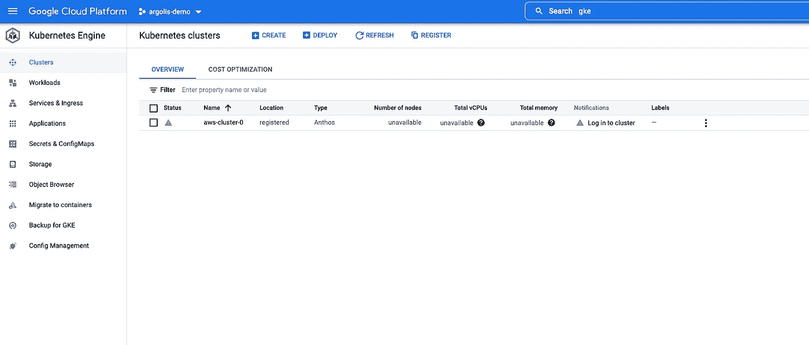

**登录集群**

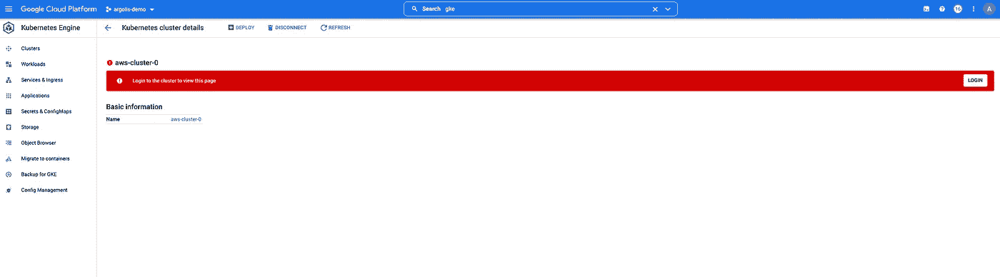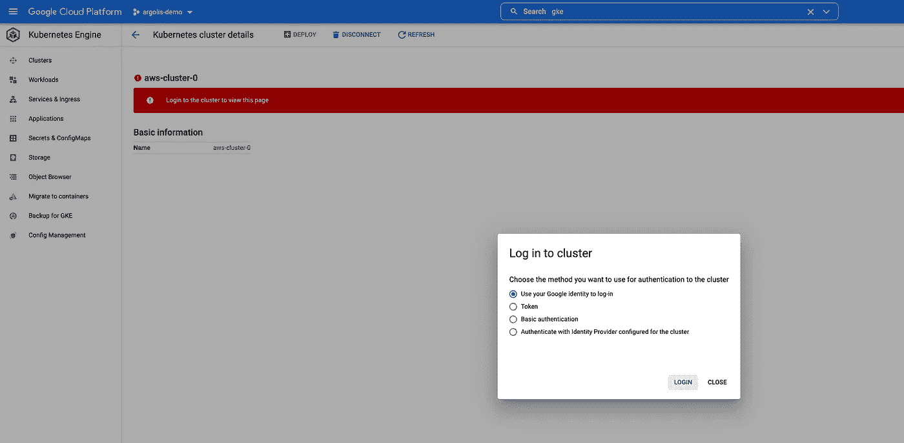

**您可以探索 Kubernetes 引擎 UI，并获得集群的所有信息。**

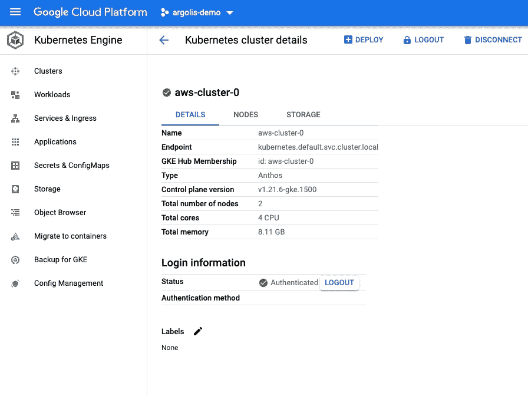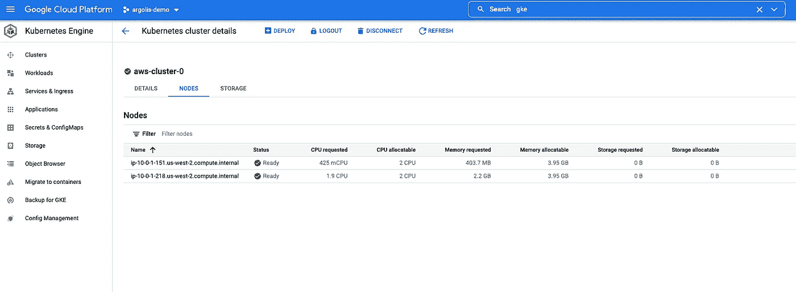

**由于 Anthos 使用 AWS EC2 作为其控制平面和节点，您也可以在 AWS 控制台中查看它们。**

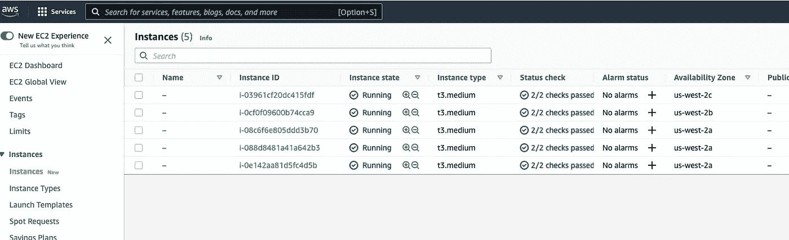

让我们安装 Anthos Service mesh 来更好地了解微服务。

```
curl https://storage.googleapis.com/csm-artifacts/asm/asmcli_1.12 > asmclichmod +x asmcliKUBECONFIG_LOCATION=$(echo "$HOME/.kube/config")./asmcli install \
  --fleet_id $PROJECT_ID \
  --kubeconfig $KUBECONFIG_LOCATION \
  --platform multicloud \
  --enable_all \
  --ca mesh_cakubectl -n istio-system get pods -l app=istiod --show-labelsREV=[rev-label] kubectl label namespace default istio.io/rev=${REV} istio-injection- --overwrite kubectl delete pod -n default --all kubectl get pod -n default
```

**你可以查看 Anthos Service Mesh 仪表盘，里面应该会列出所有的服务。**

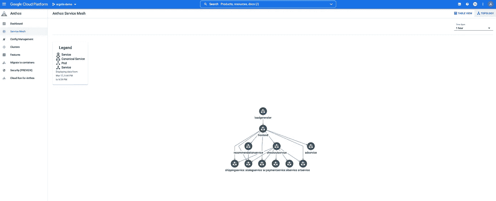

**您可以使用以下命令删除集群，以避免在 EC2 上进行不必要的计费。**

```
gcloud container aws node-pools delete pool-0 --cluster aws-cluster-0 --location $GCP_REGIONgcloud container aws clusters delete aws-cluster-0 --location $GCP_REGION
```

供稿人:[普什卡·科塔瓦德](https://medium.com/u/c79cc28e2999?source=post_page-----fc70ce352c40--------------------------------)，[施吉莫尔·阿·克](https://medium.com/u/41b475b881ff?source=post_page-----fc70ce352c40--------------------------------)，[丹杜斯](https://medium.com/u/71d9487165c6?source=post_page-----fc70ce352c40--------------------------------)