# 谷歌云 Anthos 系列:Anthos 平台技术细节

> 原文：<https://medium.com/google-cloud/google-cloud-anthos-series-f12e91c8c928?source=collection_archive---------0----------------------->

## 谷歌云 Anthos 系列:第 2 部分

欢迎来到“Google Cloud Anthos 系列”的第 2 部分。你可以在这里找到[的完整系列](/google-cloud/google-cloud-anthos-series-23b9a35e9179)

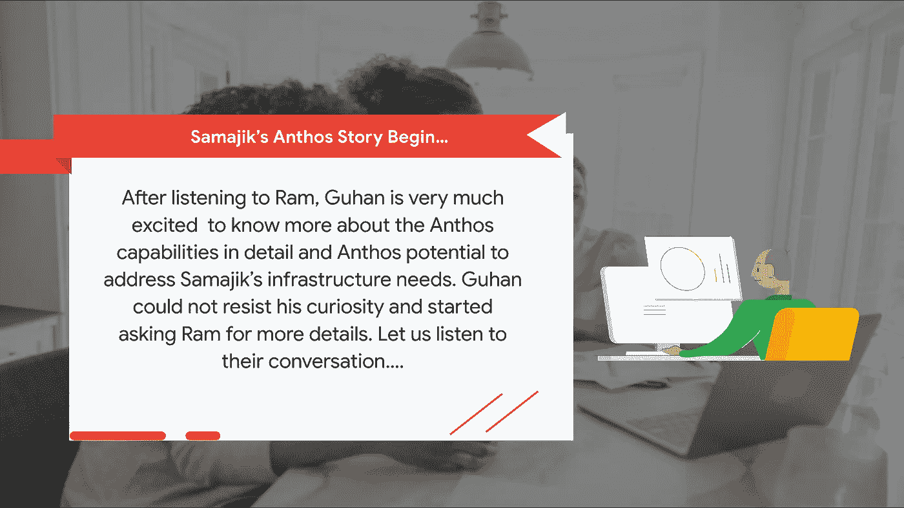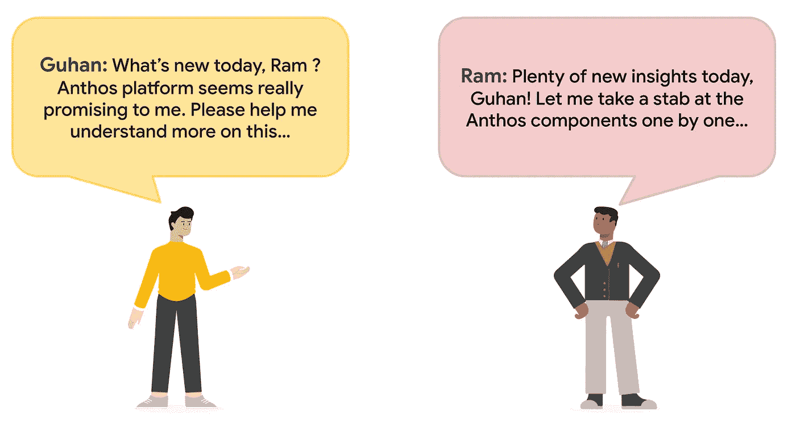

# **Anthos 平台:把云带给你**

Anthos 通过 Google Cloud 支持的控制平面，统一了跨多个 Google Cloud 区域、内部和多个公共云中的 Kubernetes 集群上运行的应用程序的管理，以实现大规模的一致操作。

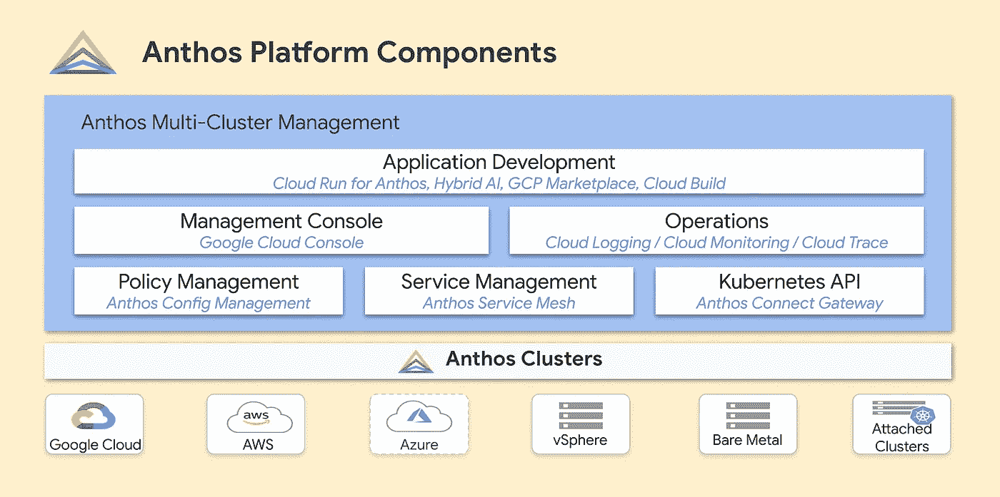

**Anthos 统一用户界面**

Google Cloud Console 中的 Anthos dashboard 为用户提供了一个安全、统一的用户界面来查看和管理分布在多个 Kubernetes 集群中的应用程序。它还提供了所有 Anthos 资源的简化视图。在下面找到示例 Anthos 仪表板。

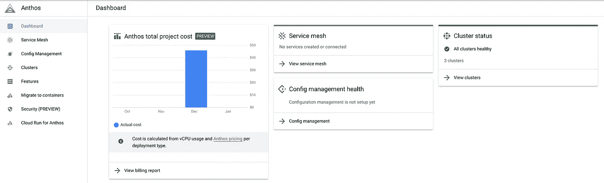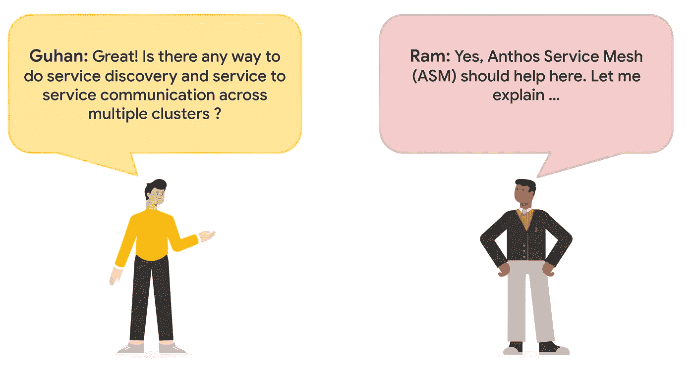

**Anthos 服务网格**

服务网格是一种架构，支持跨微服务的可管理、可观察和安全的通信，允许用户创建由许多微服务组成的健壮的企业应用程序。服务网格通过一致且强大的工具，排除了运行服务的所有常见问题，如监控、联网和安全性。Service mesh 使开发人员和 DevOps 团队能够专注于为他们的用户创建和管理优秀的应用程序，而无需更改应用程序代码。

Anthos 服务网格由一个高度可配置和强大的开源服务网格平台 [Istio](https://istio.io/) 提供支持。服务网格通过代理监控所有流量。在 Kubernetes 平台上，代理通过 sidecar 模式部署到网格中的微服务。

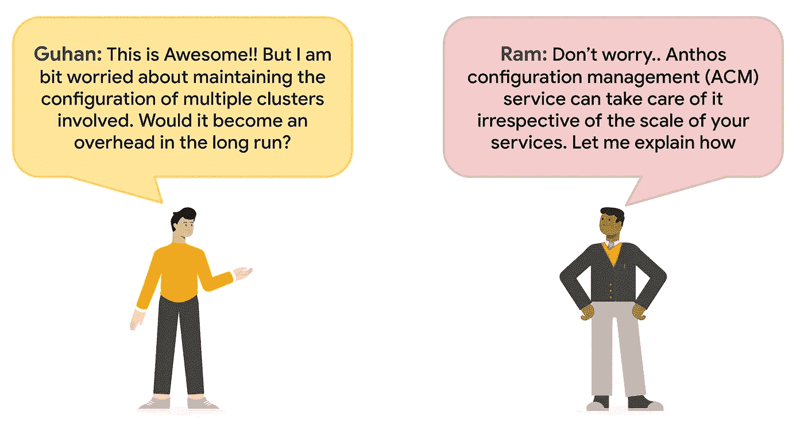

**Anthos 配置管理**

Anthos 配置管理是一个配置和策略管理服务，它结合了策略控制器、配置同步和配置控制器。跨多个 Kubernetes 环境的应用程序增加了治理、资源管理和一致性方面的复杂性。Anthos 配置管理提供了应对这一挑战的解决方案。

“GitOps”或“配置为代码”是管理这种复杂性的一种常见方法，允许用户在 Git 版本控制下存储混合/多云环境的期望状态，并直接应用它，产生可重复的结果。这种方法利用 Kubernetes 的核心概念，比如名称空间、标签和注释，来确定如何以及在哪里将配置更改应用到所有 Kubernetes 集群，而不管它们位于何处。Git repo 为您的所有 Kubernetes 配置提供了一个版本化的、安全的和受控的单一事实来源。

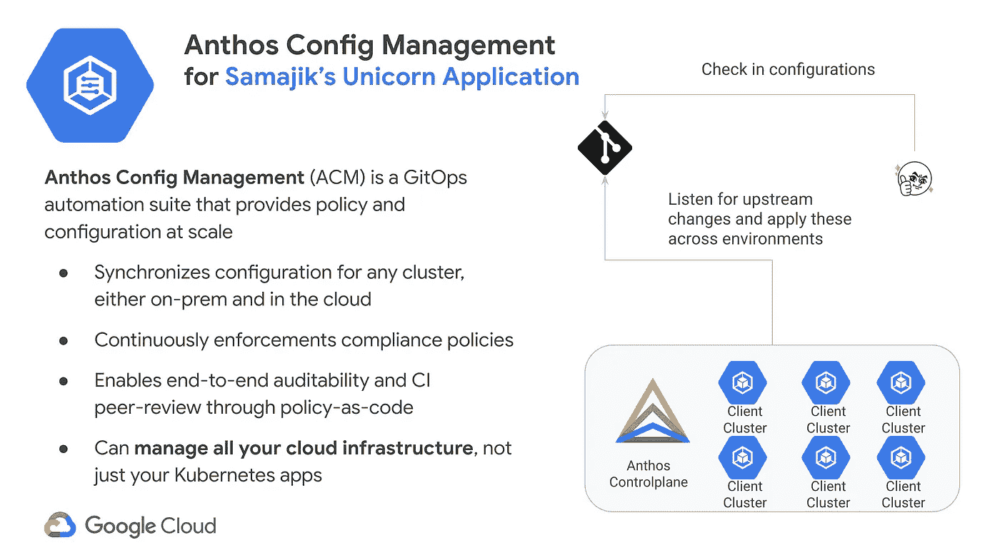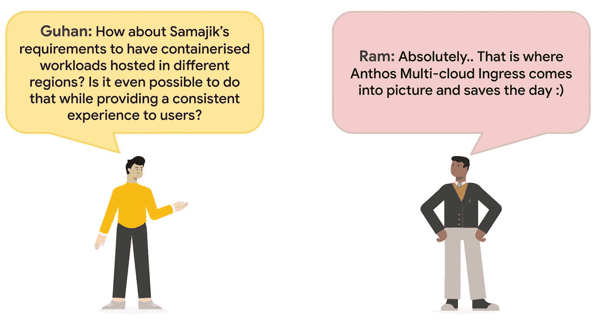

**Anthos 多集群入口**

多集群入口是用于 GKE 集群的云托管多集群入口控制器。它是 Google 托管的服务，支持跨集群和跨地区部署共享负载平衡资源。多集群入口旨在满足多集群、多区域环境的负载平衡需求。它是外部 HTTP(S)负载平衡器的控制器，为来自互联网的流量提供跨一个或多个集群的入口。

许多因素推动了多集群拓扑，包括应用程序的用户接近度、集群和区域高可用性、安全性和组织分离、集群迁移和数据局部性。随着多集群的出现，对正式的、产品化的多集群平台的需求变得更加迫切。

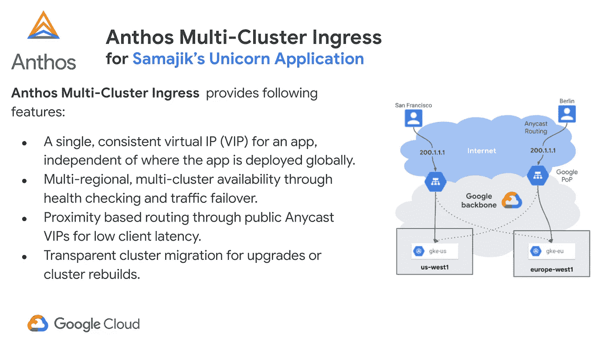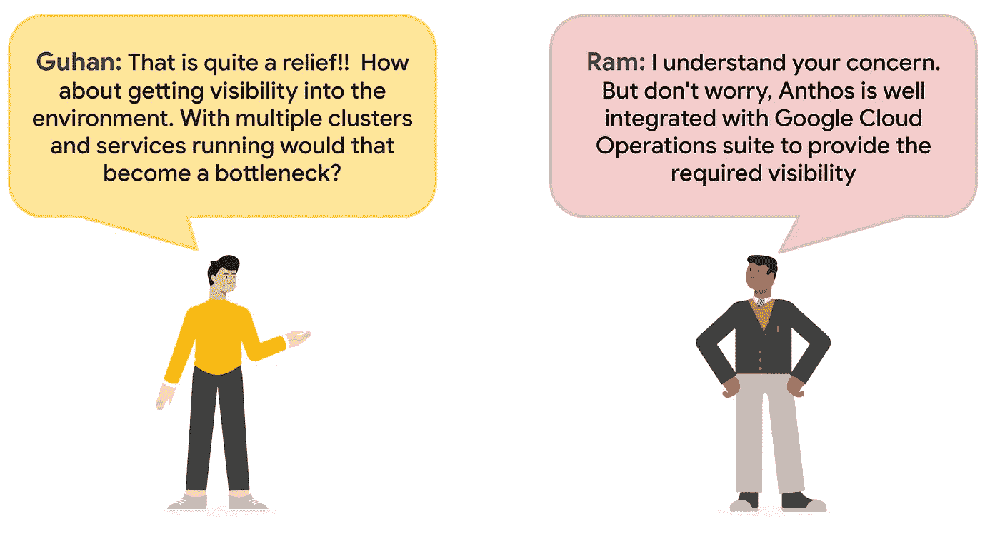

**Anthos 日志记录，监控&痕迹**

Google Cloud 的操作套件为运行在 Google Cloud 上的应用程序和系统提供集成的监控、日志记录和跟踪管理服务。

[云日志](https://cloud.google.com/logging)是一项完全托管的服务，可大规模执行，可以接收应用和平台日志数据，以及来自 GKE 环境、虚拟机和谷歌云内外其他服务的自定义日志数据。

[云监控](https://cloud.google.com/monitoring)提供云计算应用的性能、正常运行时间和整体健康状况的可见性。从 Google 云服务、托管正常运行时间探测器、应用程序工具和各种常见应用程序组件中收集指标、事件和元数据。

应用性能管理(APM)将云日志记录和云监控的监控和故障排除功能与[云跟踪](https://cloud.google.com/trace)、[云调试器](https://cloud.google.com/debugger)和[云剖析器](https://cloud.google.com/profiler)相结合。

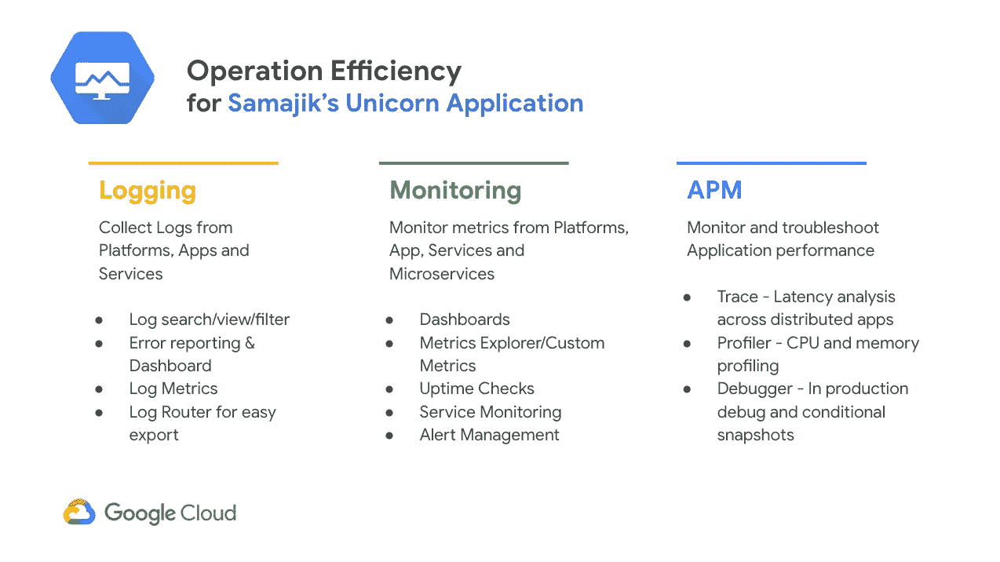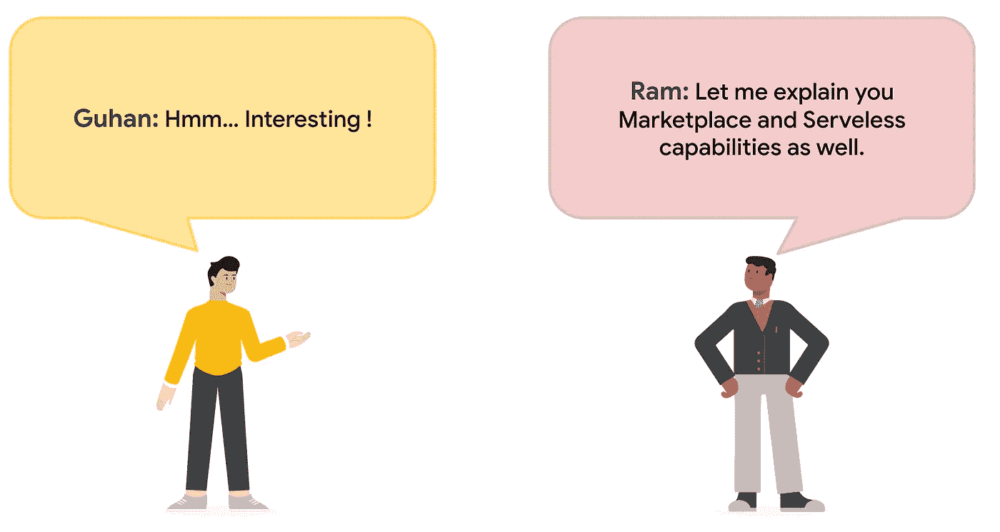

**Anthos 市场应用**

Kubernetes 应用程序是一个“容器化”的应用程序，可以在 Kubernetes 集群上运行。Cloud Marketplace 中的 Kubernetes 应用程序包括容器映像和配置文件，如“Kubectl”配置或“Helm chart”。当用户从 Cloud Marketplace 部署应用程序时，Kubernetes 资源会在集群中创建，并且可以作为一个组进行管理。

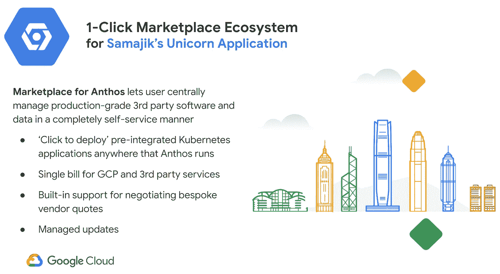

**Anthos 云运行**

面向 Anthos 的 Cloud Run 是谷歌管理并完全支持的 [Knative](https://knative.dev/) 产品。Cloud Run for Anthos 抽象出了 Kubernetes 的复杂性，使得跨混合和多云环境构建和部署无服务器工作负载变得更加容易。Cloud Run 也是 Google Cloud 上的一个完全托管的无服务器平台，没有 Kubernetes 平台的要求。

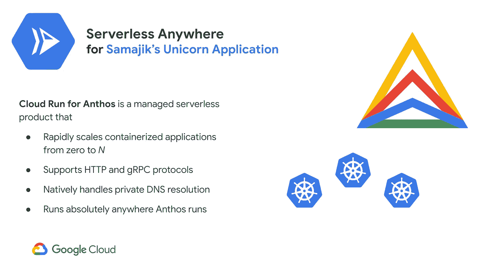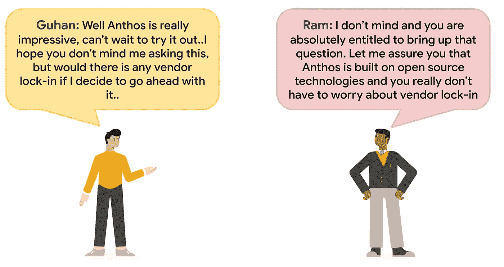

**没有供应商锁定**

Anthos 平台的设计考虑到了开源技术，这使得用户可以自由地进行升级，而不受供应商的限制。

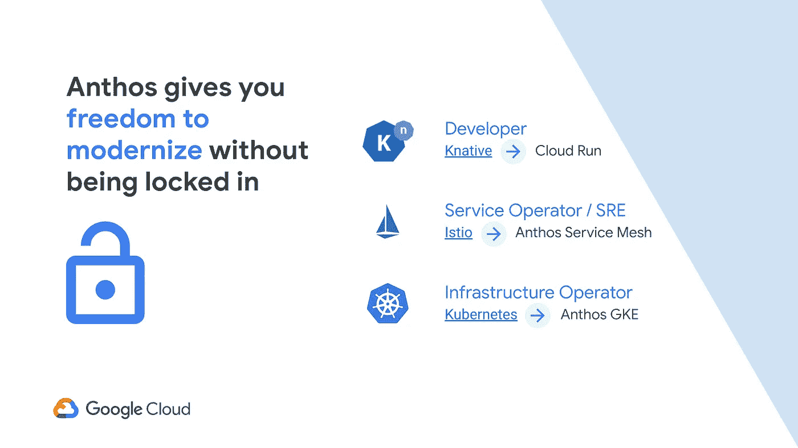

**来了..**

在这篇博客中，我们讨论了 Anthos 的技术细节和功能。在接下来的博客中，我们将继续 Samajik 收养 Anthos 的旅程。

供稿人:[施吉木尔·阿克](https://medium.com/u/41b475b881ff?source=post_page-----f12e91c8c928--------------------------------)，[安其特·尼尚](https://medium.com/u/2d47f7f3f8e2?source=post_page-----f12e91c8c928--------------------------------)，[丹杜斯](https://medium.com/u/71d9487165c6?source=post_page-----f12e91c8c928--------------------------------)