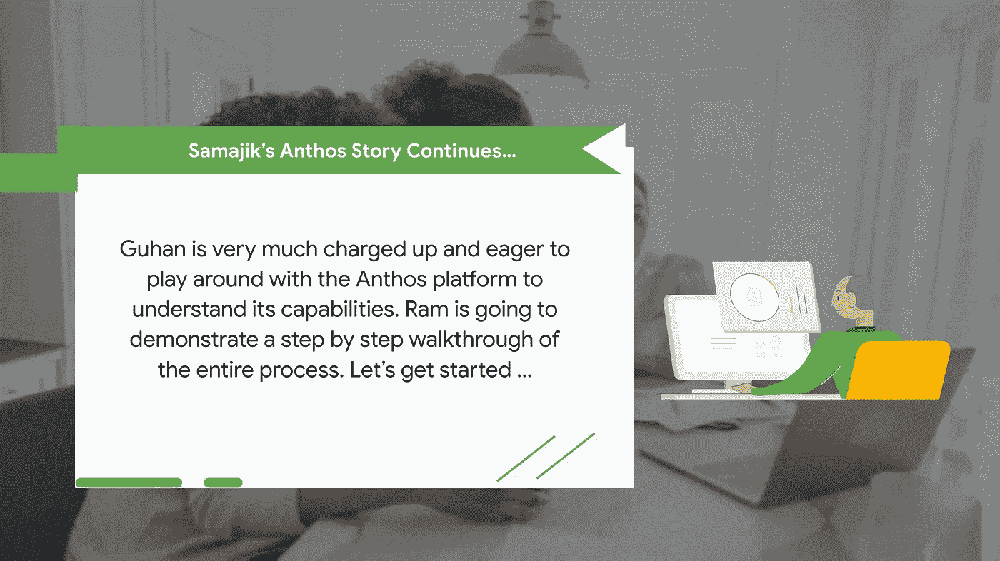
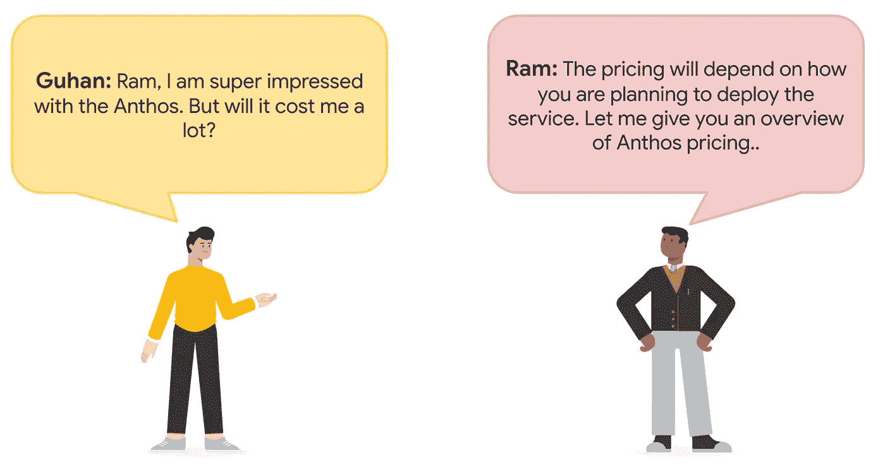
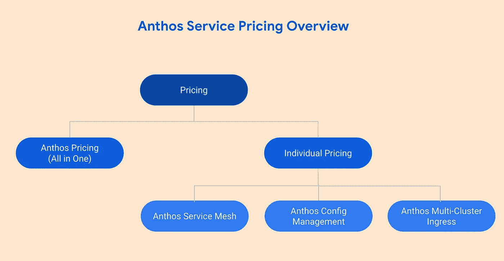
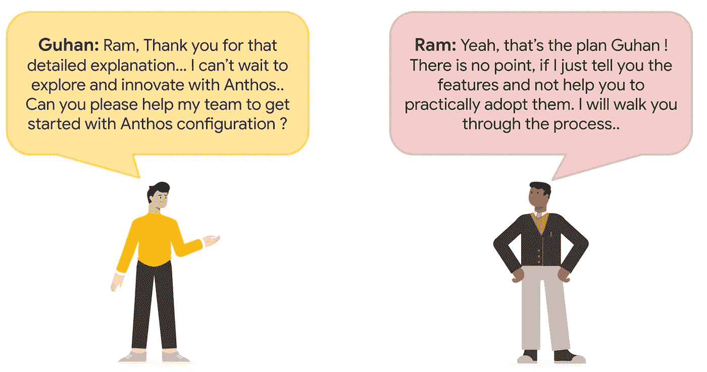
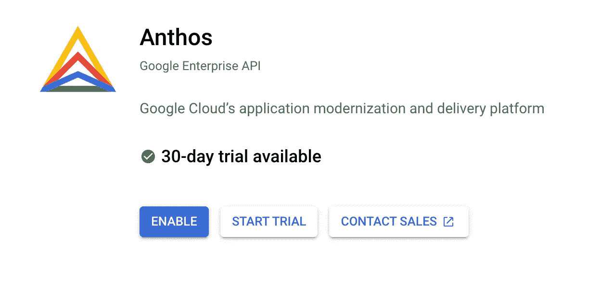
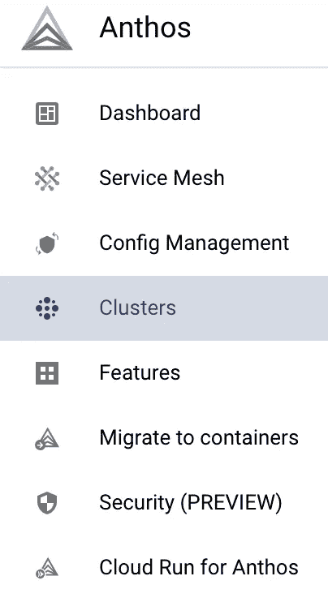
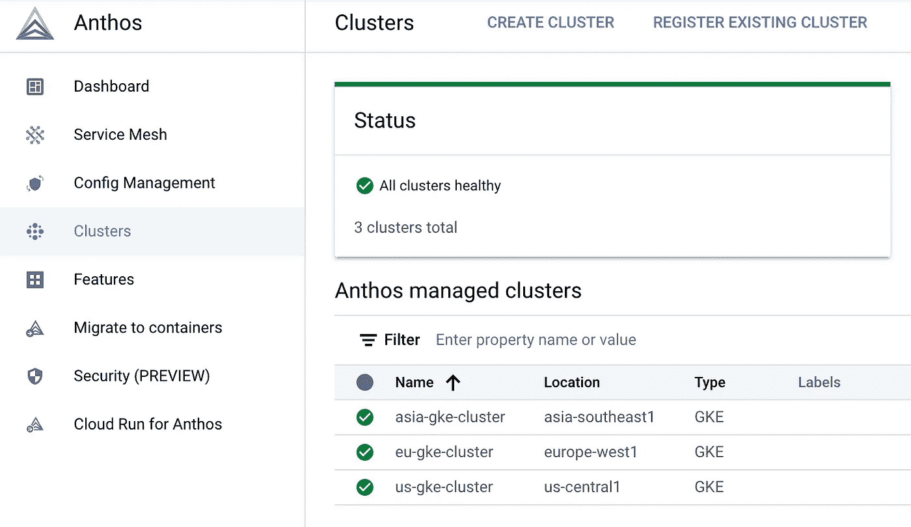

# 谷歌云 Anthos 系列:Anthos 平台入门

> 原文：<https://medium.com/google-cloud/google-cloud-anthos-series-part3-e8af35e47bc?source=collection_archive---------2----------------------->

## 谷歌云 Anthos 系列:第 3 部分

欢迎来到“Google Cloud Anthos 系列”的第 3 部分。你可以在这里找到[的完整系列](/google-cloud/google-cloud-anthos-series-23b9a35e9179)

## **Anthos:定价概述**

有两种定价模式。**“定价模式-1: Anthos 定价(All in One)”**如果组织希望使用所有 Anthos 原生功能，则更有意义；而**“定价模式-2:Anthos 组件的单独定价”**如果组织希望在完全运行在 Google 云平台上时使用一两个功能，则更适合。

> P ***ricing 模型-1: Anthos 定价(全合一)***
> 
> 在这种方法中，用户只需要从谷歌云控制台启用“Anthos API”。用户可以选择“现收现付”定价方案或“订阅”定价方案。

**启用 Anthos API**

Anthos 收费适用于所有 Anthos 管理的集群，并基于 Anthos 集群 vCPUs 的数量，按小时收费。当一个 vCPU 被 Anthos 控制平面视为可调度的计算能力时，它被视为“处于管理之下”。

***参考*** : [*Anthos 定价*](https://cloud.google.com/anthos/pricing)

> ***定价模式-2:Anthos 组件的单独定价。*** (仅在 Google 云平台上运行时适用)
> 
> 在这种方法中，应该禁用 Anthos API。用户需要启用单独的 Anthos 组件。

**禁用 Anthos API**

如果您想使用“单独的 Anthos 组件定价”模式，请确保禁用 Anthos API。

**Anthos 服务网格**

Anthos Service Mesh 可以作为 Anthos 的一部分，也可以作为 Google Cloud 上的一个独立产品。项目上启用的 Google APIs 决定了如何向您收费。要将 Anthos Service Mesh 用作独立服务，请不要在您的项目中启用 Anthos API。如果您想在内部或其他云上使用 Anthos 服务网格，您必须订阅 Anthos。

***参考*** *:* [*服务网状定价*](https://cloud.google.com/service-mesh/pricing)

**Anthos 配置管理**

配置控制器使用 GKE 集群作为底层基础设施，在删除集群之前，您需要支付 Anthos 配置管理费用和 GKE 集群费用。

注意:由于 Anthos 配置管理已经包含在 [Anthos 定价](https://cloud.google.com/anthos/pricing)中，因此不会向 Anthos 客户(定价模型-1)收取 Anthos 配置管理费。

***参考*** *:* [*配置管理定价*](https://cloud.google.com/anthos-config-management/docs/pricing)

**Anthos 多集群入口**

如果您拥有未获得 Anthos 许可的 GKE 集群，当您使用多集群入口时，将按独立定价费率计费。无论您使用 Anthos 许可还是独立定价，多集群入口的功能都是相同的。

注意:多集群入口是 Anthos 的一部分。如果您启用了 Anthos API，并且您的集群注册到了一个机群，那么使用多集群入口就不需要额外付费。

***参考****:*[*Anthos 多集群入口*](https://cloud.google.com/kubernetes-engine/pricing#multi-cluster-ingress)

## Anthos:初始设置指南

这个博客系列将遵循'**定价模型-1: Anthos 定价(All in One)'** ，启用 Anthos API。

下图显示了 Samajik 的最终状态架构。请按照逐步指南设置 Anthos 平台，并注册分布在亚洲、欧洲和美国的 GKE 集群。

Samajik 在 Anthos 平台上的结束状态架构。

**谷歌云项目&计费账户**

在 Google Cloud 控制台的项目选择器页面上，选择或创建一个 Google Cloud 项目。还要确保为您的云项目启用了计费。

**谷歌云控制台:Anthos API**

为您的项目启用 Anthos API。启用这个 API 可以让您在项目中使用 Anthos 特性。

Anthos API:谷歌云仪表板

**Anthos 仪表板:集群选项**

在谷歌云控制台中，选择 Anthos 部分的“集群”选项。

**Anthos 仪表板:创建 GKE 集群**

从 Anthos dashboard，跨亚洲、欧洲和美国地区创建新的 GKE 集群。

Anthos 仪表板:创建集群选项

**Anthos 仪表板:注册 GKE 集群**

将新创建的 GKE 集群注册到 Anthos 控制平面

即将到来..

在这篇博客中，我们讨论了 Anthos 的定价和 Anthos 的初始设置过程。在接下来的博客中，我们将继续 Samajik 收养 Anthos 的旅程。

供稿人:[施吉木尔·阿克](https://medium.com/u/41b475b881ff?source=post_page-----e8af35e47bc--------------------------------)，[安其特·尼尚](https://medium.com/u/2d47f7f3f8e2?source=post_page-----e8af35e47bc--------------------------------)，[丹杜斯](https://medium.com/u/71d9487165c6?source=post_page-----e8af35e47bc--------------------------------)