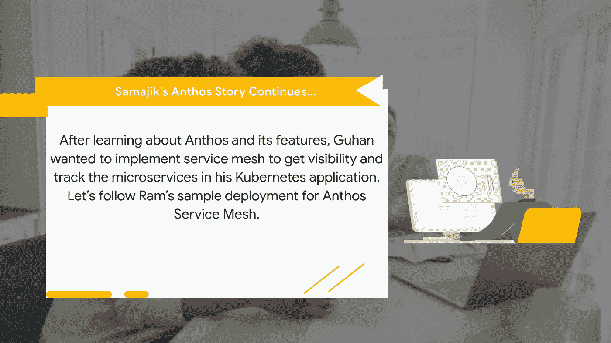
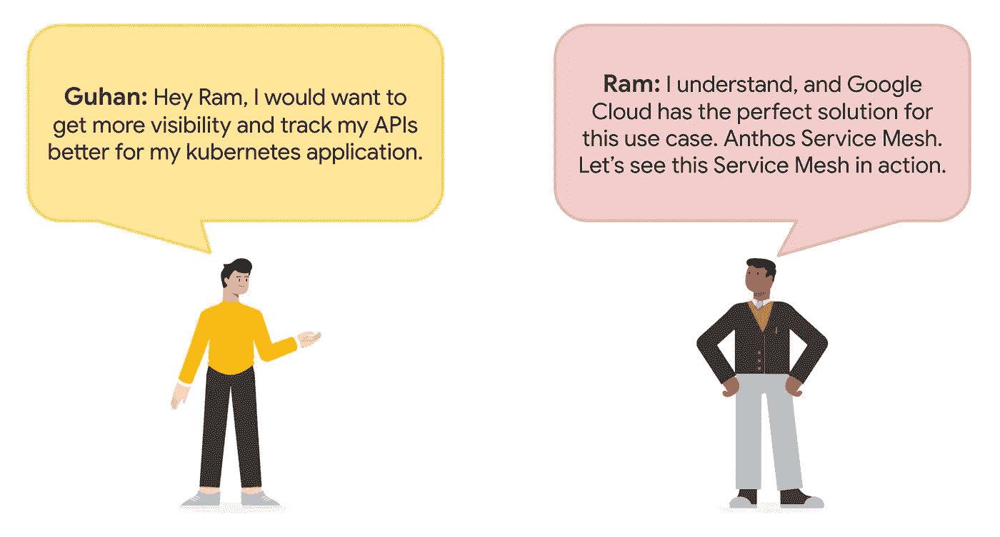
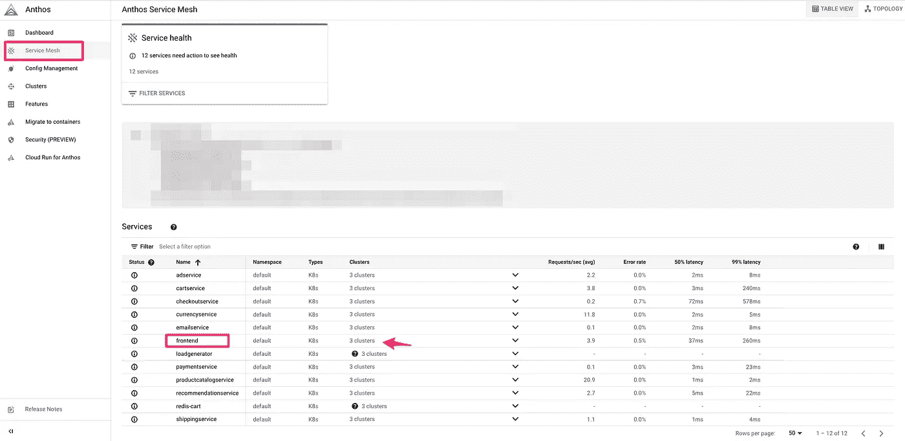
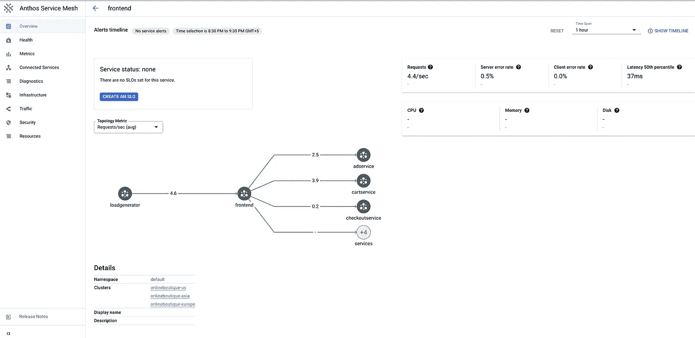
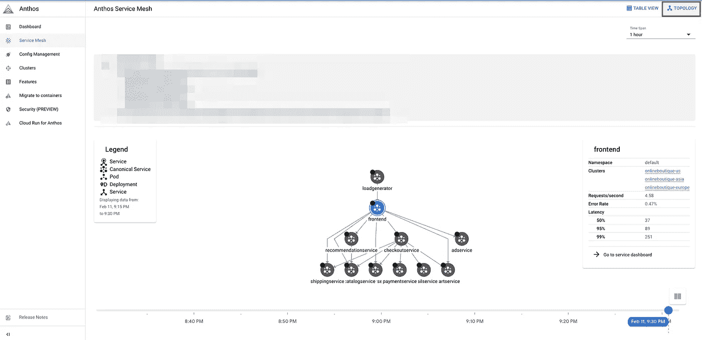

# 谷歌云 Anthos 系列:Anthos 服务网格

> 原文：<https://medium.com/google-cloud/google-cloud-anthos-series-part4-e23172b61ec9?source=collection_archive---------1----------------------->

## 谷歌云 Anthos 系列: **Part-4**

欢迎来到“谷歌云系列”的第 4 部分。你可以在这里找到完整的系列。



这些是使用 Anthos 服务网格时容器化工作负载的部署选项。

*   集群内控制平面:在集群内部署中，Istiod 安装在您自己的集群中。
*   托管 Anthos 服务网格:通过托管 Anthos 服务网格，Google 可以为您处理升级、扩展和安全问题，最大限度地减少手动用户维护。

对于此部署，我们将使用集群内部署，该部署与我们在“Google Cloud Devops 系列”中使用的在线精品应用程序相同[此处](/google-cloud/google-cloud-devops-part-1-introduction-to-google-native-devops-process-bfb55be9e3f3)。

**设置** `**PROJECT_ID**` **环境变量，确保 Google Kubernetes 引擎和云操作 API 启用。**

```
PROJECT_ID="<your-project-id>"
gcloud services enable container.googleapis.com --project ${PROJECT_ID}
gcloud services enable monitoring.googleapis.com \
    cloudtrace.googleapis.com \
    clouddebugger.googleapis.com \
    cloudprofiler.googleapis.com \
    --project ${PROJECT_ID}
```

**克隆在线精品知识库。**

```
git clone [https://github.com/GoogleCloudPlatform/microservices-demo.git](https://github.com/GoogleCloudPlatform/microservices-demo.git)
cd microservices-demo
```

**在三个不同的地区创建三个 GKE 集群。**

```
ZONE1=us-central1-b
ZONE2=europe-west1-b
ZONE3=asia-south1-bgcloud container clusters create us-gke-cluster \
    --project=${PROJECT_ID} --zone=${ZONE1} \
    --machine-type=e2-standard-2 --num-nodes=4 \
    --scopes=cloud-platform \
    --workload-pool=${PROJECT_ID}.svc.id.googgcloud container clusters create eu-gke-cluster \
    --project=${PROJECT_ID} --zone=${ZONE2} \
    --machine-type=e2-standard-2 --num-nodes=4 \
    --scopes=cloud-platform \
    --workload-pool=${PROJECT_ID}.svc.id.googgcloud container clusters create asia-gke-cluster \
    --project=${PROJECT_ID} --zone=${ZONE3} \
    --machine-type=e2-standard-2 --num-nodes=4 \
    --scopes=cloud-platform \
    --workload-pool=${PROJECT_ID}.svc.id.goog
```

**在每个集群中安装 Anthos 服务网格。**

```
curl https://storage.googleapis.com/csm-artifacts/asm/asmcli > asmclichmod +x asmcli./asmcli install \
  --project_id $PROJECT_ID \
  --cluster_name us-gke-cluster \
  --cluster_location $ZONE1 \
  --enable_all \
  --ca mesh_ca./asmcli install \
  --project_id $PROJECT_ID \
  --cluster_name eu-gke-cluster \
  --cluster_location $ZONE2 \
  --enable_all \
  --ca mesh_ca./asmcli install \
  --project_id $PROJECT_ID \
  --cluster_name asia-gke-cluster \
  --cluster_location $ZONE3 \
  --enable_all \
  --ca mesh_ca
```

有一个可选标志- -fleet_id。Fleets(以前称为 environs)是 Google Cloud 的一个概念，用于逻辑地组织集群和其他资源，让您可以使用和管理多集群功能，并在您的系统中应用一致的策略。在我们的例子中，因为所有的集群都在同一个项目中，所以我们不需要指定 fleet-id。

**安装完成后，检查控制面板盒是否正在运行。**

版本标签在`rev=`之后，为版本标签值创建环境变量。

```
kubectl -n istio-system get pods -l app=istiod --show-labelsREV=[rev-label]
```

**通过使用 kubectx 命令更改 kubectl 上下文，为所有集群启用 sidecar 注入。**

```
kubectx gke_${PROJECT_ID}_${ZONE1}_us-gke-clusterkubectl label namespace default istio.io/rev=${REV} istio-injection- --overwritekubectx gke_${PROJECT_ID}_${ZONE2}_eu-gke-clusterkubectl label namespace default istio.io/rev=${REV} istio-injection- --overwritekubectx gke_${PROJECT_ID}_${ZONE3}_asia-gke-clusterkubectl label namespace default istio.io/rev=${REV} istio-injection- --overwrite
```

您可以放心地忽略“未找到”错误。

**将应用程序部署到集群。**

```
kubectx gke_${PROJECT_ID}_${ZONE1}_us-gke-cluster
kubectl apply -f ./release/kubernetes-manifests.yamlkubectx gke_${PROJECT_ID}_${ZONE2}_eu-gke-cluster
kubectl apply -f ./release/kubernetes-manifests.yamlkubectx gke_${PROJECT_ID}_${ZONE3}_asia-gke-cluster
kubectl apply -f ./release/kubernetes-manifests.yaml
```

等待容器准备好，检查每个容器中是否有两个容器。

```
kubectx gke_${PROJECT_ID}_${ZONE1}_us-gke-cluster
kubectl get pods
```

**使用 Anthos 服务网格仪表板评估服务性能**

1.  在控制台中，进入**导航菜单**>**Anthos**>**仪表盘**。
2.  点击**服务网格**。



3.您应该能够查看 service wise 仪表板并获得拓扑指标。



您可以使用不同的服务探索仪表板。

4.使用拓扑视图更好地可视化您的网格



即将到来..

在这篇博客中，我们讨论了 Anthos 服务网格。在接下来的博客中，我们将继续 Samajik 的旅程和其他 Anthos 特性。

供稿人:[施吉木尔·阿克](https://medium.com/u/41b475b881ff?source=post_page-----e23172b61ec9--------------------------------)，[普什卡·科塔瓦德](https://medium.com/u/c79cc28e2999?source=post_page-----e23172b61ec9--------------------------------)，[丹杜斯](https://medium.com/u/71d9487165c6?source=post_page-----e23172b61ec9--------------------------------)