# 谷歌云 Anthos 系列:Anthos 配置管理

> 原文：<https://medium.com/google-cloud/google-cloud-anthos-series-part5-a17ce89ddc7a?source=collection_archive---------1----------------------->

## 谷歌云系列:第 5 部分

W 欢迎来到“谷歌云 Anthos 系列”的第 5 部分。你可以在这里找到完整的系列[。](/google-cloud/google-cloud-anthos-series-23b9a35e9179)

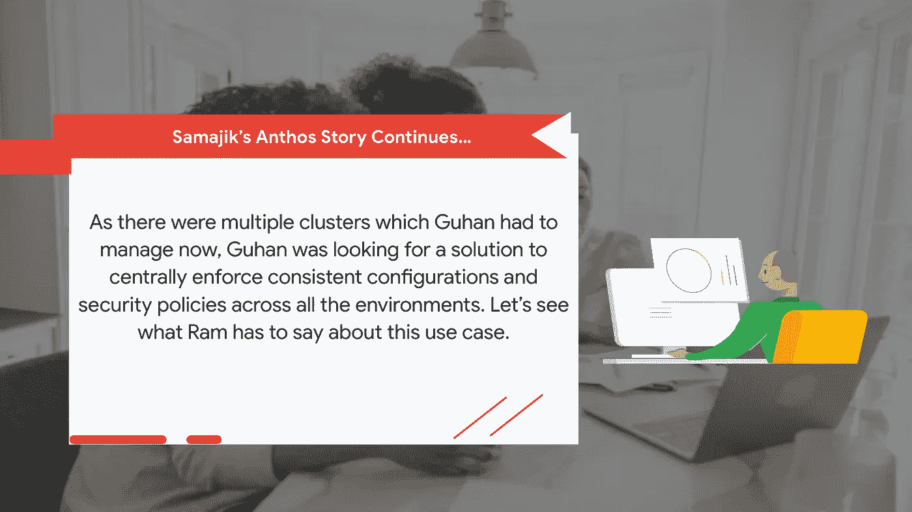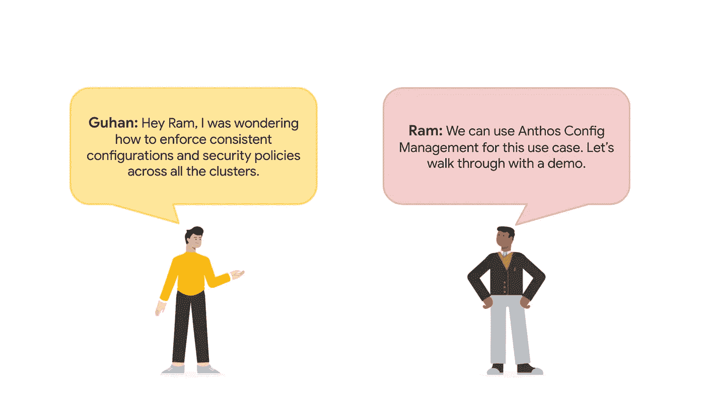

**设置** `**PROJECT_ID**` **环境变量，确保 Google Kubernetes 引擎和云操作 API 启用。**

```
PROJECT_ID="<your-project-id>"
gcloud services enable container.googleapis.com --project ${PROJECT_ID}
gcloud services enable monitoring.googleapis.com \
    cloudtrace.googleapis.com \
    clouddebugger.googleapis.com \
    cloudprofiler.googleapis.com \
    --project ${PROJECT_ID}
```

**克隆线上精品库。**

```
git clone [https://github.com/GoogleCloudPlatform/microservices-demo.git](https://github.com/GoogleCloudPlatform/microservices-demo.git)
cd microservices-demo
```

在三个不同的区域创建 GKE 集群。确保您有一个跨越至少 3 个区域的 VPC，您希望您的集群驻留在这些区域中。

```
ZONE1=us-central1-b
ZONE2=europe-west1-b
ZONE3=asia-south1-bgcloud container clusters create us-gke-cluster \
    --project=${PROJECT_ID} --zone=${ZONE1} \
    --machine-type=e2-standard-2 --num-nodes=4 \
    --scopes=cloud-platform \
    --workload-pool=${PROJECT_ID}.svc.id.googgcloud container clusters create eu-gke-cluster \
    --project=${PROJECT_ID} --zone=${ZONE2} \
    --machine-type=e2-standard-2 --num-nodes=4 \
    --scopes=cloud-platform \
    --workload-pool=${PROJECT_ID}.svc.id.googgcloud container clusters create asia-gke-cluster \
    --project=${PROJECT_ID} --zone=${ZONE3} \
    --machine-type=e2-standard-2 --num-nodes=4 \
    --scopes=cloud-platform \
    --workload-pool=${PROJECT_ID}.svc.id.goog
```

启用 Anthos 配置管理 API

```
gcloud beta container hub config-management enable
```

创建云资源存储库

```
gcloud source repos create <repo name>
```

确保群集的默认服务帐户 PROJECT_NUMBER-compute@developer.gserviceaccount.com 拥有对存储库的 source.reader 访问权限。

```
PROJECT_NUMBER=$(gcloud projects describe $PROJECT_ID --format="value(projectNumber)")gcloud projects add-iam-policy-binding ${PROJECT_ID} --member serviceAccount:${PROJECT_NUMBER}-compute@developer.gserviceaccount.com --role roles/source.reader
```

将线上精品应用推送到新创建的云源码库中。

将应用程序部署到所有集群。

```
kubectx gke_${PROJECT_ID}_${ZONE1}_us-gke-cluster
kubectl apply -f ./release/kubernetes-manifests.yamlkubectx gke_${PROJECT_ID}_${ZONE2}_eu-gke-cluster
kubectl apply -f ./release/kubernetes-manifests.yamlkubectx gke_${PROJECT_ID}_${ZONE3}_asia-gke-cluster
kubectl apply -f ./release/kubernetes-manifests.yaml
```

我们需要创建约束并将文件推送到云资源存储库。

下面是一个示例约束，它将拒绝创建任何特权容器。

文件夹结构:/all policies/policies/policy . YAML(截图)

```
#policy.yaml
apiVersion: constraints.gatekeeper.sh/v1beta1
kind: K8sPSPPrivilegedContainer
metadata:
  name: psp-privileged-container
spec:
  match:
    excludedNamespaces:
    - kube-system
    kinds:
    - apiGroups:
      - ""
      kinds:
      - Pod
```

将策略推送到源代码存储库。

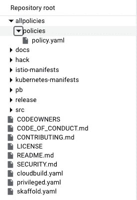

安装 Anthos 配置管理，并通过 GKE 控制台配置策略控制器。

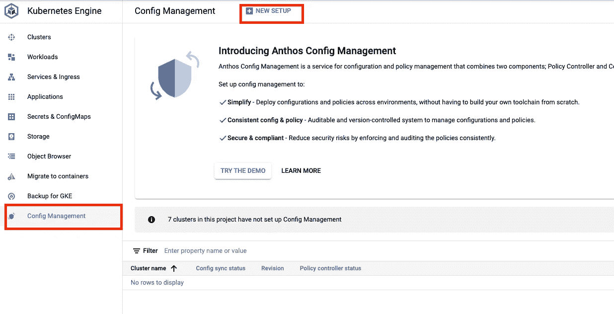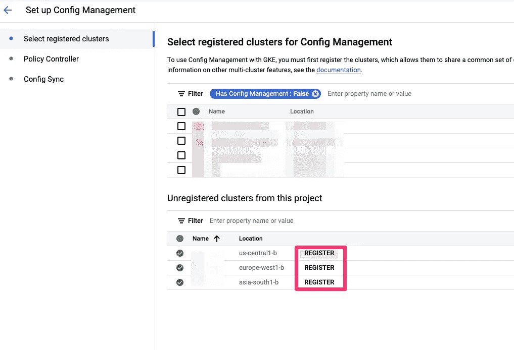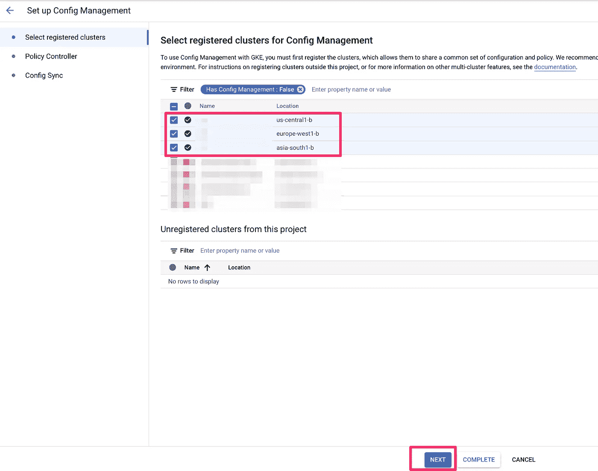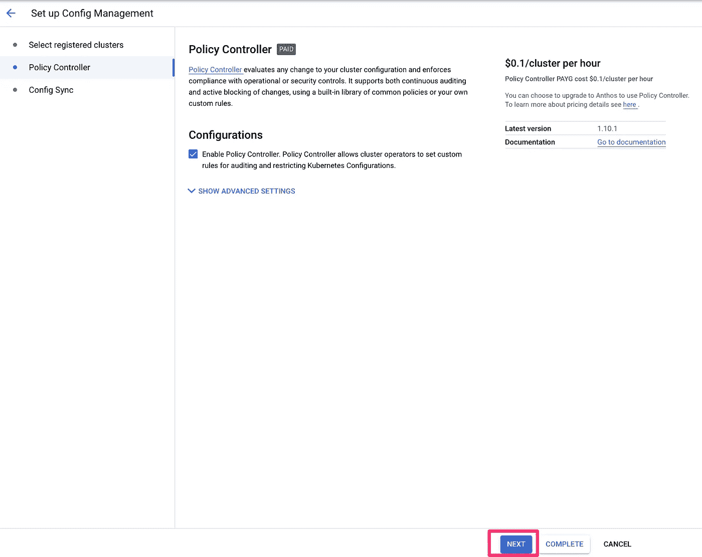

使用下面的命令获取存储库的端点。我们将在下一步需要它。

```
gcloud source repos list
```

将您的云资源库的 URL 粘贴如下，并点击显示高级选项。

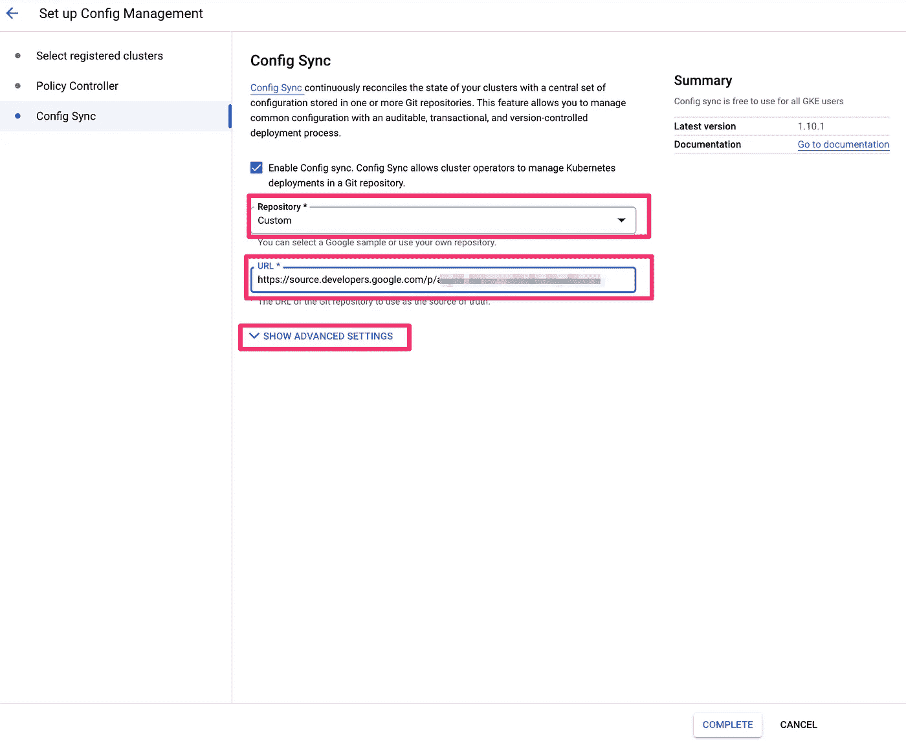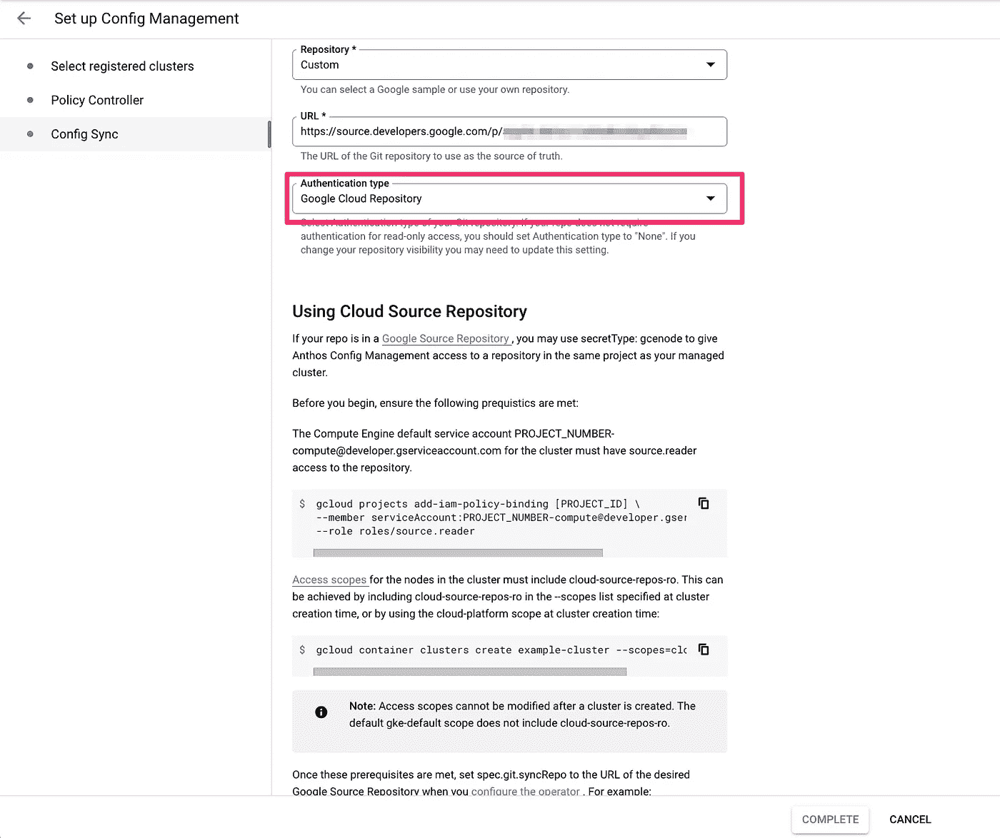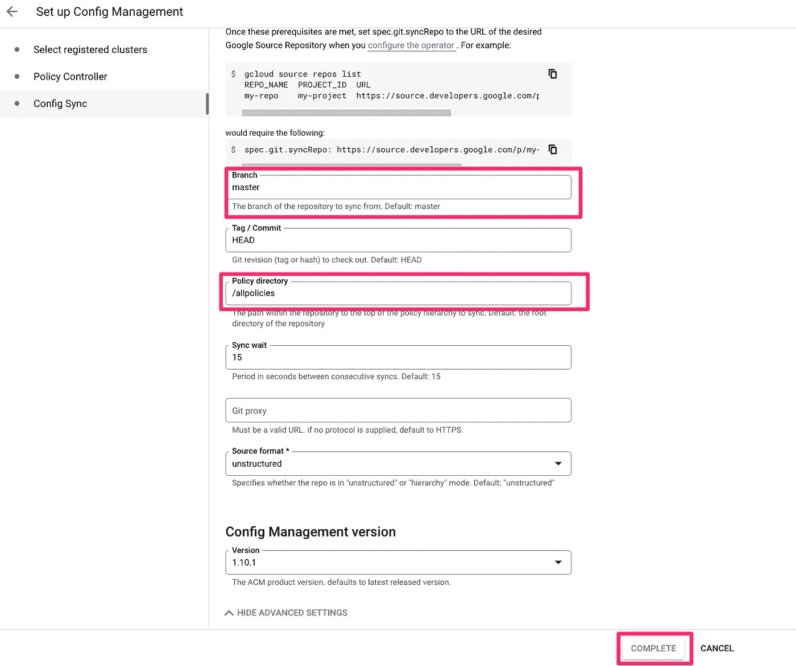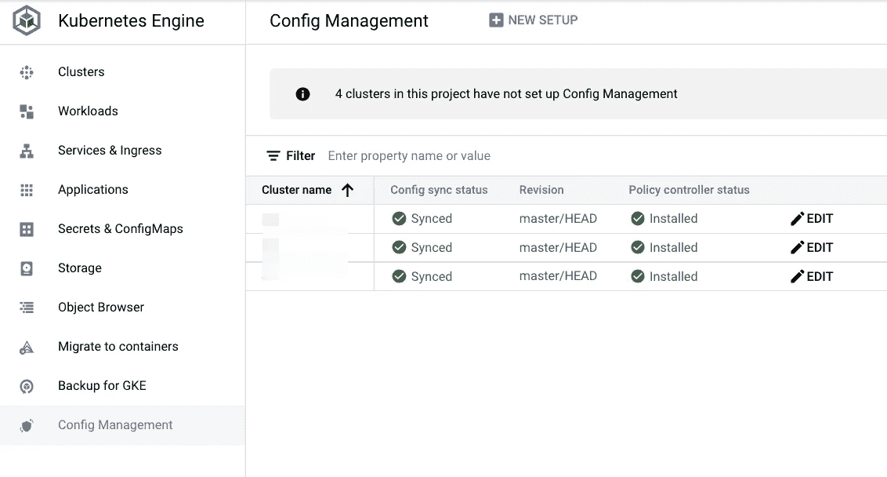

您可以验证 Config Sync 正在将此约束同步到您的 GKE 集群。

```
kubectx gke_${PROJECT_ID}_${ZONE1}_us-gke-cluster
kubectl get constraintkubectx gke_${PROJECT_ID}_${ZONE2}_eu-gke-cluster
kubectl get constraintkubectx gke_${PROJECT_ID}_${ZONE3}_asia-gke-cluster
kubectl get constraint
```

您应该能够看到如下输出。

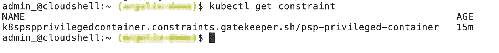

现在，让我们为拥有特权容器的 pod 创建一个清单(privileged.yaml)。

```
#privileged.yaml
apiVersion: v1
kind: Pod
metadata:
 labels:
   app: nginx-privileged
 name: nginx-privileged-disallowed
spec:
 containers:
 - image: nginx
   name: nginx
   securityContext:
     privileged: true
```

尝试将违反策略的清单部署到任何群集。

```
kubectx gke_${PROJECT_ID}_${ZONE1}_us-gke-clusterkubectl apply -f privileged.yaml
```

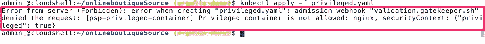

它应该会失败，并显示以下错误。

```
Error from server (Forbidden): error when creating "privileged.yaml": admission webhook "validation.gatekeeper.sh" denied the request: [psp-privileged-container] Privileged container is not allowed: nginx, securityContext: {"privileged": true}
```

如果我们在 *dryrun* 模式下运行约束，我们可以通过状态字段中的以下命令查看违反情况。

```
kubectl get K8sPSPPrivilegedContainer psp-privileged-container -o yaml
```

**即将推出..**

在这篇博客中，我们讨论了 Anthos 配置管理。在接下来的博客中，我们将继续 Samajik 的旅程和其他 Anthos 特性。

供稿人:[施吉木尔·阿克](https://medium.com/u/41b475b881ff?source=post_page-----a17ce89ddc7a--------------------------------)，[普什卡尔·科塔瓦德](https://medium.com/u/c79cc28e2999?source=post_page-----a17ce89ddc7a--------------------------------)，[丹杜斯](https://medium.com/u/71d9487165c6?source=post_page-----a17ce89ddc7a--------------------------------)