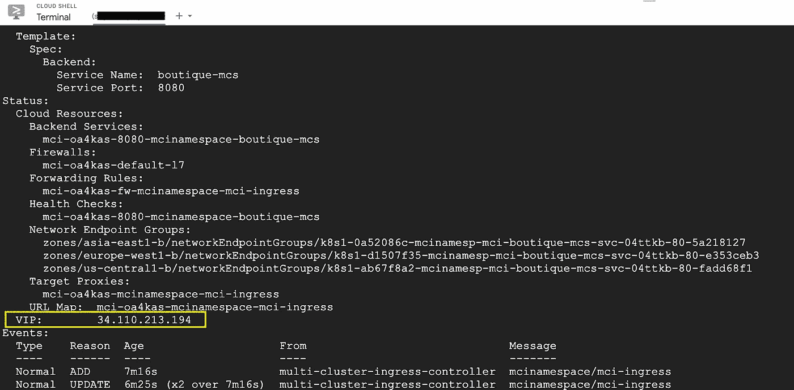

# 谷歌云 Anthos 系列-Anthos 多集群入口

> 原文：<https://medium.com/google-cloud/google-cloud-anthos-series-part6-bbb70e2f9979?source=collection_archive---------0----------------------->

## **谷歌云 Anthos 系列:第六部**

W 欢迎来到“谷歌云 Anthos 系列”的第 6 部分。你可以找到完整的系列[她的](/google-cloud/google-cloud-anthos-series-23b9a35e9179) e


Multi Cluster Ingress 是 Google 托管的服务，帮助客户通过部署在多个云区域的集群来构建弹性 Anthos 架构。除了弹性之外，它还有助于将流量重定向到最近的集群，以确保最低的延迟和一致的用户体验。在包装之下，该服务通过外部 HTTP(s)负载平衡服务利用 [Google 前端(GFEs)](https://cloud.google.com/docs/security/infrastructure/design#google_front_end_service) 。任何传入的请求都由 GFEs 路由到离客户端最近的 GKE 集群。当存在工作负载或数据驻留的区域隔离等要求时，组织还可以选择具有多集群入口的多集群体系结构

## **多集群入口架构组件**

下面简要列出了多集群入口体系结构组件及其功能

**多集群入口控制器(Anthos 入口控制器)**

*   指成员集群之外的控制平面
*   通过创建后端网络端点组(neg ),利用 GCP 的外部负载平衡器
*   LB 的后端端点动态跟踪 pod 端点
*   跟踪集群中的 pod，并确保负载平衡器了解集群中的更新

**配置集群**

*   用于部署多集群入口操作所需的名为*multiclustergress*和 *MultiClusterService* 的自定义资源类型
*   一个 GKE 集群被指定为集中管理多集群入口资源的控制平面
*   *MultiClusterService(MCS)*表示跨不同集群部署的服务，将由负载均衡器公开。
*   *MultiClusterIngress(MCI)*类似于 k8s 集群中的入口资源，它定义了向 MCS 发送匹配流量的后端、路径、协议等

**舰队**

*   以前称为 environ
*   将多个群集组合在一起，作为多群集入口的后端
*   支持“命名空间一致性”，即多个集群中具有相同名称和相同命名空间的资源被分组为单个工作负载

**成员集群**

*   指 GKE 集群注册地一支舰队
*   托管多集群入口将流量重定向到的工作负载
*   默认情况下，MCS 向所有后端集群发送流量，但这可以在 MCS 配置 yaml 中定制，以针对特定集群

多个 GKE 集群的多集群入口的高级架构如下所示:


参考:谷歌云多集群入口[文档](https://cloud.google.com/kubernetes-engine/docs/concepts/multi-cluster-ingress)

## 多集群入口部署

在我们开始部署之前，先说一下定价。虽然 GKE 集群仅使用多集群入口服务，但客户可以选择独立定价。仅当 Anthos API 被禁用时，此定价才适用。如果启用了 Anthos API，并且您也在使用 Anthos 的其他功能，那么计费将取决于集群 vCPUs 和 [Anthos 定价](https://cloud.google.com/anthos/pricing#pricing_table)。对于此次部署，我们将使用 Anthos 定价和我们在之前的 [Google Cloud Devops 博客系列](/google-cloud/google-cloud-devops-part-1-introduction-to-google-native-devops-process-bfb55be9e3f3)中使用的在线精品应用程序

注意:要了解更多关于 Anthos 定价的信息，你可以参考这个博客系列的第 3 部分

部署注意事项

*   部署多集群入口的步骤需要 GCP 项目的 GKE 管理员权限，因为它需要提升权限
*   建议对集群使用[工作负载标识](https://cloud.google.com/kubernetes-engine/docs/how-to/workload-identity)，以便在访问其他 GCP 资源时对集群中的工作负载进行无缝认证

下图显示了 Samajik 使用多集群入口的最终状态架构


下面给出了从云外壳逐步部署多集群入口的步骤。将代码中以粗体标记的变量替换为特定于您的环境的值，如项目 id、集群名称、GCP 地区等

1.  启用部署所需的 API。应该运行下面的命令来使用 Anthos 定价

```
gcloud services enable \
    anthos.googleapis.com \
    multiclusteringress.googleapis.com \
    gkehub.googleapis.com \
    container.googleapis.com \
    --project=**<<Your-project-id>>**
```

2.部署启用了工作负载标识的集群。这里，我们在三个不同的区域部署了三个集群，分别名为集群 1、集群 2 和集群 3

```
gcloud container clusters create cluster1 \
    --zone=us-central1-b \
    --enable-ip-alias \
    --workload-pool=**<<Your-project-id>>**.svc.id.goog \
    --release-channel=stable \
    --project=**<<Your-project-id>>**gcloud container clusters create cluster2 \
    --zone=europe-west1-b \
    --enable-ip-alias \
    --workload-pool=**<<Your-project-id>>**.svc.id.goog \
    --release-channel=stable \
    --project=**<<Your-project-id>>**gcloud container clusters create cluster3 \
    --zone=asia-east1-b \
    --enable-ip-alias \
    --workload-pool=**<<Your-project-id>>**.svc.id.goog \
    --release-channel=stable \
    --project=**<<Your-project-id>>**
```

3.检索集群的凭据，并对其进行重命名，以便于使用。替换集群名称后，对所有三个集群重复以下步骤

```
gcloud container clusters get-credentials cluster1 \
    --zone=us-central1-b \
    --project=***<<Your-project-id>>***kubectl config rename-context gke_***<<Your-project-id>>***_us-central1-b_g*cluster1* *cluster1*
```

4.使用工作负载身份向机群添加集群。替换集群名称后，对所有三个集群重复以下命令

```
gcloud container hub memberships register cluster1 \
    --gke-cluster us-central1-b/cluster1 \
    --enable-workload-identity \
    --project=***<<Your-project-id>>***
```

5.使用以下命令确认舰队成员

```
gcloud container hub memberships list --project=***<<Your-project-id>>***
```

输出将类似于下图


6.将集群 1 配置为配置集群

```
gcloud beta container hub ingress enable \
  --config-membership=cluster1
```

7.使用下面的内容创建一个 yaml 文件 namespace.yaml 来定义名称空间

```
apiVersion: v1
kind: Namespace
metadata:
  name: mcinamespace
```

8.将上下文切换到 cluster1 并部署 namespace.yaml 来创建名称空间。对集群 2 和集群 3 重复相同的步骤

```
kubectl config use-context cluster1
kubectl apply -f namespace.yaml
```

9.从 GitHub 克隆在线精品微服务演示应用程序

```
git clone [https://github.com/GoogleCloudPlatform/microservices-demo.git](https://github.com/GoogleCloudPlatform/microservices-demo.git)
cd microservices-demo/release/
```

10.编辑 kubernetes 清单。yaml 并删除以下配置负载平衡器入口的代码块。我们稍后将为前端服务配置多集群入口

```
 — -
apiVersion: v1
kind: Service
metadata:
 name: frontend-external
spec:
 type: LoadBalancer
 selector:
 app: frontend
 ports:
 — name: http
 port: 80
 targetPort: 8080
```

11.通过切换上下文，在所有三个集群中部署应用程序。以下命令将在集群 1 中创建部署。对集群 2 和集群 3 重复相同的操作

```
kubectl config use-context cluster1kubectl apply -f kubernetes-manifests.yaml -n mcinamespace
```

12.部署成功后，您可以看到门户中列出的每个集群的工作负载

注意:如果由于资源不足而导致调度单元时出现错误，请启用自动扩展或创建额外的节点池来调度单元。


13.下一步是创建一个可以代表所有三个集群的前端服务的 MCS 资源。用下面的内容创建一个文件 mcs_boutique.yaml。

```
apiVersion: networking.gke.io/v1
kind: MultiClusterService
metadata:
  name: boutique-mcs
  namespace: mcinamespace
spec:
  template:
    spec:
      selector:
        app: frontend
      ports:
      - name: web
        protocol: TCP
        port: 8080
        targetPort: 8080
```

14.仅在配置集群 ie 集群 1 中运行以下命令来创建 MCS

```
kubectl config use-context cluster1kubectl apply -f mcs_boutique.yaml
```

15.在切换上下文之后，在其他集群中运行下面的命令，您可以看到在所有具有标签为 *app:mcinamespace* 的集群中创建了一个关联的 headless 服务

```
kubectl config use-context cluster2
kubectl get service -n mcinamespace
```


16.使用下面的内容创建一个文件 mci_boutique.yaml。它将用于创建 MCI 服务

```
apiVersion: networking.gke.io/v1
kind: MultiClusterIngress
metadata:
  name: mci-ingress
  namespace: mcinamespace
spec:
  template:
    spec:
      backend:
        serviceName: boutique-mcs
        servicePort: 8080
```

17.仅在配置集群 ie cluster 1 中运行以下命令来创建 MCI

```
kubectl config use-context cluster1
kubectl apply -f mci_boutique.yaml
```

18.使用以下命令检查 MCI 服务的状态。您应该看到为该服务创建了一个 VIP

```
kubectl describe mci mci-ingress -n mcinamespace
```



除了 VIP，您还可以看到 MCI 控制器创建了多个资源，即负载平衡器、后端服务、防火墙规则、转发规则、网络端点组和健康检查。负载平衡器也可以从谷歌云控制台上看到。


前端 IP 将与之前显示的 VIP 相同。您可以看到后端被配置为跨 neg 分发流量，指向不同区域的三个成员集群


19.该网址可通过 http://MCI VIP >或 http:// <loadbalancer frontendip="">访问</loadbalancer>


**即将到来..**

多集群入口解决了 Samajik 在多个云位置轻松扩展服务的需求。古汉现在更加兴奋地探索 Anthos 的其他功能，Samajik 可以从中受益。请继续关注古汉和拉姆的对话，了解更多信息…

供稿人:[普什卡·科塔瓦德](https://medium.com/u/c79cc28e2999?source=post_page-----bbb70e2f9979--------------------------------)，[安其特·尼尚特](https://medium.com/u/2d47f7f3f8e2?source=post_page-----bbb70e2f9979--------------------------------)，[丹杜斯](https://medium.com/u/71d9487165c6?source=post_page-----bbb70e2f9979--------------------------------)