# 谷歌云 Anthos 系列:Anthos 市场应用

> 原文：<https://medium.com/google-cloud/google-cloud-anthos-series-part7-6b85c5f7016f?source=collection_archive---------1----------------------->

## 谷歌云系列:第 7 部分

欢迎来到“谷歌云 Anthos 系列”的第 7 部分。你可以在这里找到[的完整系列](/google-cloud/google-cloud-anthos-series-23b9a35e9179)

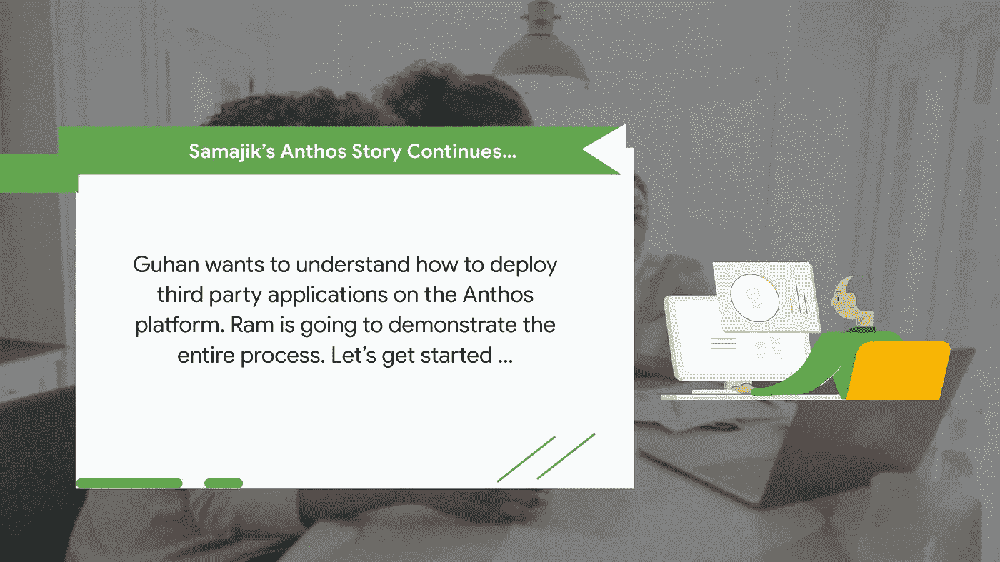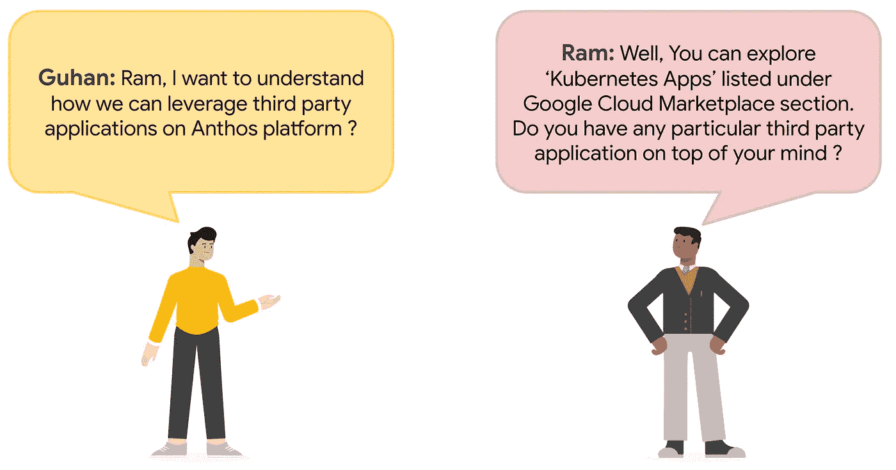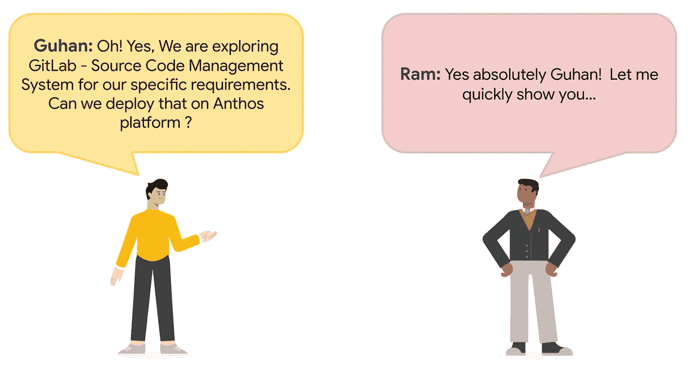

# 谷歌云**市场**

**改善您的解决方案采购体验**

Google Cloud Marketplace 允许您快速部署在 Google Cloud 上运行的功能软件包。即使您不熟悉 GCP 服务，也可以启动熟悉的软件包，而无需手动配置软件、虚拟机(VM)实例、存储或网络设置。您可以现在部署一个软件包，以后当您的应用程序需要额外容量时再扩展该部署。

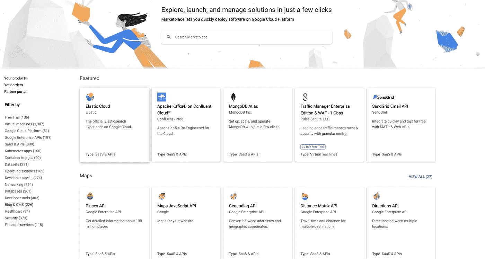

**轻松部署 Kubernetes 应用**

Kubernetes 应用程序是一个容器化的应用程序，可以在您的 Kubernetes 集群上运行。Cloud Marketplace 中的 Kubernetes 应用程序包括容器图像和配置文件，例如“kubectl”配置或舵图。当您从 Cloud Marketplace 部署应用程序时，Kubernetes 资源会在您的集群中创建，您可以作为一个组来管理这些资源。

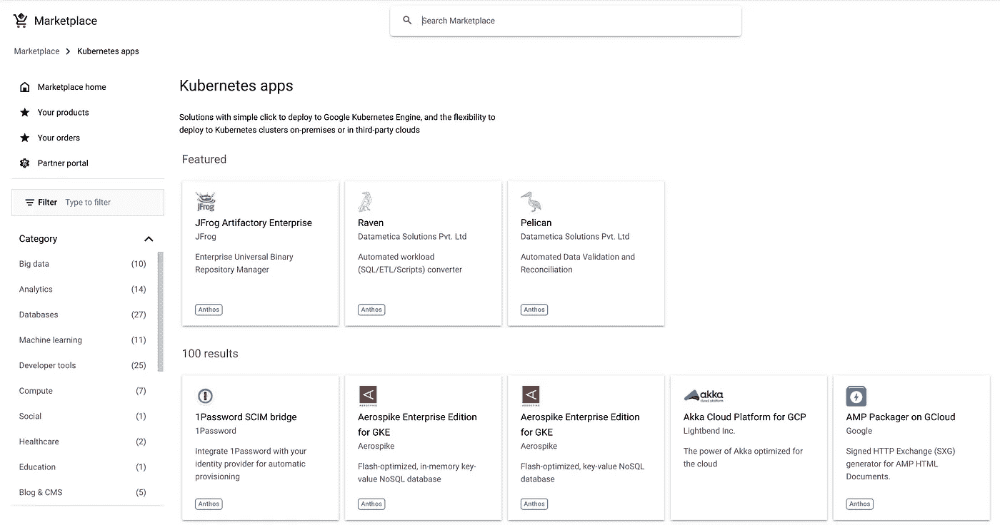

**搜索您想要的 Kubernetes 应用**

在搜索栏中输入“gitlab”找到 Kubernetes 应用程序

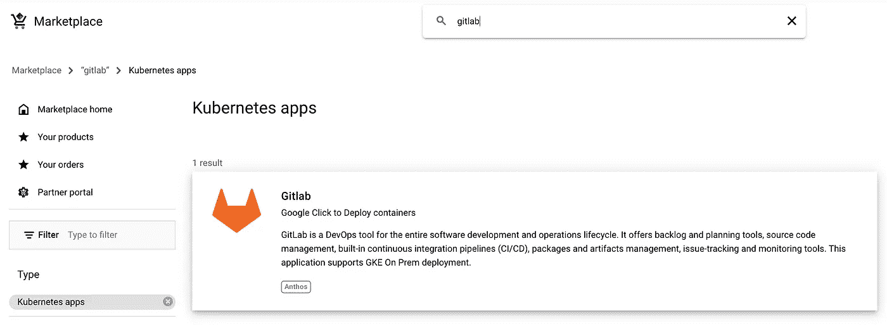

**配置您的 Kubernetes app - GitLab**

单击“配置”选项，并选择适当的参数，如“现有 Kubernetes 集群”、“名称空间”和“应用程序实例名称”。

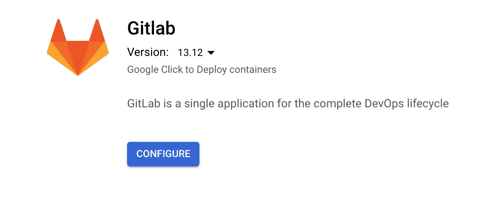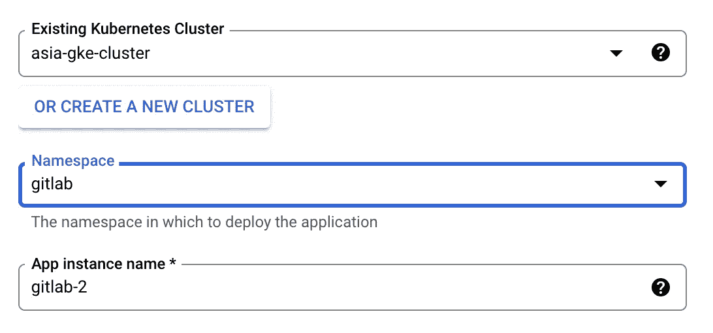

**GitLab 部署** **状态**

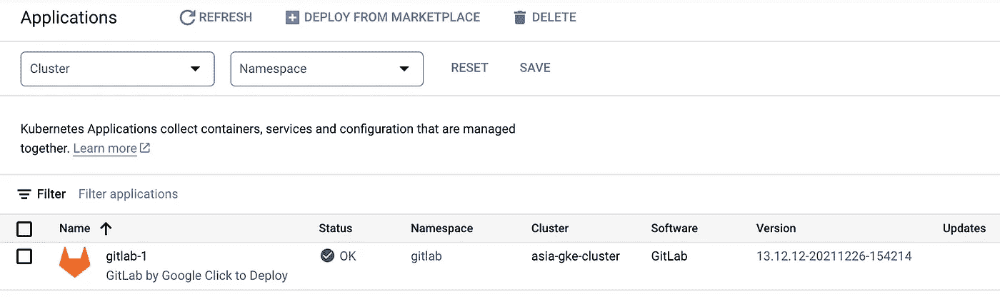

**GitLab 部署详情**

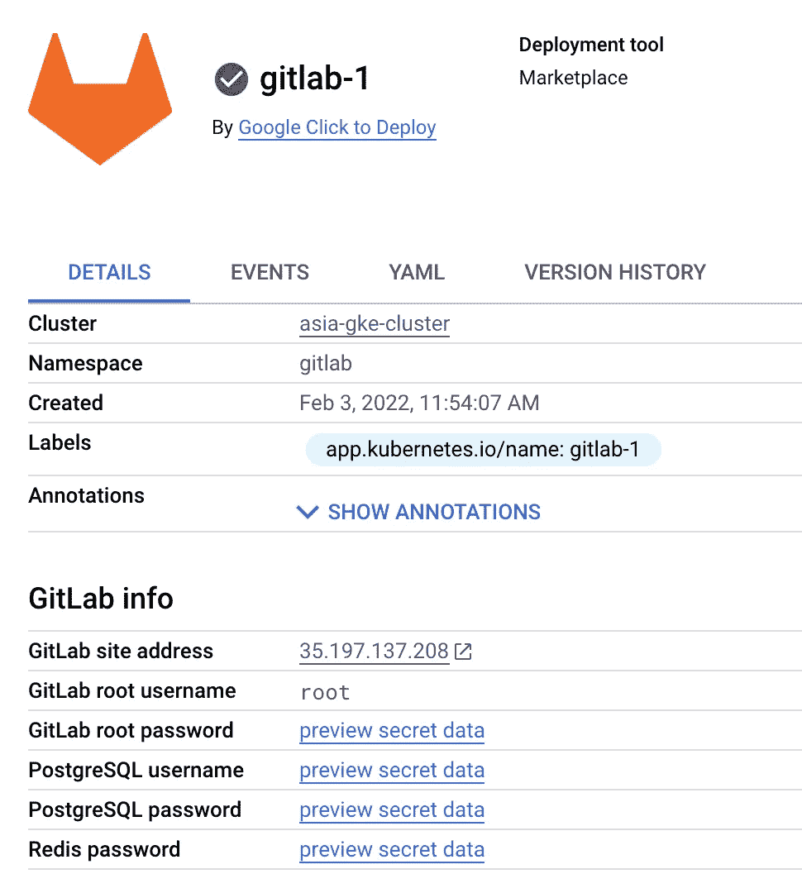

**访问 GitLab 实例**

使用“详细信息”页面中的给定凭据访问 GitLab 实例。

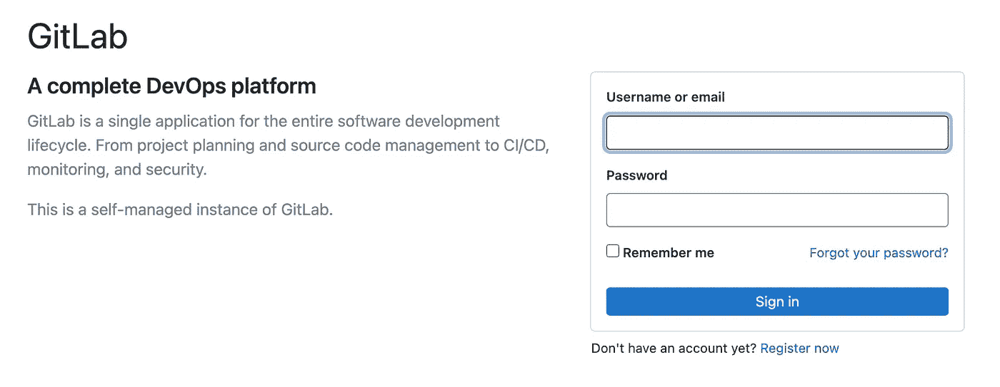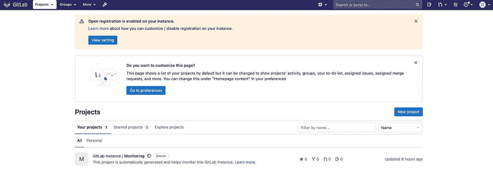

即将到来..

在这篇博客中，我们讨论了 Anthos Kubernetes 应用程序。在接下来的博客中，我们将继续 Samajik 收养 Anthos 的旅程。

供稿人:[施吉莫勒·阿克](https://medium.com/u/41b475b881ff?source=post_page-----6b85c5f7016f--------------------------------)、[安其特·尼尚特](https://medium.com/u/2d47f7f3f8e2?source=post_page-----6b85c5f7016f--------------------------------)、[丹杜斯](https://medium.com/u/71d9487165c6?source=post_page-----6b85c5f7016f--------------------------------)