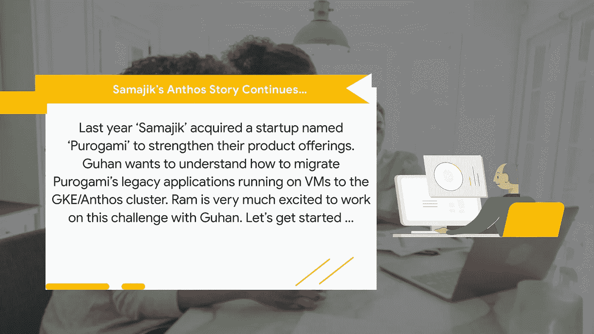
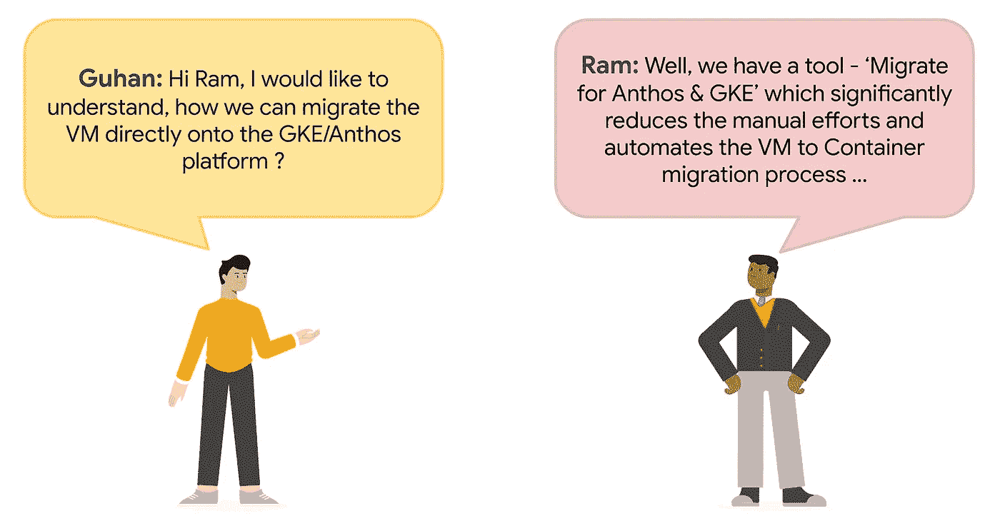
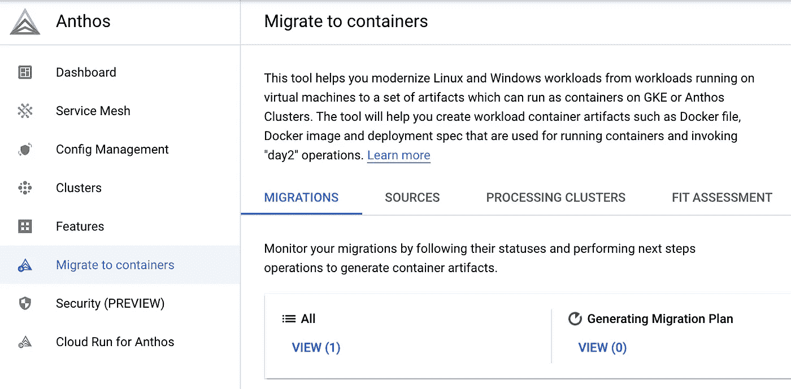
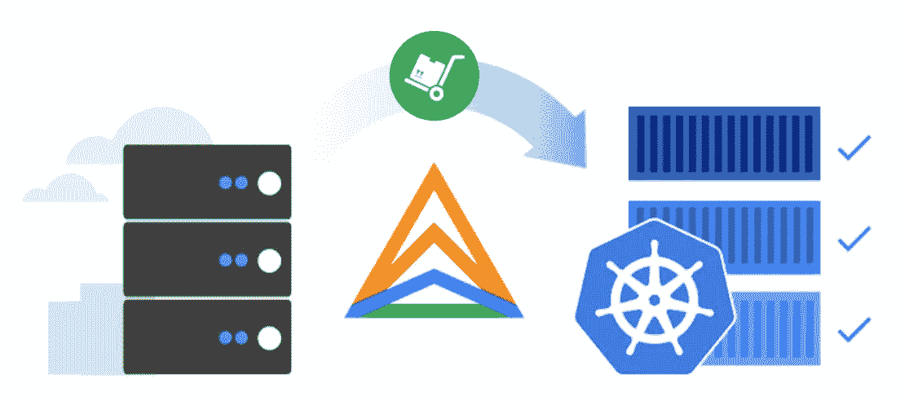
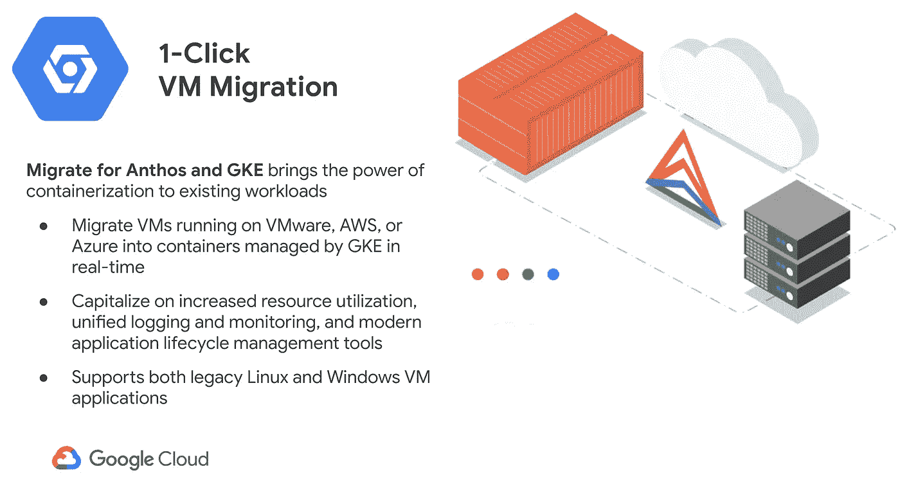
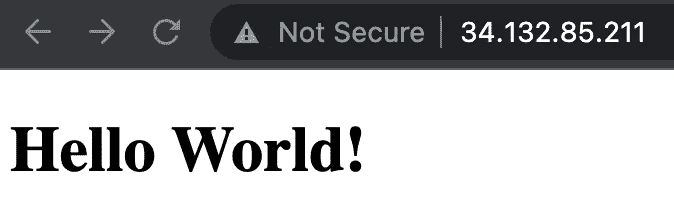
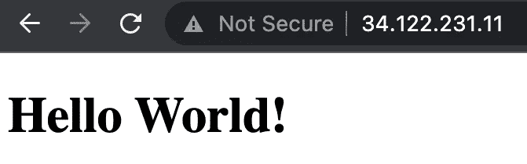
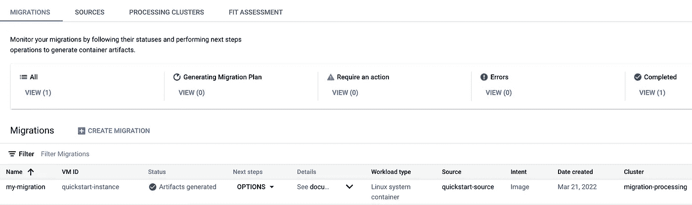
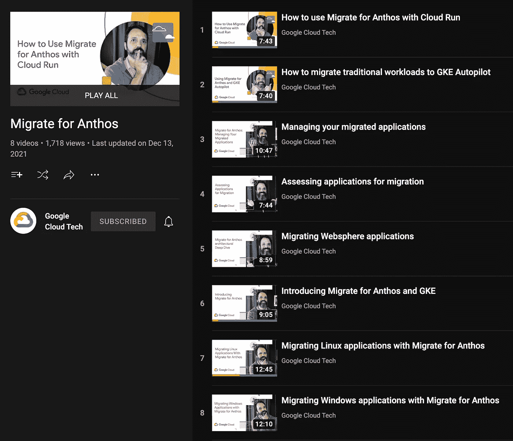

# 谷歌云 Anthos 系列:为 Anthos 和 GKE 迁移

> 原文：<https://medium.com/google-cloud/google-cloud-anthos-series-part8-2af3bdce0c9b?source=collection_archive---------0----------------------->

## 谷歌云系列:第 8 部分

W 欢迎来到“谷歌云系列”的第 8 部分。你可以在这里找到完整的系列



注意:故事情节中提到的公司名称(萨马吉克和普罗格米)和人物角色(拉姆和古汉)都是虚构的



**迁徙到安索斯和 GKE**

该工具可以快速轻松地将传统应用从虚拟机更新到本机容器中。在 Anthos dashboard 中找到这个名为“迁移到容器”的工具。



**Anthos 仪表板:迁移容器**

使用 Migrate for Anthos 和 GKE 将基于虚拟机的工作负载转换为在谷歌 Kubernetes 引擎(GKE)或 Anthos 集群上运行的容器。来自运行在 VMware、AWS、Azure 或计算引擎上的虚拟机的工作负载可以以容器格式轻松迁移到 GCP。



**将运行在 VMware、AWS、Azure 或计算引擎上的虚拟机迁移到容器**

这种独特的自动化方法从虚拟机中提取关键应用程序元素，以便这些元素可以轻松地插入到 GKE 或 Anthos 集群中的容器中，而不需要容器中变得不必要的虚拟机层(如来宾操作系统)。

这大大降低了手动应用程序现代化项目所需的成本和人力。迁移后客户的 DevOps 团队获得了 GKE/安索斯提供的现代控制来管理这些应用程序。



[**兼容的操作系统和 Kubernetes 版本**](https://cloud.google.com/migrate/anthos/docs/compatible-os-versions) **。**

**为安索斯和 GKE 迁移:快速入门指南**

在本快速入门实践指南中，首先在 GCP 上创建一个简单的计算引擎虚拟机(VM ),然后使用“为安托万和 GKE 迁移”将 VM 迁移到云中的 Google Kubernetes 引擎(GKE)处理集群。

**第 1 部分:GCE 虚拟机设置**

在 Google 云平台上创建一个 GCE 虚拟机，并在其上安装简单的 Apache web 服务器应用程序。

> 1.1.设置环境变量

```
PROJECT_ID="<your-project-id>"
REGION="<gcp-region>"
ZONE="<zone>"
```

> 1.2.使用 web 服务器创建虚拟机

```
gcloud compute instances create quickstart-instance \
 --project=${PROJECT_ID} --zone=${ZONE} --machine-type=e2-standard-2 \
 --subnet=default --scopes="cloud-platform" \
 --tags=http-server,https-server --image=ubuntu-minimal-1604-xenial-v20210119a \
 --image-project=ubuntu-os-cloud --boot-disk-size=10GB --boot-disk-type=pd-standard \
 --boot-disk-device-name=quickstart-instance
```

> 1.3.创建防火墙规则

```
gcloud compute --project=${PROJECT_ID} firewall-rules create default-allow-http \
 --direction=INGRESS --priority=1000 --network=default --action=ALLOW \
 --rules=tcp:80 --source-ranges=0.0.0.0/0 --target-tags=http-server
```

> 1.4.到虚拟机的 SSH 并安装 apache2 包

```
sudo apt-get update && sudo apt-get install apache2 -yecho '<!doctype html><html><body><h1>Hello World!</h1></body></html>' | sudo tee /var/www/html/index.html
```

> 1.5.验证安装
> 
> 打开浏览器，输入 http://<quickstart-instance-public-ip></quickstart-instance-public-ip>



> 1.6.停止虚拟机

**第二部分:GKE 处理集群设置**

> 2.1.创建处理集群

在云中创建一个 GKE 集群，用作处理集群。这是您为 Anthos 和 GKE 安装 Migrate 并执行迁移的地方。

```
gcloud container clusters create migration-processing \
--project=${PROJECT_ID} --zone=${ZONE} --machine-type e2-standard-4 \
--image-type ubuntu --num-nodes 1 \
--subnetwork "projects/${PROJECT_ID}/regions/${REGION}/subnetworks/default"
```

**第 3 部分:安装“为安索斯和 GKE 迁移”**

> 3.1.创建`m4a-install`服务帐户

```
gcloud iam service-accounts create m4a-install \
  --project=${PROJECT_ID}
```

> 3.2.将`storage.admin`角色授予服务帐户

```
gcloud projects add-iam-policy-binding ${PROJECT_ID}  \
  --member="serviceAccount:m4a-install@${PROJECT_ID}.iam.gserviceaccount.com" \
  --role="roles/storage.admin"
```

> 3.3.下载服务帐户的密钥文件

```
gcloud iam service-accounts keys create m4a-install.json \
  --iam-account=m4a-install@${PROJECT_ID}.iam.gserviceaccount.com \
  --project=${PROJECT_ID}
```

> 3.4.连接到集群

```
gcloud container clusters get-credentials migration-processing \
  --zone ${ZONE} --project ${PROJECT_ID}
```

> 3.5.为处理集群上的安索斯和 GKE 组件设置迁移

```
migctl setup install --json-key=m4a-install.json
```

> 3.6 验证 Anthos 和 GKE 安装的迁移

```
migctl doctor
```

**第 4 部分:迁移虚拟机:创建服务帐户**

> 4.1.创建`m4a-ce-src`服务帐户

```
gcloud iam service-accounts create m4a-ce-src \
  --project=${PROJECT_ID}
```

> 4.2.将`compute.viewer`角色授予服务帐户

```
gcloud projects add-iam-policy-binding ${PROJECT_ID}  \
  --member="serviceAccount:m4a-ce-src@${PROJECT_ID}.iam.gserviceaccount.com" \
  --role="roles/compute.viewer"
```

> 4.3.将`compute.storageAdmin`角色授予服务帐户

```
gcloud projects add-iam-policy-binding ${PROJECT_ID}  \
  --member="serviceAccount:m4a-ce-src@${PROJECT_ID}.iam.gserviceaccount.com" \
  --role="roles/compute.storageAdmin"
```

> 4.4.下载服务帐户的密钥文件

```
gcloud iam service-accounts keys create m4a-ce-src.json \
  --iam-account=m4a-ce-src@${PROJECT_ID}.iam.gserviceaccount.com \
  --project=${PROJECT_ID}
```

> 4.5.创建迁移源

```
migctl source create ce quickstart-source --project ${PROJECT_ID} --json-key=m4a-ce-src.json
```

**第 5 部分:迁移虚拟机:创建迁移**

> 5.1.创建迁移计划

```
migctl migration create my-migration --source quickstart-source \
  --vm-id quickstart-instance --intent Image
```

> 5.2.检查迁移状态

```
migctl migration status my-migration
```

> 5.3.下载迁移计划

```
migctl migration get my-migration
```

> 5.4.使用迁移计划迁移虚拟机

```
migctl migration generate-artifacts my-migration
```

> 5.5.迁移开始后，检查其状态，直到完成

```
migctl migration status my-migration
```

**第 6 部分:部署迁移的工作负载**

> 6.1.迁移完成后，下载生成的 YAML 工件

```
migctl migration get-artifacts my-migration
```

> 6.2.将以下服务添加到“deployment_spec.yaml”文件中

```
apiVersion: v1
kind: Service
metadata:
  name: hello-service
spec:
  selector:
    app: quickstart-instance
  ports:
    - protocol: TCP
      port: 80
      targetPort: 80
  type: LoadBalancer
```

> 6.3 .应用部署规范 YAML 来部署工作负载

```
kubectl apply -f deployment_spec.yaml
```

> 6.4.检查外部 IP 地址

```
kubectl get service hello-service
```

> 6.5.通过打开浏览器并访问外部 IP 地址的网页来测试迁移

```
http://<EXTERNAL-IP>
```



检查 GCP 控制台上“Kubernetes 引擎”部分下的“迁移到容器”仪表板。



**参考**



[**https://www.youtube.com/playlist?list = pliivdwyy 5 sqlbi 6 lgi wbli 6 OJ 94 x7a jnw**](https://www.youtube.com/playlist?list=PLIivdWyY5sqLbI6lgiwBLI6OJ94X7AjNW)

**即将到来..**

在这篇博客中，我们讨论了用于将虚拟机迁移到容器的“安索斯和 GKE 迁移”工具。在接下来的博客中，我们将继续 Samajik 收养 Anthos 的旅程。

供稿人:[安其特·尼尚](https://medium.com/u/2d47f7f3f8e2?source=post_page-----2af3bdce0c9b--------------------------------)，[施吉莫尔·阿克](https://medium.com/u/41b475b881ff?source=post_page-----2af3bdce0c9b--------------------------------)，[丹杜斯](https://medium.com/u/71d9487165c6?source=post_page-----2af3bdce0c9b--------------------------------)