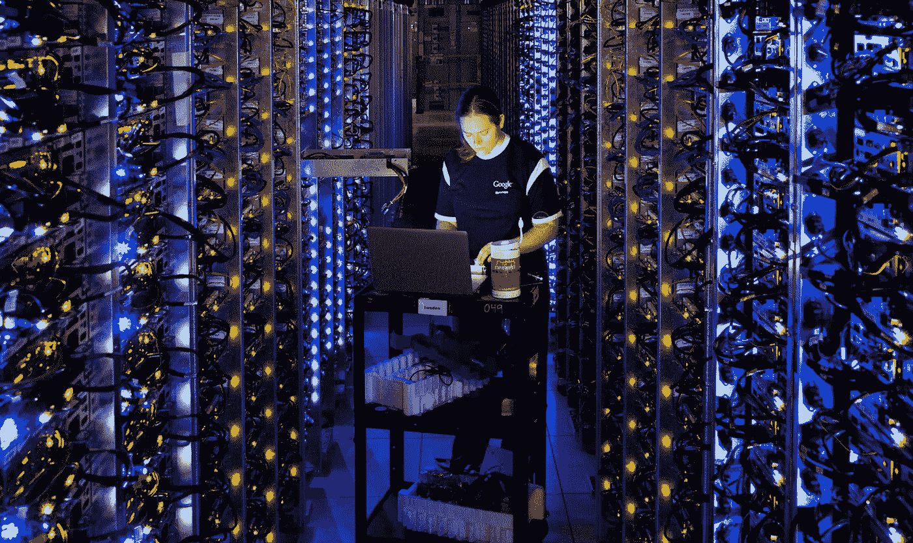

# 英伟达 GTC 公司的谷歌云

> 原文：<https://medium.com/google-cloud/google-cloud-at-nvidia-gtc-3920dd3a995b?source=collection_archive---------2----------------------->

查看英伟达 GTC ( [在此免费注册](https://nvda.ws/3sxzkIy))了解谷歌云如何帮助您克服挑战，从[高性能计算](https://cloud.google.com/solutions/hpc) (HPC)和[机器学习](https://cloud.google.com/ai-platform) (ML)中获取价值。通过与 NVIDIA 合作，他们能够提供与众不同的体验，使您能够轻松扩展大型 HPC 工作负载，或将 ML 工作负载从培训转移到生产中。

谷歌云和 NVIDIA 最近在 Compute engine 上推出了基于 NVIDIA Ampere A100 Tensor Core GPU 的 A2 VMs。单个 A2 虚拟机利用由 [NVIDIA 的 NVlink](https://www.nvidia.com/en-us/data-center/nvlink/) 结构支持的多达 16 个[NVIDIA A100 GPU](https://www.nvidia.com/en-us/data-center/a100/)，在单个虚拟机中达到高达 10 petaflops 的 FP16 或 10 petaflops 的 int8 的有效性能。这种性能和规模是 Google Cloud 独有的，旨在满足当今最苛刻的 HPC 应用。

这种能力能够给 [Altair](https://www.nvidia.com/content/dam/en-zz/Solutions/Data-Center/gpu-cloud-computing/google-cloud-platform/csp-print-google-cloud-altair-solution-brief-1497169-r8.pdf) 前所未有的周转时间，让他们用 ultraFluidX 进行 CFD 模拟。[deep mind](https://cloud.google.com/blog/products/compute/a2-vms-with-nvidia-a100-gpus-are-ga)(Alphabet 子公司)在利用机器类型之前，能够比以往任何时候都更快地训练他们的 GPU 实验。[艾伦研究所](https://cloud.google.com/blog/products/compute/a2-vms-with-nvidia-a100-gpus-are-ga)能够在 GCP 上运行 A100s，速度比他们现有的系统快 4 倍。点击了解更多关于 A2 VM 系列产品的信息[。](https://cloud.google.com/blog/products/compute/a2-vms-with-nvidia-a100-gpus-are-ga)

构建 ML 应用程序是复杂的，但为生产中的应用程序提供服务却并非如此。谷歌云提供了简化机器学习操作(MLOps)的能力，以自动化 ML 生产生命周期。OpenX 能够利用 GCP 工具来自动化其 ML 基础设施，并通过利用谷歌云平台上的独特功能来自动化其机器学习工作负载。 [OpenX](https://blog.tensorflow.org/2021/02/how-openx-trains-and-serves-for-million-queries-per-second.html) 优化了运行在 Google Kubernetes 引擎上的 TensorFlow 服务，在 15 毫秒内每秒可服务 250 万次预测请求。

**在以下谷歌云会议上了解更多信息:** [**英伟达 GTC**](https://nvda.ws/3sxzkIy) **:**

1.  [SS32947](https://nam11.safelinks.protection.outlook.com/?url=https%3A%2F%2Fgtc21.event.nvidia.com%2Fmedia%2F1_hlgbhsho%3Fncid%3Dref-spo-51335&data=04%7C01%7Ctwade%40nvidia.com%7C87b4605629ca421ad49408d8ef3ba57c%7C43083d15727340c1b7db39efd9ccc17a%7C0%7C0%7C637522386739805758%7CUnknown%7CTWFpbGZsb3d8eyJWIjoiMC4wLjAwMDAiLCJQIjoiV2luMzIiLCJBTiI6Ik1haWwiLCJXVCI6Mn0%3D%7C1000&sdata=29hjVM3Ka%2F64JOyJ%2F8nOANMeSf75T75zdhAp4XKJhpc%3D&reserved=0) —利用 ML Ops 获得竞争优势:Kubeflow、NVIDIA Merlin 和 Google Cloud——天哪。(由谷歌云提供)
2.  [SS32946](https://nam11.safelinks.protection.outlook.com/?url=https%3A%2F%2Fgtc21.event.nvidia.com%2Fmedia%2F1_0o78q5ve%3Fncid%3Dref-spo-51335&data=04%7C01%7Ctwade%40nvidia.com%7C87b4605629ca421ad49408d8ef3ba57c%7C43083d15727340c1b7db39efd9ccc17a%7C0%7C0%7C637522386739815754%7CUnknown%7CTWFpbGZsb3d8eyJWIjoiMC4wLjAwMDAiLCJQIjoiV2luMzIiLCJBTiI6Ik1haWwiLCJXVCI6Mn0%3D%7C1000&sdata=seB%2FIXpJAUII3srK5y3KgdesOJezTyg%2FFfm8iQHtm%2Bk%3D&reserved=0) —我应该在本地还是云中运行我的 GPU 工作负载？探索 Google Cloud 的 Anthos 和 NVIDIA 选项(由 Google Cloud 提供)
3.  看，妈妈，没有电脑！云如何革新虚拟现实体验(由谷歌云提供)
4.  [S31290](https://gtc21.event.nvidia.com/media/Scaling%20Data%20Processing%20with%20Dask%20%2B%20Rapids%20on%20Google's%20Cloud%20AI%20Platform%20%5BS31290%5D/1_1woiftwe) —在谷歌的云人工智能平台上使用 Dask + Rapids 扩展数据处理
5.  [S31579](https://gtc21.event.nvidia.com/media/Avoiding%20Accelerated-Analytics%20Antipatterns%20in%20the%20Cloud%20%5BS31579%5D/1_j367izrj) -避免云中的加速分析反模式
6.  [S31877](https://gtc21.event.nvidia.com/media/Fast%20to%20Faster%3A%20Real-time%20AI%20with%20Google%20Cloud%20Dataflow%20and%20NVIDIA%20GPU%20%5BS31877%5D/1_eajkz2ri) -从快到更快:使用谷歌云数据流和英伟达 GPU 的实时人工智能
7.  [S31564](https://gtc21.event.nvidia.com/media/Supercharging%20Cloud-Based%20Computational%20Fluid%20Dynamics%20with%20the%20NVIDIA%20Ampere%20Architecture%20%5BS31564%5D/1_jh4usfxr) —使用英伟达安培架构为基于云的计算流体力学增压
8.  [S31137](https://gtc21.event.nvidia.com/media/A%20Deep%20Dive%20on%20Supporting%20Multi-Instance%20GPUs%20in%20Containers%20and%20Kubernetes%20%5BS31137%5D/1_w18dvo24) —深入探讨在容器和 Kubernetes 中支持多实例 GPU
9.  [S31071](https://gtc21.event.nvidia.com/media/Productionizing%20ML%20with%20ML%20Ops%20and%20Cloud%20AI%20%5BS31071%5D/1_5soia9k0) —用 ML Ops 和云 AI 生产 ML
10.  [S31498](https://gtc21.event.nvidia.com/media/XLA%20Compilation%20in%20TensorFlow%20with%20tf.function(jit_compile%3DTrue)%20%5BS31498%5D/1_0hmyz8kj) —使用 tf.function 在 TensorFlow 中进行 XLA 编译(jit_compile=True)
11.  [S31798](https://gtc21.event.nvidia.com/media/Standardizing%20on%20an%20Array%20API%20for%20Python%20Across%20Deep%20Learning%20Frameworks%20%5BS31798%5D/1_glr7rb8l) -在深度学习框架中为 Python 标准化数组 API
12.  [s 31799](https://gtc21.event.nvidia.com/media/What's%20New%20in%20TensorFlow%20-%20an%20Ecosystem%20Update%20%5BS31799%5D/1_4x4qmz4w)—tensor flow 的新功能—生态系统更新
13.  [S31925](https://gtc21.event.nvidia.com/media/Keras%20and%20TensorFlow%3A%20The%20Next%20Five%20Years%20%5BS31925%5D/1_a4ljjuyy) — Keras 和 TensorFlow:未来五年
14.  [s 31732](https://gtc21.event.nvidia.com/media/Inference%20with%20Tensorflow%202%20Integrated%20with%20TensorRT%20Session%20%5BS31732%5D/1_a7n329bw)—tensor flow 2 . x 集成 TensorRT Session 的推理
15.  [S31376](https://gtc21.event.nvidia.com/media/Large-Scale%20Machine%20Learning%20in%20Google%20Cloud%20%5BS31376%5D/1_8ywkmtxr) —谷歌云中的大规模机器学习
16.  [S31743](https://gtc21.event.nvidia.com/media/GShard%3A%20Scaling%20Giant%20Models%20with%20Conditional%20Computation%20and%20Automatic%20Sharding%20%5BS31743%5D/1_rs29ix7v) — GShard:使用条件计算和自动分片缩放巨型模型
17.  [S32508](https://gtc21.event.nvidia.com/media/Unlocking%20the%20Power%20of%20AI%20in%20Latin%20America%20through%20Developer%20Communities%20%5BS32508%5D/1_0oy9upa5) —通过开发者社区释放人工智能在拉丁美洲的力量
18.  [S31742](https://gtc21.event.nvidia.com/media/Delivering%20Interactive%20Virtual%20Experiences%20Using%20Unreal%20Engine%20and%20Google%20Cloud%20%20%5BS31742%5D/1_968ox0ep) —使用虚幻引擎和谷歌云提供交互式虚拟体验
19.  [S31647](https://gtc21.event.nvidia.com/media/Simplify%20Building%20Two-Tower%20Matching%20Encoders%20to%20Improve%20Nearest-Neighbor%20Recommendation%20Results%20%5BS31647%5D/1_903lywrs) —简化双塔匹配编码器的构建，以改善最近邻推荐结果
20.  [S32518](https://gtc21.event.nvidia.com/media/Get%20Started%20Now%20on%20Medical%20Imaging%20AI%20with%20Clara%20Train%20on%20Google%20Cloud%20Platform%20%5BS32518%5D/1_2yjdekmi) —现在就开始使用谷歌云平台上的 Clara Train 进行医学成像人工智能