# 谷歌云——计费预算和警报

> 原文：<https://medium.com/google-cloud/google-cloud-billing-budgets-and-alerts-fc707ac1c2e4?source=collection_archive---------2----------------------->

我听到的关于云的最大担忧之一是意外成本。例如，我听说过许多人尝试云，意外地积累了大量账单，因为大型虚拟机运行时间太长，低效的数据库查询处理了太多数据，旧项目没有得到妥善清理。使问题更加复杂的是，人们直到几天后账单到达时才知道这些意想不到的费用。意想不到的成本让人们不敢进一步探索云，并可能在短期内损害云计划。在 Google Cloud 中解决这一问题的一种方法是使用[计费预算和警报](https://cloud.google.com/billing/docs/how-to/budgets)。顾名思义，预算和提醒允许您设置一个预算，并在您超出预算时提醒您。预算和警报在谷歌云中监控成本，易于设置，是控制意外成本的有效工具。

要设置[计费预算和警报](https://cloud.google.com/billing/docs/how-to/budgets)，请在谷歌云控制台中转至“*计费→预算和警报”*。选择*创建预算*。

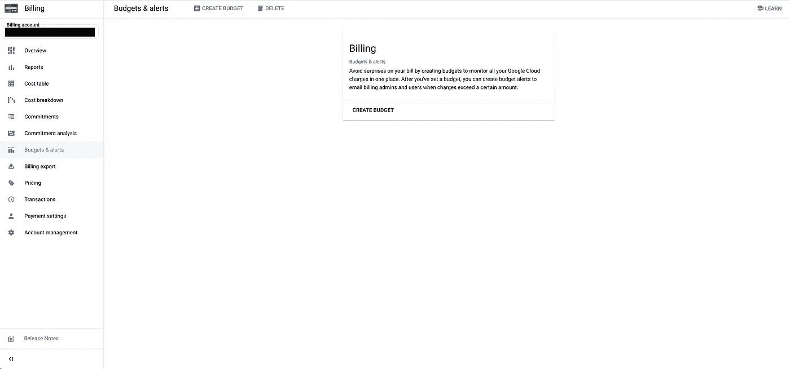

计费和提醒起始页

**第 1 步**:输入预算名称。默认情况下，指定整个计费帐户的每月预算，但您可以更改时间范围，并使用项目、服务和标签过滤器选择特定的资源。此外，默认情况下会选择折扣和积分，因此您会收到净支出通知，但如果您希望收到总支出通知，您可以取消选中它们。

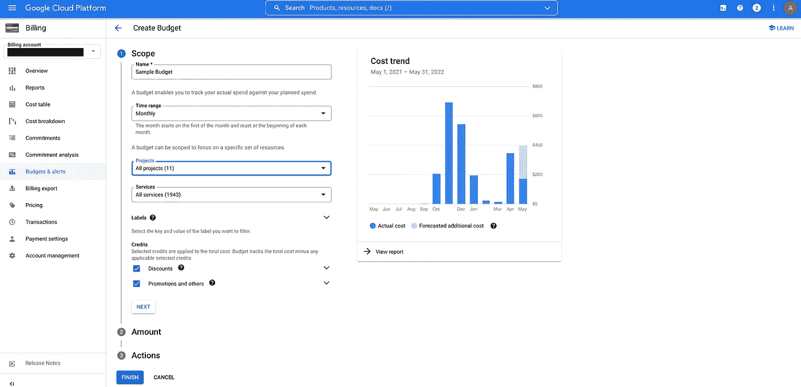

创建预算

**第二步**。指定你的每月预算。在这个例子中，我设定每月预算为 1000 美元。还有一个选项，通过从*“预算类型”*下拉菜单中选择*“上个月的支出”*，使用上个月的支出作为目标金额，这将自动将预算填充为您上个月的支出金额。

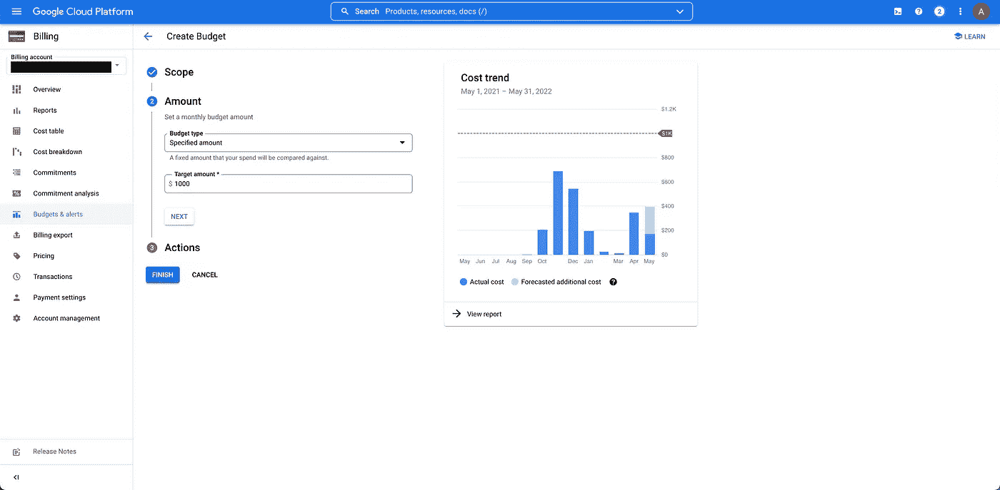

设定预算

**第三步**:设置预警阈值规则。默认情况下，当实际支出超过预算的 50%、90%和 100%时，将触发警报。还有一个选项可以触发预测支出的警报。所有值都是可配置的。您甚至可以添加或删除阈值。

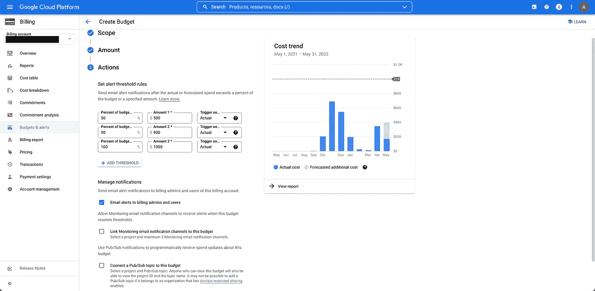

设置警报阈值

**第四步**:管理通知。有三种通知选项:

1.  向计费管理员和用户发送电子邮件提醒。
2.  将监控电子邮件通知渠道链接到此预算。
3.  将发布/订阅主题连接到此预算。

[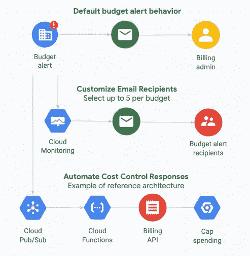](https://cloud.google.com/billing/docs/how-to/budgets)

谷歌云预算警报选项

**选项 1:向计费管理员和用户发送电子邮件提醒:**默认提醒行为将向计费管理员和计费用户发送电子邮件。该复选框已被选中。

**选项 2:** [**将监控邮件通知渠道链接到该预算**](https://cloud.google.com/monitoring/support/notification-options) **:** 如果您想向其他邮件地址发送预警，您可以选择“*将监控邮件通知渠道链接到该预算*”。首先，你需要设置一个[云监控邮件通知通道](https://cloud.google.com/monitoring/support/notification-options)。

要设置电子邮件通知通道，请转至“*监控→警报”*。然后选择*“编辑通知频道”*。

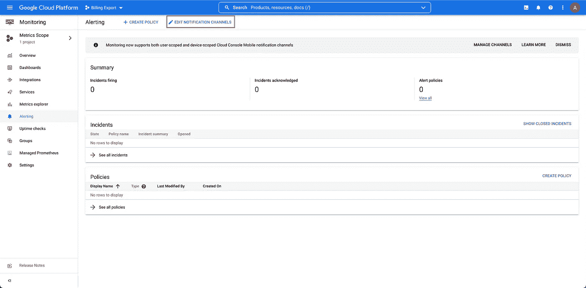

监控和警报

有几个通知渠道可用，但[只有电子邮件渠道支持](https://cloud.google.com/billing/docs/how-to/budgets-notification-recipients#how-to-setup)云计费预算和警报。

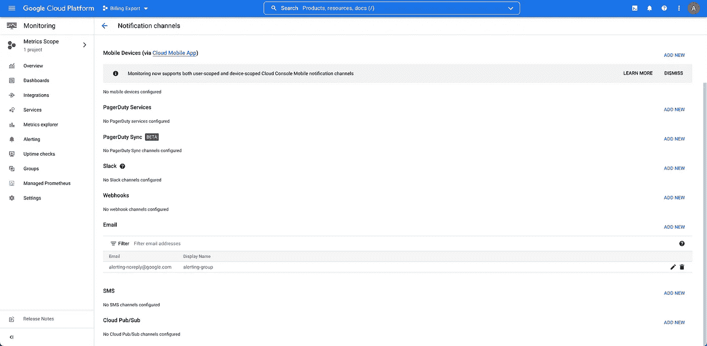

编辑通知渠道

添加新的或编辑现有的电子邮件渠道。在本例中，电子邮件提醒将发送到群组电子邮件“alerting-noreply@google.com”。可以将多个电子邮件地址添加到通知通道，但请注意，最多只能向 5 个电子邮件地址发送计费警报。

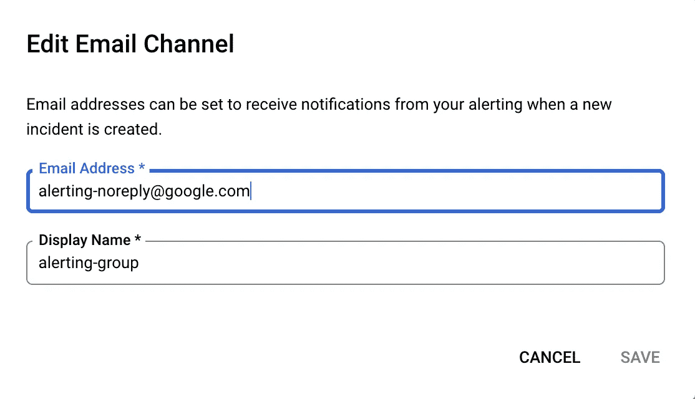

配置发送警报的电子邮件

返回“预算和预警配置”页面，选择您配置的电子邮件通知。通知通道中最多可以选择五个电子邮件收件人。

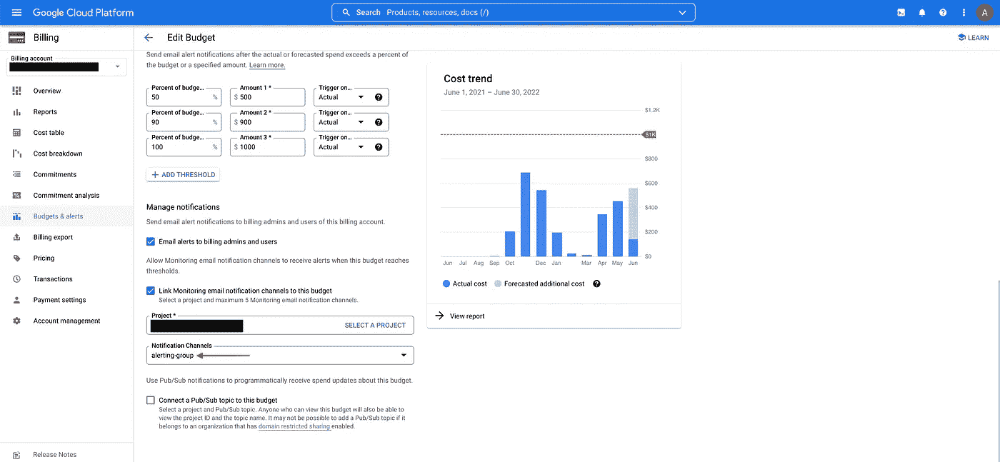

发送到电子邮件通知通道的警报

**选项三:** [**自动化成本控制**](https://cloud.google.com/billing/docs/how-to/budgets-programmatic-notifications) **:** 有一个程序化的通知选项，用于自动化成本控制。一般的想法是，警报被发送到一个发布/订阅主题，一个程序订阅该主题，然后程序在收到警报时采取行动。

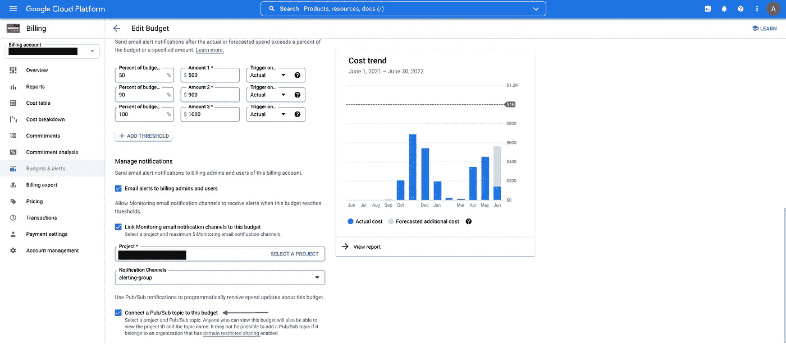

使用发布/订阅实现自动化成本控制

Google Cloud 提供了[示例参考架构](https://cloud.google.com/billing/docs/how-to/notify)，它结合了云发布/订阅和云功能，将警报重定向到 Slack，并自动禁用计费以防止成本失控。您可以编写自己的云函数来发出警报。

```
Warning: Disabling billing on a project will cause *all* Google Cloud services in the project to terminate, including [free-tier services](https://cloud.google.com/free/docs/gcp-free-tier). Therefore, programatically disabling billing would only be appropriate in development or sandbox environments.
```

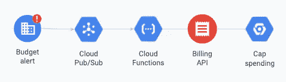

发布/订阅通知的参考架构示例

**步骤 5:** 预算配置完成后，预算将出现在主仪表板上。您可以根据需要创建任意多的预算来监控和控制成本。

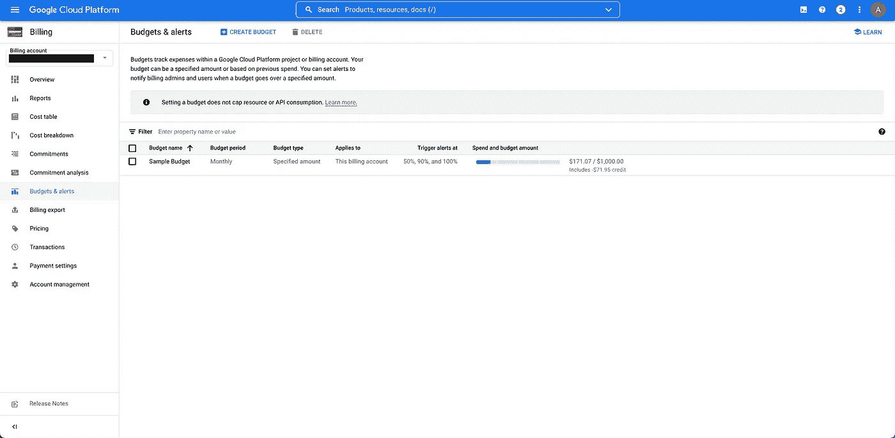

预算和预警列表

## 摘要

预算和警报在谷歌云中监控和控制成本。您设置一个预算，当超过特定阈值时就会触发警报。警报可以发送到电子邮件通知或发布/订阅主题进行编程控制。通过使用预算和预警，您可以防止意外成本。

## 进一步观察

```
**Further Reading:**[Google Cloud: Create, edit, or delete budgets and budget alerts](https://cloud.google.com/billing/docs/how-to/budgets)
[Google Cloud: Customize budget alert email recipients](https://cloud.google.com/billing/docs/how-to/budgets-notification-recipients)
[Google Cloud: Manage notification channels](https://cloud.google.com/monitoring/support/notification-options)
[Google Cloud: Examples of automated cost control responses](https://cloud.google.com/billing/docs/how-to/notify)
[Google Cloud: Manage programmatic budget alert notifications](https://cloud.google.com/billing/docs/how-to/budgets-programmatic-notifications)
[Medium: Google Cloud - Export Billing Data to BigQuery](/google-cloud/google-cloud-export-billing-data-to-bigquery-ce004fb87ce3)
```