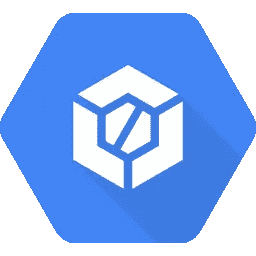

# 一个短视频中的谷歌云代码和云构建

> 原文：<https://medium.com/google-cloud/google-cloud-code-and-cloud-build-in-one-short-video-6fc71f4464d6?source=collection_archive---------0----------------------->

继我在最近发布的“运营”视频上的[帖子之后，这里是另一个视频，这次是关于云代码和云构建的:](/google-cloud/recent-gcp-operations-videos-fa50c130c21c)

你知道 Google 为 VS 代码和 IntelliJ 提供插件吗？
谷歌云附带了一个强大的构建工具？

对于那些在 Kubernetes(如谷歌 Kubernetes 引擎，GKE)或云上构建部署为容器的应用程序，并希望花更多时间编写代码而不是 YAML 配置文件的人，那么你应该真正尝试一下 [**云代码**](https://cloud.google.com/code/docs) 。

云代码是一组针对 *VS Code* 和 *IntelliJ* 的 IDE 扩展，可以让你快速迭代、调试和部署代码到容器运行时，比如 GKE，也可以部署到其他 Kubernetes 实现。

在幕后，它使用流行的工具，如 Skaffold、Minikube、Jib，显然还有 kubectl，在代码编辑器中为您提供持续的反馈。

调试、一键式部署、持续部署、本地开发、云运行支持、高级 YAML 编辑、客户端库支持—一切都由您来尝试！

无论您的目标是 CI/CD 的哪个阶段， [**Cloud Build**](https://cloud.google.com/cloud-build/docs) 都允许您使用一个在 Google 云平台基础设施上执行构建的完全托管平台，将构建和部署流程从您的开发工具中分离出来。

这是通过使用构建配置文件来完成的——一组用 JSON 或 YAML 表达的指令，描述了要执行的任务。或者简单地使用一个`Dockerfile`。

您可以配置生成以获取依赖项、运行单元测试、静态分析或集成测试。您还可以使用 docker、gradle、maven 和 bazel 等构建工具来创建工件。最后，您还可以将这些工件部署到您首选的运行时或工件 repo 中。

云构建将您的构建作为一系列步骤来执行，每个步骤都在由云构建、社区或您自己提供的 Docker 容器中执行。

构建是使用 gcloud CLI、云构建 API 或通过一些预配置的源存储库(如 GitHub 应用程序)启动的，GitHub 应用程序使用 GitHub 事件在每次推送源存储库时自动构建您的代码。

最后，云构建本身支持容器，但是不需要将代码打包到容器中。事实上，云功能和 App Engine 等几个基于源代码的产品都依赖于引擎盖下的云构建。

*是的，我还是想写一些在录制这些最近的视频时学到的一些幕后经验教训。敬请期待！*