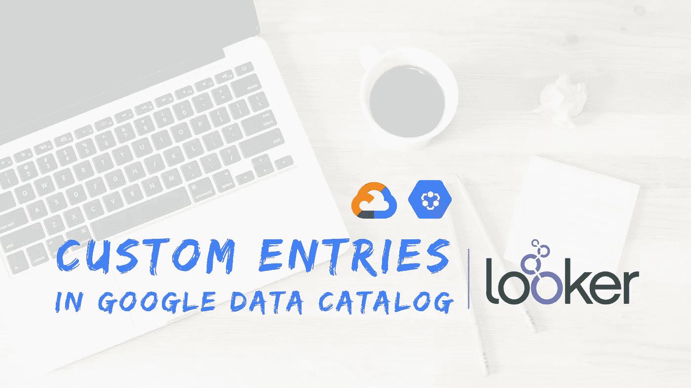
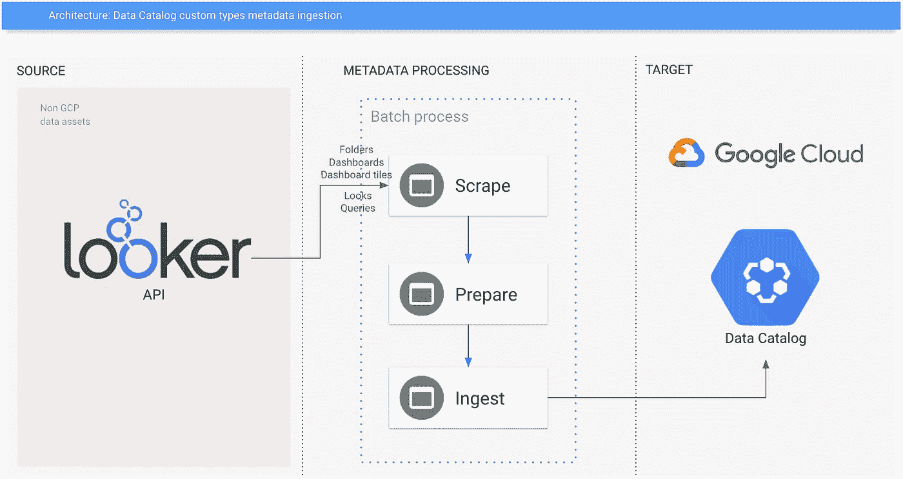
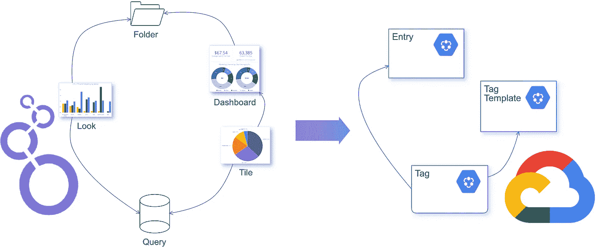
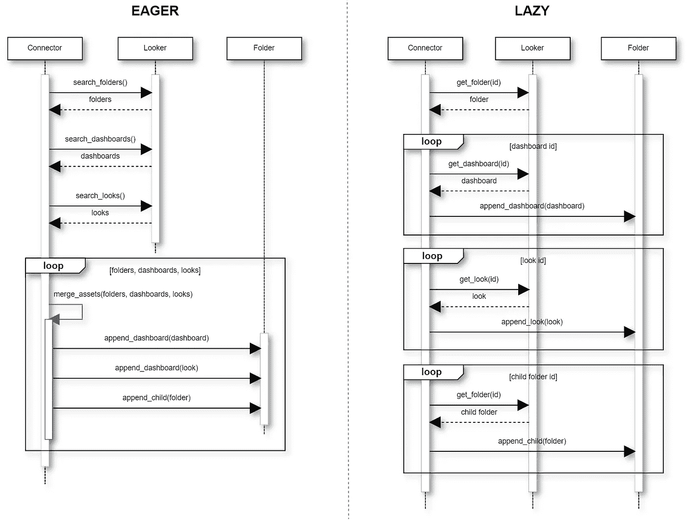
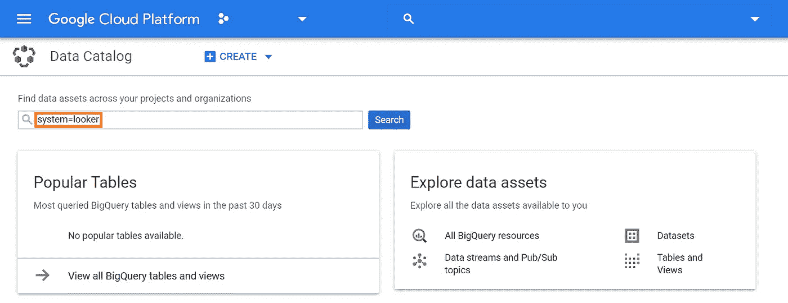
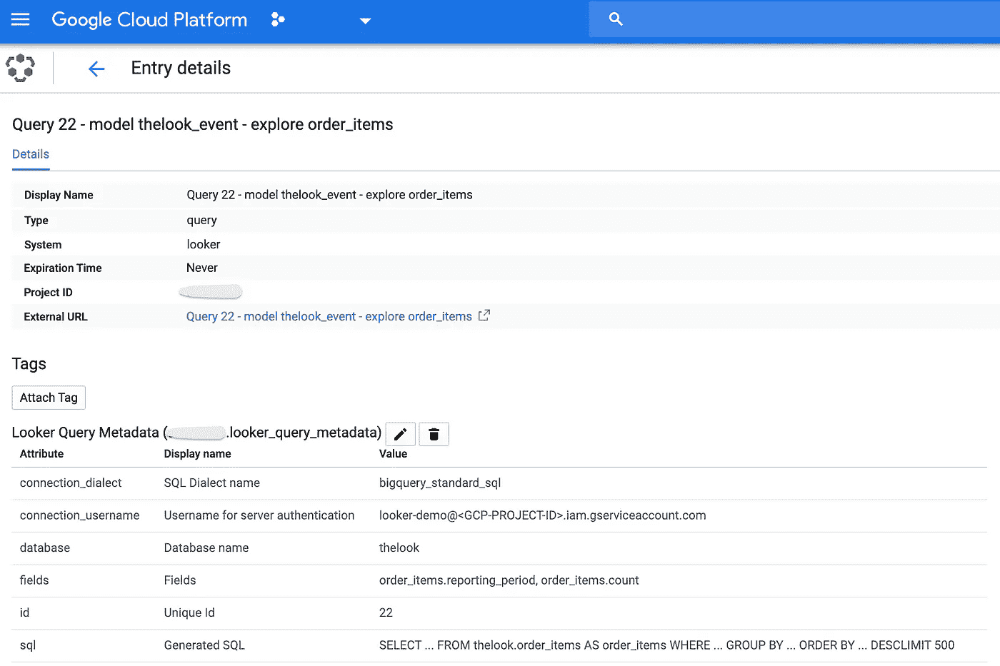
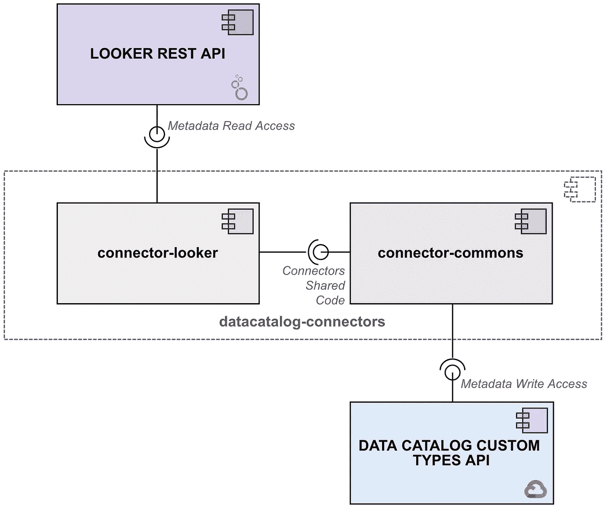

# Google 云数据目录和 Looker 集成

> 原文：<https://medium.com/google-cloud/google-cloud-data-catalog-and-looker-integration-4ebefdef6a34?source=collection_archive---------0----------------------->

## 利用数据目录发现和注释 Looker 资产

背景照片由[劳伦·曼克](https://unsplash.com/@laurenmancke?utm_source=unsplash&utm_medium=referral&utm_content=creditCopyText)在 [Unsplash](https://unsplash.com/s/photos/computer?utm_source=unsplash&utm_medium=referral&utm_content=creditCopyText) 拍摄

T 谷歌云数据目录团队最近宣布[其产品现已正式发布，并准备接受定制(即用户定义)条目](https://cloud.google.com/blog/products/data-analytics/data-catalog-metadata-management-now-generally-available)！这一全新功能为集成开辟了空间，现在用户可以利用 [Data Catalog 众所周知的潜力](https://towardsdatascience.com/boosting-the-data-governance-journey-with-google-cloud-data-catalog-d67acc3e3ffb)来管理几乎任何类型的数据资产的元数据。

为了演示它是如何工作的，我将在这篇博文中分享将数据目录连接到市场领先的商业智能/数据可视化工具的设计思想和示例代码，包括 [**Looker**](http://looker.com/) 元数据集成。它们来自参与开发完全可操作的**样本连接器**的经验，可在 [GitHub](https://github.com/GoogleCloudPlatform/datacatalog-connectors-bi) 上公开获得。

> **免责声明:在撰写本文时(2020 年 4 月)，谷歌和/或谷歌云不正式支持任何将数据目录连接到非 GCP 系统的工具。您将在这里发现的仅仅是我作为数据目录早期采用者的经验的结果。**

# 技术要求

让我们从实现集成的最低技术要求开始:

1.  from Looker:允许对属于托管在给定服务器/实例中的资产的元数据进行读访问；
2.  从数据目录:允许用户摄取表示由旁观者管理的资产的元数据；
3.  连接器:**从 Looker 实例中抓取**元数据的组件，**准备**适合数据目录的实体模型的信息，**接收**准备好的元数据。

**图片 1** 。架构概述:集成数据目录和 Looker

由于 1 和 2 已经由 Looker 和 Google Cloud 提供，我们的重点是开发一个软件组件来解决第三个问题。

# 适应不同的概念

这种集成的第一步是将业务实体从源系统映射到目标系统。**选择了五种 Looker 类型来说明这一点:文件夹、Look、仪表板、仪表板元素(又名 Tile)和查询**。

**图片二**。数据目录和 Looker 集成:调整实体模型

我们需要调整这样的类型，以适应更通用的数据目录模型。所有这些类型的 Looker 资产都将变成目录中的条目，因为**条目**是那里的一等公民。它们将通过添加到`Entry`类的新的`userSpecifiedType`属性来区分，我们将在下面看到。

但是 Looker 实体的属性比目录条目所能支持的要多得多…在这种情况下，我们可以使用**标签**来注释它们，避免遗漏有意义的信息。标签基于**模板**，这意味着我们将利用三种数据目录主要类型来实现目标。顺便说一句，我想你至少对它们有一个基本的了解。万一你没有，请看一下 [*这篇博文*](/google-cloud/data-catalog-hands-on-guide-a-mental-model-dae7f6dd49e) *。*

当涉及到实体关联和父/子关系时，有一个缺失的部分。例如，文件夹包含多个仪表板和外观；仪表板包含多个磁贴；给定的查询可以向多个外观和图块提供信息。数据目录目前不提供对在自定义类型中构建这种关系的本机支持。同样，标签可以帮助我们绘制地图。

# Looker API 和客户端 SDK

一旦总体设计决定已经提出，是时候看看一些实际的东西了。Looker 拥有丰富的 REST API，本文将讨论以下资源:

*   [文件夹:管理文件夹](https://docs.looker.com/reference/api-and-integration/api-reference/v3.1/folder)
*   [外观:运行和管理外观](https://docs.looker.com/reference/api-and-integration/api-reference/v3.1/look)
*   [仪表板:管理仪表板](https://docs.looker.com/reference/api-and-integration/api-reference/v3.1/dashboard)
*   [查询:运行和管理查询](https://docs.looker.com/reference/api-and-integration/api-reference/v3.1/query)

请浏览这些页面，你会清楚地知道我所说的丰富的 API 是什么意思。您会注意到每项资产都有大量信息。

可以通过最流行语言中可用的 [**预建客户端 SDK**](https://github.com/looker-open-source/sdk-codegen)以编程方式访问 API，包括 **Python** 和 **Javascript** 。这里展示的示例连接器和代码片段都是用 Python 编写的。

API 客户端需要一个配置文件，其内容在 [SDK 文档](https://github.com/looker-open-source/sdk-codegen/blob/master/looker-sample.ini)中有描述。一旦有了合适的文件，实例化客户机就像下面这样简单:

> **旁注** : [ApiAuth: API 认证](https://docs.looker.com/reference/api-and-integration/api-reference/v3.1/api-auth)描述了如何在 API 中进行认证。该文档提到了登录所需的客户端凭证，必须通过在 Looker 管理控制台中的用户帐户上创建 API3 密钥来获得。Looker 管理控制台的快捷方式是 https://<YOUR-Looker-INSTANCE>/Admin/users/API 3 _ key/<YOUR-USER-ID>。

客户端可以包装任何 API 调用。例如，假设您想要检索给定文件夹的信息。API 为[https://docs . looker . com/reference/API-and-integration/API-reference/v 3.1/folder # get _ folder](https://docs.looker.com/reference/api-and-integration/api-reference/v3.1/folder#get_folder)。要以编程方式执行调用，我们需要:

请注意`fields`参数:它允许我们在响应中指定我们想要的字段，而不是检索 API 提供的所有信息。

# 抓取 Looker 元数据

我们已经探索了两种搜集 Looker 元数据的策略**——**让我把它们称为**渴望**和**懒惰**。****

******Eager** scraping 允许使用一个 API 调用从给定类型的所有资产中读取元数据。这对读取**公共资产(通常是用户管理的)元数据**很有用。在读取所有元数据后，连接器遍历这些元数据，并使用属性值来重建对象之间的关系，例如，将仪表板数组追加/嵌套到其父文件夹。****

******另一方面，惰性**抓取在处理**特殊(包括系统管理的)**资产的信息时可能有用，例如所谓的`lookml`文件夹及其子文件夹，它们负责处理 [LookML](https://docs.looker.com/data-modeling/learning-lookml/what-is-lookml) 内容。它需要一系列后续的 API 调用来检索嵌套的资产信息。****

****下一张图说明了不同之处。从我们到目前为止所看到的，混合它们是一个很好的实践，因为它们填补了彼此留下的空白。****

********

******图片 3** 。渴望与懒惰的 Looker 元数据抓取****

****让我补充几句关于实现急切抓取时的编码决策。检索对象列表有两个主要选项:`sdk.all_*()`和`sdk.search_*()`。所有* 方法返回**缩写对象**。 *search* *方法更加灵活，因为您可以在响应中指定您想要的字段。总而言之:****

*   ****`sdk.all_folders()` response 并没有包含你实际可能需要的所有字段，所以我建议用`sdk.search_folders()`来代替。此外，空文件夹不包括在 *all_folders* 响应中；****
*   ****`sdk.all_dashboards()` response 并没有包含你实际可能需要的所有字段，所以我推荐用`sdk.search_dashboards()`来代替。请提醒 LookML 仪表板不包含在 *search_dashboards* 响应中，需要惰性处理；****
*   ****`sdk.all_looks()` response 并没有包含你实际可能需要的所有字段，所以我推荐用`sdk.search_looks()`来代替。****

****总之，我们优先考虑渴望的方法，而不是懒惰的方法。Eager 意味着更少的 API 调用和更多的内存处理，因此它更快。Lazy 仅用于处理不可急切解决的极端情况:例如，LookML 仪表板不包含在`sdk.search_dashboards()` —急切抓取—响应中，因此它们被延迟处理。****

# ****准备数据目录的元数据****

****此时，我们已经从 Looker 那里获得了所需的所有信息。是时候将它们转换成数据目录实体了。创建条目似乎是一个很好的起点，因为其他一切都依赖于它们。****

*****以* `*__*` *开头的方法代表助手类的东西，不在代码片段的范围内。*****

****上面的代码是不言自明的(即使对那些不了解 Python 的人来说…)，但是有一些要点需要注意:****

*   ****第 5 行，`entry = types.Entry()`:目前为止只有 Google Cloud 的数据资源是由 Data Catalog 管理的。更具体地说:在产品第一次发布测试版时，只管理自动同步的条目(指 BigQuery 和 Pub/Sub 资产);几个月后，用户能够手动创建引用 GCS 文件集的条目。从现在开始，我们可以创建任何类型的条目；****
*   ****第 9 行，`YOUR-ENTRY-GROUP-ID`:每个条目必须属于一个条目组，通过一个非常简单的 API 调用在条目之前创建，我们将在下一节中看到。作为参考，BigQuery 和 Pub/Sub 条目的自动管理组具有`@bigquery`和`@pubsub`id。用户定义的条目将属于用户定义的组— [与 GCS 文件集使用的方法](https://cloud.google.com/data-catalog/docs/how-to/filesets)完全相同。因为项目和位置 id 被添加到条目组 id 的前面，所以在这一点上可以简单地使用`looker`;****
*   ****第 12 行，`entry.user_specified_system = 'looker'`:所有 Looker 相关条目的公共值；****
*   ****第 13 行，`entry.user_specified_type = 'look'`:用于区分与 Looker 相关的条目类型。在本讨论的范围内，以下值可用于实现该属性:`dashboard`、`dashboard_element`、`folder`、`look`和`query`。****

****正如我在*适应不同的概念*一节中提到的，条目的属性只覆盖了一小部分查看者资产的元数据。但是我们可以利用数据目录标签来避免丢失有价值的信息。首先，让我们来看一个标签模板建议:****

****这个模板中的标签可以附加到每个与外观相关的条目上。通过这样做，我们丰富了数据目录中可用的元数据，就好像我们向这些条目“添加”了四个额外的字段:`Folder name`、`Query Id`、`Data Catalog Entry for the Query`和`Excel File Url`。*文件夹名*、*查询 id* 、 *Excel 文件*是典型的技术元数据。*查询*的条目可以通过引用[数据目录的 web 控制台](http://console.cloud.google.com/datacatalog)中相应查询条目的 HTML 链接来实现。这个链接可以在准备阶段通过一个非常简单的算法生成。****

****当丰富其他资产类型的元数据时，同样的方法也适用。关于查询有一个有趣的例子:Looker 允许我们通过 [Run Query](https://docs.looker.com/reference/api-and-integration/api-reference/v3.1/query#run_query) 方法获得任何查询的 SQL 语句(将`sql`作为`result_format`参数传递)。所以 SQL 语句变成了查询相关标记中的一个属性。****

# ****元数据摄取****

****这是集成过程的最后一个阶段，其中的条目和标记被接收到数据目录中。如前一节所述，每个条目都必须属于一个条目组，所以让我们从创建它开始:****

****然后，我们可以遍历这些条目，并要求 Data Catalog 保存它们以及它们的标签:****

****一旦接收过程完成，您就可以通过使用数据目录 UI 来查看新的元数据。键入`system=looker`和*搜索*:****

********

******图片 4** 。使用数据目录用户界面搜索外观资产****

****下图(截屏经过处理以提高可读性)显示了一个示例查询的条目和标签:****

********

******图片 5** 。Looker 通过数据目录 UI 查询元数据****

****并且**刮-准备-摄取**过程**完成**！****

# ****样本连接器****

****GitHub 上的示例连接器[涵盖了本文中讨论的所有主题。你可以随便拿，按照说明跑。顺便说一下，欢迎投稿！](https://github.com/GoogleCloudPlatform/datacatalog-connectors-bi)****

> ****它是根据 Apache License 版许可的，以“原样”为基础发布，没有任何种类的担保或条件，无论是明示的还是暗示的。****

****与文本一起提供的代码片段基于连接器，但出于可读性的原因进行了简化。您会注意到，实际代码中加入了更多的一致性检查、异常处理，不仅处理创建，还处理条目和标签的更新和删除操作。所需的模板在摄取阶段开始时创建。****

****此外，它还分为两个主要部分:`datacatalog-connector-commons`和`datacatalog-connector-looker`。还有其他非 GCP 系统的示例连接器，如 Tableau、 [Hive](https://github.com/GoogleCloudPlatform/datacatalog-connectors-hive) 、 [MySQL、Oracle 和其他](https://github.com/GoogleCloudPlatform/datacatalog-connectors-rdbms)。它们共享的代码，主要是与摄取阶段相关的类，在[*data catalog-connector-commons*](https://github.com/GoogleCloudPlatform/datacatalog-connectors)组件中进行管理。理想情况下，通过设计，只有该组件应该与数据目录自定义类型 API 进行通信。另一方面，所有 Looker 通信和特定元数据操作代码都驻留在*data catalog-connector-Looker*上。如下图所示，commons 组件对外部源系统一无所知:****

********

******图片 6** 。数据目录和 Looker 集成组件****

****由于 Looker 目前没有 webhooks 或类似的技术来潜在地支持增量同步，**属于给定服务器的所有资产在每次执行时都被同步**。****

****测试表明，从 Looker 中抓取 1，000 项资产，准备并将其纳入数据目录需要大约 25 分钟。为每个资产生成一个条目和一个*富化*标签。**每个条目+标签对需要 4 次 API 调用才能完全同步:1 次获取条目，1 次创建或更新条目，1 次获取标签，最后 1 次创建或更新标签。**数据目录目前不支持批量 API 操作。****

****就这些了，伙计们！****

## ****参考****

*   ******谷歌云数据目录动手指南，心智模型**:[https://medium . com/Google-Cloud/Data-Catalog-hands-on-guide-a-mental-model-DAE 7 f 6 DD 49 e](/google-cloud/data-catalog-hands-on-guide-a-mental-model-dae7f6dd49e)****
*   ******Looker API 3.1 参考**:**[https://docs . Looker . com/Reference/API-and-integration/API-Reference/v 3.1](https://docs.looker.com/reference/api-and-integration/api-reference/v3.1)******
*   ********Looker 客户端 SDK Codegen**:【https://github.com/looker-open-source/sdk-codegen ******