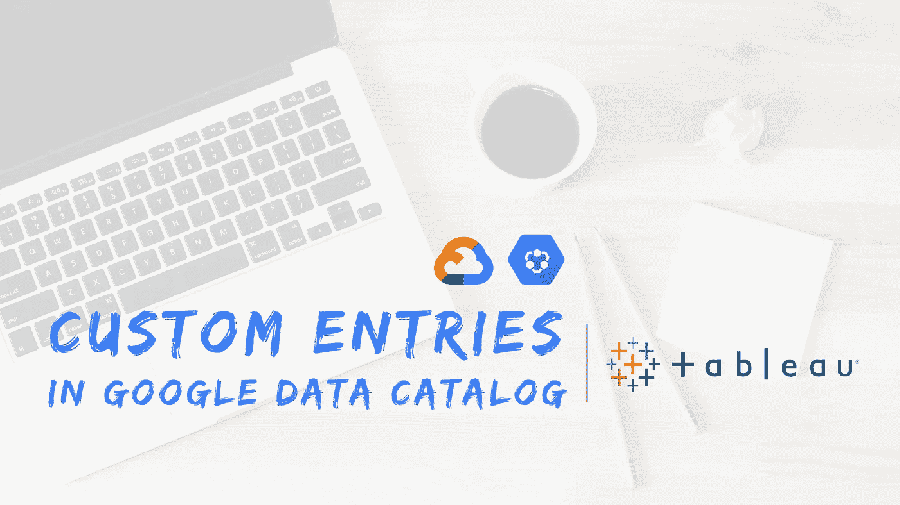
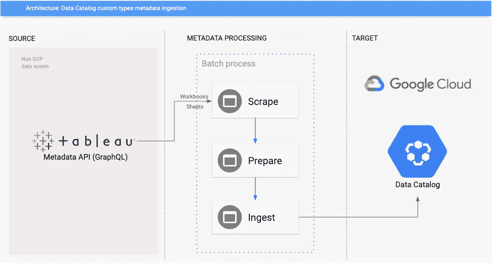
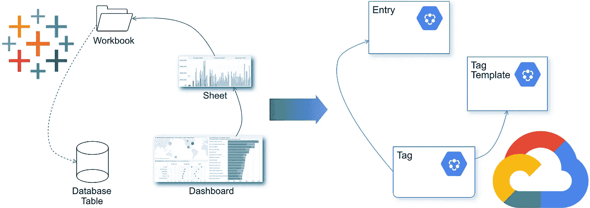
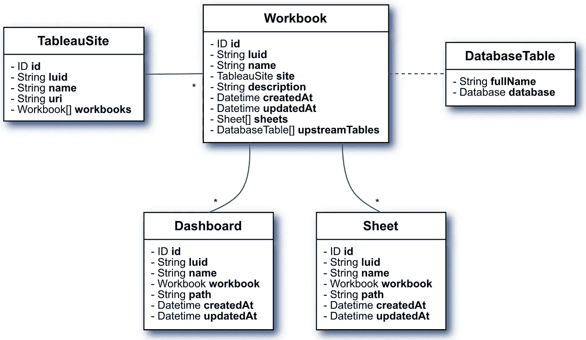
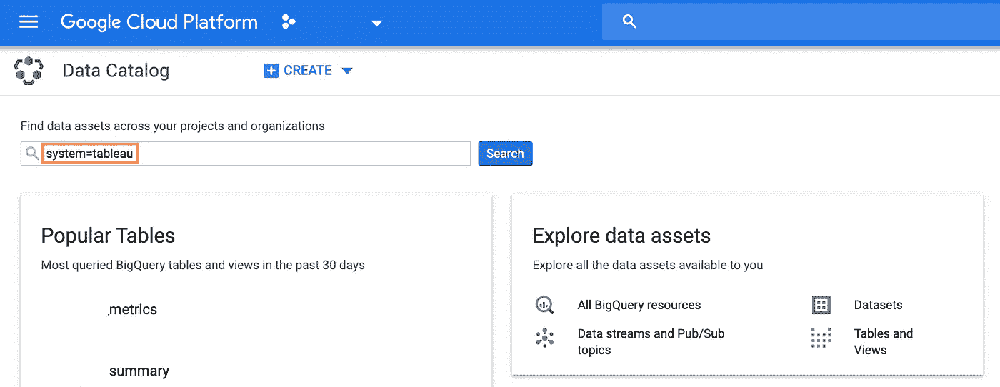
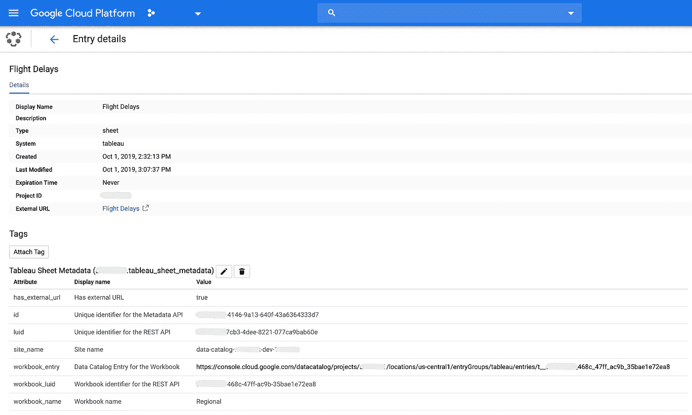
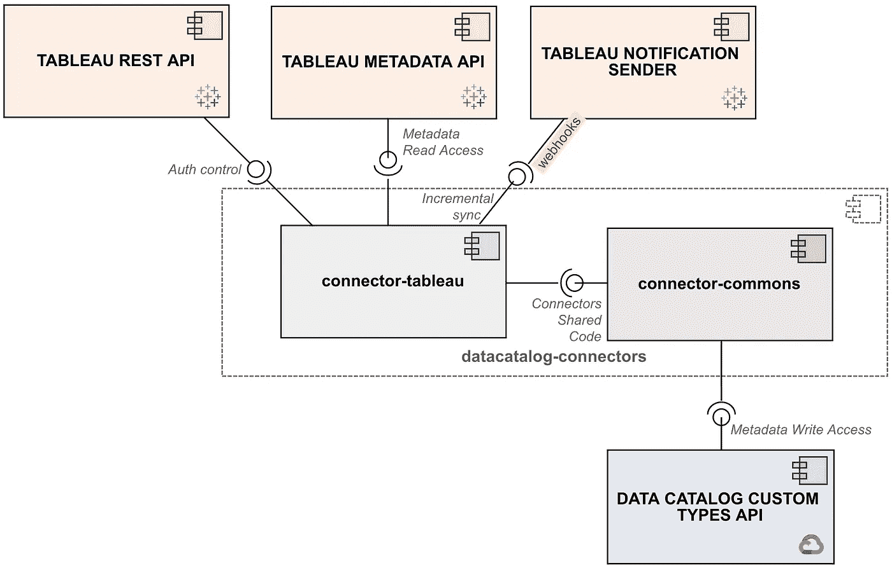

# Google 云数据目录和 Tableau 集成

> 原文：<https://medium.com/google-cloud/google-cloud-data-catalog-and-tableau-integration-204c1d17cc62?source=collection_archive---------0----------------------->

## 利用数据目录发现和注释 Tableau 资产

背景照片由[劳伦·曼克](https://unsplash.com/@laurenmancke?utm_source=unsplash&utm_medium=referral&utm_content=creditCopyText)在 [Unsplash](https://unsplash.com/s/photos/computer?utm_source=unsplash&utm_medium=referral&utm_content=creditCopyText) 拍摄

T 谷歌云数据目录团队最近宣布[其产品现已正式发布，并准备接受定制(即用户定义)条目](https://cloud.google.com/blog/products/data-analytics/data-catalog-metadata-management-now-generally-available)！这一全新功能为集成开辟了空间，现在用户可以利用 [Data Catalog 众所周知的潜力](https://towardsdatascience.com/boosting-the-data-governance-journey-with-google-cloud-data-catalog-d67acc3e3ffb)来管理几乎任何类型的数据资产的元数据。

为了演示其工作原理，我将在这篇博文中分享将数据目录连接到市场领先的商业智能/数据可视化工具的设计思想和示例代码，包括 [**Tableau**](https://www.tableau.com/) 元数据集成。它们来自于参与开发完全可操作的**样本连接器**、**、**的经验，可在 [GitHub](https://github.com/GoogleCloudPlatform/datacatalog-connectors-bi) 上公开获得。

> **免责声明:在本文撰写之时(2020 年 5 月)，谷歌和/或谷歌云不正式支持任何将数据目录连接到非 GCP 系统的工具。您将在这里发现的仅仅是我作为数据目录早期采用者的经验的结果。**

# 技术要求

让我们从实现集成的最低技术要求开始:

1.  from Tableau:允许对属于托管在给定服务器/实例中的资产的元数据进行读访问；
2.  从数据目录:允许用户接收代表 Tableau 管理的资产的元数据；
3.  连接器:**从 Tableau 实例中抓取**元数据的组件，**准备**适合数据目录的实体模型的信息，**接收**准备好的元数据。

**图片 1** 。架构概述:集成数据目录和表格

由于 1 和 2 已经由 Tableau 和 Google Cloud 提供，我们的重点是开发一个软件组件来解决第三个问题。

# 适应不同的概念

这种集成的第一步是将业务实体从源系统映射到目标系统。**选择了三种 Tableau 类型来说明这一点:工作簿、工作表和仪表板**。

**图片二**。数据目录和表格集成:调整实体模型

我们需要调整这样的类型，以适应更通用的数据目录模型。所有这些类型的 Tableau 资产都将变成目录中的条目，因为**条目**是那里的一等公民。它们将通过添加到`Entry`类的新的`userSpecifiedType`属性来区分，我们将在下面看到。

但是 Tableau 实体的属性比目录条目所能支持的要多得多……在这种情况下，我们可以使用**标签**来注释它们，避免遗漏有意义的信息。标签基于**模板**，这意味着我们将利用三种数据目录主要类型来实现目标。顺便说一句，我想你至少对它们有一个基本的了解。万一你没有，请看一下 [*这篇博文*](/google-cloud/data-catalog-hands-on-guide-a-mental-model-dae7f6dd49e) *。*

当涉及到实体关联和父/子关系时，有一个缺失的部分。例如，工作簿包含多个表和仪表板；同时，它依赖于数据库表来检索信息。数据目录目前不提供对在自定义类型中构建这种关系的本机支持。同样，标签可以帮助我们绘制地图。

# 在 Tableau REST 和元数据 API 之间做出选择

Tableau 提供了不同的方式来访问他们服务器上的内容——其中包括所谓的 **REST** 和**元数据**API。鉴于此，我们需要决定哪一个将用于*构建带有数据目录的桥梁*。

REST API 更加成熟，允许用户使用 HTTP 以编程方式管理和更改 Tableau 服务器资源。一般来说，它允许我们检索比元数据 API 更少的信息。

[元数据 API](https://help.tableau.com/v0.0/api/metadata_api/en-us/index.html) 更新更强大，因为它允许用户从 Tableau 资产中读取更全面的元数据集合，包括**血统信息**！是的，它带来了您正在评估的资产和由 Tableau 或外部系统(如数据库服务器)管理的其他项目之间的关系。

它们之间还有一个显著的技术差异:REST API 端点(或资源)可以通过标准的 HTTP 请求访问，例如 GET、POST 等等。另一方面，元数据 API 由 GraphQL 提供支持。

> 像 REST APIs 一样，GraphQL 也是通过 HTTP 服务的。但是，您可以向一个端点发送一个查询，然后对其进行过滤，只返回您请求的内容，而不是向多个端点发送请求以返回感兴趣的数据。GraphQL 服务器与一个端点相关联。[Tableau 元数据 API 简介](https://help.tableau.com/v0.0/api/metadata_api/en-us/index.html#differences-between-using-graphql-and-rest)

大概你猜到了元数据 API 更适合我们的需求。你是对的！据我们调查，除了*认证用户*和*检索属于给定 Tableau 服务器*的站点列表之外，它提供了我们实现集成所需的 99%。所以，事实上，我们两个 API 都需要…

# 连接到 Tableau

一旦大致的场景已经呈现，是时候看看一些实际的东西了。本文的代码片段是用 Python 编写的。

在做任何事情之前，我们需要认证，而 **REST API** 是以编程方式完成认证的关键。在这种情况下，普通的 HTTP 请求就足够了:

上述方法返回一个访问令牌，该令牌必须在后续请求中作为`X-Tableau-Auth`头提供。

> **旁注**:虽然[Python 客户端是可用的](https://github.com/tableau/server-client-python)，但是我们决定不依赖它，因为我们与那个 API 的交互很少。

将使用类似的方法从**元数据 API** 中检索信息(顺便说一下，这个 API 没有客户端库)。下面的片段展示了它是如何工作的:

请注意 GraphQL 是如何简化从相关对象中检索信息的(第 5 行到第 14 行)。在这种情况下,*工作簿*是主要实体，但是相同的查询可以用于获取其*工作表*。输入查询具有特定的格式；响应来自标准 JSON。

我们将在下一节看到元数据 API 的更多细节。

# 抓取 Tableau 元数据

在编写 GraphQL 查询时，理解 Tableau 实体如何相互关联是很有帮助的。我相信一张图片胜过千言万语，所以让我将来自[元数据 API 引用](https://help.tableau.com/v0.0/api/metadata_api/en-us/reference/)的一些信息“转录”到一个图表中:

**图片 3** 。属于 Tableau 元数据模型的类的子集

我们可以基于这样一个模型编写一个更复杂的查询:

上述示例中真正重要的是什么？

*   第 2 行，`tableauSites` : GraphQL 允许以基于关系的方式获取资产的元数据。因此，我们可以编写查询来从顶级资产(站点)检索信息，到较低级的资产(如表和数据库表);
*   第 6 行，`workbooks`:站点可能有工作簿，如果发生这种情况，这个查询将检索所请求的工作簿的信息；
*   第 12 行，`sheets`:同第 6 行，但引用的是工作簿与其表的关系；
*   第 19 行，`upstreamTables`:从概念上讲，这种关系与前面的关系有点不同，工作簿可能依赖于资产来获取数据，但是它们并不拥有这样的资产。*在本文中,“表格”一词是指通常由外部系统拥有/管理的资产，如数据库服务器甚至 Microsoft Excel* 。还请注意`upstream`前缀——它表示 Tableau 元数据模型中的**沿袭快捷方式**。沿袭快捷方式从上游的*或下游*的*开始，可能指内部或外部资产。*

> 例如，您可以使用`upstreamTablesConnection`来查询数据源使用的表，或者使用`downstreamSheetsConnection`来查询工作簿使用的表。[了解元数据模型](https://help.tableau.com/v0.0/api/metadata_api/en-us/docs/meta_api_model.html#other-objects-related-to-tableau-content-and-assets)

*   *第 25 行，* `*dashboards*` *:可惜没有(还没有？)…在撰写本文时(2020 年 1 月)，元数据 API 不支持提取嵌套在父工作簿中的仪表板。因此，需要一个额外的查询来抓取它们的元数据。*

如果以上概念对您来说很清楚，那么您就可以通过查询 Tableau 元数据 API 来获取任何类型的元数据了。是时候前进了！

# 准备数据目录的元数据

此时，我们有知识从 Tableau 中收集我们需要的所有信息。创建条目似乎是将它们转换成数据目录实体的良好起点，因为其他一切都依赖于它们。

*以* `*__*` *开头的方法代表助手类的东西，不在代码片段的范围内。*

上面的代码是不言自明的(即使对那些不了解 Python 的人来说…)，但是有一些要点需要注意:

*   第 5 行，`entry = types.Entry()`:到目前为止，只有 Google Cloud 的数据资源由 Data Catalog 管理。更具体地说:在产品第一次发布测试版时，只管理自动同步的条目(指 BigQuery 和 Pub/Sub 资产);几个月后，用户能够手动创建引用 GCS 文件集的条目。从现在开始，我们可以创建任何类型的条目；
*   第 9 行，`YOUR-ENTRY-GROUP-ID`:每个条目必须属于一个条目组，通过一个非常简单的 API 调用在条目之前创建，我们将在下一节中看到。作为参考，BigQuery 和 Pub/Sub 条目的自动管理组具有`@bigquery`和`@pubsub`id。用户定义的条目将属于用户定义的组— [与 GCS 文件集使用的方法](https://cloud.google.com/data-catalog/docs/how-to/filesets)完全相同。因为项目和位置 id 被添加到条目组 id 的前面，所以在这一点上可以简单地使用`tableau`;
*   第 12 行，`entry.user_specified_system = 'tableau'`:所有 Tableau 相关条目的公共值；
*   第 13 行，`entry.user_specified_type = 'workbook'`:用于区分 Tableau 相关的条目类型。在本讨论的范围内，以下值可用于实现该属性:`workbook`、`sheet`和`dashboard`。

正如我在*改编不同的概念*一节中提到的，条目的属性只覆盖了一小部分 Tableau 资产的元数据。但是我们可以利用数据目录标签来避免丢失有价值的信息。首先，让我们来看一个标签模板建议:

此模板中的标签可以附加到每个与工作簿相关的条目。通过这样做，我们丰富了 Data Catalog 中可用的元数据，就好像我们向这样的条目“添加”了两个额外的字段:`Site name`和`Tables used by the workbook`。

> **旁注**:数据目录目前不支持列表作为标记值，所以表名必须连接起来以满足`*upstream_tables*`字段。

# 元数据摄取

这是集成过程的最后一个阶段，其中的条目和标记被接收到数据目录中。如前一节所述，每个条目都必须属于一个条目组，所以让我们从创建它开始:

然后，我们可以遍历在准备阶段创建的条目，并要求 Data Catalog 保存这些条目及其标签:

一旦接收过程完成，您就可以通过使用数据目录 UI 来查看新的元数据。键入`system=tableau`和*搜索*:

**图片 4** 。使用数据目录用户界面搜索 Tableau 资产

下图显示了样张的条目和标签:

**图片 5** 。通过数据目录 UI 的 Tableau 表元数据

**刮-准备-摄取**过程**完成**！

# 样本连接器

GitHub 上的示例连接器[涵盖了本文中讨论的所有主题。你可以随便拿，按照说明跑。顺便说一下，欢迎投稿！](https://github.com/GoogleCloudPlatform/datacatalog-connectors-bi)

> 它是根据 Apache License 版许可的，以“原样”为基础发布，没有任何种类的担保或条件，无论是明示的还是暗示的。

与文本一起提供的代码片段基于连接器，但出于可读性的原因进行了简化。您会注意到，实际代码中加入了更多的一致性检查、异常处理，不仅处理创建，还处理条目和标签的更新和删除操作。所需的模板在摄取阶段开始时创建。

此外，它还分为两个主要部分:`datacatalog-connector-commons`和`datacatalog-connector-tableau`。还有其他非 GCP 系统的示例连接器，如 Looker、 [Hive](https://github.com/GoogleCloudPlatform/datacatalog-connectors-hive) 、 [MySQL、Oracle 和其他](https://github.com/GoogleCloudPlatform/datacatalog-connectors-rdbms)。它们共享的代码，主要是与摄取阶段相关的类，在[*data catalog-connector-commons*](https://github.com/GoogleCloudPlatform/datacatalog-connectors)组件中进行管理。理想情况下，通过设计，只有该组件应该与数据目录自定义类型 API 进行通信。另一方面，所有 Tableau 通信和特定元数据操作代码驻留在*data catalog-connector-Tableau*上。如下图所示，commons 组件对外部源系统一无所知:

**图片 6** 。数据目录和 Tableau 集成组件

Tableau 允许两种同步策略:**完全**和**增量**。*完全同步*发生在属于给定实例的所有资产在单次执行中同步的时候。第一次从该实例接收元数据时，建议这样做。*增量(或部分)同步*发生在只有一部分资产由于元数据的改变而被同步的时候。 [Tableau 在 2019.4 版本中引入了 Webhooks 支持](https://www.tableau.com/about/blog/2019/10/tableau-webhooks-support)，这项技术是一个增量同步使能器。

测试表明，从 Tableau 中抓取 1，000 个资产，准备它们并将其纳入数据目录，需要大约 25 分钟。为每个资产生成一个条目和一个*富化*标签。**每个条目+标签对需要 4 次 API 调用才能完全同步:1 次获取条目，1 次创建或更新条目，1 次获取标签，最后 1 次创建或更新标签。**数据目录目前不支持批量 API 操作。

就这些了，伙计们！

## 参考

*   **谷歌云数据目录动手指南，心智模型**:[https://medium . com/Google-Cloud/Data-Catalog-hands-on-guide-a-mental-model-DAE 7 f 6 DD 49 e](/google-cloud/data-catalog-hands-on-guide-a-mental-model-dae7f6dd49e)
*   **Tableau 元数据 API 介绍**:[https://help . Tableau . com/v 0.0/API/Metadata _ API/en-us/index . html](https://help.tableau.com/v0.0/api/metadata_api/en-us/index.html)
*   **Tableau 元数据 API 引用**:[https://help . Tableau . com/v 0.0/API/Metadata _ API/en-us/Reference/](https://help.tableau.com/v0.0/api/metadata_api/en-us/reference/)
*   **Tableau REST API**:[https://help . Tableau . com/current/API/REST _ API/en-us/REST/REST _ API . htm](https://help.tableau.com/current/api/rest_api/en-us/REST/rest_api.htm)
*   **为 Tableau 开发者平台创建由 Webhooks 事件触发的自定义工作流**:[https://www . Tableau . com/about/blog/2019/10/Tableau-web hooks-support](https://www.tableau.com/about/blog/2019/10/tableau-webhooks-support)