# Google 云数据目录文件集:释放其全部潜力

> 原文：<https://medium.com/google-cloud/google-cloud-data-catalog-filesets-unlock-its-full-potential-5625c745303c?source=collection_archive---------0----------------------->

## 用有用的文件统计数据丰富你的 Google 云存储文件集


由[本达维亚](https://unsplash.com/@bendavisual)在 [Unsplash](https://unsplash.com/photos/FiZTaNTj2Ak) 拍摄的照片

# 进退两难

您是否曾经忘记自己在云提供商处存储了多少文件？您的对象存储解决方案是否杂乱无章？你有没有不知道的空桶？您是否希望更好地管理您的文件，以符合所有这些新的数据保护法规？

> **数据目录来救场了！**

如果你不熟悉**数据目录**，一个[最近宣布的**谷歌云的大数据**服务家族的](https://cloud.google.com/blog/products/data-analytics/google-cloud-data-catalog-now-available-in-public-beta)成员，在 medium 上有一个很棒的[系列](/google-cloud/data-catalog-hands-on-guide-a-mental-model-dae7f6dd49e)解释了它的一些功能。

> [Data Catalog 是一种全面管理和可扩展的元数据管理服务，使组织能够快速发现、管理和了解他们在 Google Cloud 中的所有数据](https://cloud.google.com/data-catalog/)

有了最新版本，用户现在能够[创建文件集](https://cloud.google.com/data-catalog/docs/how-to/filesets)。

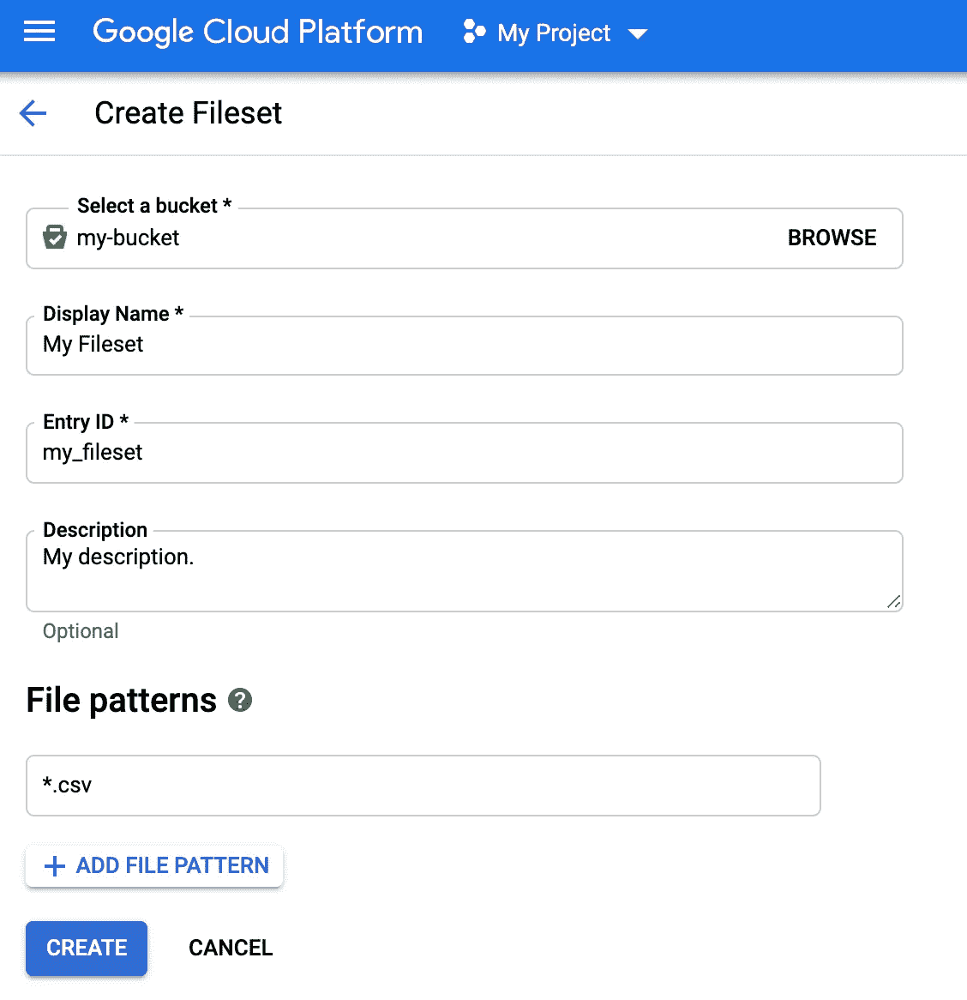

来自[谷歌官方文档](https://cloud.google.com/data-catalog/docs/how-to/filesets#data-catalog-fileset-console)

云存储文件集是云存储中一个或多个文件的集合。定义基数的是创建时提供的`file pattern`。

> 稍后我们将更多地讨论文件模式，并给出一些具体的例子。

为了创建您的文件集，首先您需要有一个用户定义的条目组，让我们来理解这种关系:

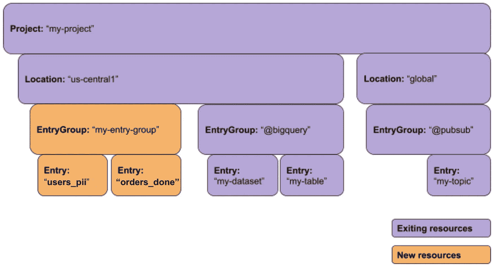

基于[谷歌官方文件](https://cloud.google.com/data-catalog/docs/how-to/filesets)

文件集条目包含在用户创建的条目组中。因此，我们必须事先创建条目组。

> 请遵循 [google 官方文档](https://cloud.google.com/data-catalog/docs/how-to/filesets)中的说明，如果您想测试它并创建您的文件集条目，这里有多种语言的示例，展示了如何做。

一旦设置了文件集条目，就可以使用 DataCatalog 的搜索引擎发现它，并向它添加业务标记，但是这就产生了一个问题…如果这个文件集条目没有指向任何东西，该怎么办？

我们可以有一个`file pattern`来匹配一个桶中的零个文件，但这可能不会有很大帮助…我们如何用关于我们文件的有用元数据来丰富它，并改进 DataCatalog 的搜索功能以及我们自己的元数据管理？

# 文件集丰富器

这是文件集丰富器的目标:

[](https://github.com/mesmacosta/datacatalog-util) [## mesmacosta/datacatalog-util

### 管理 Google Cloud 数据目录助手命令和脚本的 Python 包。声明:这不是一个正式的…

github.com](https://github.com/mesmacosta/datacatalog-util) 

它是`datacatalog-util` python 包的一部分，使用`enrich`命令，您的 DataCatalog 文件集条目将被标记上与所提供的`file pattern`相匹配的文件的统计信息。

> 你可以简单地通过`pip3 install datacatalog-util`来安装它。
> 
> 声明:这不是一个官方支持的谷歌产品，它是一个开源的 python 包，对贡献开放=)

为了演示这一功能，让我们看一下这个场景，其中我们有 3 个不同的文件存储桶:

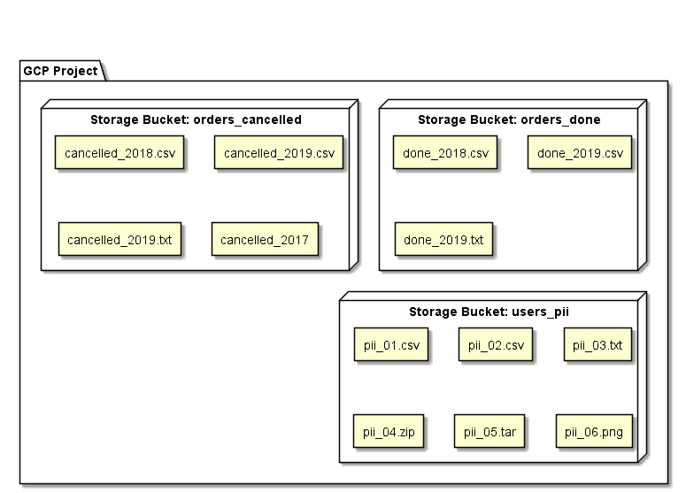

GCP 项目和装有文件的存储桶

现在，我们将在项目中创建 4 个文件集条目:

*   `file pattern` gs://orders*/*csv
*   `file pattern` gs://orders*/*
*   `file pattern` gs://users_pii/*
*   `file pattern` gs://new_orders/*

让我们来看看它们:

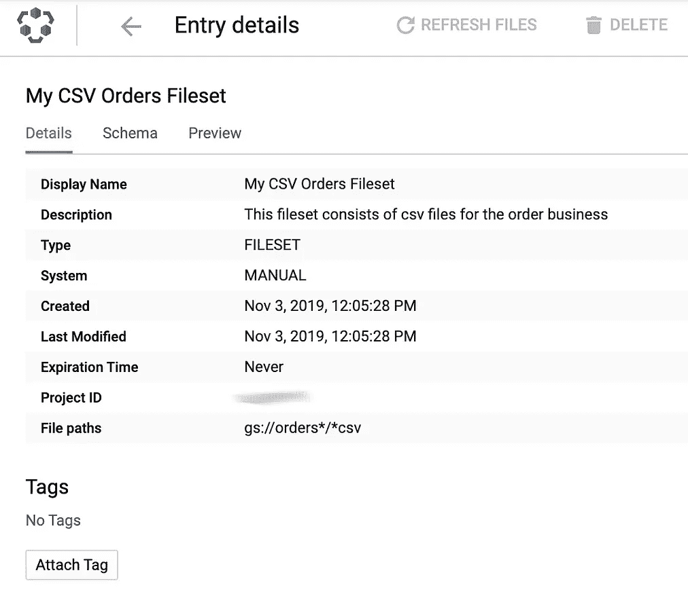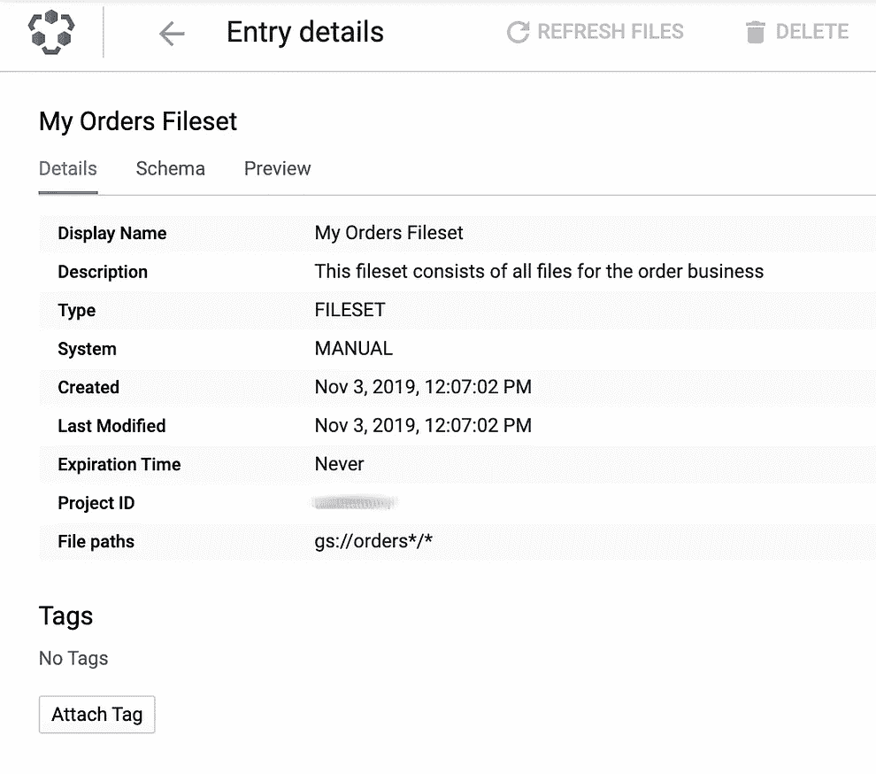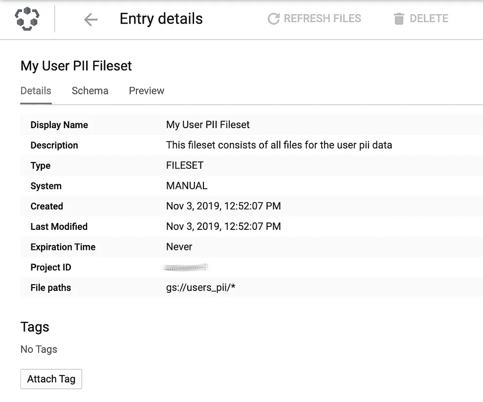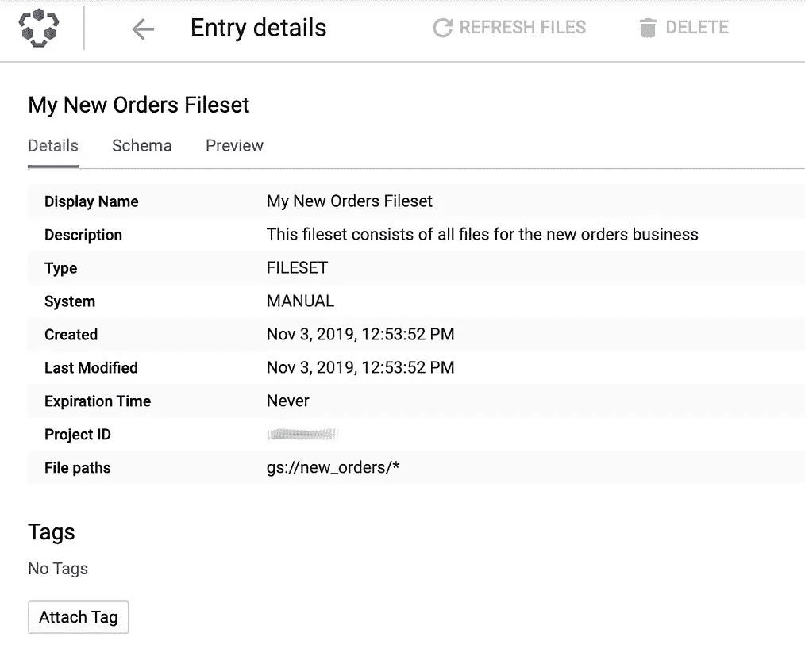

创建的文件集条目

> 不是很有用吧？

文件集丰富器功能将向每个文件集条目添加以下标记字段:

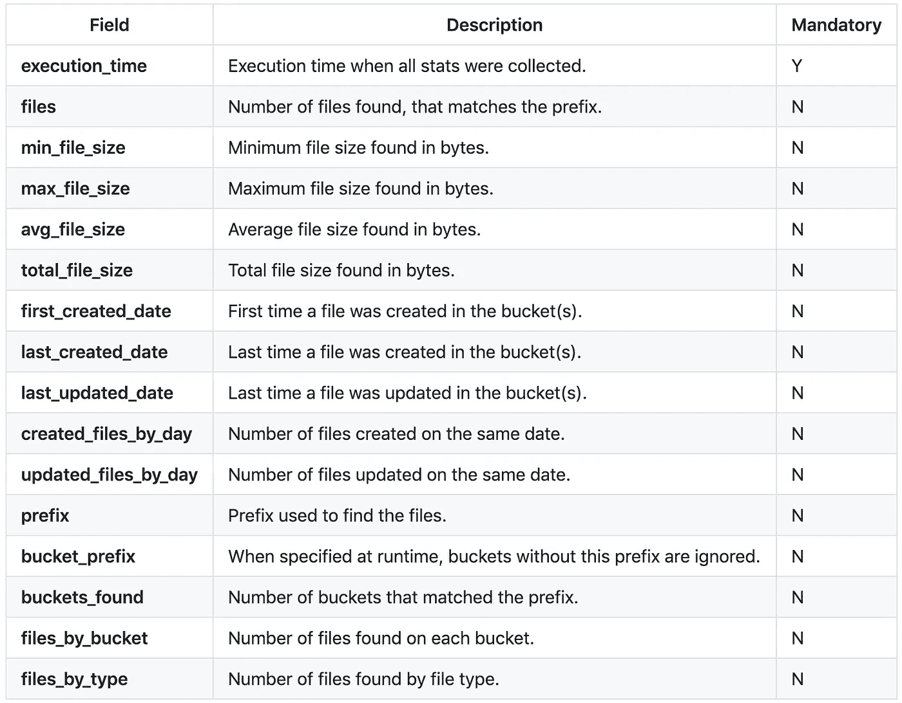

标签字段选项

它甚至允许用户选择应该添加到条目中的字段，如果没有指定字段，则应用上面的所有字段。

让我们运行脚本:

```
datacatalog-util filesets enrich --project-id my-project
```

*   `file pattern` gs://orders*/*csv

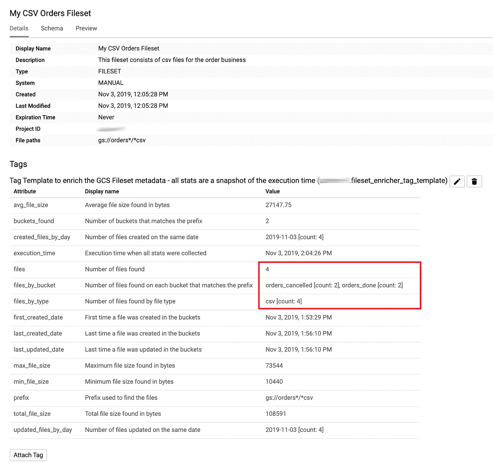

CSV 订单文件集增加了标签

我们可以看到找到了两个存储桶，并且我们有 4 个 CSV 文件匹配该模式。

*   `file pattern` gs://orders*/*

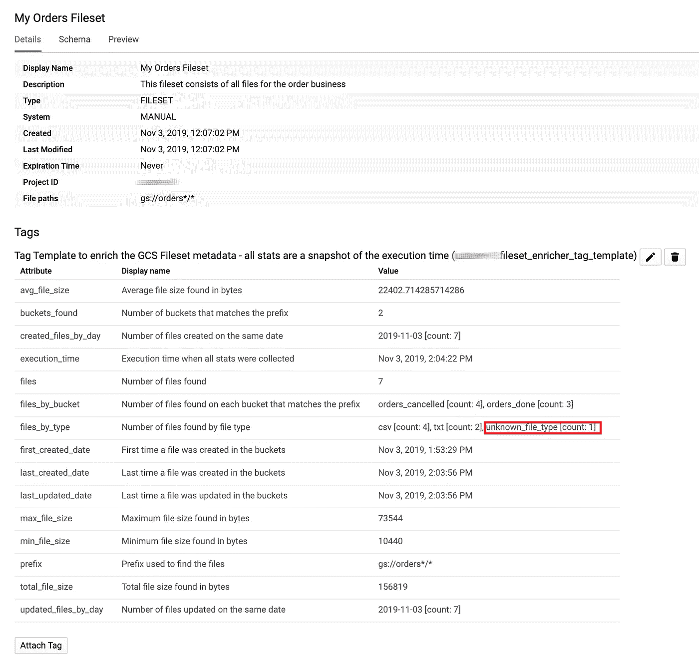

用标记丰富的订单文件集

我们可以看到现在找到了 7 个文件，我们有一个`unkown_file_type`，有人出错了？:)

*   `file pattern` gs://users_pii/*

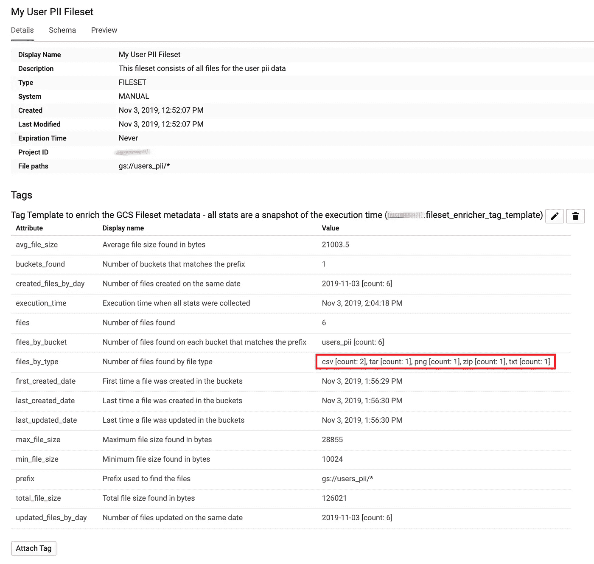

标记丰富的 PII 数据文件集

我们可以看到现在找到了 6 个文件，我们有 5 种不同的文件类型。也许我们应该标准化这个桶？

*   `file pattern` gs://new_orders/*

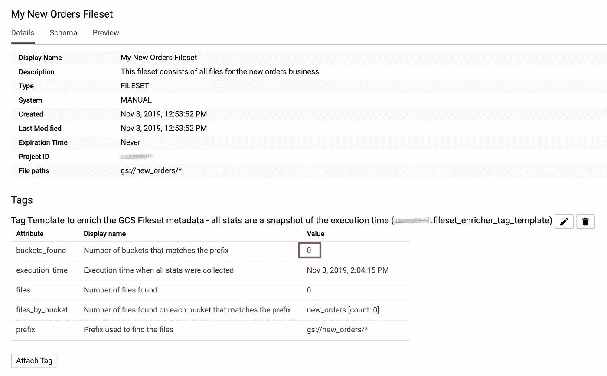

标签丰富的新订单文件集

等等，这个桶根本不存在，也许我们应该删除这个条目？

*   奖金:`file pattern` gs://*/*

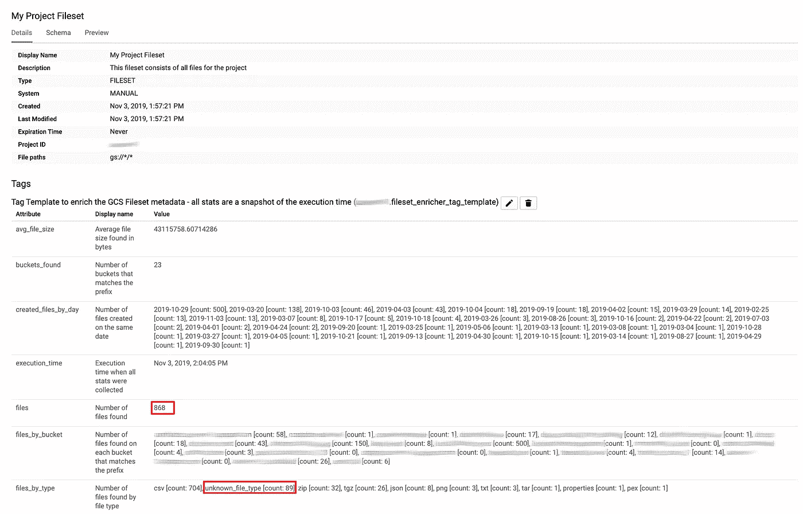

标记丰富了我的项目文件集

您甚至可以对项目中的所有存储桶运行它，通过这样做，我们发现我们有 868 个文件，其中 89 个是未知类型的。

# 数据目录搜索

这就是数据目录的亮点，想象一下，您可能有数千个存储桶和文件集……如果您无法搜索并找到数据，数据的质量有多好并不重要。

> 如果你想了解搜索的基础知识，请阅读这篇解释其特点的伟大的[文章](/google-cloud/data-catalog-hands-on-guide-search-get-lookup-with-python-82d99bfb4056)，或者官方的[文档](https://cloud.google.com/data-catalog/docs/quickstarts/quickstart-search-tag)。

让我们运行一些查询来展示这一点:

*   `tag:fileset_enricher_findings.buckets_found=0`

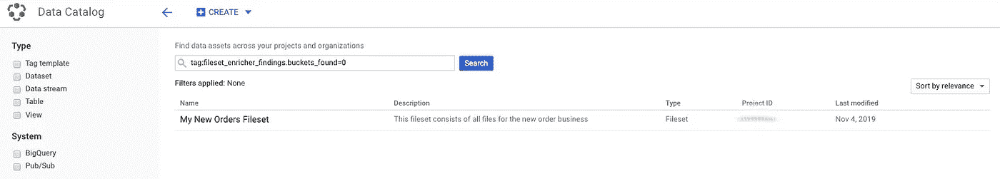

搜索用户界面，找到零个存储桶

*   `tag:fileset_enricher_findings.buckets_found>0`

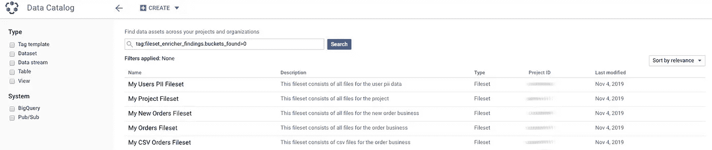

搜索用户界面，找到大于零的桶

*   `tag:fileset_enricher_findings.files_by_type:png`

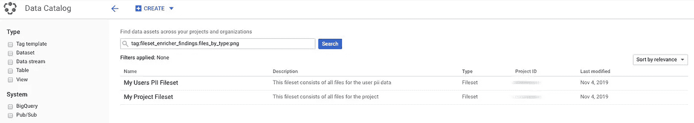

搜索界面，找到 png 文件

这些只是几个选项，但是您可以使用任何标签字段来搜索并从您的元数据中获得有意义的见解！

# 负荷试验

总结一下……当我们考虑一个对象存储解决方案时，比如 Google 云存储，处理大量文件是很常见的，所以为了了解这个 python 脚本是如何执行的，我们创建了一个场景，将`1008689`文件放在一个桶中。因为我们只处理文件元数据，应该不会花很长时间，对吗？让我们看看它是如何运作的。

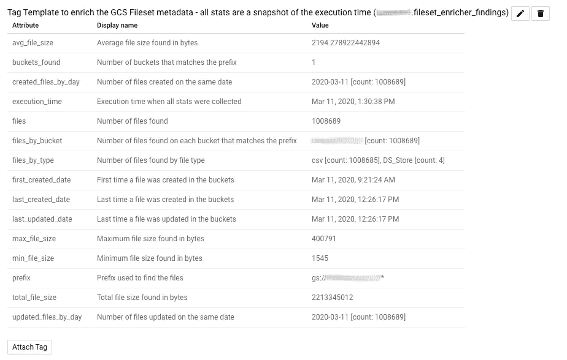

来自 100 多万个文件的结果

一个`e2-medium`虚拟机(2 个 vCPUs，4GB 内存)用来运行 Python 脚本，花了 3 分钟完成执行。

# 结束语

在本文中，我们已经介绍了如何用关于文件的有用统计数据来丰富您的数据目录文件集条目，然后搜索它，重要的是要指出，这个数据目录功能目前在测试版中，很可能以后会得到改进，同时这个 python 脚本可以是改进元数据管理的一个很好的选择。此外，请记住，python 脚本使用 GCS `list_buckets`和`list_blobs`API 来提取与`file pattern`匹配的元数据并生成文件统计数据，因此它们的计费策略将适用。
希望有所帮助！干杯！

【更新】改为使用`datacatalog-util` python 包。

# 资源

1.  **数据目录正式文件集文档**:[https://cloud.google.com/data-catalog/docs/how-to/filesets](https://cloud.google.com/data-catalog/docs/how-to/filesets)
2.  **data catalog Utils GitHub**:【https://github.com/mesmacosta/datacatalog-util 
3.  **DataCatalog medium 系列**:[https://medium . com/Google-cloud/data-catalog-hands-on-guide-a-mental-model-DAE 7 f 6 DD 49 e](/google-cloud/data-catalog-hands-on-guide-a-mental-model-dae7f6dd49e)
4.  **数据目录入门指南**:[https://cloud . Google . com/Data-Catalog/docs/quick starts/quick start-search-tag](https://cloud.google.com/data-catalog/docs/quickstarts/quickstart-search-tag)