# Google 云数据目录—集成您的本地 RDBMS 元数据

> 原文：<https://medium.com/google-cloud/google-cloud-data-catalog-integrate-your-on-prem-rdbms-metadata-468e0d8220fb?source=collection_archive---------0----------------------->

## 关于如何将元数据从本地关系数据库接收到 Google Cloud Data Catalog 的实用方法的代码示例

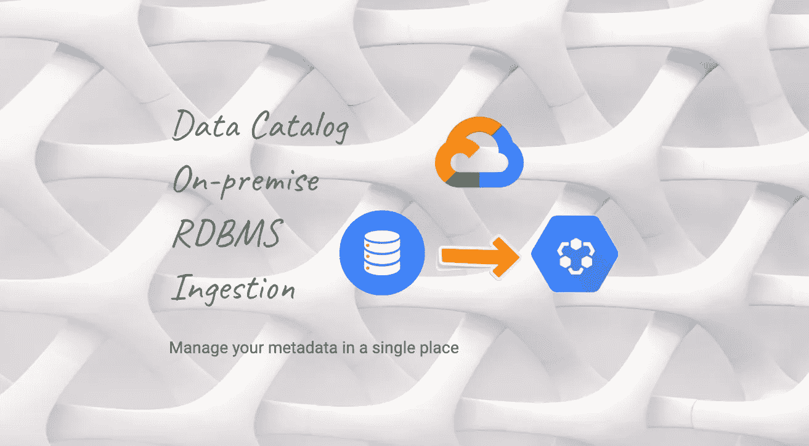

背景由 [JJ 颖](https://unsplash.com/@jjying?utm_source=unsplash&utm_medium=referral&utm_content=creditCopyText)上[的 Unsplash](https://unsplash.com/?utm_source=unsplash&utm_medium=referral&utm_content=creditCopyText)

> **免责声明:所有表达的观点仅代表我个人，不代表除我之外的任何人……**。**它们来自参与开发完全可操作的示例连接器的经验，可在:**[**github**](https://github.com/GoogleCloudPlatform/datacatalog-connectors)**获得。**

Google Cloud Data Catalog 团队最近宣布该产品为 **GA** ，具有接受自定义(也称为用户定义)类型的功能:[Data-Catalog-metadata-management-now-generally-available](https://cloud.google.com/blog/products/data-analytics/data-catalog-metadata-management-now-generally-available)！这个全新的特性为集成开辟了空间，现在用户可以利用 [Data Catalog 众所周知的潜力](https://towardsdatascience.com/boosting-the-data-governance-journey-with-google-cloud-data-catalog-d67acc3e3ffb)来管理几乎任何类型的数据资产的元数据。

# 挑战

我们很少发现大型组织将所有数据存储在同一个地方，有时这是因为合规性，甚至是战略原因。这导致许多客户将数据资产分散在多个孤岛上，处理驻留在混合云和/或本地环境中的数据。众所周知，关系数据库生态系统有许多不同的供应商，这使得我们很难与每一个供应商合作，因为我们最终要处理这么多不同的特性。

因此，这里的主要思想是提供一个可重用的`components`架构，以最少的代码设置更容易将不同的关系数据库集成到 Google Cloud Data Catalog。

为了演示它是如何工作的，我将分享设计思想和示例代码，为此，SQLServer `connector`将被用作实现示例。

此外，这篇博文还将更新其他 RDBMS 连接器实现的链接:

*   [**SQLServer**](https://github.com/GoogleCloudPlatform/datacatalog-connectors-rdbms/tree/master/google-datacatalog-sqlserver-connector)
*   [**PostgreSQL**](https://github.com/GoogleCloudPlatform/datacatalog-connectors-rdbms/tree/master/google-datacatalog-postgresql-connector)
*   [**青梅**](https://github.com/GoogleCloudPlatform/datacatalog-connectors-rdbms/tree/master/google-datacatalog-greenplum-connector)
*   [**红移**](https://github.com/GoogleCloudPlatform/datacatalog-connectors-rdbms/tree/master/google-datacatalog-redshift-connector)
*   [**MySQL**](https://github.com/GoogleCloudPlatform/datacatalog-connectors-rdbms/tree/master/google-datacatalog-mysql-connector)
*   [**Teradata**](https://github.com/GoogleCloudPlatform/datacatalog-connectors-rdbms/tree/master/google-datacatalog-teradata-connector)
*   [**甲骨文**](https://github.com/GoogleCloudPlatform/datacatalog-connectors-rdbms/tree/master/google-datacatalog-oracle-connector)
*   [](https://github.com/GoogleCloudPlatform/datacatalog-connectors-rdbms/tree/master/google-datacatalog-vertica-connector)

**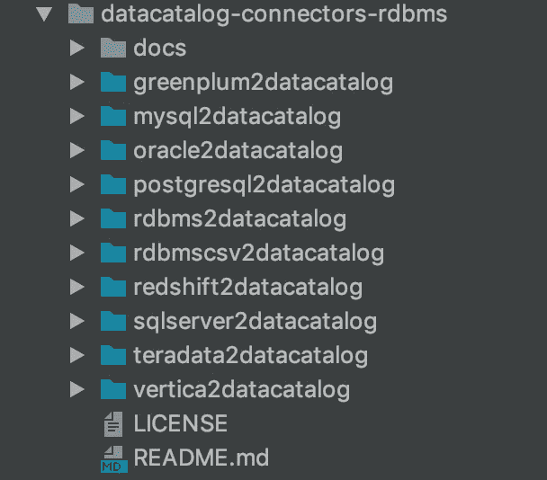**

**RDBMS 连接器选项**

# **RDBMS 结构**

**为了创建一个 commons 抽象，我们需要后退一步，看看资产在 RDBMS 中是如何构造的。**

**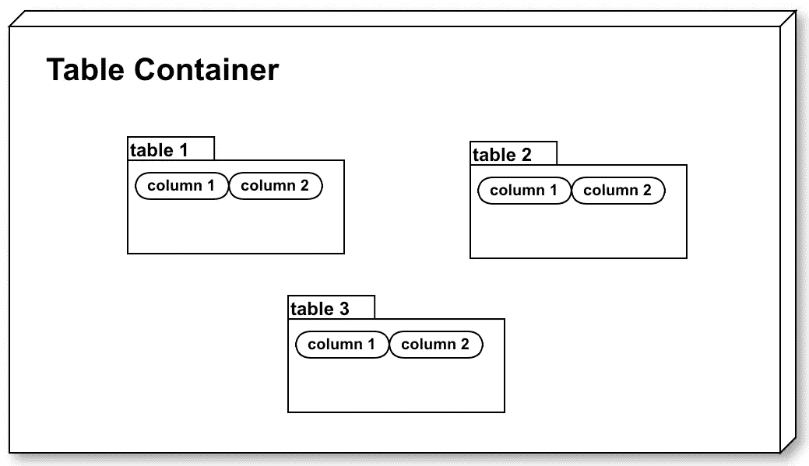**

**RDBMS 数据结构**

**在顶层，我们有我们称之为`Table Container`的东西，一个将`Tables`分组在一起的逻辑分段，然后我们有每个表`Columns`。**

> **您可能想知道，为什么不直接将表容器称为数据库或模式呢？**

**在传统的`RDBMS`中，一个特权用户连接到数据库，然后他可以创建模式，并在这些模式中创建带有列定义的表。**

**有些`RDBMS`在这点上有所不同，比如`MySQL`，其中 create Schema 语句是[只是一个创建数据库的链接](https://dev.mysql.com/doc/refman/8.0/en/create-database.html)。**

**`Teradata`其中[数据库扮演模式角色](https://stackoverflow.com/questions/36643822/how-user-database-and-schema-are-related-in-teradata)。**

**而`Oracle`为了创建一个模式，我们实际上必须[创建一个用户并授予其 create Table 权限](https://docs.oracle.com/en/cloud/paas/exadata-express-cloud/csdbp/create-database-schemas.html#GUID-7B279C9C-CD76-4AD4-8CEE-E26B845E3803)。**

**考虑到这些差异，首先我们想提供一个灵活的架构，其中每个连接器声明它们的表容器是什么。**

## **元数据查询**

**第二个问题是每个`RDBMS`如何存储它的元数据，每个供应商可能有他们自己的存储实现，以及他们的内部系统表是什么。**

## **RDBMS 连接**

**最后，最后一个问题是如何连接到`RDBMS`，每个供应商可能使用不同的 ODBC/JDBC 驱动程序、库和连接参数。所以我们必须保持负责`connection`的那段代码可以扩展。**

# **连接器概述**

**介绍完之后，让我们在更高的层次上理解连接器是如何工作的。**

**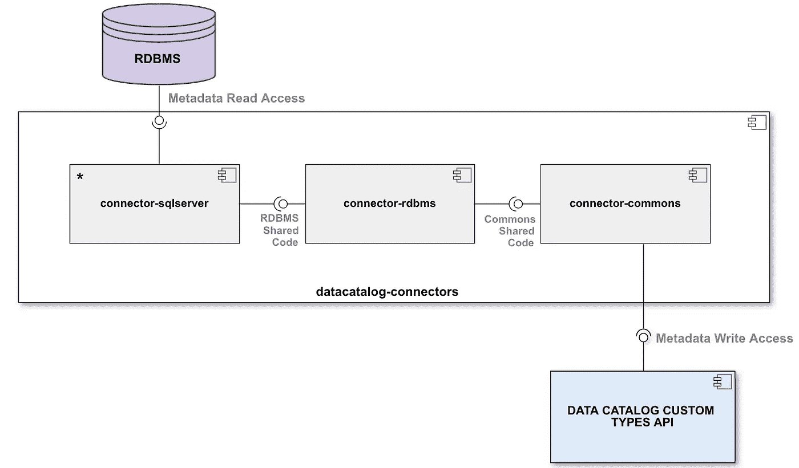**

**SQLServer 数据目录连接器概述**

**它分为三个主要部分:`datacatalog-connector-commons`、`datacatalog-connector-rdbms`和`datacatalog-connector-sqlserver`。**

*   ****数据目录-连接器-通用****

**所有连接器的公共代码都在这里，主要是与摄取相关的类。根据设计，只有该组件应该与数据目录自定义类型 API 进行通信。**

**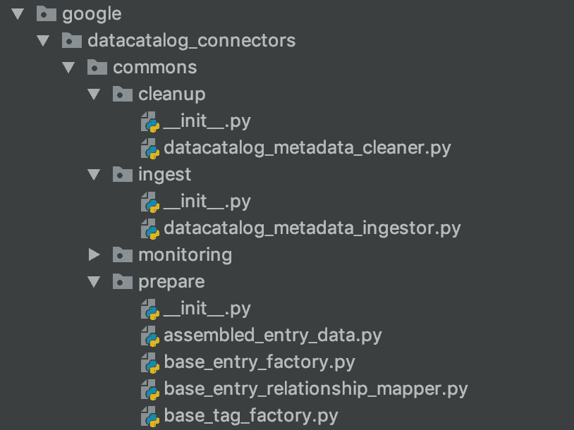**

**公共连接器结构**

*   ****数据目录-连接器-关系数据库管理系统****

**这是所有`RDBMS`连接器的通用代码，这里的类是开放扩展的，允许每个连接器定制部分流程。**

**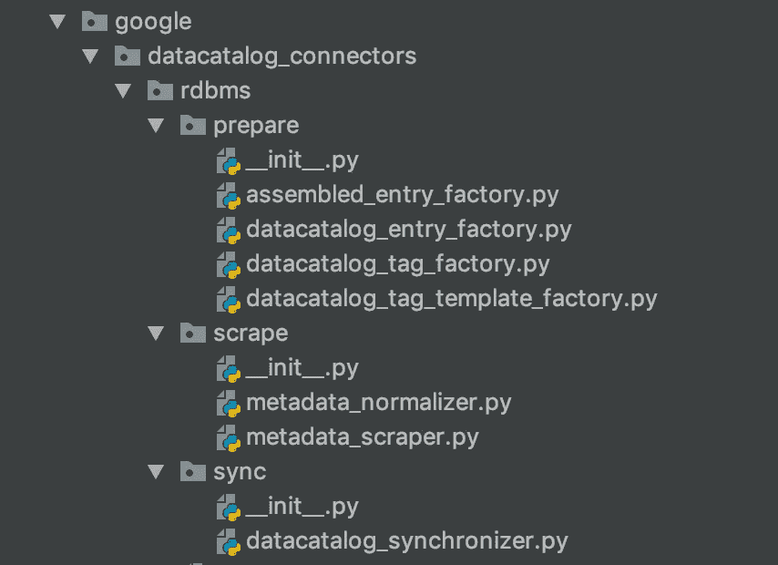**

**RDBMS 连接器结构**

**例如，如果一个`RDBMS`连接器需要向摄取过程添加新的`Tags`，只需扩展`datacatalog_tag_factory`类，就可以访问来自源系统的所有元数据。**

*   ****数据目录-连接器-sqlserver****

**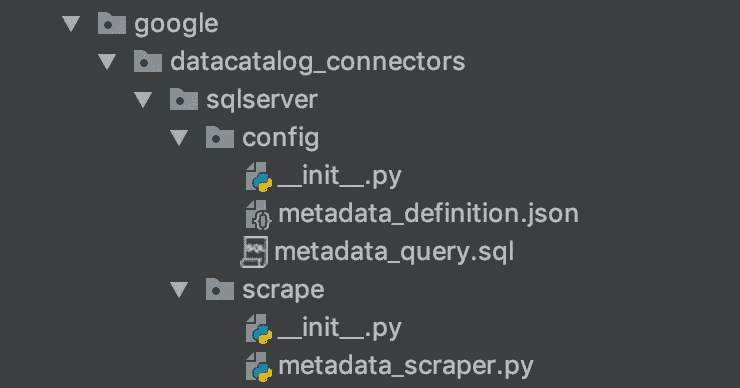**

**SQLServer 连接器结构**

**`SQLServer`连接器的代码，它解决了介绍中涉及的 3 个问题，我们将在下一节更深入地讨论细节。**

# **连接器实现**

**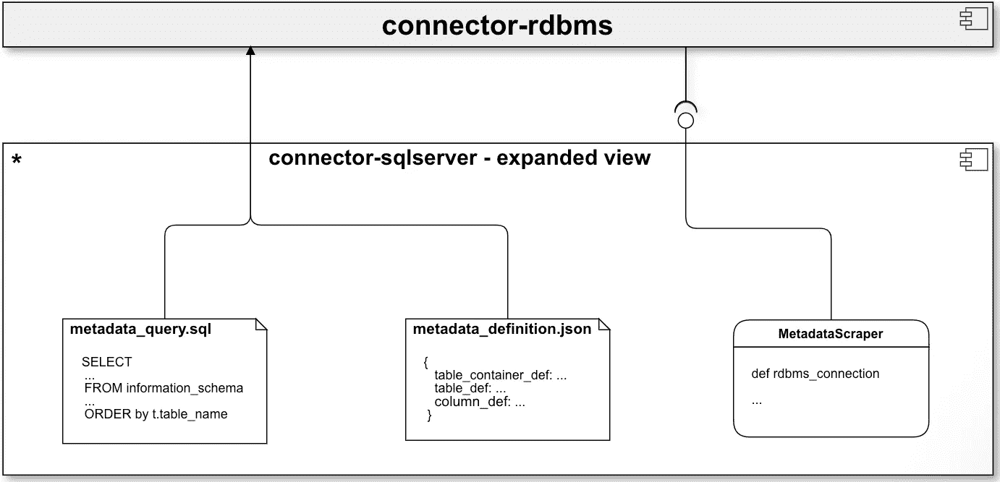**

**SQLServer 实现扩展视图**

**让我们来看看这些文件:**

*   ****元数据 _ 查询. sql****

**这是负责检索元数据的 SQL 查询**

**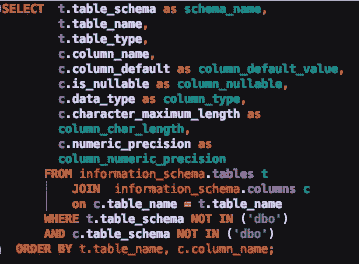**

**元数据 SQL 查询**

**对于`SQLServer`和许多其他 RDBMS，元数据信息存储在`information_schema`数据库中。经常变化的是内部系统表，在这种情况下，当我们抓取元数据时，我们将忽略`DBO`模式。**

*   ****metadata _ definition . JSON****

**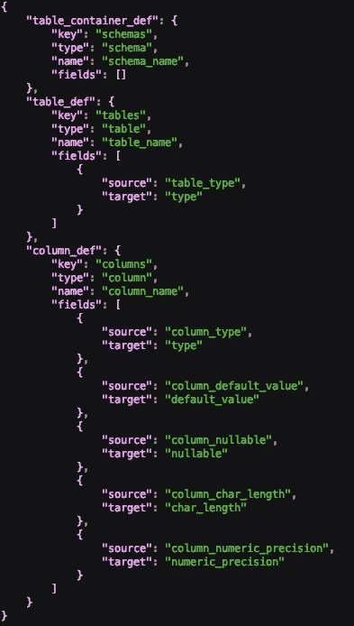**

**元数据定义 JSON**

**元数据定义 JSON 表示我们在特定 RDBMS 中的三级层次结构，在这种情况下，`Table Container`被表示为`schemas`，因为在同一个数据库中我们可以有许多`schemas`。**

****源** → **目标**字段将从 SQL 查询中提取元数据，并将其发送给后续连接器进程使用的元数据对象。一些 RDBMS 在元数据信息方面更丰富，因此灵活的表示很重要，允许用户向它添加新的字段。**

> **例如，在 Oracle 中，我们有一个特殊的元数据字段来存储每个表有多少行，而不必查询每个表。**

*   ****元数据清除程序****

**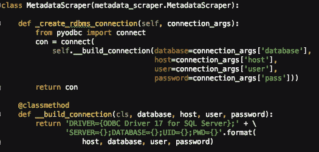**

**元数据刮刀扩展点**

**这里我们使用了`pyodbc`库，它加载了 [SQL Server ODBC 驱动程序](https://docs.microsoft.com/en-us/sql/connect/odbc/linux-mac/installing-the-microsoft-odbc-driver-for-sql-server?view=sql-server-2017)来创建连接。一些用户在过去的某个时候青睐`Pymssql`库，但它是[停产](https://github.com/pymssql/pymssql/issues/668)而青睐`pyodbc`。**

**对于每个`RDBMS`连接器，我们使用他们的供应商推荐库，使得代码中的这个扩展点极其重要。例如:**

*   **PostgreSQL → `[psycopg2](https://pypi.org/project/psycopg2/)`**
*   **甲骨文→ `[cx_Oracle](https://oracle.github.io/python-cx_Oracle/)`**
*   **MySQL → `[mysql.connector](https://pypi.org/project/mysql-connector-python/)`**
*   **Teradata → `[teradatasql](https://pypi.org/project/teradatasql/)`**

**所有这些库的共同点是它们遵循`DB API 2.0` [规范](https://www.python.org/dev/peps/pep-0249/)，这使得在其上创建通用抽象更加容易，这是`connector-rdbms`库的一个巨大部分。**

> **有关每个连接器及其 python 连接库的更多细节，请查看 [github repo](https://github.com/GoogleCloudPlatform/datacatalog-connectors-rdbms) 。**

# **连接器执行**

**总结一下，这就是 SQLServer 连接器的整体架构**

**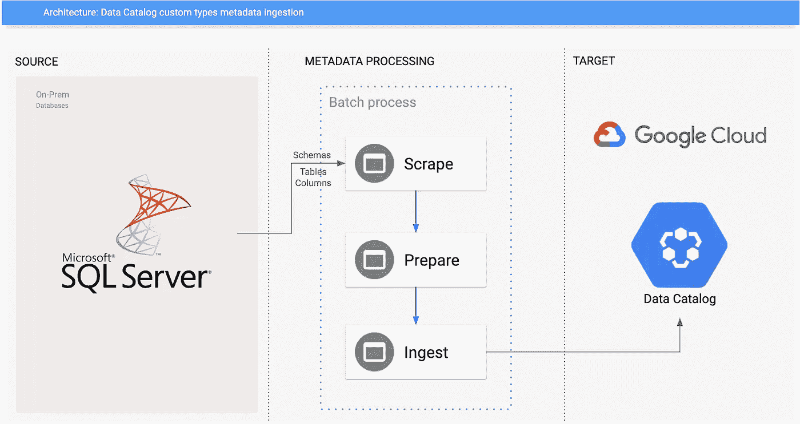**

**SQLServer 连接器体系结构**

**每次执行时，它都会:**

*   ****抓取**:连接数据库，检索所有可用的元数据。**
*   ****准备** : 在数据目录实体中转换，用附加元数据创建标签。**
*   ****摄取**:将数据目录实体发送到 Google Cloud 项目。**

**重要的是要记住，大部分代码位于`connector-rdbms`和`connector-commons`库中。**

## **运行它**

**设置好`connector`环境后，按照 [Github repo](https://github.com/GoogleCloudPlatform/datacatalog-connectors-rdbms/tree/master/sqlserver2datacatalog) 上的说明，让我们使用它的命令行参数来执行它:**

```
# Environment variables
export DATACATALOG_PROJECT_ID=sqlserver2dc-gcp-project
export DATACATALOG_LOCATION_ID=us-central1
export SQLSERVER_HOST=localhost
export SQLSERVER_USERNAME=sqlserver
export SQLSERVER_PASSWORD=sqlserver_pwd
export SQLSERVER_DATABASE=master
export GOOGLE_APPLICATION_CREDENTIALS=<CREDENTIALS_FILES_FOLDER>/sqlserver2dc-datacatalog-credentials.json# Command line execution
google-datacatalog-sqlserver-connector \
--datacatalog-project-id=$DATACATALOG_PROJECT_ID \
--datacatalog-location-id=$DATACATALOG_LOCATION_ID \
--sqlserver_host=$SQLSERVER_HOST \
--sqlserver_user=$SQLSERVER_USERNAME \
--sqlserver_pass=$SQLSERVER_PASSWORD \
--sqlserver_database=$SQLSERVER_DATABASE
```

## **结果**

**一旦执行完成，我们就可以进入数据目录搜索用户界面，寻找被吸收的资产**

**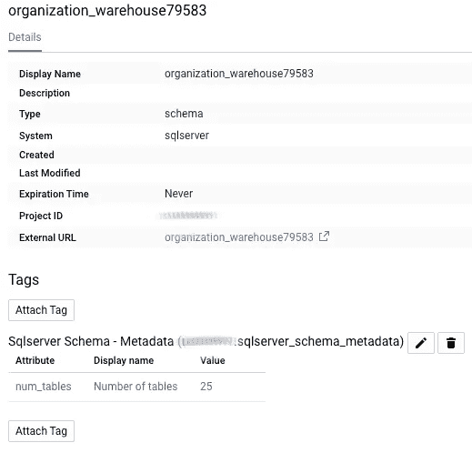**

**摄取的 SQLServer 架构**

**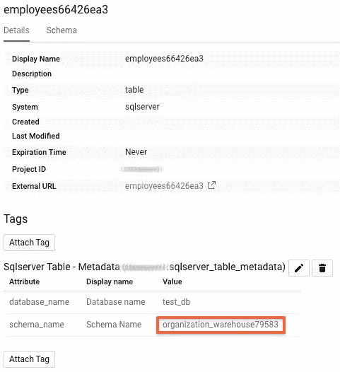****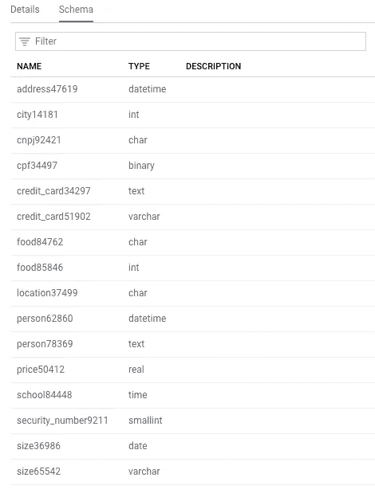**

**从同一个架构中获取 SQLServer 表**

## **使用 CSV 运行**

**还有一个通过从 CSV 文件读取元数据来执行连接器的选项:**

```
# Environment variables
export DATACATALOG_PROJECT_ID=sqlserver2dc-gcp-project
export DATACATALOG_LOCATION_ID=us-central1
export SQLSERVER_HOST=localhost
export RAW_METADATA_CSV=resource/sqlserver_full_dump.csv
export GOOGLE_APPLICATION_CREDENTIALS=<CREDENTIALS_FILES_FOLDER>/sqlserver2dc-datacatalog-credentials.json# Command line execution
google-datacatalog-sqlserver-connector \
--datacatalog-project-id=$DATACATALOG_PROJECT_ID \
--datacatalog-location-id=$DATACATALOG_LOCATION_ID \
--sqlserver_host=$SQLSERVER_HOST \
--raw-metadata-csv=$RAW_METADATA_CSV
```

**这一点非常重要，因为我们可能会在无法到达 GCP 项目的网络中处理本地 RDBMS。然后，摄入过程将分为两部分；1 —生成 CSV 文件，2 —从该文件运行连接器。**

> **如果用 GCS 路径提供了`raw-metadata-csv` arg，那么也支持从云存储桶中读取 CSV 文件。**

## **执行指标**

**最后，让我们看看执行过程中产生的一些指标。通过在 SQL Server `2017`标准实例上运行`connector`来收集指标，用分布在 4 个模式中的`1008`表填充。**

> **以下指标并非保证，而是近似值，可能会因环境、网络和执行情况而异。由于大部分代码都在公共库中，用户可以从其他 RDBMS 连接器获得类似的值。**

**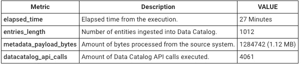**

**度量摘要**

**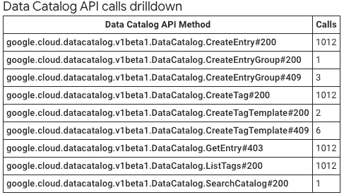**

**数据目录 API 调用向下钻取**

# **样本连接器**

**本文中讨论的所有主题都包含在一个示例连接器中，可以在 GitHub 上找到: [**rdbms-connectors**](https://github.com/GoogleCloudPlatform/datacatalog-connectors-rdbms) 。你可以随便拿，按照说明跑。顺便说一下，欢迎投稿！**

> ***它是在 Apache License 版本下许可的，在“按原样”的基础上发布，没有任何种类的保证或条件，无论是明示的还是暗示的。***

# **结束语**

**在本文中，我们介绍了如何将元数据从 RDBMS 接收到 Google Cloud Data Catalog 中，使用户能够集中管理他们的元数据，即使它驻留在本地环境中。拥有 RDBMS commons 连接器使得实现其他数据库集成变得更加容易，所以请继续关注展示如何对其他源系统做同样事情的新帖子！干杯！**

# **参考**

*   ****数据目录 GA 博文**:[https://cloud . Google . com/blog/products/Data-analytics/Data-Catalog-metadata-management-now-generally-available](https://cloud.google.com/blog/products/data-analytics/data-catalog-metadata-management-now-generally-available)**
*   ****连接器 Github Repo**:[https://Github . com/Google cloud platform/data catalog-connectors](https://github.com/GoogleCloudPlatform/datacatalog-connectors)**
*   ****连接器 RDBMS Github Repo:**[https://Github . com/Google cloud platform/data catalog-connectors-RDBMS](https://github.com/GoogleCloudPlatform/datacatalog-connectors-rdbms)**
*   ****数据目录公文**:[https://cloud.google.com/data-catalog/](https://cloud.google.com/data-catalog/)**
*   ****SQL Server ODBC 驱动**:[https://docs . Microsoft . com/en-us/SQL/connect/ODBC/Linux-MAC/installing-the-Microsoft-ODBC-driver-for-SQL-Server？view=sql-server-2017](https://docs.microsoft.com/en-us/sql/connect/odbc/linux-mac/installing-the-microsoft-odbc-driver-for-sql-server?view=sql-server-2017)**