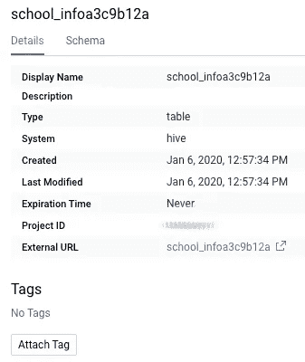

# Google 云数据目录—与您的本地 Hive 服务器保持同步

> 原文：<https://medium.com/google-cloud/google-cloud-data-catalog-keep-up-with-your-on-prem-hive-server-237edd1a1888?source=collection_archive---------1----------------------->

## 关于如何将元数据从本地配置单元服务器接收到 Google Cloud Data Catalog 的实用方法的代码示例


背景由 [JJ 颖](https://unsplash.com/@jjying?utm_source=unsplash&utm_medium=referral&utm_content=creditCopyText)上[下](https://unsplash.com/?utm_source=unsplash&utm_medium=referral&utm_content=creditCopyText)

> **声明:所有观点仅代表我个人，不代表除我之外的任何人……**。**它们来自参与开发完全可操作的示例连接器的经验，可从:**[**github**](https://github.com/GoogleCloudPlatform/datacatalog-connectors)**获得。**

# 挑战

我们很少发现大型组织将所有数据存储在同一个地方，有时这是因为合规性，甚至是战略原因。这导致许多客户将数据资产分散在多个孤岛上，处理驻留在混合云和/或本地环境中的数据。
从元数据管理的角度来看，我们需要在一个集中的位置实现数据发现，无论数据在哪里。

# 数据目录

去年，谷歌云发布了他们的元数据管理工具

> [*Data Catalog 是一种全面管理和可扩展的元数据管理服务，使组织能够快速发现、管理和了解他们在 Google Cloud 中的所有数据*](https://cloud.google.com/data-catalog/)

但是他们如何应对给定的挑战呢？

# 谷歌云承担了这一任务

最近，Google Cloud 发布了[数据目录自定义条目 API](https://cloud.google.com/data-catalog/docs/how-to/custom-entries) ，允许用户将几乎任何东西摄取到数据目录中。这是一个灵活的 API，具有开放的字符串字段，允许用户指定他们的资产类型、名称和数据类型的模式。

> 有 NodeJS、Java 和 Python 的[代码样本](https://cloud.google.com/data-catalog/docs/how-to/custom-entries#data-catalog-custom-entry-python)。如果你想了解更多，请看看官方文件。

# 蜂巢服务器

有许多方法可以让配置单元服务器在生产环境中运行，并连接到它。在这篇博文中，我们将使用通常[推荐的生产环境](https://data-flair.training/blogs/apache-hive-metastore/)，其中我们为 hive 服务器、hive metastore 和底层 RDBMS(代表 hive 存储元数据)提供了单独的工作负载。


蜂巢环境

> 如果您想快速建立一个用于测试/开发目的的 Hive 环境，请查看这篇[文章](https://dev.to/mesmacosta/quickly-set-up-a-hive-environment-on-gcp-38j8)。

## 测试数据

拥有大量的测试数据来模拟更真实的场景也很重要，因此我们将使用一个预先填充了~ `1000`资产的 Hive 服务器。为了生成数据，使用了这个[脚本](https://dev.to/mesmacosta/using-python-to-create-hive-tables-with-random-schema-2e5o),它创建了具有不同列类型的随机表。

让我们来看看它


数据库

然后连接到`on_prem_warehouse90281`数据库。


表格-为了提高可读性，隐藏了一些表格

现在让我们看看表中的`school_infoa3c9b12a`列:


列—为了提高可读性，隐藏了一些列

# 配置单元到数据目录连接器


连接器架构

为了将所有元数据从 Hive 摄取到数据目录中，我们将使用一个 Python 脚本(在本文中称为`connector`)，分为 3 个步骤:**抓取**、**准备**和**摄取**。

## 刮擦声

在这个阶段，脚本连接到源系统——在本例中是 PostgreSQL 数据库，并使用 SQL 查询检索元数据，遵循 Hive metastore [模式定义](https://github.com/apache/hive/blob/master/metastore/scripts/upgrade/postgres/hive-schema-2.3.0.postgres.sql)。

> 需要指出的是，这个脚本在连接到 RDBMS metastore 时并不访问实际数据，它只检索元数据，即数据库、表和列定义。

## 准备

转换逻辑在这里发生，源系统资产被转换成数据目录资产。

## 吸收

最后，根据源系统状态的需要，内存中的数据目录资产被同步并持久化到指定的 Google Cloud 数据目录实例`updated` / `created` / `deleted`中。为此调用了数据目录自定义类型 API。

# 执行连接器

设置完`connector`环境后，按照 [Github repo](https://github.com/GoogleCloudPlatform/datacatalog-connectors-hive/tree/master/hive2datacatalog) 中的说明，让我们使用它的命令行参数来执行它:

```
# Environment variables
export DATACATALOG_PROJECT_ID=hive2dc-gcp-project
export DATACATALOG_LOCATION_ID=us-central1
export HIVE_METASTORE_DB_HOST=localhost
export HIVE_METASTORE_DB_USER=hive
export HIVE_METASTORE_DB_PASS=hive
export HIVE_METASTORE_DB_NAME=metastore
export HIVE_METASTORE_DB_TYPE=postgresql
export GOOGLE_APPLICATION_CREDENTIALS=<CREDENTIALS_FILES_FOLDER>/hive2dc-datacatalog-credentials.json# Command line execution
google-datacatalog-hive-connector \
--datacatalog-project-id=$HIVE2DC_DATACATALOG_PROJECT_ID \
--datacatalog-location-id=$HIVE2DC_DATACATALOG_LOCATION_ID \
--hive-metastore-db-host=$HIVE2DC_HIVE_METASTORE_DB_HOST \
--hive-metastore-db-user=$HIVE2DC_HIVE_METASTORE_DB_USER \
--hive-metastore-db-pass=$HIVE2DC_HIVE_METASTORE_DB_PASS \
--hive-metastore-db-name=$HIVE2DC_HIVE_METASTORE_DB_NAME \
--hive-metastore-db-type=$HIVE2DC_HIVE_METASTORE_DB_TYPE
```

## 结果

一旦连接器完成，我们就可以进入数据目录搜索 UI，并查找所摄取的资产


搜索 UI 中的数据库

相同的 8 个数据库显示在配置单元服务器上。如果我们搜索桌子


表格-为了提高可读性，隐藏了一些结果

现在让我们看看之前看到的表`school_infoa3c9b12a`



表 school _ info a3 c 9 b 12 a-为了提高可读性，隐藏了一些列

过滤栏`cpf61825`


cpf61825 柱

然后我们可以使用数据目录标签将其标记为`PII`


列 cpf61825 标记为 PII

## 执行指标

最后，让我们看看执行过程中产生的一些指标。通过在 Hive Metastore 版本`2.3.0`上运行`connector`来收集指标，该版本由 PostgreSQL 数据库实例支持，该实例由分布在`8`数据库中的`993`表填充。

> 以下指标并非保证，而是近似值，可能会因环境、网络和执行情况而异。


度量摘要


数据目录 API 调用向下钻取

# 样本连接器

本文中讨论的所有主题都包含在 GitHub 上的一个示例连接器中:[**hive-connectors**](https://github.com/GoogleCloudPlatform/datacatalog-connectors-hive)。你可以随便拿，按照说明跑。顺便说一下，欢迎投稿！

> *它是在 Apache 许可证版本 2.0 下许可的，以“原样”为基础发布，没有任何种类的保证或条件，无论是明示的还是暗示的。*

# 结束语

在本文中，我们介绍了如何将元数据从 Hive 接收到 Google Cloud Data Catalog 中，使用户能够集中管理他们的元数据，即使它驻留在本地环境中。敬请关注展示如何用其他源系统做同样事情的新帖子！干杯！

# 参考

*   **连接器 Github Repo**:[https://Github . com/Google cloud platform/data catalog-connectors-hive](https://github.com/GoogleCloudPlatform/datacatalog-connectors-hive)
*   **数据目录 GA 博文**:[https://cloud . Google . com/blog/products/Data-analytics/Data-Catalog-metadata-management-now-generally-available](https://cloud.google.com/blog/products/data-analytics/data-catalog-metadata-management-now-generally-available)
*   数据目录公文:[https://cloud.google.com/data-catalog/](https://cloud.google.com/data-catalog/)
*   **代码示例**:[https://cloud . Google . com/data-catalog/docs/how-to/custom-entries # data-catalog-custom-entry-python](https://cloud.google.com/data-catalog/docs/how-to/custom-entries#data-catalog-custom-entry-python)
*   **创建配置单元测试/开发环境**:[https://dev . to/mes macosta/quick-set-up-a-Hive-environment-on-GCP-38j 8](https://dev.to/mesmacosta/quickly-set-up-a-hive-environment-on-gcp-38j8)
*   **创建 Hive 测试数据**:[https://dev . to/mes macosta/using-python-to-Create-Hive-tables-with-random-schema-2e5o](https://dev.to/mesmacosta/using-python-to-create-hive-tables-with-random-schema-2e5o)