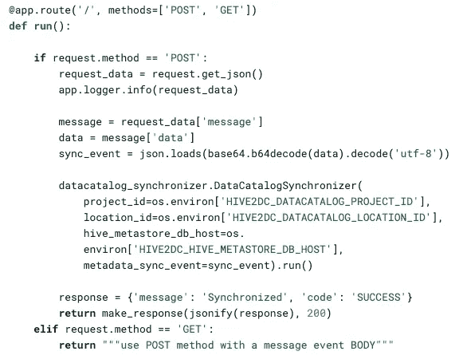

# Google 云数据目录—实时同步您的本地配置单元服务器元数据更改

> 原文：<https://medium.com/google-cloud/google-cloud-data-catalog-live-sync-your-on-prem-hive-server-metadata-changes-4f5e661626d8?source=collection_archive---------2----------------------->

## 代码示例提供了一种实用的方法，说明如何将元数据更改从本地配置单元服务器增量接收到 Google Cloud Data Catalog 中

背景由 [JJ 颖](https://unsplash.com/@jjying?utm_source=unsplash&utm_medium=referral&utm_content=creditCopyText)上 [Unsplash](https://unsplash.com/?utm_source=unsplash&utm_medium=referral&utm_content=creditCopyText)

> **免责声明:所有表达的观点均为我个人观点，仅代表我个人……**。**它们来自参与开发完全可操作的示例连接器的经验，可从:**[**github**](https://github.com/GoogleCloudPlatform/datacatalog-connectors)**获得。**

# 挑战

进入大数据世界绝非易事，数据量可能会很快失控。看看[优步的故事](https://eng.uber.com/uber-big-data-platform/)，关于他们如何使用 Hadoop 生态系统处理 100 的数据，想象一下，如果每次他们将他们的本地元数据同步到数据目录时，都执行完整的运行，那将是不切实际的。

我们需要一种方法来监视在 Hive 服务器上执行的更改，每当表或数据库被修改时，我们就捕获这种更改，并将其增量地保存在我们的数据目录中。

> 如果您错过了[上一篇文章](/google-cloud/google-cloud-data-catalog-keep-up-with-your-on-prem-hive-server-237edd1a1888)，我们展示了将本地配置单元元数据摄取到数据目录中，在这种情况下，我们没有使用增量解决方案。

**为了掌握情况，一个完整的运行用了~** `**1000**` **表用了差不多 20 分钟，即使只有 1 个表发生了变化。在优步的故事中，这一点都不好玩，对吗？**

> *旁注:本文假设您对什么是数据目录和配置单元有所了解。如果您想了解更多关于数据目录的信息，请阅读* [*官方文档*](https://cloud.google.com/data-catalog/) *。*

# 实时同步架构

实时同步架构

有多种方法可以监听在 Hive 服务器上执行的更改，本文比较了两种方法: [Hive 挂钩 x Hive Metastore 监听器](https://towardsdatascience.com/apache-hive-hooks-and-metastore-listeners-a-tale-of-your-metadata-903b751ee99f)。

所展示的架构使用了一个`Hive Metastore Listener`，这是为了简化已经解析的元数据。

## **本地 Hadoop 环境端**

这里的主要组件是一个用 Java 编写的代理，它监听 5 个 Metastore 事件:`onAlterTable`、`onCreateTable`、`onCreateDatabase`、`onDropTable`、`onDropDatabase`。

onCreateTable —为了更好的可读性，隐藏了其他事件

这是一段非常简单的代码，它获取事件并将其发送到 PubSub 主题。关于如何设置和其他事件的详细信息，请查看 [GitHub repo](https://github.com/GoogleCloudPlatform/datacatalog-connectors-hive/tree/master/hive-metastore-listener) 。

> 代理在 Hive Metastore 进程中运行，该进程必须位于能够访问 Google Cloud 项目的网络中，并且在其中设置的服务帐户需要主题中的发布/订阅发布者角色。

## **谷歌云平台端**

这里的主要组件是 **PubSub** 和 **Hive 到数据目录连接器**。

*   **PubSub** :作为持久事件摄取和交付系统层。
*   **连接器(Scrape/Prepare/Ingest)** :这一层将 Hive Metastore 消息转换为数据目录资产，并持久化它——有关其工作原理的详细信息，请查看本文中的[。](/google-cloud/google-cloud-data-catalog-keep-up-with-your-on-prem-hive-server-237edd1a1888)

我们还有**云运行**、**、**，它作为边车 web 服务器接收来自 **PubSub** 的消息并触发**连接器**。

这是一段非常简单的代码，它从`hive2datacatalog` Python 模块调用`Synchronizer`类，从而触发`Scrape` / `Prepare` / `Ingest`步骤。

云跑边车

> 有关如何设置云运行侧车的详细信息，请查看连接器 [github repo](https://github.com/GoogleCloudPlatform/datacatalog-connectors-hive) 。

# 触发连接器

让我们创建一个新的`database`和`table`来看看它是如何工作的

Hive 服务器终端

检查配置单元 Metastore 日志，我们可以看到两条消息被发送到 PubSub

Hive Metastore 日志—为了提高可读性，某些数据被隐藏起来

转到云运行，我们可以查看执行日志

云运行日志-为了提高可读性，某些行被抑制

## 结果

最后，让我们使用数据目录用户界面打开新条目

中型数据库条目

张贴表格条目

几秒钟之内，我们就可以搜索新创建的条目。

# 样本连接器

本文中讨论的所有主题都包含在一个连接器示例中，该示例可在 GitHub 上获得: [**蜂巢连接器**](https://github.com/GoogleCloudPlatform/datacatalog-connectors-hive) 。请随意获取并按照说明运行。顺便说一下，欢迎捐款！

> *其根据 Apache License Version 2.0 获得许可，按“原样”分发，没有任何形式的明示或暗示的保证或条件。*

# 结束语

在本文中，我们已经介绍了如何以可扩展和高效的方式，将元数据从 Hive 逐步引入 Google Cloud Data Catalog，使用户能够集中管理他们的元数据。请继续关注新的帖子，展示如何在其他源系统上做同样的事情！干杯！

# 参考

*   **Connector git hub Repo**:[https://git hub . com/GoogleCloudPlatform/data catalog-connectors-hive](https://github.com/GoogleCloudPlatform/datacatalog-connectors-hive)
*   **数据目录 GA 博客帖子**:[https://cloud . Google . com/blog/products/Data-analytics/Data-Catalog-metadata-management-now-general-available](https://cloud.google.com/blog/products/data-analytics/data-catalog-metadata-management-now-generally-available)
*   **数据目录正式文件**:[https://cloud.google.com/data-catalog/](https://cloud.google.com/data-catalog/)
*   **代码示例**:[https://cloud . Google . com/data-catalog/docs/how-to/custom-entries # data-catalog-custom-entry-python](https://cloud.google.com/data-catalog/docs/how-to/custom-entries#data-catalog-custom-entry-python)
*   **Hive hooks x Hive Metastore Listeners post**:[https://towards data sciences . com/Apache-Hive-hooks-and-Metastore-Listeners-a-tale-of-of-to-towers-of-to-towers-of-to-towers-to-towers-to-towers-to-towers-to-towers-to-towers-](https://towardsdatascience.com/apache-hive-hooks-and-metastore-listeners-a-tale-of-your-metadata-903b751ee99f)